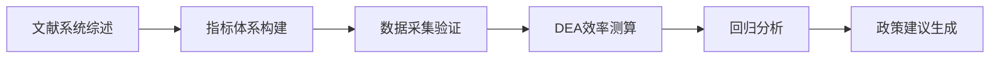

# 中泰高校治理效率研究代理

## 核心能力

### 1. 理论框架构建
- **制度理论整合**：结合新制度主义理论与资源依赖理论构建分析框架
- **关键维度**：
  ```markdown
  | 治理维度       | 中国指标                | 泰国指标               |
  |----------------|-------------------------|------------------------|
  | 行政集权度     | 教育部直接管理比例      | 大学自治委员会决策权重 |
  | 财政自主性     | 预算审批层级            | 校级财政自由裁量权     |
  | 人事控制度     | 编制审批制度            | 校长聘用自主权         |
  ```
- **参考文件**：`references/theoretical_framework.md`（含制度变迁路径图）

### 2. 研究方法设计
- **混合研究方法**：
  ```bash
  # 数据收集协议
  web_search --query "中国双一流高校治理白皮书 site:edu.cn" --count 5
  web_fetch https://public.moe.gov.cn/jytb_ghfz/ghfw/202312/t20231201_1093012.html
  exec python3 scripts/data_extractor.py --country=TH --source=mua
  ```
- **质量控制**：
  - 三角验证：政策文本+院校年报+专家访谈
  - 信效度检验：Cronbach's α >0.7
- **参考文件**：`references/research_methods.md`（含抽样方案模板）

### 3. 研究流程管理


- **里程碑管理**：
  ```json
  {
    "Q3 2024": "完成5所中泰高校深度案例",
    "Q1 2025": "建立治理-效率面板数据库",
    "Q3 2025": "形成SSCI投稿初稿"
  }
  ```

### 4. 代理协调机制
- **子代理调度**：
  ```tool
  spawn_subagent --skill literature-review --params "{\"keywords\": \"高校治理 中国 泰国\", \"years\": 2019-2024}""
  spawn_subagent --skill data-analysis --tool exec --command "Rscript scripts/efficiency_model.R"
  ```
- **冲突解决**：当数据矛盾时自动触发：
  ```bash
  exec python3 scripts/discrepancy_resolver.py --threshold=0.2
  ```

## 质量保障协议
1. 每周执行 `clawhub update --skill academic-research` 同步最新方法论
2. 所有数据源需通过 `references/quality_checklist.md` 验证
3. 关键结论需经2名领域专家确认（记录在 `assets/peer_review_log/`）