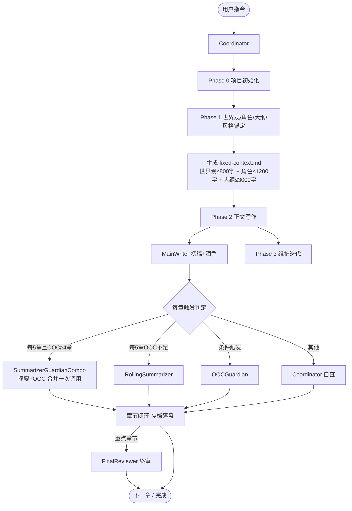

# novel-free (v1.0.1)

1个 Coordinator 主控 + 12个子 Agent 分工的长篇小说创作系统。Phase 0 初始化 → Phase 1 前期架构 → Phase 2 正文写作 → Phase 3 维护迭代。

## 🎉 版本 1.0.1 更新亮点

### 🚀 用户体验优化
- **交互式启动脚本** `novel-free-launch.sh` - 一体化菜单界面
- **自动模型配置** - 告别手动编辑 `config.md`
- **智能项目管理** - 项目切换、状态查看、环境隔离
- **错误恢复框架** - 系统化错误处理和项目恢复

### 🛠️ 新增工具脚本
```
scripts/
├── simple-auto-configure.sh    # 自动模型配置
├── error-handler.sh           # 错误处理与恢复
├── project-manager.sh         # 项目管理
└── novel-free-launch.sh       # 一体化启动界面
```

### 📁 项目创建优化
- **外部目录支持** - 项目不再污染技能目录
- **自动环境配置** - 一键创建隔离环境
- **智能备份系统** - 自动备份和版本管理

## 🚀 快速开始（推荐新方式）

### 方式一：交互式启动（推荐）
```bash
./novel-free-launch.sh
```
选择「创建新项目」→ 输入项目名 → 自动完成所有配置

### 方式二：命令行创建
```bash
# 1. 创建项目（自动放置到外部目录）
./create-novel.sh <项目名>

# 2. 自动配置模型
cd skills/novel-free
./scripts/simple-auto-configure.sh /path/to/project

# 3. 开始创作
告诉Coordinator："开始Phase 1" 或 "写第1章"
```

### 方式三：传统指令
| 用户指令 | 触发阶段 |
|----------|----------|
| 新建小说 | Phase 0 初始化 |
| 世界观 / 角色 / 大纲 | Phase 1 前期架构 |
| 写第X章 | Phase 2 单章写作 |
| 写第X章到第Y章 | Phase 2 批量写作 |
| 写第X章，自动推进N章 | Phase 2 自动推进 |
| 继续写作 | Phase 2 断点恢复 |
| 重写第X章 / 补设定 | Phase 3 维护迭代 |

## 工作流程



## 四项内置优化

| 优化 | 机制 | 收益 |
|------|------|------|
| **用户体验优化** | 交互式菜单 + 自动配置 + 项目管理 | 降低操作复杂度，提升启动效率 |
| 固定层压缩 | style-anchor≤600字 / 世界观≤800字 / 角色≤1200字 | 每章节省约1900 token |
| fixed-context.md 强制缓存 | Phase 2 全程只读一个文件，禁止动态读原始文档 | 消除重复读取 |
| SummarizerGuardianCombo | 每5章且OOC≥4章时摘要+OOC合并为单次调用 | 每20章节省约4次调用 |

## 核心文档

开始前必读：
- `references/lifecycle-phase0.md` — Phase 0 初始化详细流程
- `references/lifecycle-phase1.md` — Phase 1 前期架构详细流程
- `references/lifecycle-phase2-normal.md` — 常规章节工作流（含合并触发逻辑）
- `references/lifecycle-phase2-key-chapter.md` — 重点章节工作流
- `references/lifecycle-phase2-auto-advance.md` — 自动推进机制
- `references/resume-protocol.md` — 恢复协议（续写前必读）
- `references/iron-rules.md` — 铁律（所有 Agent 必须遵守）
- `references/context-feeding-strategy.md` — 固定层压缩规范（novel-free 专用）
- `references/session-cache.md` — 强制缓存规范（novel-free 专用）
- `references/agent-summarizer-guardian-combo.md` — 合并 Agent（novel-free 专用）

## 🔧 新增工具脚本

### 1. 一体化启动脚本
```bash
./novel-free-launch.sh
```
提供交互式菜单，包含：创建项目、管理项目、查看状态、恢复中断、备份、配置模型、项目切换、查看文档。

### 2. 自动模型配置
```bash
./scripts/simple-auto-configure.sh <项目目录>
```
自动从当前会话读取模型配置，更新 `config.md` 和 `agent-registry.json`。

### 3. 错误处理与恢复
```bash
./scripts/error-handler.sh resume <项目目录>    # 恢复项目
./scripts/error-handler.sh backup <项目目录>    # 备份项目
```
提供系统化错误处理、项目恢复和自动备份功能。

### 4. 项目管理
```bash
./scripts/project-manager.sh list              # 列出项目
./scripts/project-manager.sh status <项目名>   # 查看状态
./scripts/project-manager.sh switch <项目名>   # 切换项目
./scripts/project-manager.sh isolate <项目名>  # 创建隔离环境
```

### 5. 项目创建（外部目录）
```bash
./create-novel.sh <项目名> [自定义目录]
```
在外部目录创建项目，避免污染技能文件。

## 📝 更新日志

### v1.0.1 (2026-03-25)
- **新增**：交互式启动脚本 `novel-free-launch.sh`
- **修复**：模型分工选择问题，新增自动配置脚本
- **新增**：错误处理与恢复框架
- **增强**：项目管理功能，支持项目切换和状态查看
- **优化**：用户交互体验，降低学习曲线
- **新增**：项目隔离和环境管理

### v1.0.0 (初始版本)
- 基于12agent-novel的优化版本
- 固定层压缩、强制缓存、合并触发三项核心优化

## 安全规范

- `openclaw.json` 读取优先级：`~/.openclaw/openclaw.json` → `./openclaw.json` → `/etc/openclaw/openclaw.json`
- 嵌入子 Agent prompt 前过滤凭据字段（`apiKey`、`token`、`secret`、`password`）
- `scripts/init-project.sh` 仅本地文件操作，不含网络请求
- 所有新增脚本均为本地操作，不涉及网络请求
