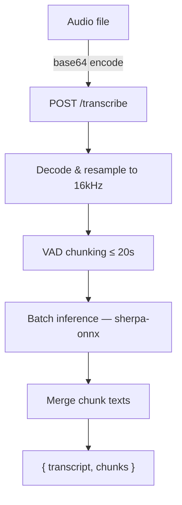

# Gipformer ASR

Vietnamese speech recognition — send audio of any length, get transcript.

**Huggingface Model**: `g-group-ai-lab/gipformer-65M-rnnt` (65M params, int8/fp32 ONNX)

## Architecture



The client sends base64-encoded audio (any length, any format). The server decodes, chunks with VAD, infers in batches, and returns the full transcript.

## Quick Start

### 1. Install dependencies

```bash
pip install -r {baseDir}/requirements.txt
```

System dependency: `ffmpeg` (required for M4A support).

### 2. Start the server

```bash
python {baseDir}/scripts/serve.py
# or with options:
python {baseDir}/scripts/serve.py --port 8910 --quantize int8 --max-batch-size 32
```

The server downloads the ASR model + VAD model on first run and listens on `http://127.0.0.1:8910`.

### 3. Transcribe audio

```bash
# Single file (any format)
python {baseDir}/scripts/transcribe.py audio.wav
python {baseDir}/scripts/transcribe.py recording.mp3

# Multiple files
python {baseDir}/scripts/transcribe.py *.wav

# JSON output with chunk details
python {baseDir}/scripts/transcribe.py audio.wav --json

# Save results
python {baseDir}/scripts/transcribe.py audio.wav -o results.json
```

### 4. Direct API call (curl)

```bash
# Transcribe (any length, any format)
curl -X POST http://127.0.0.1:8910/transcribe \
  -H "Content-Type: application/json" \
  -d "{\"audio_b64\": \"$(base64 -i audio.wav)\"}"

# Response:
# { "transcript": "full text...", "duration_s": 120.5, "process_time_s": 5.2,
#   "chunks": [{"text": "...", "start_s": 0.0, "end_s": 8.7}, ...] }

# Health check
curl http://127.0.0.1:8910/health
```

## Audio Format

| Format | Extension | Support |
|--------|-----------|---------|
| WAV | .wav | Native (soundfile) |
| FLAC | .flac | Native (soundfile) |
| OGG | .ogg | Native (soundfile) |
| MP3 | .mp3 | Native (soundfile) |
| M4A/AAC | .m4a | Via ffmpeg |

All formats are converted to WAV 16-bit PCM mono 16kHz internally.

## Server Tuning

| Flag | Default | Effect |
|------|---------|--------|
| `--quantize` | int8 | `fp32` for accuracy, `int8` for speed/size |
| `--max-batch-size` | 16 | Higher = more throughput, more latency |
| `--max-wait-ms` | 100 | How long to wait before flushing a partial batch |
| `--num-threads` | 4 | ONNX runtime threads |
| `--decoding-method` | modified_beam_search | `greedy_search` for faster speed |

## API Reference

See [references/api.md](references/api.md) for full endpoint documentation.
