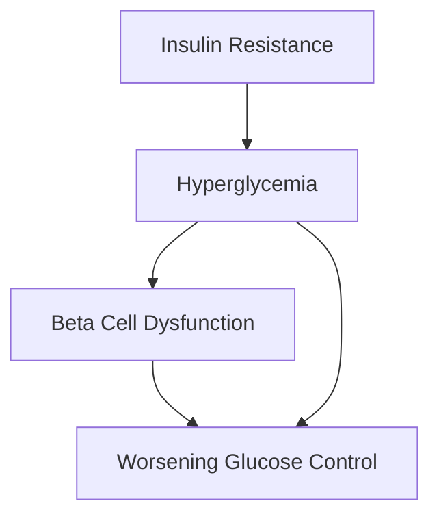

# Mechanism Flowchart

Generates Mermaid flowchart code and visual representations of medical mechanisms, pathophysiology, and drug action pathways.

## When to Use

- Use this skill when the task needs Generates Mermaid flowchart code and visual diagrams for pathophysiological.
- Use this skill for data analysis tasks that require explicit assumptions, bounded scope, and a reproducible output format.
- Use this skill when you need a documented fallback path for missing inputs, execution errors, or partial evidence.

## Key Features

See `## Features` above for related details.

- Scope-focused workflow aligned to: Generates Mermaid flowchart code and visual diagrams for pathophysiological.
- Packaged executable path(s): `scripts/main.py`.
- Reference material available in `references/` for task-specific guidance.
- Structured execution path designed to keep outputs consistent and reviewable.

## Dependencies

See `## Prerequisites` above for related details.

- `Python`: `3.10+`. Repository baseline for current packaged skills.
- `dataclasses`: `unspecified`. Declared in `requirements.txt`.
- `enum`: `unspecified`. Declared in `requirements.txt`.

## Example Usage

```python
from mechanism_flowchart import MechanismDiagram

diagram = MechanismDiagram()
result = diagram.generate(
    "Type 2 Diabetes: Insulin resistance leads to hyperglycemia, "
    "causing beta cell dysfunction and further glucose elevation"
)
print(result['mermaid_code'])
```

## Implementation Details

See `## Workflow` above for related details.

- Execution model: validate the request, choose the packaged workflow, and produce a bounded deliverable.
- Input controls: confirm the source files, scope limits, output format, and acceptance criteria before running any script.
- Primary implementation surface: `scripts/main.py`.
- Reference guidance: `references/` contains supporting rules, prompts, or checklists.
- Parameters to clarify first: input path, output path, scope filters, thresholds, and any domain-specific constraints.
- Output discipline: keep results reproducible, identify assumptions explicitly, and avoid undocumented side effects.

## Quick Check

Use this command to verify that the packaged script entry point can be parsed before deeper execution.

```bash
python -m py_compile scripts/main.py
```

## Audit-Ready Commands

Use these concrete commands for validation. They are intentionally self-contained and avoid placeholder paths.

```bash
python -m py_compile scripts/main.py
python scripts/main.py
```

## Workflow

1. Confirm the user objective, required inputs, and non-negotiable constraints before doing detailed work.
2. Validate that the request matches the documented scope and stop early if the task would require unsupported assumptions.
3. Use the packaged script path or the documented reasoning path with only the inputs that are actually available.
4. Return a structured result that separates assumptions, deliverables, risks, and unresolved items.
5. If execution fails or inputs are incomplete, switch to the fallback path and state exactly what blocked full completion.

## Features

- Automatic flowchart generation from text descriptions
- Multiple diagram types (flowchart, sequence, state)
- Customizable styling for publication
- Support for complex branching logic
- Export to multiple formats

## Use Cases

- Creating educational diagrams for presentations
- Visualizing drug mechanism of action
- Illustrating disease pathways
- Thesis and publication figure preparation

## Input Parameters

| Parameter | Type | Required | Description |
|-----------|------|----------|-------------|
| `mechanism_description` | str | Yes | Text description of the mechanism |
| `diagram_type` | str | No | Type: "flowchart", "sequence", "state" (default: "flowchart") |
| `direction` | str | No | Flow direction: "TB", "LR", "RL", "BT" |
| `style` | str | No | Visual style: "default", "medical", "minimal" |

## Output Format

```json
{
  "mermaid_code": "string",
  "diagram_type": "string",
  "nodes": ["string"],
  "edges": ["string"],
  "rendered_svg": "string (optional)"
}
```

## Sample Output



## Limitations

- Requires Mermaid renderer for visualization
- Complex mechanisms may need manual refinement
- Limited to Mermaid-supported diagram types

## Risk Assessment

| Risk Indicator | Assessment | Level |
|----------------|------------|-------|
| Code Execution | Python/R scripts executed locally | Medium |
| Network Access | No external API calls | Low |
| File System Access | Read input files, write output files | Medium |
| Instruction Tampering | Standard prompt guidelines | Low |
| Data Exposure | Output files saved to workspace | Low |

## Security Checklist

- [ ] No hardcoded credentials or API keys
- [ ] No unauthorized file system access (../)
- [ ] Output does not expose sensitive information
- [ ] Prompt injection protections in place
- [ ] Input file paths validated (no ../ traversal)
- [ ] Output directory restricted to workspace
- [ ] Script execution in sandboxed environment
- [ ] Error messages sanitized (no stack traces exposed)
- [ ] Dependencies audited

## Prerequisites

```text

# Python dependencies
pip install -r requirements.txt
```

## Evaluation Criteria

### Success Metrics
- [ ] Successfully executes main functionality
- [ ] Output meets quality standards
- [ ] Handles edge cases gracefully
- [ ] Performance is acceptable

### Test Cases
1. **Basic Functionality**: Standard input → Expected output
2. **Edge Case**: Invalid input → Graceful error handling
3. **Performance**: Large dataset → Acceptable processing time

## Lifecycle Status

- **Current Stage**: Draft
- **Next Review Date**: 2026-03-06
- **Known Issues**: None
- **Planned Improvements**: 
  - Performance optimization
  - Additional feature support

## Output Requirements

Every final response should make these items explicit when they are relevant:

- Objective or requested deliverable
- Inputs used and assumptions introduced
- Workflow or decision path
- Core result, recommendation, or artifact
- Constraints, risks, caveats, or validation needs
- Unresolved items and next-step checks

## Error Handling

- If required inputs are missing, state exactly which fields are missing and request only the minimum additional information.
- If the task goes outside the documented scope, stop instead of guessing or silently widening the assignment.
- If `scripts/main.py` fails, report the failure point, summarize what still can be completed safely, and provide a manual fallback.
- Do not fabricate files, citations, data, search results, or execution outcomes.

## Input Validation

This skill accepts requests that match the documented purpose of `mechanism-flowchart` and include enough context to complete the workflow safely.

Do not continue the workflow when the request is out of scope, missing a critical input, or would require unsupported assumptions. Instead respond:

> `mechanism-flowchart` only handles its documented workflow. Please provide the missing required inputs or switch to a more suitable skill.

## Response Template

Use the following fixed structure for non-trivial requests:

1. Objective
2. Inputs Received
3. Assumptions
4. Workflow
5. Deliverable
6. Risks and Limits
7. Next Checks

If the request is simple, you may compress the structure, but still keep assumptions and limits explicit when they affect correctness.
