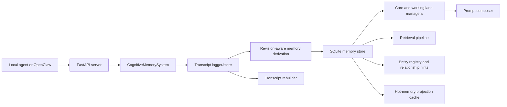

# Smart Memory v3.1

Smart Memory is a single-user, fully local, transcript-first memory backend for agents and OpenClaw-style runtimes.

v3.1 changes the core contract:

- transcripts are the canonical truth
- memories are derived, revision-aware state
- SQLite is the only canonical runtime store
- core and working lanes are downstream context views
- the whole derived state can be wiped and rebuilt from transcript history

## What v3.1 adds

- immutable local transcript logging with `sessions`, `transcript_messages`, and `memory_evidence`
- transcript-first ingest flow: append transcript first, derive memory second
- evidence-backed revision chains for `SUPERSEDE`, `EXPIRE`, `NOOP`, and `UPDATE`
- deterministic rebuild and replay from transcript history
- transcript inspection APIs and rebuild endpoints
- transcript-backed lane promotion rules and hot-memory projection regeneration

## Truth hierarchy

1. Transcript layer
2. Derived memory layer
3. Prompt/context layer

This means:

- transcript messages are the source of truth
- durable memories must link back to transcript evidence unless explicitly synthetic
- memory state is disposable and rebuildable
- prompt assembly depends on active derived memory, not the other way around

## Design constraints

- 100% local and offline-capable
- deterministic and inspectable
- bounded prompt assembly
- minimal infrastructure
- no graph database
- no cloud services
- no migration-first runtime complexity

## Architecture



## Runtime flow

1. `POST /ingest` or `POST /transcripts/message`
2. transcript row is committed first
3. candidate memory is derived from the new transcript message
4. revision logic decides `ADD`, `UPDATE`, `SUPERSEDE`, `EXPIRE`, `NOOP`, `MERGE`, or `REJECT`
5. derived memory, entity links, lane membership, vectors, and audit events are updated
6. `POST /compose` assembles prompt context from core, working, and retrieved memory

## Canonical storage

```text
workspace/
+- data/
   +- memory_store/
   |  +- v3_memory.sqlite
   +- hot_memory/
      +- hot_memory.json   # derived compatibility projection only
```

`v3_memory.sqlite` contains transcript tables, memory tables, lane membership, entity hints, vectors, and audit events in one local database.

JSON export remains useful for backup or debugging, but it is no longer part of the runtime truth path.

See [MEMORY_STRUCTURE.md](/D:/Users/JamesMSI/Desktop/LLM%20Projects/Smart%20Memory/smart-memory/.release-repo/MEMORY_STRUCTURE.md).

## HTTP API

Core runtime:

- `GET /health`
- `POST /ingest`
- `POST /retrieve`
- `POST /compose`
- `POST /run_background`
- `GET /memories`
- `GET /memory/{memory_id}`
- `GET /memory/{memory_id}/history`
- `GET /memory/{memory_id}/active`
- `GET /memory/{memory_id}/chain`
- `GET /memory/{memory_id}/evidence`
- `GET /insights/pending`

Transcript and rebuild:

- `POST /transcripts/message`
- `GET /transcripts/{session_id}`
- `GET /transcript/message/{message_id}`
- `POST /rebuild`
- `POST /rebuild/{session_id}`

Lane and eval inspection:

- `GET /lanes/{lane_name}`
- `POST /lanes/{lane_name}/{memory_id}`
- `DELETE /lanes/{lane_name}/{memory_id}`
- `GET /eval/suite/{suite_name}`
- `GET /eval/case/{case_id}`

See [INTEGRATION.md](/D:/Users/JamesMSI/Desktop/LLM%20Projects/Smart%20Memory/smart-memory/.release-repo/INTEGRATION.md).

## Quick start

```bash
git clone https://github.com/BluePointDigital/smart-memory.git
cd smart-memory/smart-memory
npm install
.\.venv\Scripts\python -m uvicorn server:app --host 127.0.0.1 --port 8000
```

Example ingest:

```json
{
  "user_message": "I prefer coffee now instead of tea.",
  "assistant_message": "Preference updated.",
  "source_session_id": "session-42"
}
```

Example transcript append:

```json
{
  "role": "user",
  "source_type": "conversation",
  "content": "Deployment is blocked on config review."
}
```

## Rebuildability

The key operational guarantee in v3.1 is that you can rebuild derived state from transcript truth:

- keep `sessions` and `transcript_messages`
- wipe memories, evidence links, lanes, entities, relationship hints, and vectors
- replay transcript history deterministically
- recover active memory and prompt context from the transcript log

## Current focus

Smart Memory v3.1 is not trying to be a hosted memory platform.

It is a lean local backend that is:

- smarter than plain vector retrieval
- more stable than memory-only heuristics
- more inspectable than opaque LLM memory loops
- small enough to run and debug on one local machine

