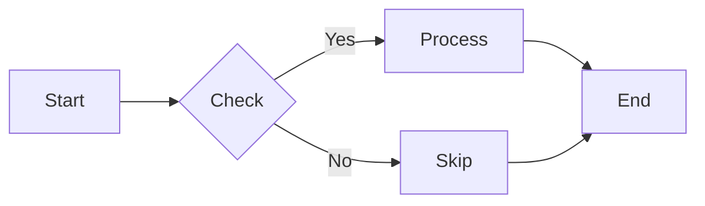
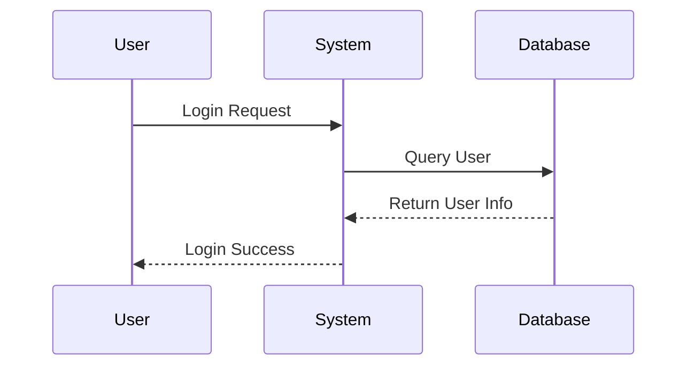
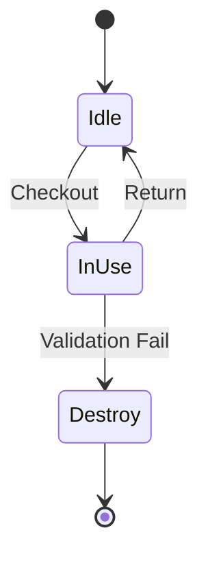

# Mermaid Image Uploader | Mermaid 图片上传器

> 🎨 Convert Mermaid diagrams to images and upload to free image hosts - Perfect for WeChat Official Accounts!
>
> 🎨 将 Mermaid 图表转换为图片并上传到免费图床 - 完美适配微信公众号！

---

## ✨ Features | 功能特性

- **Multiple Conversion Methods | 多种转换方式**
  - Kroki online conversion (recommended, no installation needed) | Kroki 在线转换（推荐，无需安装）
  - mermaid-cli local conversion | mermaid-cli 本地转换
  - HTML preview method | HTML 预览方式

- **Free Image Host Support | 免费图床支持**
  - FreeImage.host (fast in China) | FreeImage.host（国内访问速度快）
  - Postimages (simple & easy) | Postimages（简单易用）
  - Imgur (stable & international) | Imgur（稳定，国际化）

- **Batch Markdown Processing | 批量 Markdown 处理**
  - Auto-detect all Mermaid diagrams in file | 自动检测文件中所有 Mermaid 图表
  - One-click replace with image links | 一键替换为图片链接
  - Preserve original formatting | 保留原始格式

- **Auto Markdown Generation | 自动 Markdown 生成**
  - Directly output `` code | 直接输出 `` 代码
  - Perfect for WeChat Official Account articles | 完美适配微信公众号文章

---

## 🚀 Quick Start | 快速开始

### Install Dependencies | 安装依赖

```bash
pip install requests
```

### Basic Usage | 基本使用

```bash
# Convert single Mermaid to HTML (easiest) | 转换单个 Mermaid 为 HTML（最简单）
python mermaid_uploader.py --code "graph LR A-->B" --format html

# Convert and upload to image host | 转换并上传到图床
python mermaid_uploader.py --code "graph LR A-->B" --upload

# Process Markdown file | 处理 Markdown 文件
python mermaid_uploader.py --markdown article.md
```

### Python API

```python
from mermaid_uploader import MermaidUploader

uploader = MermaidUploader()

url = uploader.convert_and_upload("""
graph LR
    A[Start] --> B[Process]
    B --> C[End]
""", image_host='freeimage')

print(f"Image URL: {url}")
```

---

## 📊 Supported Image Hosts | 支持的图床

| Host | API Key Required | Notes | 说明 |
|------|-----------------|-------|------|
| FreeImage.host | ❌ | Free, fast in China (recommended) | 免费，国内访问快（推荐） |
| Postimages | ❌ | Simple & user-friendly | 简单易用 |
| Imgur | ✅ | Stable, international | 稳定，国际化 |

---

## 🎯 Conversion Methods | 转换方式对比

| Method | Installation | Speed | Quality | 安装要求 | 速度 | 质量 |
|--------|-------------|-------|---------|----------|------|------|
| Kroki | ❌ | Fast | Good | 无需安装 | 快 | 良好 |
| mermaid-cli | ✅ Node.js | Fast | Best | 需要 Node.js | 快 | 最佳 |
| HTML | ❌ | Fast | Manual | 无需安装 | 快 | 需手动 |

**Kroki is recommended for most cases! | 大多数情况下推荐使用 Kroki！**

---

## 📁 Project Structure | 项目结构

```
mermaid-image-uploader/
├── SKILL.md                    # Skill documentation | 技能说明
├── package.json                # Skill configuration | 技能配置
├── README.md                   # Detailed usage guide | 详细使用指南
├── GITHUB_PROFILE.md           # GitHub profile | GitHub 项目简介
├── mermaid_uploader.py         # Main program | 主程序
├── mermaid_converter.py        # Mermaid converter | Mermaid 转换器
└── image_host_uploader.py      # Image host uploader | 图床上传器
```

---

## 🎨 Examples | 使用示例

### Flowchart | 流程图



### Sequence Diagram | 时序图



### State Diagram | 状态图



---

## 🔧 Configuration | 配置说明

### Command Line Options | 命令行选项

```
--input, -i      Input Mermaid file | 输入 Mermaid 文件
--output, -o     Output image file | 输出图片文件
--markdown, -m   Markdown file to process | 要处理的 Markdown 文件
--output-markdown  Output Markdown file | 输出 Markdown 文件
--upload, -u     Upload to image host | 上传到图床
--image-host     Image host (freeimage, postimages, imgur) | 图床选择
--format, -f     Output format (png, svg, jpg, html) | 输出格式
--api-key        Image host API Key | 图床 API Key
--code, -c       Direct Mermaid code input | 直接输入 Mermaid 代码
--test           Run test | 运行测试
```

---

## 🐛 FAQ | 常见问题

### Q: Conversion failed? | 转换失败怎么办？

A: Try HTML format and save manually | 尝试 HTML 格式并手动保存：

```bash
python mermaid_uploader.py --code "your code" --format html
```

### Q: Image host upload too slow or failed? | 图床上传太慢或失败？

A: Try different host | 尝试不同的图床：

```bash
python mermaid_uploader.py --input diagram.mmd --upload --image-host postimages
```

### Q: How to use mermaid-cli? | 如何使用 mermaid-cli？

A: Install first | 先安装：

```bash
npm install -g @mermaid-js/mermaid-cli
```

The program will auto-detect it | 程序会自动检测。

---

## 👨‍💻 Author | 作者

Created with ❤️ by ClawX | ClawX 用心打造

## 📄 License | 许可证

MIT License

---

**Built for WeChat Official Account content creators! | 专为微信公众号内容创作者打造！** 🚀
