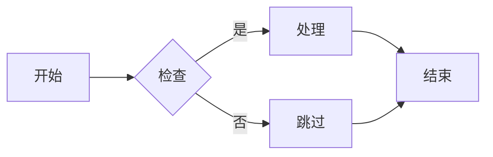
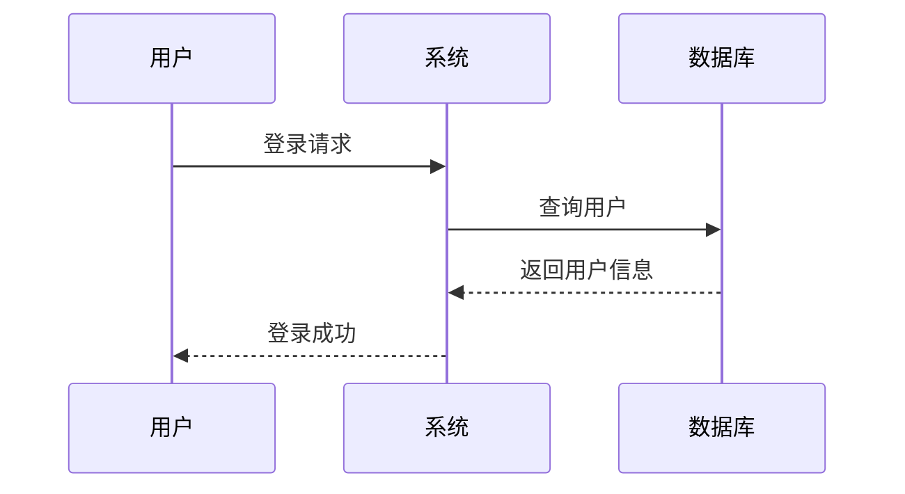
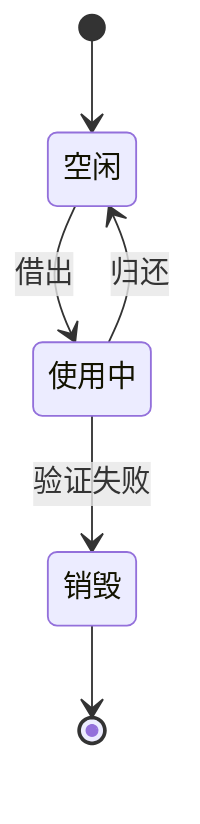

# Mermaid 图片生成与图床上传技能

专为公众号文章设计的 Mermaid 图表转换与图床上传工具。

## ✨ 功能特性

- 🎨 **多种转换方式**
  - Kroki 在线转换（推荐，无需安装）
  - mermaid-cli（本地转换）
  - HTML 预览（浏览器打开截图）

- ☁️ **支持多个免费图床**
  - FreeImage.host（免费，国内访问快）
  - Postimages（简单易用）
  - Imgur（稳定，国外）

- 📝 **批量处理 Markdown**
  - 自动识别文件中的所有 Mermaid 图表
  - 一键替换为图片链接
  - 保留原始文件格式

- 🔗 **自动生成 Markdown 代码**
  - 转换完成后直接给出 `` 代码
  - 方便直接复制到公众号文章

## 🚀 快速开始

### 安装依赖

```bash
pip install requests
```

### 基本使用

#### 1. 转换单个 Mermaid 代码

```bash
# 使用 HTML 方式（最简单，无需其他工具）
python mermaid_uploader.py --code "graph LR A-->B" --format html

# 使用 Kroki 在线转换
python mermaid_uploader.py --code "graph LR A-->B" --format png --upload
```

#### 2. 转换 Mermaid 文件

```bash
# 转换文件并上传
python mermaid_uploader.py --input diagram.mmd --upload

# 指定图床
python mermaid_uploader.py --input diagram.mmd --upload --image-host postimages
```

#### 3. 处理 Markdown 文件

```bash
# 处理文件中的所有 Mermaid 图表
python mermaid_uploader.py --markdown article.md

# 指定输出文件
python mermaid_uploader.py --markdown article.md --output-markdown article_final.md
```

### Python API 使用

```python
from mermaid_uploader import MermaidUploader

uploader = MermaidUploader()

# 转换并上传
url = uploader.convert_and_upload("""
graph LR
    A[开始] --> B[处理]
    B --> C[结束]
""", image_host='freeimage')

print(f"图片URL: {url}")
```

## 📋 支持的图床

| 图床 | 需要API Key | 特点 |
|------|------------|------|
| FreeImage.host | ❌ | 免费，国内访问快，推荐 |
| Postimages | ❌ | 简单易用，界面友好 |
| Imgur | ✅ | 稳定，国际知名 |

## 🎯 转换方式对比

| 方式 | 需要安装 | 速度 | 质量 |
|------|---------|------|------|
| Kroki | ❌ | 快 | 好 |
| mermaid-cli | ✅ Node.js | 快 | 最好 |
| HTML | ❌ | 快 | 需手动截图 |

**推荐优先使用 Kroki 方式！**

## 📁 文件结构

```
skills/mermaid-image-uploader/
├── SKILL.md                    # 技能说明
├── package.json                # 技能配置
├── README.md                   # 详细使用说明（本文件）
├── mermaid_uploader.py         # 主程序
├── mermaid_converter.py        # Mermaid 转换器
├── image_host_uploader.py      # 图床上传器
└── examples/                   # 示例
    ├── sample_diagram.mmd
    └── sample_article.md
```

## 🎨 示例

### 流程图



### 序列图



### 状态图



## 🔧 配置说明

### 命令行参数

```
--input, -i      输入的 Mermaid 文件
--output, -o     输出的图片文件
--markdown, -m   处理的 Markdown 文件
--output-markdown  输出的 Markdown 文件
--upload, -u     是否上传到图床
--image-host     指定图床 (freeimage, postimages, imgur)
--format, -f     输出格式 (png, svg, jpg, html)
--api-key        图床 API Key
--code, -c       直接传入 Mermaid 代码
--test           运行测试
```

## 🐛 常见问题

### Q: 转换失败怎么办？

A: 尝试使用 HTML 格式，然后在浏览器中打开并截图：

```bash
python mermaid_uploader.py --code "your code" --format html
```

### Q: 图床上传太慢或失败？

A: 尝试更换图床：

```bash
# 使用 Postimages
python mermaid_uploader.py --input diagram.mmd --upload --image-host postimages
```

### Q: 如何使用 mermaid-cli？

A: 先安装：

```bash
npm install -g @mermaid-js/mermaid-cli
```

然后就可以使用了，程序会自动检测。

## 👥 欢迎关注

欢迎关注微信公众号：**拿客**

获取更多技术干货和开源工具分享！

## 📄 许可证

MIT License
