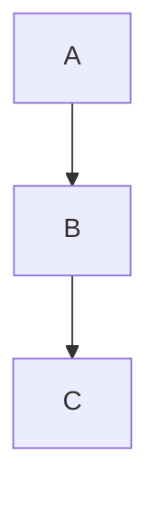
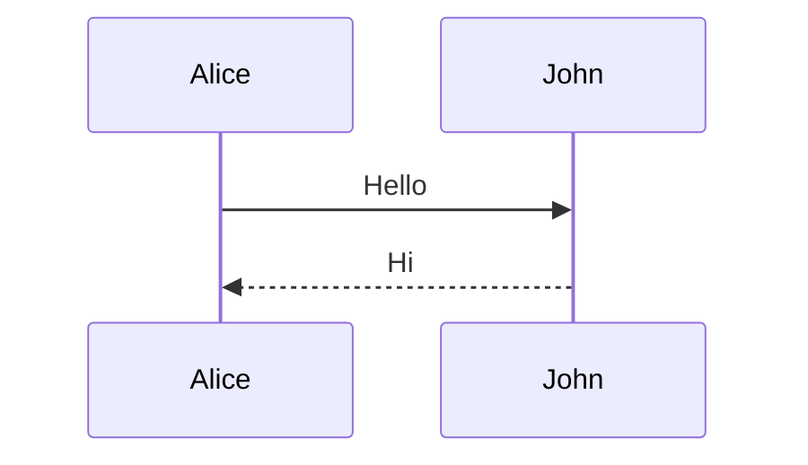
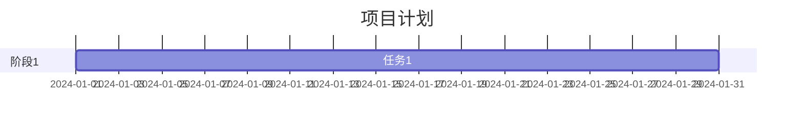
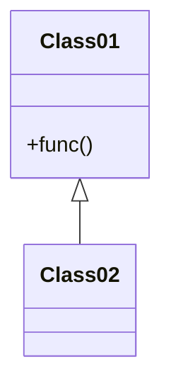
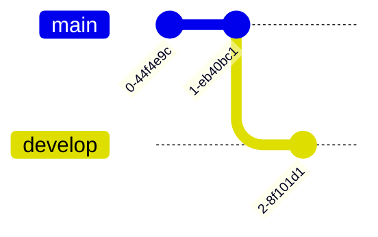

# 思源笔记内容书写指南

本文档基于思源笔记官方文档总结，为 AI Agent 操作思源笔记提供书写格式规范。

> 参考来源：思源笔记用户指南（笔记本 ID: 20210808180117-czj9bvb）

## 核心概念

### 内容块

内容块是思源笔记的基本单位，每个内容块通过全局唯一的 ID 进行标识。

- **ID 格式**：`YYYYMMDDHHMMSS-xxxxxxx`（时间戳 + 7位随机字符）
- **示例**：`20200813004931-q4cu8na`

### 内容块类型

| 类型  | 说明           | kramdown type |
| --- | ------------ | ------------- |
| 文档块 | 文档本身         | `d`           |
| 标题块 | `# ## ###` 等 | `h`           |
| 段落块 | 普通文本段落       | `p`           |
| 列表块 | 有序/无序/任务列表   | `l`           |
| 代码块 | 代码片段         | `c`           |
| 表格块 | 表格内容         | `t`           |
| 引用块 | 块引用          | `blockquote`  |

### 容器块

以下三种内容块是容器块，可以包含其他任意类型的内容块：

- 文档块
- 列表块
- 引述块

## 引用语法

### 基本格式

```
((块ID "锚文本"))
```

### 锚文本类型

| 语法            | 类型    | 说明            |
| ------------- | ----- | ------------- |
| `((id "文本"))` | 静态锚文本 | 固定显示，不跟随定义块变化 |
| `((id '文本'))` | 动态锚文本 | 跟随定义块内容自动更新   |

### 示例

```
推荐引用格式：
((20200813004931-q4cu8na "什么是内容块"))

动态锚文本（跟随原文变化）：
((20200813004931-q4cu8na '什么是内容块'))
```

### 注意事项

- 必须使用双引号 `"` 或单引号 `'` 包裹锚文本
- **不要**使用标准 Markdown 链接格式 `[文本](id)`
- 如需使用标准 Markdown 链接，格式为 `[标题](siyuan://blocks/<docId>)`

## 嵌入块语法

### 基本格式

```
{{ SQL查询语句 }}
```

### 常用查询示例

```sql
查询最近更新的5个文档：
{{ SELECT * FROM blocks WHERE type = 'd' ORDER BY updated DESC LIMIT 5 }}

查询包含特定关键词的段落：
{{ SELECT * FROM blocks WHERE content LIKE '%关键词%' AND type = 'p' }}

查询特定标签的内容：
{{ SELECT * FROM blocks WHERE content LIKE '%#标签#%' }}

查询未完成的任务：
{{ SELECT * FROM blocks WHERE markdown LIKE '%[ ]%' AND subtype = 't' AND type = 'i' }}

随机显示3个内容块：
{{ SELECT * FROM blocks ORDER BY random() LIMIT 3 }}
```

### 数据库表

| 表名           | 说明        |
| ------------ | --------- |
| `blocks`     | 内容块表（最常用） |
| `attributes` | 属性表       |
| `refs`       | 引用关系表     |
| `assets`     | 资源引用表     |
| `spans`      | 行内元素表     |

## 排版元素

### 标题

```markdown
## 二级标题
### 三级标题
#### 四级标题
##### 五级标题
###### 六级标题
```

> 注意：一级标题 `#` 通常用于文档标题，正文从二级开始

### 列表

```markdown
无序列表：
- 项目一
- 项目二
  - 子项目

有序列表：
1. 第一步
2. 第二步
   1. 子步骤

任务列表：
- [ ] 未完成任务
- [X] 已完成任务
```

### 代码块

````markdown
带语法高亮：

```javascript
function hello() {
  console.log("Hello World");
}
````

支持的语言：ruby, python, js, html, css, bash, json, yml, xml, go, java 等

````

### 引用块

```markdown
> 这是普通引用块
> 可以多行
````

### 提示块（Callout）

```markdown
> [!NOTE]
> 提示信息，即使快速浏览也应注意

> [!TIP]
> 可选信息，有助于更顺利完成任务

> [!IMPORTANT]
> 成功完成任务所必需的关键信息

> [!WARNING]
> 由于存在潜在风险，此重要内容需要立即关注

> [!CAUTION]
> 某项操作可能带来的负面后果
```

### 表格

```markdown
| 列1 | 列2 | 列3 |
| --- | --- | --- |
| 数据1 | 数据2 | 数据3 |
| 数据4 | 数据5 | 数据6 |
```

### 分隔线

```markdown
---
```

### 数学公式

```markdown
行内公式：$E=mc^2$

块级公式：
$$
\frac{1}{x}
$$
```

### 图表

#### 脑图

````markdown
```mindmap
- 根节点
  - 子节点1
  - 子节点2
    - 孙节点
```
````

#### 流程图（Mermaid）

````markdown

````

#### 时序图

````markdown

````

#### 甘特图

````markdown

````

#### 类图

````markdown

````

#### Git 图

````markdown

````

#### ECharts 图表

````markdown
```echarts
{
  "title": { "text": "图表标题" },
  "xAxis": { "type": "category", "data": ["A", "B", "C"] },
  "yAxis": { "type": "value" },
  "series": [{ "type": "line", "data": [1, 2, 3] }]
}
```
````

### 多媒体

```markdown
视频：
<video controls="controls" src="assets/video.mp4"></video>

音频：
<audio controls="controls" src="assets/audio.wav"></audio>

iframe：
<iframe src="https://example.com" style="width: 100%; height: 400px;"></iframe>
```

### HTML 块

```markdown
<div>
自定义 HTML 内容
</div>
```

## 内容块属性

### 命名

- 每个块可以设置一个唯一的命名
- 命名用于在内容区中标识块

### 别名

- 一个块可以设置多个别名
- 通过英文状态下的逗号 `,` 分隔

### 备注

- 仅支持纯文本
- 用于添加简短说明

### 属性语法（kramdown）

```markdown
内容{: id="块ID" name="命名" alias="别名1,别名2" memo="备注"}
```

## 换行规则

- 使用 `\n` 表示换行
- 使用 `\n\n` 表示段落分隔（空一行）
- 列表项之间不需要空行

```markdown
正确示例：
第一段内容

第二段内容

## 新标题
标题下的内容
```

## Agent 书写建议

### 创建文档时

1. 标题通过命令参数指定，内容从正文开始
2. 使用 `\n` 换行，`\n\n` 分段
3. 引用其他文档时使用 `((id "标题"))` 格式

### 更新文档时

1. 使用 `siyuan update <docId> "完整内容"` 全文更新
2. 使用 `siyuan bu <blockId> "块内容"` 更新单个块
3. 保留原有的块 ID 和属性

### 格式选择

1. 优先使用 Markdown 语法
2. 特殊需求可使用 HTML 块
3. 动态内容使用嵌入块

## 相关文档

- [最佳实践](best-practices.md)
- [使用指南](usage-guide.md)
- [命令详细文档](../commands/)

