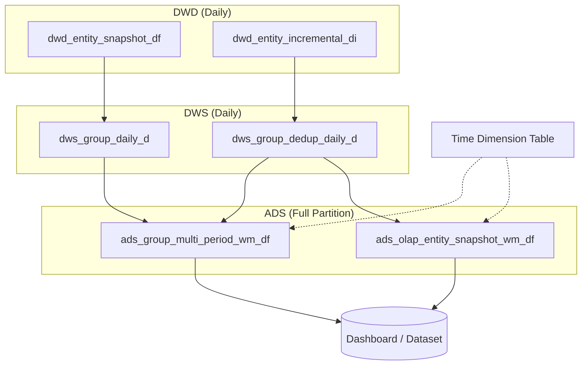

# DWD/DWS/ADS Layered Data Warehouse Patterns

Production-tested SQL patterns for multi-period, multi-dimension data warehouse modeling.
Use this skill when designing DWD/DWS/ADS summary tables, multi-period (weekly/monthly) ADS roll-ups, OLAP multi-select deduplication tables, or dashboard dataset SQL.

Core patterns: dimension explosion with ALL, period-end snapshots, period-sum metrics, historical period freezing, and OLAP deduplication.

After completing table design and SQL, a Mermaid architecture diagram **must** be generated (see Section 8).

---

## 0. Scheduling Date Placeholders

All partition writes must use date placeholders consistent with the scheduling engine. Mixing placeholder styles causes T-1 / T-0 misalignment.

### 0.1 Placeholder Reference

| Scenario | Recommended Placeholder | Meaning | Typical Use |
|----------|------------------------|---------|-------------|
| **Batch write** `INSERT OVERWRITE … PARTITION(dt=…)` | `${zdt.addDay(-1).format("yyyy-MM-dd")}` | Run date minus 1 (T-1), `yyyy-MM-dd` | ADS multi-period, OLAP snapshot, DIM daily full |
| **SQL stat date CTE** | Same as above | Aligned with write partition `dt` | `stat_dt AS (SELECT '…' AS dt)`, downstream `WHERE d.dt <= s.dt` |
| **Dataset / report read** | `$effectdate(''yyyy-MM-dd'',-1)` | Read T-1 partition data | Reading latest ready partition from ADS/OLAP tables |
| **Dimension table latest partition** | `$maxd(''schema'',''table'',0)` | Latest `dt` of target table | Joining dimension tables |

> **Partition semantics**: `dt` generally represents the **effective stat date** of the write (aligned with T-1). Historical partitions are never overwritten — this is how period freezing works (see Section 2.3).

### 0.2 Standard Write Example

```sql
INSERT OVERWRITE TABLE <schema>.<target_table> PARTITION (dt = '${zdt.addDay(-1).format("yyyy-MM-dd")}')
SELECT <cols_in_ddl_order>
FROM <source>
WHERE dt = '${zdt.addDay(-1).format("yyyy-MM-dd")}';
```

### 0.3 Standard Dataset Read Example

```sql
FROM <schema>.<ads_wm_table>
WHERE dt = '$effectdate(''yyyy-MM-dd'',-1)' AND period_type = 'W'
```

### 0.4 Local Debugging Notes

- **Ad-hoc**: Replace placeholders with fixed dates, e.g. `'2026-03-20'`.
- **Do not mix**: If the team standard is `zdt` T-1, do not use `${bizdate}` in new tables unless `bizdate ≡ T-1` is explicitly agreed.

---

## 1. Layered Architecture & Responsibilities

| Layer | Grain | ALL Dimension | Core Responsibility |
|-------|-------|---------------|-------------------|
| **DWD** | Entity × Dimension (daily) | **Not stored** | Daily snapshot / daily incremental detail |
| **DWS (entity grain)** | Entity × Dimension (daily) | **Not stored** | Aggregate by entity, deduplicate detail-level items |
| **DWS (group grain)** | Group × Dimension (daily) | **Stored** | Dimension explosion adds ALL, then aggregate |
| **ADS (multi-period)** | Dimension × Period Type × Period ID (full partition) | **Stored** | Weekly/monthly roll-up; historical period freezing |
| **ADS (OLAP)** | Period × Detail-level grain (full partition) | **Stored** | Online deduplication for multi-select reports |

### Key Design Rules

1. **DWD never stores ALL** — ALL is generated at DWS/ADS via dimension explosion
2. **DWS is the boundary** — below DWS, grain is fine (per entity); above DWS, grain is coarse (per group)
3. **ADS multi-period** — joins time dimension table for week/month boundaries; two metric types: snapshot (period-end) vs. cumulative (period-sum)
4. **OLAP layer** — detail-grain table for online deduplication when users multi-select dimension values

---

## 2. Core Patterns

### 2.1 Dimension Explosion with ALL (DWS Layer, Hive)

When aggregating by multiple dimensions and the report needs an "ALL" option for each:

```sql
-- Explode each dimension to include both real value and ALL
FROM <source_table> t
LATERAL VIEW EXPLODE(array(t.dimension_a, 'ALL')) a AS dim_a_exp
LATERAL VIEW EXPLODE(array(t.dimension_b, 'ALL')) b AS dim_b_exp
LATERAL VIEW EXPLODE(array(t.dimension_c, 'ALL')) c AS dim_c_exp
```

> **StarRocks / Trino**: `LATERAL VIEW EXPLODE` is not supported. Use `UNION ALL` to manually append ALL rows:
>
> ```sql
> SELECT dim_a, dim_b, <metrics> FROM <source> WHERE <filter>
> UNION ALL
> SELECT 'ALL' AS dim_a, dim_b, <metrics> FROM <source> WHERE <filter>
> UNION ALL
> SELECT dim_a, 'ALL' AS dim_b, <metrics> FROM <source> WHERE <filter>
> UNION ALL
> SELECT 'ALL' AS dim_a, 'ALL' AS dim_b, <metrics> FROM <source> WHERE <filter>
> ```

### 2.2 Multi-Period Aggregation CTE (Weekly + Monthly)

Complete SQL skeleton for building ADS multi-period tables from a DWS daily source:

```sql
WITH stat_dt AS (
    SELECT '${zdt.addDay(-1).format("yyyy-MM-dd")}' AS dt
),

-- Step 1: Join time dimension table for week/month fields
daily_with_dim AS (
    SELECT d.dt, d.<all_dim_cols>, d.<snapshot_metrics>, d.<cumulative_metrics>,
           dim.y_week_id, dim.y_month,
           dim.week_last_day, dim.month_last_day
    FROM <dws_table> d
    INNER JOIN <time_dim_table> dim ON d.dt = dim.date_id
    CROSS JOIN stat_dt s
    WHERE d.dt <= s.dt
),

-- Step 2a: Weekly — determine period-end date (only completed weeks)
week_period_end AS (
    SELECT y_week_id, <dims>,
           MAX(week_last_day) AS period_end_dt
    FROM daily_with_dim
    WHERE y_week_id IS NOT NULL
      AND week_last_day <= (SELECT dt FROM stat_dt)  -- only completed weeks
    GROUP BY y_week_id, <dims>
),

-- Step 2b: Weekly — snapshot metrics at period-end
week_snapshot AS (
    SELECT t.y_week_id, t.<dims>, e.period_end_dt,
           t.<snapshot_metrics>   -- e.g. row_count, storage_gb
    FROM daily_with_dim t
    INNER JOIN week_period_end e
        ON t.y_week_id = e.y_week_id
       AND t.dt = e.period_end_dt
       AND <dims_join_conditions>
),

-- Step 2c: Weekly — cumulative metrics (sum over all days in period)
week_cumulative AS (
    SELECT y_week_id, <dims>,
           ROUND(SUM(<cumulative_metric>), 2) AS <cumulative_metric>
    FROM daily_with_dim
    WHERE y_week_id IS NOT NULL
    GROUP BY y_week_id, <dims>
),

-- Step 2d: Weekly — combine snapshot + cumulative
week_agg AS (
    SELECT s.<dims>,
           'W' AS period_type,
           s.y_week_id AS period_id,
           s.period_end_dt,
           s.<snapshot_metrics>,
           COALESCE(c.<cumulative_metric>, 0) AS <cumulative_metric>
    FROM week_snapshot s
    LEFT JOIN week_cumulative c
        ON s.y_week_id = c.y_week_id AND <dims_join_conditions>
),

-- Step 3: Monthly — identical structure, replace week → month
month_period_end AS (
    SELECT y_month, <dims>,
           MAX(month_last_day) AS period_end_dt
    FROM daily_with_dim
    WHERE y_month IS NOT NULL
      AND month_last_day <= (SELECT dt FROM stat_dt)
    GROUP BY y_month, <dims>
),
month_snapshot AS (
    SELECT t.y_month, t.<dims>, e.period_end_dt,
           t.<snapshot_metrics>
    FROM daily_with_dim t
    INNER JOIN month_period_end e
        ON t.y_month = e.y_month
       AND t.dt = e.period_end_dt
       AND <dims_join_conditions>
),
month_cumulative AS (
    SELECT y_month, <dims>,
           ROUND(SUM(<cumulative_metric>), 2) AS <cumulative_metric>
    FROM daily_with_dim
    WHERE y_month IS NOT NULL
    GROUP BY y_month, <dims>
),
month_agg AS (
    SELECT s.<dims>,
           'M' AS period_type,
           s.y_month AS period_id,
           s.period_end_dt,
           s.<snapshot_metrics>,
           COALESCE(c.<cumulative_metric>, 0) AS <cumulative_metric>
    FROM month_snapshot s
    LEFT JOIN month_cumulative c
        ON s.y_month = c.y_month AND <dims_join_conditions>
),

-- Step 4: UNION weekly + monthly
all_periods AS (
    SELECT * FROM week_agg
    UNION ALL
    SELECT * FROM month_agg
)

INSERT OVERWRITE TABLE <schema>.<target_ads_table>
  PARTITION (dt = '${zdt.addDay(-1).format("yyyy-MM-dd")}')
SELECT <cols_in_ddl_order>   -- ⚠️ Column order MUST match DDL exactly
FROM all_periods;
```

### 2.3 Historical Period Freezing

Historical periods are frozen by two mechanisms working together:

1. **Period-end gating**: `week_last_day <= stat_dt` — only **completed** periods produce snapshots. The current in-progress week/month is excluded.
2. **Partition overwrite**: `INSERT OVERWRITE … PARTITION(dt=<today>)` writes only to today's partition. Historical partitions are never touched, naturally freezing them.

> **Why this matters**: A dashboard reading partition `dt = '2026-01-15'` will always show the same weekly/monthly numbers — even if the pipeline is re-run. Only the latest `dt` partition gets refreshed.

### 2.4 Two Types of Metrics — Snapshot vs. Cumulative

| Metric Type | Definition | Aggregation | Example |
|-------------|-----------|-------------|---------|
| **Snapshot** | Point-in-time value at period end | Take value on `period_end_dt` day | Storage size, row count, active users |
| **Cumulative** | Accumulated over the period | `SUM()` over all days in the period | Compute cost, API calls, revenue |

This distinction is critical: mixing up the two produces incorrect numbers. Snapshot metrics join on `dt = period_end_dt`; cumulative metrics `SUM()` across all days.

---

## 3. OLAP Multi-Select Deduplication

### The Problem

Pre-aggregated ADS tables store one row per dimension combination. When users multi-select (e.g. business_line IN ('A', 'B')), directly summing pre-aggregated rows **double-counts** entities that belong to multiple selected values.

### The Solution

Create detail-grain OLAP tables at the (period × entity) level. The report dataset first deduplicates by entity, then aggregates:

```sql
-- Correct: deduplicate by entity first, then SUM
WITH entity_dedup AS (
    SELECT period_id, <output_dim>, entity_id,
           MAX(<snapshot_metric>) AS entity_value
    FROM <schema>.<olap_detail_table>
    WHERE dt = '$effectdate(''yyyy-MM-dd'',-1)'
      AND period_type = 'W'
      AND dimension_a IN (#{selectedListA})   -- multi-select
      AND dimension_b IN (#{selectedListB})   -- multi-select
      AND dimension_a <> 'ALL'
      AND dimension_b <> 'ALL'
    GROUP BY period_id, <output_dim>, entity_id
),
entity_agg AS (
    SELECT period_id, <output_dim>,
           COUNT(DISTINCT entity_id) AS entity_count,
           ROUND(SUM(entity_value), 2) AS total_value
    FROM entity_dedup
    GROUP BY period_id, <output_dim>
)
SELECT * FROM entity_agg
```

> **Key rule**: Inner query groups by `(period_id, entity_id)` with `MAX()` — this ensures each entity contributes only once regardless of how many selected dimension values it belongs to.

---

## 4. Dataset Skeleton — Period Comparison with Delta

Standard pattern for T-1 / T-2 / T-3 period comparison with week-over-week or month-over-month delta:

```sql
WITH periods_ranked AS (
    SELECT <all_cols>,
           ROW_NUMBER() OVER (
               PARTITION BY <report_dims>
               ORDER BY period_end_dt DESC
           ) AS rn
    FROM <schema>.<ads_wm_table>
    WHERE dt = '$effectdate(''yyyy-MM-dd'',-1)' AND period_type = 'W'
),
base AS (
    SELECT *,
           CASE rn
               WHEN 1 THEN 'T-1'
               WHEN 2 THEN 'T-2'
               WHEN 3 THEN 'T-3'
           END AS stat_period
    FROM periods_ranked WHERE rn IN (1, 2, 3)
),
with_prev AS (
    SELECT *,
           LAG(<metric>, 1) OVER (
               PARTITION BY <report_dims>
               ORDER BY CASE stat_period
                   WHEN 'T-1' THEN 3
                   WHEN 'T-2' THEN 2
                   WHEN 'T-3' THEN 1
                   ELSE 0
               END
           ) AS <metric>_prev
    FROM base
)
SELECT <report_cols>, stat_period, period_id, period_end_dt,
       <metric>,
       ROUND(<metric> - <metric>_prev, 4) AS <metric>_delta
FROM with_prev
```

> The `CASE` in `ORDER BY` ensures LAG works correctly: T-3 → T-2 → T-1 chronological order, so `LAG(1)` always gives the previous period.

---

## 5. DDL Templates

### ADS Multi-Period Table

```sql
CREATE TABLE <schema>.<prefix>_<dimensions>_<metrics>_wm_df (
    dimension_a       STRING  COMMENT 'Dimension A (includes ALL)',
    dimension_b       STRING  COMMENT 'Dimension B (includes ALL)',
    dimension_c       STRING  COMMENT 'Dimension C (includes ALL)',
    period_type       STRING  COMMENT 'Period type: W=weekly M=monthly',
    period_id         STRING  COMMENT 'Period identifier: week_id or month_id',
    period_end_dt     STRING  COMMENT 'Period end date (week=Sunday, month=last day)',
    entity_count      INT     COMMENT 'Distinct entity count (snapshot at period end)',
    snapshot_metric   DOUBLE  COMMENT 'Snapshot metric at period end',
    cumulative_metric DOUBLE  COMMENT 'Cumulative metric summed over period'
) COMMENT '<table description>'
PARTITIONED BY (dt STRING COMMENT 'Write date partition');
```

### OLAP Detail Table

```sql
CREATE TABLE <schema>.<prefix>_olap_period_<entity>_snapshot_wm_df (
    period_type       STRING  COMMENT 'W=weekly M=monthly',
    period_id         STRING  COMMENT 'Period identifier',
    period_end_dt     STRING  COMMENT 'Period end date',
    dimension_a       STRING  COMMENT 'Dimension A (includes ALL)',
    dimension_b       STRING  COMMENT 'Dimension B (includes ALL)',
    dimension_c       STRING  COMMENT 'Dimension C (includes ALL)',
    entity_id         STRING  COMMENT 'Detail-level entity identifier',
    metric_value      DOUBLE  COMMENT 'Metric value for this entity in this period'
) COMMENT 'OLAP period × entity detail for online deduplication on multi-select'
PARTITIONED BY (dt STRING COMMENT 'Write date partition');
```

---

## 6. Naming Conventions

### Table Naming

Pattern: `<prefix>_<dimensions>_<metrics>_<dedup_flag>_<period_flag>_<load_type>`

| Component | Values | Example |
|-----------|--------|---------|
| prefix | `adm_<domain>_a` | `adm_rsk_a` |
| dimensions | Abbreviated dimension list | `biz_lifecycle_quarter` |
| metrics | What's measured | `storage_compute` |
| dedup_flag | `dedup` if entity-level deduplicated, omit if not | `dedup` |
| period_flag | `wm` = weekly+monthly, `d` = daily | `wm` |
| load_type | `df` = full snapshot per partition, `di` = daily increment | `df` |

Examples:
- `adm_rsk_a_biz_lifecycle_quarter_storage_compute_dedup_wm_df`
- `adm_rsk_a_olap_period_table_snapshot_wm_df`

### File Organization

Each table directory should contain:
- `.ddl` — CREATE TABLE statement
- `.sql` — INSERT/write logic
- `_backfill_batch.sql` — Historical backfill script (optional)

### Column Order Rule

**INSERT column order MUST match DDL field order exactly.** Column misalignment silently writes values into wrong fields — the most common and hardest-to-detect bug in this architecture.

---

## 7. Debugging Checklist

When data looks wrong, check these in order:

| # | Symptom | Likely Cause | How to Verify |
|---|---------|-------------|---------------|
| 1 | **Cumulative metric has constant/wrong value** | INSERT SELECT column order doesn't match DDL | Compare SELECT column list against DDL field order — look for shifted positions |
| 2 | **Weekly cumulative metric is unusually low** | Including incomplete weeks | Check if `week_last_day > stat_dt` for the period — incomplete weeks should be excluded |
| 3 | **Multi-select SUM is too high** | Direct SUM on pre-aggregated table without entity-level dedup | Verify the dataset uses two-level aggregation: inner `MAX()` by entity, outer `SUM()` |
| 4 | **Historical period data changed unexpectedly** | Accidentally overwrote historical partitions | Confirm `INSERT OVERWRITE` targets only the current `dt` partition, not historical ones |
| 5 | **Snapshot metric differs between layers** | DWS used wrong join key to period-end | Verify `dt = period_end_dt` join condition — snapshot must read the period-end day's data, not any other day |
| 6 | **ALL row doesn't equal sum of parts** | Dimension explosion missed or double-exploded | For N dimensions, each row should produce 2^N combinations (including ALL). Check EXPLODE count matches dimension count |

---

## 8. Architecture Diagram Generation (Mandatory)

After completing any layered table design and SQL output, you **must** generate a Mermaid architecture diagram.

### What to Include

| Element | Description |
|---------|-------------|
| **Layers** | Top-to-bottom or left-to-right: DWD → DWS → ADS → OLAP → Consumer (report/dataset) |
| **Entities** | Table names (abbreviated) or logical names per layer |
| **Flow** | Arrows showing data flow direction with partition key annotations if helpful |
| **Dimension tables** | Show as side inputs (e.g. time dimension, business dimension) |
| **Metric notes** | Optionally annotate: snapshot = period-end, cumulative = period-sum |

### Recommended Format

Use `flowchart TB` or `LR` with `subgraph` per layer:



For complex lineage, split into two diagrams: "Layer Overview" + "ADS Multi-Period & OLAP Detail".

### Delivery

- Include a **renderable Mermaid code block** in the response.
- If the user has a project directory, offer to write it as `architecture.md` alongside the `.ddl` / `.sql` files.

**Never skip this step** when the conversation produces new or modified layered table designs (unless the user explicitly says "no diagram").

---

## 9. Time Dimension Table Reference

The multi-period pattern depends on a time dimension table with these key fields:

```sql
-- Required fields in time dimension table
<time_dim_schema>.<time_dim_table>
    date_id         -- DATE or STRING, join key to daily tables
    y_week_id       -- Year-week identifier, e.g. '2026-W12'
    y_month         -- Year-month identifier, e.g. '2026-03'
    week_first_day  -- First day (Monday) of the week
    week_last_day   -- Last day (Sunday) of the week
    month_first_day -- First day of the month
    month_last_day  -- Last day of the month
```

If your warehouse doesn't have a time dimension table, generate one:

```sql
-- Generate time dimension (Hive / MaxCompute)
SELECT
    date_id,
    CONCAT(YEAR(date_id), '-W', LPAD(WEEKOFYEAR(date_id), 2, '0')) AS y_week_id,
    DATE_FORMAT(date_id, 'yyyy-MM') AS y_month,
    DATE_SUB(date_id, PMOD(DATEDIFF(date_id, '1900-01-01') - 1, 7)) AS week_first_day,
    DATE_ADD(DATE_SUB(date_id, PMOD(DATEDIFF(date_id, '1900-01-01') - 1, 7)), 6) AS week_last_day,
    TRUNC(date_id, 'MM') AS month_first_day,
    LAST_DAY(date_id) AS month_last_day
FROM (
    SELECT DATE_ADD('2020-01-01', pos) AS date_id
    FROM (SELECT POSEXPLODE(SPLIT(REPEAT(',', 3650), ',')) AS (pos, val)) t
) dates
```

---

## 10. Pattern Selection Guide

When the user describes a requirement, use this decision tree:

```
User wants periodic statistics?
├── Yes → What grain?
│   ├── Group-level summary (e.g. by department, category)
│   │   ├── Single period (daily) → DWS with dimension explosion
│   │   └── Multi-period (weekly/monthly)
│   │       ├── Report uses single-select filters → ADS multi-period table
│   │       └── Report uses multi-select filters → ADS multi-period + OLAP detail table
│   └── Entity-level detail (e.g. per table, per user)
│       └── OLAP detail table for online dedup
├── No → What does the user need?
│   ├── Daily snapshot of entities → DWD snapshot table
│   ├── Daily incremental events → DWD incremental table
│   └── Entity-level aggregation → DWS entity-grain table
```

---

## Appendix: Metric Semantics Convention

| Metric | Semantics | Period Aggregation |
|--------|-----------|-------------------|
| Snapshot metrics (storage, count, balance) | Value on the **last day** of the period | Take value where `dt = period_end_dt` |
| Cumulative metrics (compute cost, events, revenue) | **Sum** of all daily values within the period | `SUM()` over all days in the period |
| Only completed periods are output | `week_last_day <= stat_dt` | In-progress periods are excluded until they complete |
