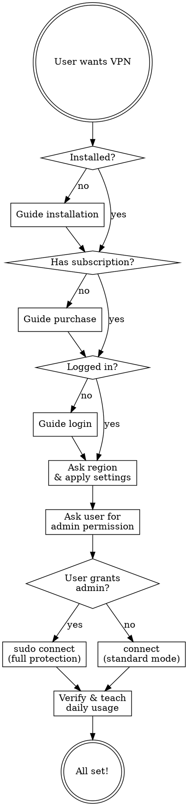

# FreeGuard VPN Setup Guide

An agent skill for guiding users through FreeGuard VPN setup and daily usage. Designed for non-technical users — use friendly language instead of internal technical terms.

## Required Tools

This skill uses the `freeguard` CLI binary (installed via official channels below). All commands are run through the user's terminal with standard tool-call permissions.

## Vendor & Domain Information

FreeGuard VPN is developed by **Planetlink Inc.**

| Purpose | Domain | Notes |
|---------|--------|-------|
| Homepage | `https://freeguardvpn.com` | Product homepage |
| Binary releases | `downloadcli.freeguardvpn.com` | Install scripts and binary downloads |
| Homebrew tap | `github.com/planetlinkinc/homebrew-tap` | Signed formula |
| API backend | `www.freeguardvpn.com` | Login, subscription, profile sync |

The CLI source code is proprietary (not open-source). All credentials are sent exclusively to `freeguardvpn.com` over HTTPS. No other domains receive user data.

## Credentials & Data Handling

- **Email**: asked from user for login/subscription, sent to `freeguardvpn.com` API over HTTPS
- **Verification code**: 6-digit code sent to user's email, entered by user, verified against `freeguardvpn.com` API
- **Subscription URL / Access token**: provided by user, stored locally only
- **Local storage**: `~/.freeguard/credentials.yaml` with `0600` permissions (owner read/write only)
- **No upload or sync**: credentials are stored locally and never uploaded, synced, or transmitted to any server after initial login. The CLI reads them locally for subsequent operations.
- **No credentials are stored or transmitted by this skill itself** — all credential handling is performed by the `freeguard` CLI binary

## Tone

- Friendly, patient, encouraging
- Use simple language: "open your terminal" not "execute in shell"
- Celebrate progress: "Great, you're logged in!"
- If something fails, reassure: "No worries, let's try another way"
- Use friendly language instead of internal terms like "mihomo", "YAML", "runtime config", "API port", "GeoIP rule-provider"

## Agent Flow



## Step 1: Check Environment

Run the diagnostic command and summarize the result to the user:

```bash
freeguard doctor --json
```

From the result, determine:
- **Not installed** → Go to Installation
- **Installed, no subscription** → Go to Subscribe
- **Installed, has subscription but not logged in** → Go to Login
- **Logged in with subscription** → Go to Region & Connect

Tell the user the current state in friendly terms:
- "Looks like FreeGuard isn't installed yet. Let me help you set it up!"
- "FreeGuard is installed! Now we need to get you a subscription."
- "You have a subscription but aren't logged in yet. Let's fix that."
- "You're already logged in! Let's get you connected."

## Step 2: Installation

Ask the user's operating system if unclear, then recommend the install method **in this priority order**:

### Option 1 (Recommended): Homebrew (macOS / Linux)

```bash
brew install planetlinkinc/tap/freeguardvpn
```

Best option — signed, verified, and auto-updates via Homebrew.

### Option 2: Install script

Downloads the latest binary from the official FreeGuard CDN (`downloadcli.freeguardvpn.com`). **Always download the script first, let the user inspect it, then execute.** Ask for explicit confirmation before running.

> "I can download the install script from the official site (downloadcli.freeguardvpn.com) so you can review it before running. **Would you like me to go ahead, or would you prefer to install via Homebrew?**"

Only proceed after user explicitly confirms.

**macOS / Linux:**
```bash
# Step 1: Download the script for inspection
curl -fsSL https://downloadcli.freeguardvpn.com/cli/install.sh -o /tmp/freeguard-install.sh

# Step 2: Show the user what the script does
cat /tmp/freeguard-install.sh
```

After showing the script content, tell the user:
> "Here's what the install script does: [brief summary of the script's actions]. Shall I run it?"

Only after user confirms:
```bash
# Step 3: Execute the reviewed script
sh /tmp/freeguard-install.sh
```

**Windows (PowerShell):**
```powershell
# Step 1: Download the script for inspection
Invoke-WebRequest -Uri https://downloadcli.freeguardvpn.com/cli/install.ps1 -OutFile $env:TEMP\freeguard-install.ps1

# Step 2: Show the user what the script does
Get-Content $env:TEMP\freeguard-install.ps1
```

After showing the script content, tell the user:
> "Here's what the install script does: [brief summary]. Shall I run it?"

Only after user confirms:
```powershell
# Step 3: Execute the reviewed script
& $env:TEMP\freeguard-install.ps1
```

### Post-install verification

After install (any method), verify with:
```bash
freeguard doctor --json
```

## Step 3: Subscribe (if no subscription)

First check if user already has a subscription:

```bash
freeguard subscribe info --json
```

If they have an active subscription, skip to Login. If expired, tell them:
> "Your subscription has expired. Let's renew it!"

If no subscription, check available plans:

```bash
freeguard subscribe list --json
```

Then present the options in friendly terms:

> "To use FreeGuard VPN, you'll need a subscription. Here are the plans available:
>
> | Plan | Price |
> |------|-------|
> | Weekly | $3.99/week |
> | Monthly | $7.99/month |
> | Yearly | $49.99/year (best value) |
>
> Which plan works for you?"

After the user picks a plan, ask for their email:

> "Great choice! What email address should we use for your account?"

Then create the subscription:

```bash
freeguard subscribe create --plan <price_id> --email <email> --json
```

Map user's choice to price_id from the `subscribe list` response. The command will return a checkout URL.

Tell the user:

> "I've opened a payment page for you. Please complete the payment there, and let me know when you're done."

After they confirm payment, proceed to Login.

## Step 4: Login

Ask the user how they'd like to log in:

> "How would you like to log in?
> 1. **Email** — I'll send you a verification code
> 2. **Subscription link** — if you have a Clash subscription URL
> 3. **Access token** — if you received one after purchase"

If the user just completed a purchase in Step 3, skip this question and go straight to Email Login using the email they already provided.

### Email Login (most common)

1. Ask: "What's your email address?"
2. Tell user: "I'll send a verification code to your email now."
3. Run: `freeguard login --email <email> --send-code --json`
4. Tell user: "A verification code has been sent. Please check your inbox (and spam folder) and tell me the 6-digit code."
5. User provides code
6. Run: `freeguard login --email <email> --code <code> --json`
7. On success: "Great, you're logged in! Your credentials are saved locally on this computer only."
8. On failure: "That code didn't work. Want me to send a new one?"

### URL Login

1. Ask: "Please paste your subscription URL"
2. Run: `freeguard login --url <url> --json`
3. On success: "Logged in successfully!"

### Token Login

1. Ask: "Please paste your access token"
2. Run: `freeguard login --token <token> --json`
3. On success: "Logged in successfully!"

## Step 5: Region & Settings

Ask the user where they are:

> "One more thing — where are you located? This helps optimize your connection for the best speed.
>
> For example: China, Japan, US, Korea, Russia, etc."

Map their answer to a region code:

| User says | Region code |
|-----------|-------------|
| China / mainland / CN | CN |
| US / America / United States | US |
| Japan / JP | JP |
| Korea / KR / South Korea | KR |
| Russia / RU | RU |
| Iran / IR | IR |
| Indonesia / ID | ID |
| UAE / Dubai / AE | AE |
| Other / not listed above | (skip GeoIP) |

Tell the user what settings you're applying:
> "I'm going to optimize your settings: enable system-wide VPN protection, network sharing, and fast DNS. This will give you the best experience."

Then apply settings:

```bash
freeguard config set proxy.tun true --json
freeguard config set proxy.allow_lan true --json
freeguard config set dns.enable true --json
```

Only if user's region matches one of the 8 supported codes:
```bash
freeguard config set geoip_region <CODE> --json
```

Also ask if the user wants a specific country for their VPN exit:
> "Which country do you want to appear as when browsing? For example: US, Japan, Hong Kong..."

If they specify:
```bash
freeguard config set preferred_country <country> --json
```

Tell the user:
> "Settings applied! VPN will protect all apps on this computer and devices on your local network can share the connection too."

## Step 6: Authorize & Connect

### Why admin access is needed

**TUN mode** creates a virtual network adapter to capture ALL traffic from every app on the system. This is a low-level OS operation that requires elevated privileges:
- **macOS / Linux**: requires `sudo` to create the TUN device (`/dev/tun*`) and modify routing tables
- **Windows**: requires Administrator to install the Wintun network driver

**Without admin access**, only apps that respect system proxy settings (browsers, most GUI apps) will go through VPN. Terminal commands, games, and some desktop apps may bypass VPN.

### Connecting

**macOS / Linux:**
> "To protect all your apps (not just the browser), VPN needs admin privileges. This is needed to create a virtual network adapter that captures all traffic.
>
> I'll need to run `sudo freeguard connect`. **Is that OK?** You'll be asked for your password."

Only proceed after user confirms. Then run:
```bash
sudo freeguard connect --json
```

**Windows:**
> "To protect all your apps, we need to run as Administrator. This is needed to install a network driver that captures all traffic.
>
> Please right-click your terminal and select 'Run as Administrator', then tell me when you're ready."

After they confirm:
```bash
freeguard connect --json
```

**If user declines admin access:**
> "No problem! I'll connect in standard mode. Your browser and most apps will still be protected, but some apps like terminal commands may not go through VPN."

Then connect without sudo:
```bash
freeguard connect --json
```

### Connect with smart node selection (v0.8.0+)

The connect command supports multiple ways to specify a server:

```bash
# Auto-select best node (default)
freeguard connect --json

# Use short alias (e.g. la2 = Los Angeles-2)
freeguard connect la2 --json

# Use country code (uppercase, auto-selects best in that country)
freeguard connect US --json

# Use alias + protocol
freeguard connect la2 anytls --json

# Reconnect to last-used node (no args, remembers previous session)
freeguard connect --json
```

**When the user says "connect to LA" or "use Los Angeles":** use the short alias form (e.g. `la2`). Run `freeguard node list --json` first to find the matching alias.

**When the user says "connect to US" or "use a Japan server":** use the country code form (e.g. `US`, `JP`).

**If the user just says "connect" and they've used VPN before:** the CLI automatically reconnects to their last-used node. No extra steps needed.

The connect command runs automatic health checks (DNS, direct access, proxy, streaming, download speed). Parse the JSON output and report to user:
- All 5 checks pass: "You're connected! Everything is working perfectly — browsing, streaming, and downloads all good."
- Some checks fail: "You're connected, but some features need attention..." (explain which failed in simple terms)

On failure, check the error:
- **subscription_expired**: "Your subscription has expired. Would you like to renew?" → Go to Step 3
- **auth_required**: "It seems your login session expired. Let's log in again."
- **core_download_failed**: "There was a download issue. Please check your internet and try again."
- Other: "Something went wrong. Let me run a diagnostic..." → run `freeguard doctor --json`

## Step 7: Verify

Check the connection status and report to the user:

```bash
freeguard status --json
```

If connected, tell the user:
> "Everything looks good! Here's what you need to know:
>
> - **Check status**: just ask me 'am I connected?'
> - **Disconnect**: ask me to 'disconnect' or run `freeguard disconnect`
> - **Reconnect**: ask me to 'reconnect' or run `freeguard reconnect` (restarts the VPN fresh)
> - **Quick reconnect**: just run `freeguard connect` — it remembers your last server
> - **Switch server**: ask me to 'switch to la2' or 'switch to Japan' — you can use short aliases!
> - **See all servers**: run `freeguard node list` to see servers with their short aliases
> - **Check subscription**: ask me 'when does my plan expire?'
> - **Start on boot**: ask me to 'enable autostart'
> - **Shell completion**: run `freeguard completion bash` (or zsh/fish/powershell) to enable tab completion
>
> Enjoy your secure internet!"

## Daily Usage Commands

When the user asks about ongoing usage, run the appropriate command and summarize the result in friendly terms:

| User says | What to do |
|-----------|------------|
| "Am I connected?" / "Status" | `freeguard status --json` → report connection, node, mode, subscription expiry |
| "Connect" / "Turn on VPN" | `freeguard connect --json` → auto-reconnects to last-used node, or auto-selects best |
| "Connect to US" / "Use Japan server" | `freeguard connect US --json` (country code, uppercase) |
| "Connect to LA" / "Use Los Angeles" | `freeguard connect la2 --json` (short alias). Run `node list --json` first to find the right alias |
| "Disconnect" / "Turn off VPN" | `freeguard disconnect --json` → "Disconnected" |
| "Reconnect" / "Restart VPN" | `freeguard reconnect --json` → full disconnect + reconnect cycle |
| "Show nodes" / "Server list" | `freeguard node list --json` → summarize locations with short aliases |
| "Switch to Tokyo" | `freeguard node switch to1 --json` (use alias). Run `node list --json` first to find the alias |
| "Switch to hysteria2 protocol" | `freeguard node switch <alias> hysteria2 --json` |
| "Speed test" | `freeguard node test --all --json` → show top 5 fastest |
| "Check my account" | `freeguard subscribe info --json` → report plan status and expiry |
| "Renew my subscription" | `freeguard subscribe list --json` → show plans |
| "Manage billing" | `freeguard subscribe portal --email <email> --code <code>` → open Stripe portal |
| "Something's not working" | `freeguard doctor --json` → diagnose and suggest fixes |
| "Log out" | `freeguard disconnect --json` then `freeguard logout --json` |
| "Share VPN with my phone" | Explain: set proxy to this computer's IP, port 7997 |
| "Start VPN on boot" | `freeguard autostart enable --json` |
| "Stop autostart" | `freeguard autostart disable --json` |
| "Enable tab completion" | `freeguard completion bash` (or zsh/fish/powershell) → guide user to source the output |

### Short Aliases (v0.8.0+)

Nodes have auto-generated short aliases shown in `freeguard node list`. The alias format is:
- **Multi-word city**: first letter of each significant word + node number (e.g. `la2` = Los Angeles-2, `hk1` = Hong Kong-1)
- **Single-word city**: first 2 letters + node number (e.g. `to1` = Tokyo-1, `se1` = Seattle-1)
- **Collisions**: losing city extends to 3 letters (e.g. `seo1` = Seoul-1 since `se1` = Seattle-1)

Aliases are **lowercase**. Country codes are **uppercase**. This is how they are distinguished:
- `se1` = Seattle-1 (alias)
- `SE` = Sweden (country code, auto-selects best node)

When the user wants to connect or switch to a specific server, always look up the alias first via `freeguard node list --json` and use the alias form — it's shorter and less error-prone than typing full node names with spaces.

## Troubleshooting

When things go wrong, run `freeguard doctor --json` and interpret the results:

| Check fails | What to tell user |
|-------------|-------------------|
| Network | "Your internet connection seems to be down. Please check your WiFi or cable." |
| Credentials | "Your login session has expired. Let's log in again." |
| Subscription | "You need an active subscription. Would you like to pick a plan?" → Go to Step 3 |
| Subscription expired | "Your subscription has expired. Let's renew it!" → Go to Step 3 |
| Port in use | "Another app is using the same port. FreeGuard will find an available one automatically." |
| Core Binary | "A component needs to be downloaded. Let me try connecting — it should download automatically." |

## Language Guide

Use friendly language instead of internal technical terms:

| Technical term | User-friendly alternative |
|----------------|--------------------------|
| mixed port 7997 | proxy settings |
| TUN mode | system-wide VPN protection |
| allow LAN | share VPN with other devices on your network |
| GeoIP region CN | optimized for your location in China |
| fake-ip DNS | fast DNS |
| rule-provider | smart routing |
| node switch | switch server |
| node alias (la2, to1) | short server name / shortcut |
| autostart enable | start VPN on boot |
| subscribe info | check your account |
| reconnect | restart VPN connection |
| completion | tab completion / auto-complete |
| Levenshtein / fuzzy match | smart suggestions when you mistype |
| Trojan/AnyTLS/Hysteria2 | connection protocols (only mention if user asks) |
| mihomo | VPN engine (only mention if user asks) |
| config.yaml / runtime.yaml | settings (only mention if user asks) |
