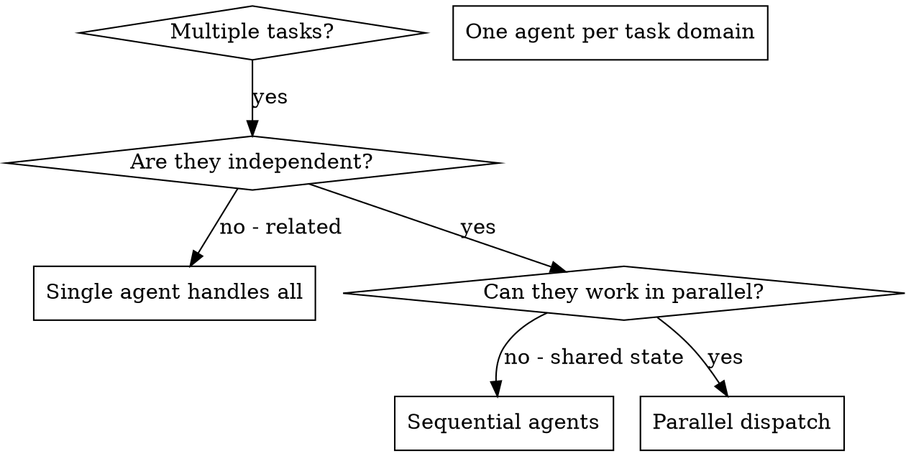

# Dispatching Parallel Agents

## Overview

You delegate tasks to specialized agents with isolated context. By precisely crafting their instructions and context, you ensure they stay focused and succeed at their task. They should never inherit your session's context or history — you construct exactly what they need. This also preserves your own context for coordination work.

When you have multiple unrelated tasks (different topics, different areas, different problems), working on them sequentially wastes time. Each task is independent and can happen in parallel.

**Core principle:** Dispatch one agent per independent problem domain. Let them work concurrently.

## When to Use



**Use when:**
- 3+ independent tasks with different domains
- Multiple areas broken independently
- Each task can be understood without context from others
- No shared state between tasks

**Don't use when:**
- Tasks are related (completing one might affect others)
- Need to understand full project state first
- Agents would interfere with each other (editing same files, using same resources)

## The Pattern

### 1. Identify Independent Domains

Group tasks by what's involved:
- Task A: Research topic X
- Task B: Draft section Y
- Task C: Review document Z

Each domain is independent — researching X doesn't affect drafting Y.

### 2. Create Focused Agent Tasks

Each agent gets:
- **Specific scope:** One task or domain
- **Clear goal:** What to produce
- **Constraints:** What NOT to do
- **Expected output:** Summary of what was found/produced

### 3. Dispatch in Parallel

```
Agent 1 → Task A: Research topic X
Agent 2 → Task B: Draft section Y
Agent 3 → Task C: Review document Z
// All three run concurrently
```

### 4. Review and Integrate

When agents return:
- Read each summary
- Verify outputs don't conflict
- Integrate all results
- Verify the combined output meets overall goals

## Agent Prompt Structure

Good agent prompts are:
1. **Focused** — One clear task domain
2. **Self-contained** — All context needed to understand the task
3. **Specific about output** — What should the agent return?

```markdown
[Task description with full context]

Your task:
1. [Step 1]
2. [Step 2]
3. [Step 3]

Do NOT [constraint — what to avoid].

Return: [Exact summary format expected]
```

## Common Mistakes

**❌ Too broad:** "Handle all the tasks" — agent gets lost
**✅ Specific:** "Research topic X only" — focused scope

**❌ No context:** "Fix the problem" — agent doesn't know where
**✅ Context:** Paste the relevant background and exact task description

**❌ No constraints:** Agent might do too much
**✅ Constraints:** "Do NOT change Y" or "Focus only on Z"

**❌ Vague output:** "Do it" — you don't know what changed
**✅ Specific:** "Return summary of findings and decisions made"

## When NOT to Use

**Related tasks:** Completing one might affect others — handle together first
**Need full context:** Understanding requires seeing the entire project
**Exploratory work:** You don't know what's needed yet
**Shared state:** Agents would interfere (editing same files, using same resources)

## Verification

After agents return:
1. **Review each summary** — Understand what was produced
2. **Check for conflicts** — Did agents produce contradictory results?
3. **Verify combined output** — Do all results work together?
4. **Spot check** — Agents can make systematic errors

## Key Benefits

1. **Parallelization** — Multiple tasks happen simultaneously
2. **Focus** — Each agent has narrow scope, less context to track
3. **Independence** — Agents don't interfere with each other
4. **Speed** — 3 tasks solved in time of 1
