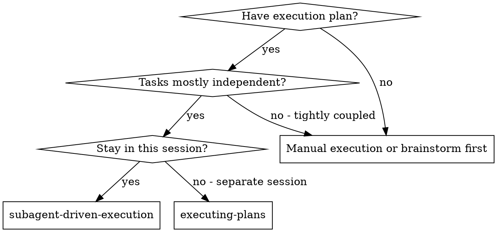
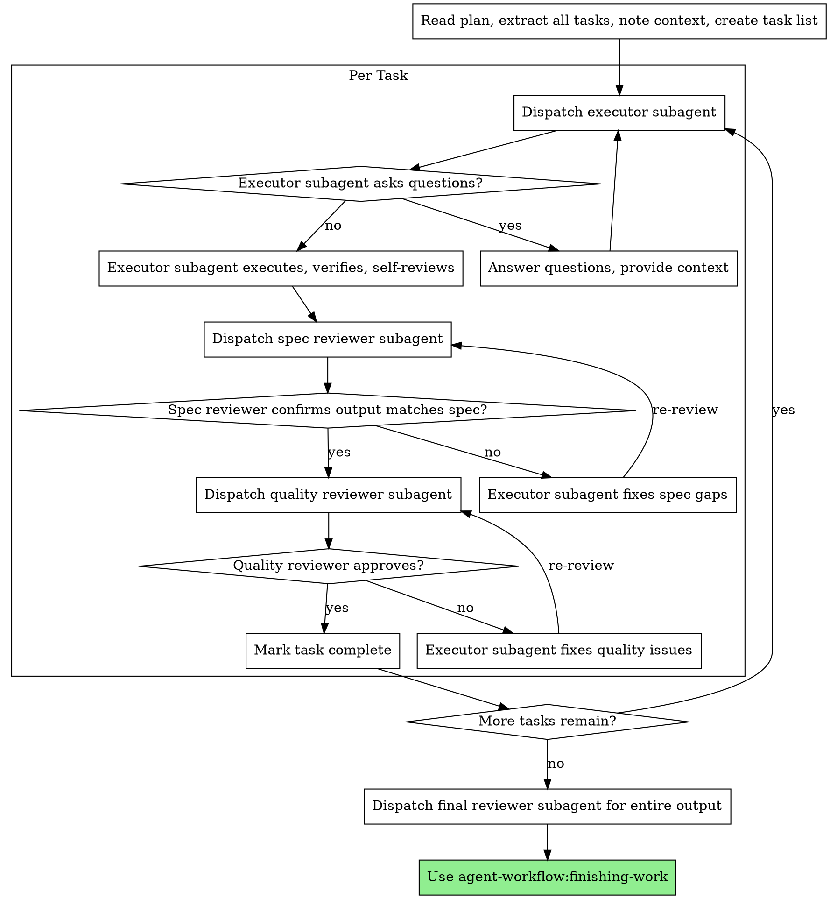

# Subagent-Driven Execution

Execute a plan by dispatching a fresh subagent per task, with two-stage review after each: spec compliance review first, then quality review.

**Why subagents:** You delegate tasks to specialized agents with isolated context. By precisely crafting their instructions and context, you ensure they stay focused and succeed. They should never inherit your session's context or history — you construct exactly what they need. This also preserves your own context for coordination work.

**Core principle:** Fresh subagent per task + two-stage review (spec then quality) = high quality, fast iteration.

## When to Use



## The Process



## Model Selection

Use the least powerful model that can handle each role to conserve cost and increase speed.

**Mechanical execution tasks** (isolated, clear specs, narrow scope): use a fast, cheap model. Most tasks are mechanical when the plan is well-specified.

**Integration and judgment tasks** (multi-area coordination, pattern matching, problem-solving): use a standard model.

**Design, review, and quality tasks**: use the most capable available model.

**Task complexity signals:**
- Touches 1-2 areas with a complete spec → cheap model
- Touches multiple areas with integration concerns → standard model
- Requires design judgment or broad project understanding → most capable model

## Executor Subagent Prompt Structure

Craft each executor prompt to be:
1. **Self-contained** — all context needed to complete the task
2. **Scoped** — one task only, clear boundaries
3. **Verifiable** — explicit acceptance criteria
4. **Output-specified** — exactly what to produce and where

```markdown
## Task: [Task Name from Plan]

### Context
[Project background, relevant prior work, conventions to follow]

### Your Task
[Exact description from plan, including all steps]

### Acceptance Criteria
- [ ] Criterion A
- [ ] Criterion B

### Output
Produce: [exact output description]
Save to: [location]

### Self-Review
Before reporting complete, verify each criterion above is met.
Report: summary of what you did and any decisions made.
```

## Spec Reviewer Prompt Structure

```markdown
## Review: Does output match spec?

### Spec / Plan Task
[Paste the task from the plan]

### Output Produced
[Summary or location of what the executor produced]

### Your Job
Check each requirement in the spec against the output.
Report:
- PASS: output matches spec
- FAIL: list specific gaps with exact locations
```

## Quality Reviewer Prompt Structure

```markdown
## Review: Quality check

### Output
[Location or summary of what was produced]

### Your Job
Review for quality issues:
- Clarity and completeness
- Consistency with project conventions
- Any obvious errors or omissions

Report:
- APPROVE: output is ready
- REVISE: list specific issues with suggested fixes
```

## Common Mistakes

**Too broad executor scope:** "Do everything in the plan" — executor gets lost
**Specific is better:** "Complete Task 3 only: [paste task]"

**No context in prompt:** Executor doesn't know project conventions
**Include context:** Paste relevant background, prior decisions

**No acceptance criteria:** Executor doesn't know when done
**Always include:** Explicit criteria the executor checks before reporting

**Trusting executor self-report:** Always run spec review after
**Always dispatch:** Spec reviewer after every executor

## Integration

**Called by:**
- `agent-workflow:writing-plans` — After plan is created and execution mode chosen

**Calls:**
- `agent-workflow:finishing-work` — After all tasks complete and final review passes
- `agent-workflow:requesting-review` — Optional: request review after each task
