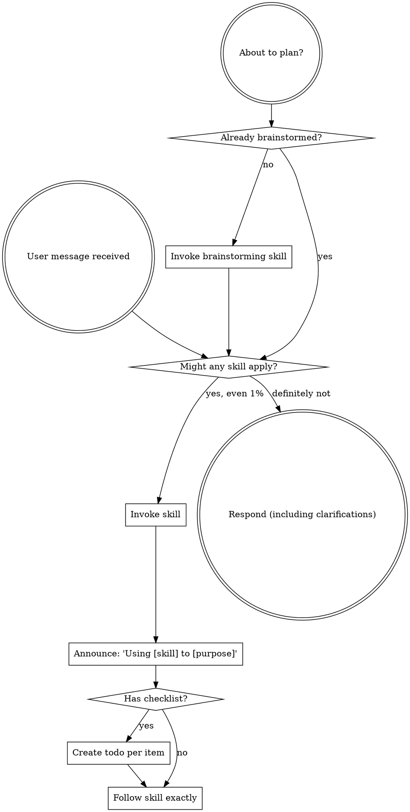

<EXTREMELY-IMPORTANT>
If you think there is even a 1% chance a skill might apply to what you are doing, you ABSOLUTELY MUST invoke the skill.

IF A SKILL APPLIES TO YOUR TASK, YOU DO NOT HAVE A CHOICE. YOU MUST USE IT.

This is not negotiable. This is not optional. You cannot rationalize your way out of this.
</EXTREMELY-IMPORTANT>

## Instruction Priority

Agent-workflow skills override default behavior, but **user instructions always take precedence**:

1. **User's explicit instructions** (project config files, direct requests) — highest priority
2. **Agent-workflow skills** — override default behavior where they conflict
3. **Default behavior** — lowest priority

## How to Access Skills

Use the platform's skill invocation mechanism. When you invoke a skill, its content is loaded and presented to you — follow it directly.

# Using Skills

## The Rule

**Invoke relevant or requested skills BEFORE any response or action.** Even a 1% chance a skill might apply means you should invoke the skill to check. If an invoked skill turns out to be wrong for the situation, you don't need to use it.

## Red Flags

These thoughts mean STOP — you're rationalizing:

| Thought | Reality |
|---------|---------|
| "This is just a simple question" | Questions are tasks. Check for skills. |
| "I need more context first" | Skill check comes BEFORE clarifying questions. |
| "Let me gather information first" | Skills tell you HOW to gather information. |
| "This doesn't need a formal skill" | If a skill exists, use it. |
| "I remember this skill" | Skills evolve. Read current version. |
| "This doesn't count as a task" | Action = task. Check for skills. |
| "The skill is overkill" | Simple things become complex. Use it. |
| "I'll just do this one thing first" | Check BEFORE doing anything. |
| "This feels productive" | Undisciplined action wastes time. Skills prevent this. |
| "I know what that means" | Knowing the concept ≠ using the skill. Invoke it. |

## Skill Priority

When multiple skills could apply, use this order:

1. **Process skills first** (brainstorming, systematic-problem-solving) — these determine HOW to approach the task
2. **Execution skills second** (writing-plans, subagent-driven-execution) — these guide execution

"Let's do X" → brainstorming first, then execution skills.
"Something went wrong" → systematic-problem-solving first, then domain-specific skills.

## Skill Types

**Rigid** (systematic-problem-solving, verification-before-completion): Follow exactly. Don't adapt away the discipline.

**Flexible** (brainstorming, writing-plans): Adapt principles to context.

The skill itself tells you which type it is.

## User Instructions

Instructions say WHAT, not HOW. "Do X" or "Fix Y" doesn't mean skip workflows.
