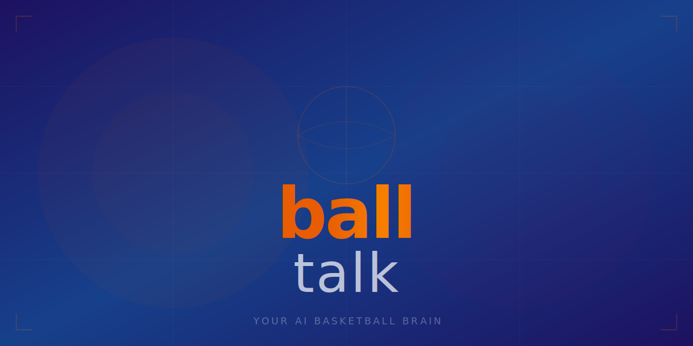

<p align="center">
  
</p>

<p align="center">
  <a href="https://github.com/KeWang0622/balltalk/stargazers"></a>
  <a href="https://github.com/KeWang0622/balltalk/network/members"></a>
  <a href="LICENSE"></a>
</p>

<p align="center">
  
  
  
  
  
</p>

<h3 align="center">Ask anything about basketball. Get real stats, real analysis, real takes.</h3>

---

**balltalk** is an AI agent skill that pulls real NBA stats, compares players, gives fantasy advice, explains plays, generates scouting reports, and talks basketball like someone who actually watches games.

> Zero basketball AI skills exist on skills.sh or ClawHub. nba_api has 3,500 stars. The data demand is real. The conversational layer was missing. Now it's not.

## Install

```bash
cp SKILL.md ~/.claude/skills/balltalk.md
```

<details>
<summary>Other agents</summary>

| Agent | Install |
|-------|---------|
| **Cursor** | Copy to `.cursor/rules/balltalk.md` |
| **Codex CLI** | Add to agent instructions |
| **Gemini CLI** | Add to agent instructions |
| **Any AI chat** | Paste SKILL.md as system prompt |

</details>

## Usage

```
Is Shai having a better season than Luka?
```
```
Should I start Jalen Brunson or Tyrese Haliburton this week? 9-cat league.
```
```
Give me a scouting report on Victor Wembanyama.
```
```
Explain the difference between a drop coverage and a switch-everything defense.
```
```
What's the best play to run against a 2-3 zone?
```
```
Who are the best waiver wire pickups this week?
```

## What You Get

| Ask About | What It Does |
|-----------|-------------|
| **Player comparisons** | Side-by-side stats with advanced metrics — has opinions, not just numbers |
| **Fantasy basketball** | Start/sit, trades, waivers, category punting — checks injuries and schedule |
| **Scouting reports** | Strengths, weaknesses, tendencies, player comparisons |
| **Play/strategy** | Break down plays, defensive schemes, pick-and-roll coverage with diagrams |
| **Rules** | Any NBA rule explained simply with game examples |
| **Stats lookup** | Current season, career, splits, advanced metrics — always real, never guessed |
| **Draft/prospects** | Evaluate upcoming draft picks with strengths and fit analysis |
| **History/debates** | All-time records, GOAT debates, historical comparisons backed by data |

## Example

> ## Luka vs Shai — 2025-26 Season
>
> | Stat | Luka Doncic | Shai Gilgeous-Alexander |
> |------|-------------|------------------------|
> | PPG  | 28.4        | 31.2                   |
> | RPG  | 8.1         | 5.4                    |
> | APG  | 8.7         | 6.1                    |
> | FG%  | .478        | .534                   |
> | 3P%  | .358        | .341                   |
> | TS%  | .589        | .645                   |
> | PER  | 26.8        | 29.4                   |
>
> **The verdict:** Shai is having the better season. The efficiency gap is massive — .645 TS% is historically elite. Luka is the better playmaker and rebounder, but Shai is scoring more on way better efficiency with fewer turnovers. In a vacuum, Shai is the MVP frontrunner.

## Why This Exists

nba_api has 3,500 GitHub stars. Basketball Reference scrapers have hundreds more. The data demand is massive. But nobody wrapped it into a conversational AI that can actually talk ball — pull live stats, compare players, give fantasy advice, explain plays, and have opinions backed by real numbers.

The GPT Store has one basic basketball chatbot. skills.sh and ClawHub had zero basketball skills. Now they have one.

## Found with [nobodybuilt](https://github.com/KeWang0622/nobodybuilt)

Scored **163/190** on viral potential. Input: "basketball."

## License

[MIT](LICENSE)

---

<p align="center">
  <b>If this is your new favorite basketball brain, <a href="https://github.com/KeWang0622/balltalk">star the repo</a></b>
</p>
