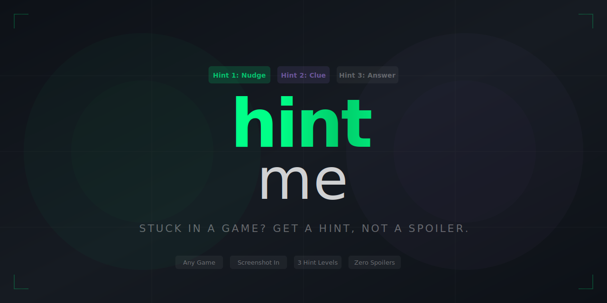

<p align="center">
  
</p>

<p align="center">
  <a href="https://github.com/KeWang0622/hintme/stargazers"></a>
  <a href="https://github.com/KeWang0622/hintme/network/members"></a>
  <a href="LICENSE"></a>
</p>

<p align="center">
  
  
  
  
  
</p>

<h3 align="center">Stuck in a game? Send a screenshot. Get a hint, not a spoiler.</h3>

---

**hintme** is an AI agent skill that gives you **progressive hints** when you're stuck in any video game. Screenshot in, 3 levels of hints out — from gentle nudge to explicit answer. You control how much help you get.

> Every walkthrough either spoils the story or makes you scrub through a 30-minute YouTube video. hintme gives you exactly the push you need — nothing more.

## Install

```bash
cp SKILL.md ~/.claude/skills/hintme.md
```

<details>
<summary>Other agents</summary>

| Agent | Install |
|-------|---------|
| **Cursor** | Copy to `.cursor/rules/hintme.md` |
| **Codex CLI** | Add to agent instructions |
| **Gemini CLI** | Add to agent instructions |
| **Any AI chat** | Paste SKILL.md as system prompt |

</details>

## Usage

Send a screenshot and say what you're stuck on:

```
I'm stuck in this room in Zelda. [screenshot]
```
```
How do I beat this boss? [screenshot]
```
```
Where do I go next? I've been wandering for 20 minutes. [screenshot]
```

Or just describe it:
```
I'm in the water temple in Zelda and I can't find the third key.
```

## How It Works

```
You send a screenshot
        │
        ▼
┌────────────────────────────────────────────┐
│  Hint 1: Gentle nudge                      │
│  "Look carefully at the walls in this      │
│   room — one is different from the others" │
└──────────────────┬─────────────────────────┘
                   │
          "more?"  ▼
┌────────────────────────────────────────────┐
│  Hint 2: Clearer direction                 │
│  "The torch on the left wall can be        │
│   interacted with — try your bow"          │
└──────────────────┬─────────────────────────┘
                   │
          "more?"  ▼
┌────────────────────────────────────────────┐
│  Hint 3: The answer                        │
│  "Shoot an arrow at the unlit torch.       │
│   The door will open."                     │
└────────────────────────────────────────────┘
```

**You choose when to stop.** Most players only need Hint 1. That's the point.

## Example

> ## Zelda: Tears of the Kingdom — Shrine Puzzle
>
> **What I see:** You're in a shrine with a ball, a ramp, and a locked door. Your ultrahand ability is available and you have arrows.
>
> ### Hint 1
> The ball needs to reach the other side of the room, but not the way you'd expect. Think about what ultrahand can attach to.
>
> ---
> *Want another hint, or want to try that first?*

> ### Hint 2
> Try attaching the ball to one of the objects on the ramp. Gravity will do the rest.
>
> ---
> *One more hint will give you the answer. Want it?*

> ### Hint 3 (The Answer)
> Attach the ball to the end of the long plank using ultrahand. Place the plank on the ramp so the ball rolls down and lands in the socket by the door.

## Rules

| Rule | Why |
|------|-----|
| **Always start at Hint 1** | Respect the player's desire to solve it themselves |
| **Never spoil story** | "Open the chest" is fine. What's inside is not. |
| **Never assume skill level** | "Just parry" is useless if they don't know parrying exists |
| **Any game works** | Uses screenshot analysis + web search for game-specific knowledge |
| **"Just tell me" is fine** | If they want Hint 3 immediately, skip to it — no judgment |

## What It Analyzes in Screenshots

- HUD elements (health, inventory, minimap, quest markers)
- Game identification from art style and UI
- Player state (low health? specific equipment? ability cooldowns?)
- Environment (puzzle room? boss arena? open world exploration?)
- NPC dialogue and visible text
- Enemy types and positioning

## Why This Exists

Gamers have wanted "hints not solutions" since 1988 (the Universal Hint System). Every generation reinvents the workaround — ask a friend on Discord, scrub through YouTube, Ctrl+F through GameFAQs while averting your eyes from spoilers.

The technology to solve this (AI vision + progressive hints) finally exists. Nobody combined them. Now someone did.

## Found with [nobodybuilt](https://github.com/KeWang0622/nobodybuilt)

This idea was discovered using **nobodybuilt** — scored **164/190** on viral potential. Input: "video games."

## License

[MIT](LICENSE)

---

<p align="center">
  <b>If this saved you from a spoiler, <a href="https://github.com/KeWang0622/hintme">star the repo</a></b>
</p>
