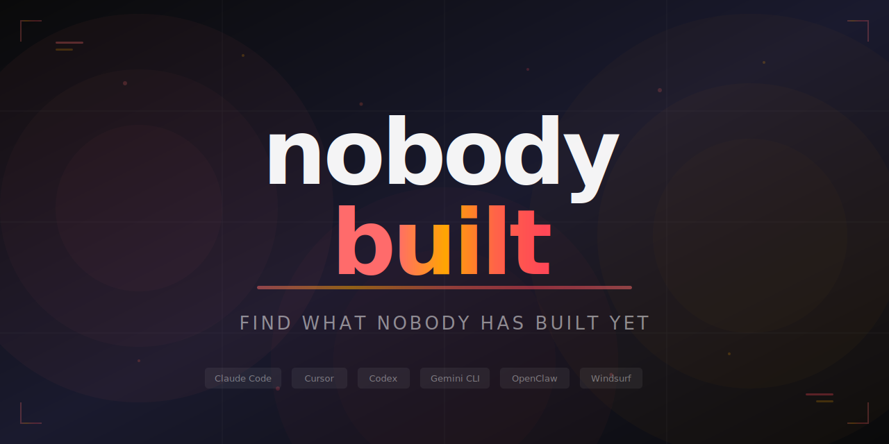

<p align="center">
  
</p>

<p align="center">
  <a href="https://github.com/KeWang0622/nobodybuilt/stargazers"></a>
  <a href="https://github.com/KeWang0622/nobodybuilt/network/members"></a>
  <a href="LICENSE"></a>
</p>

<p align="center">
  
  
  
  
  
  
  
</p>

<h3 align="center">Stop building the 50th todo app. Find the tool <i>nobody</i> has built yet.</h3>

---

**nobodybuilt** is an AI agent skill that searches GitHub, Product Hunt, Reddit, npm, app stores, and AI tool directories to find **genuinely unexplored ideas** with viral potential — then generates a complete, publish-ready project with code, README, and launch strategy.

> **"I can't believe nobody built this yet."** — That's the reaction you want. This skill finds those ideas systematically.

## Built with nobodybuilt

<table>
<tr>
<td width="120" align="center">
<a href="https://github.com/KeWang0622/shouldislab">
<br/>
<b>shouldislab</b>
</a>
</td>
<td>
<b>Should I slab this Pokemon card?</b> — AI skill that calculates grading ROI. Looks up raw vs graded prices, factors in costs, gives a SLAB IT / SKIP IT verdict. <i>Scored 162/190.</i> Input was one word: "Pokemon."
</td>
</tr>
<tr>
<td width="120" align="center">
<a href="https://github.com/KeWang0622/hintme">
<br/>
<b>hintme</b>
</a>
</td>
<td>
<b>Stuck in a game? Get a hint, not a spoiler.</b> — Send a screenshot, get 3 levels of progressive hints. Works with any game. Never spoils the story. <i>Scored 164/190.</i> Input: "video games."
</td>
</tr>
</table>

<details>
<summary><b>See the full discovery process</b></summary>

> ### 1. shouldislab
> *Should I slab this Pokemon card? Calculates grading ROI with real price data.*
>
> **Pain** 9 · **Blue Ocean** 8 · **Need** 9 · **Instant** 7 · **Name** 8 · **Trend** 9 · **Share** 9 · **Moat** 6 · **Build** 5 = **162/190**
>
> **The insight:** "Should I grade this?" is the #1 financial decision Pokemon collectors agonize over. Pre-grading apps tell you "PSA 9" but don't answer "is it worth the $35 fee?" No AI agent skill for Pokemon cards exists on skills.sh or ClawHub — zero results.
>
> **Evidence:** Searched GitHub for `"SKILL.md" pokemon`, `"claude skill" pokemon card` — nothing. Elite Fourum threads on grading ROI uncertainty. Reddit r/PokemonTCG has daily "should I grade this?" posts.
>
> **The share moment:** ROI table showing "Your Charizard ex: PSA 10 +50% ROI, PSA 9 -19% ROI. **Verdict: SKIP IT.**"

nobodybuilt generated the complete project — [SKILL.md](https://github.com/KeWang0622/shouldislab/blob/main/SKILL.md), [README](https://github.com/KeWang0622/shouldislab), banner, and launch strategy — from one word of input.

</details>

---

## Install

```bash
# One-liner — clone and install
git clone https://github.com/KeWang0622/nobodybuilt.git && cp nobodybuilt/SKILL.md ~/.claude/skills/nobodybuilt.md
```

Or just grab the skill file:

```bash
# Copy SKILL.md into your agent's skills directory
cp SKILL.md ~/.claude/skills/nobodybuilt.md
```

<details>
<summary>Other agents (Cursor, Codex, Gemini CLI, Windsurf, Aider)</summary>

| Agent | Install |
|-------|---------|
| **Cursor** | Copy SKILL.md to `.cursor/rules/nobodybuilt.md` |
| **Codex CLI** | Add SKILL.md content to agent instructions |
| **Gemini CLI** | Add SKILL.md content to agent instructions |
| **Windsurf** | Add to Cascade rules |
| **Aider** | Copy to `.aider/prompts/nobodybuilt.md` |
| **Any AI chat** | Paste SKILL.md content as system prompt |

</details>

## Usage

```
Use nobodybuilt. I'm into cooking.
```
```
Use nobodybuilt. Pokemon.
```
```
Use nobodybuilt. Surprise me.
```

Or send an image:
```
Use nobodybuilt. [screenshot of an app] — find gaps in this space.
```
```
Use nobodybuilt. [photo of messy desk] — what tool would fix this?
```
```
Use nobodybuilt. [screenshot of a Reddit "I wish..." post]
```

Text or image — one input is enough. It figures out the domain, audience, platform, and vibe automatically. After it builds your project, it asks where you want to launch — GitHub, skill marketplaces, Twitter, Reddit, HN — and writes ready-to-post content for each.

## How It Works

Most "idea generators" just brainstorm. **nobodybuilt** validates with real search data.

```
You say "cooking"
        │
        ▼
┌─────────────────────────────────────────────────────────────┐
│  IDEATE   5 creative frameworks → 15-20 raw ideas           │
└──────────────────────────┬──────────────────────────────────┘
                           ▼
┌─────────────────────────────────────────────────────────────┐
│  RESEARCH  GitHub, Reddit, PH, npm, AI dirs → map gaps      │
└──────────────────────────┬──────────────────────────────────┘
                           ▼
┌─────────────────────────────────────────────────────────────┐
│  VALIDATE  Demand proof + anti-pattern filter → Top 3       │
└──────────────────────────┬──────────────────────────────────┘
                           ▼
┌─────────────────────────────────────────────────────────────┐
│  BUILD    Name + code + README + launch strategy             │
└──────────────────────────┬──────────────────────────────────┘
                           ▼
┌─────────────────────────────────────────────────────────────┐
│  SHIP     "Where to launch?" → GitHub, marketplaces,         │
│           Twitter, Reddit, HN — with ready-to-post content   │
└─────────────────────────────────────────────────────────────┘
```

## What the Output Looks Like

nobodybuilt presents top ideas with scores, evidence, and the "share moment" — then builds the winner into a complete project. See the [shouldislab example above](#built-with-nobodybuilt) for a real end-to-end run.

## What You Get

| Output | Details |
|--------|---------|
| **3 scored ideas** | Ranked on 190-point scale, with search evidence proving the gap |
| **Validated name** | Collision-checked on GitHub, npm, and web — confirmed available |
| **Complete code** | Working v1 — SKILL.md, CLI, extension, or web app. Not stubs. Runnable. |
| **Viral README** | Hook-first, one-command install, 3 usage examples, "why this exists" |
| **Launch strategy** | Draft posts for Reddit/HN/X, directory submissions, timing advice |
| **Ready-to-post content** | Pick Twitter, Reddit, HN, or GitHub — get copy-paste launch content |
| **Marketplace publishing** | Walks you through publishing to skills.sh, ClawHub, Smithery, Skills Directory, awesome-lists |

## Scoring System

Every idea is scored on 9 weighted factors with calibrated benchmarks.

| Factor | Wt | 10 = | 1 = |
|--------|----|------|-----|
| **Pain Point** | 3x | Reddit threads with 500+ upvotes complaining | "Nice to have" nobody mentions |
| **Blue Ocean** | 3x | Zero results on GitHub, PH, anywhere | Multiple well-maintained tools |
| **"I Need This"** | 3x | You stop and think "wait, I want this" | You have to explain why anyone would |
| **Instant Value** | 2x | `npx tool` and it works. No config. | Needs API keys, database, setup wizard |
| **Catchy Name** | 2x | Name IS the pitch ("Shazam") | Generic ("my-tool") |
| **Trend Alignment** | 2x | Enabled by something launched this month | Could've been built 5 years ago |
| **Shareability** | 2x | Output so good people MUST screenshot it | Correct but boring |
| **Moat** | 1x | Network effects, unique data, "standard" status | Anyone could clone it |
| **Feasibility** | 1x | Single file, 2-hour build | Needs infra and multiple services |

**Max: 190.** Top 3 presented with evidence.

## Creative Ideation Methods

Not just gap-searching — active idea generation:

| Method | Formula | Example |
|--------|---------|---------|
| **Mashup** | Domain A × Domain B | Duolingo = language + gaming |
| **Annoyance Autopsy** | List frustrations → build the fix | "I hate copying recipe ingredients to my shopping list" |
| **"What If"** | Impossible thing + simple input | "Mass-unfollow inactive Twitter accounts in one click" |
| **Audience Flip** | Dev tool → make it for non-devs | GitHub contribution graph → but for gym workouts |
| **Format Shift** | Web app → CLI / SaaS → open source | Canva → but as a CLI for developers |

## Anti-Pattern Filter

Ideas get killed before you see them:

| Trap | Why |
|------|-----|
| "Dashboard for X" | No wow moment, competes with everything |
| "AI wrapper, no angle" | Everyone has this idea already |
| "Yet another todo app" | 10,000+ exist |
| "Requires behavior change" | New daily habits almost always fail |
| "Needs large user base" | Network effects impossible solo |
| "Too broad to be catchy" | "Productivity toolkit" = nothing |

## Publish Everywhere

After building your project, nobodybuilt walks you through publishing to every major skill marketplace:

| Platform | Method | When |
|----------|--------|------|
| **GitHub** | Creates repo, pushes code, sets topics | Immediately |
| **skills.sh** | `npx skills add owner/repo` — auto-listed | Immediately |
| **ClawHub** | `clawhub publish` CLI command | Immediately |
| **Skills Directory** | Web form submission | Immediately |
| **Smithery** | Web or CLI deploy | Immediately |
| **SkillsMP** | Auto-indexed from GitHub | After 2+ stars |
| **awesome-claude-skills** | GitHub PR | After 10+ stars |
| **awesome-agent-skills** | GitHub PR | After 10+ stars |
| **awesome-claude-code** | GitHub Issue form | After traction |

It tells you which platforms you can hit NOW and which to revisit after gaining stars.

## How Is This Different?

| | **nobodybuilt** | Typical idea generators | Skill factories |
|---|---|---|---|
| **Finds ideas** | Searches 8+ platforms for real gaps | Brainstorms from training data | N/A — you bring the idea |
| **Validates demand** | Reddit wishlists, manual workarounds, search evidence | No validation | No validation |
| **Kills bad ideas** | Anti-pattern filter + calibrated scoring | Everything sounds good | N/A |
| **Checks name collisions** | GitHub + npm + web search | No | No |
| **Generates code** | Complete runnable v1 | Maybe a description | Template-based |
| **Launch strategy** | Draft posts, timing, directory targets | No | No |
| **Creative frameworks** | 5 ideation methods (mashup, what-if, etc.) | Random brainstorm | N/A |

## Iteration

Don't like the results? Keep going:

- **"More like this"** — 3 more ideas in the same direction
- **"Combine 1 and 3"** — Merge ideas into a hybrid
- **"Same idea, different platform"** — CLI to extension, skill to web app
- **"Pivot"** — Same domain, completely different angle
- **"Go deeper"** — Second research pass with refined queries

<details>
<summary><b>Full Feature List</b></summary>

### Research Sources
- GitHub repos, stars, forks, awesome-lists, topics
- Product Hunt launches and traction data
- Chrome Web Store and extension marketplaces
- npm, PyPI, crates.io packages
- Reddit wishlists, X complaints, HN gaps
- AI tool directories (ClawHub, skills.sh, GPT Store, FutureTools)
- Niche platforms (itch.io, Figma Community, Splice, etc.)

### Ideation Techniques
- Mashup method (cross-domain combination)
- Annoyance Autopsy (frustration-first ideation)
- "What If" method (impossibility framing)
- Audience Flip (re-target existing tools)
- Format Shift (platform/format translation)
- Cross-pollination scan (adjacent domain analysis)

### Validation
- Demand signals (Reddit/X/HN "I wish..." searches)
- Manual workaround detection
- Adjacent tool popularity as demand proxy
- Search volume inference
- Collision detection (GitHub, npm, web)

### Output Formats
- AI agent skills (SKILL.md)
- CLI tools (Node.js, Python, Rust)
- Browser extensions
- Web apps
- Discord/Slack/Telegram bots
- Any platform that fits the idea best

### Launch Strategy
- Draft posts for Reddit, HN, X (platform-specific framing)
- Money screenshot specification
- Awesome-list and directory submission targets
- Timing optimization
- Follow-up content plan (blog, video, thread)

</details>

## Why This Exists

There are millions of repos on GitHub. Most are clones. Meanwhile, entire domains have **zero good tools** and massive unmet demand sitting in Reddit threads and unanswered tweets.

The most successful tools follow the same pattern: **be first in a real category, not 50th in a crowded one.** This skill finds those categories before anyone else does.

## Contributing

Found a tool idea using nobodybuilt? [Share it in the showcase](https://github.com/KeWang0622/nobodybuilt/issues/new?template=idea-showcase.md)!

Ideas for improving the skill: open an issue or PR.

## License

[MIT](LICENSE) — do whatever you want with it.

---

<p align="center">
  <b>If this helped you find something worth building, <a href="https://github.com/KeWang0622/nobodybuilt">give it a star</a></b> so others find it too.
</p>
