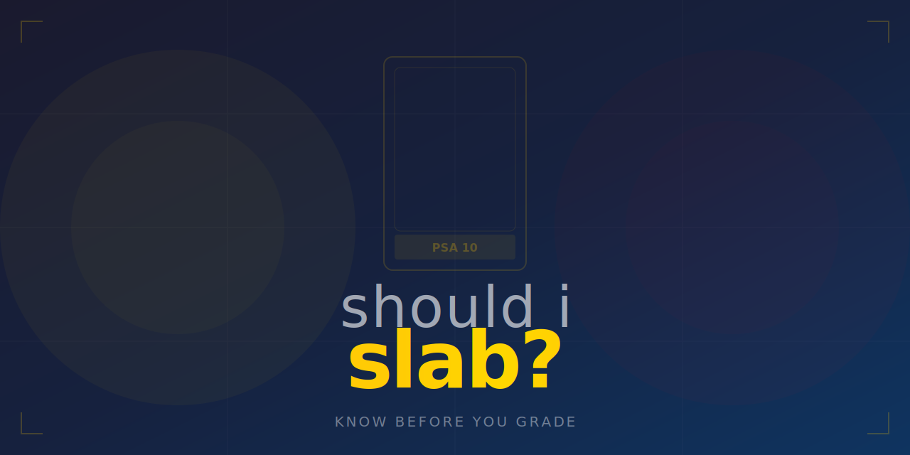

<p align="center">
  
</p>

<p align="center">
  <a href="https://github.com/KeWang0622/shouldislab/stargazers"></a>
  <a href="https://github.com/KeWang0622/shouldislab/network/members"></a>
  <a href="LICENSE"></a>
</p>

<p align="center">
  
  
  
  
  
</p>

<h3 align="center">Stop guessing. Know if your Pokemon card is worth grading before you spend $35.</h3>

---

**shouldislab** is an AI agent skill that looks up your Pokemon card's raw and graded prices, calculates grading ROI for every grade scenario (PSA 10, 9, 8), and tells you: **SLAB IT, SKIP IT, or MAYBE**.

> Every collector has asked "should I grade this?" Now you get the math, not a guess.

## Install

```bash
cp SKILL.md ~/.claude/skills/shouldislab.md
```

Or:
```bash
curl -sL https://raw.githubusercontent.com/KeWang0622/shouldislab/main/SKILL.md \
  -o ~/.claude/skills/shouldislab.md
```

<details>
<summary>Other agents</summary>

| Agent | Install |
|-------|---------|
| **Cursor** | Copy to `.cursor/rules/shouldislab.md` |
| **Codex CLI** | Add to agent instructions |
| **Gemini CLI** | Add to agent instructions |
| **Any AI chat** | Paste SKILL.md as system prompt |

</details>

## Usage

```
Should I slab my Charizard ex from Obsidian Flames?
```
```
Is this Umbreon VMAX alt art worth grading?
```
```
I have a Japanese Neo Genesis Lugia, should I grade it?
```
```
Check these 5 cards: [list them]
```

One sentence is enough. It figures out the card, looks up prices, and gives you the math.

## Example Output

> ## Charizard ex — Obsidian Flames 125/197
>
> **Raw value:** $45 (TCGPlayer market)
>
> ### Grading ROI
>
> | Grade | Graded Value | Cost In | Profit/Loss | ROI |
> |-------|-------------|---------|-------------|-----|
> | PSA 10 | $120 | $80 | +$40 | +50% |
> | PSA 9 | $65 | $80 | -$15 | -19% |
> | PSA 8 | $50 | $80 | -$30 | -38% |
>
> ### Verdict: SKIP IT
>
> Only profitable at PSA 10, and modern Charizard ex cards have a ~35% PSA 10 rate. The $40 upside doesn't justify the 65% chance of losing $15-30. Keep it raw unless you're confident it's a 10 (perfect centering, no whitening).
>
> ### Tips
> - PSA 10 population is already 2,400+ — graded premium will likely shrink
> - Check centering first: this card is notorious for left-right centering issues
> - If you pull a pack-fresh copy with dead-center alignment, THEN consider slabbing

## How It Decides

| Verdict | When |
|---------|------|
| **SLAB IT** | PSA 9 (the likely outcome) is profitable |
| **SKIP IT** | Only PSA 10 is profitable, and the upside is small |
| **MAYBE** | PSA 9 is break-even but PSA 10 has big upside |

The key insight: most modern cards grade **PSA 9, not 10**. Tools that only show PSA 10 values mislead you. shouldislab shows you what happens at every grade.

## What Makes This Different

| | **shouldislab** | Pre-grading apps | Price lookup tools |
|---|---|---|---|
| **Answers "should I grade?"** | Yes — with ROI math | No — just predicts grade | No |
| **Shows all grade scenarios** | PSA 10, 9, 8 with P/L | Single grade prediction | N/A |
| **Includes grading costs** | Service fee + shipping | No | No |
| **Population report context** | Warns about high-pop cards | No | No |
| **Vintage vs modern awareness** | Different math for each | Same model for all | N/A |
| **Bulk analysis** | Analyzes multiple cards, summary table | One at a time | One at a time |
| **Free** | Yes | Freemium/subscription | Varies |

## Works With

Any AI coding agent: Claude Code, Cursor, Codex, Gemini CLI, OpenClaw, Windsurf, Aider — or paste into any AI chat.

## Found with [nobodybuilt](https://github.com/KeWang0622/nobodybuilt)

This idea was discovered using **nobodybuilt** — the AI skill that finds what nobody has built yet. Scored **162/190** on viral potential.

## License

[MIT](LICENSE) — do whatever you want with it.

---

<p align="center">
  <b>If this saved you from a bad grading decision, <a href="https://github.com/KeWang0622/shouldislab">star the repo</a></b>
</p>
