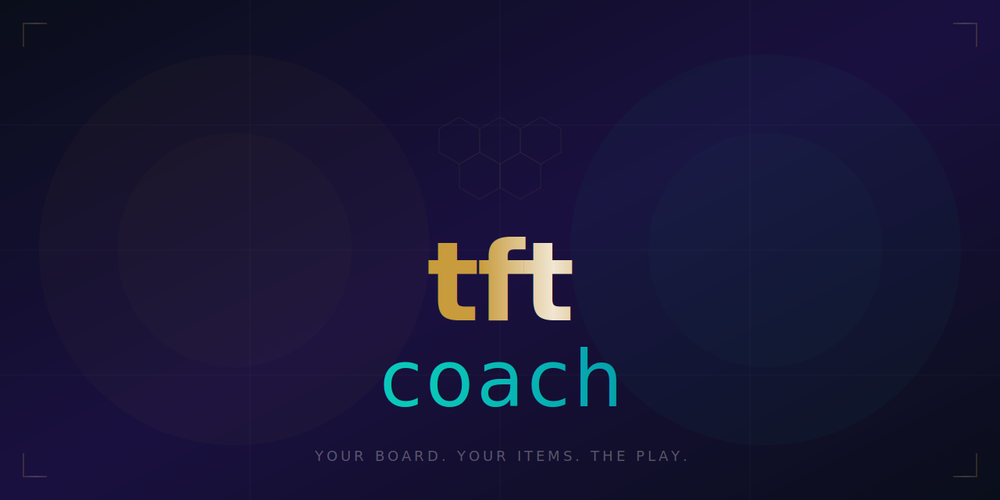

<p align="center">
  
</p>

<p align="center">
  <a href="https://github.com/KeWang0622/tftcoach/stargazers"></a>
  <a href="https://github.com/KeWang0622/tftcoach/network/members"></a>
  <a href="LICENSE"></a>
</p>

<p align="center">
  
  
  
  
  
</p>

<h3 align="center">Every overlay shows you tier lists. This one reads YOUR board and makes the call.</h3>

---

**tftcoach** is an AI agent skill that reads your TFT board state — from a screenshot or description — and gives you the play. Comp direction, item slams, augment picks, economy, pivoting, positioning. Not tier lists. Coaching.

> Human TFT coaching costs $30-100/hr. This is free, instant, and knows the current patch.

## Install

```bash
cp SKILL.md ~/.claude/skills/tftcoach.md
```

<details>
<summary>Other agents</summary>

| Agent | Install |
|-------|---------|
| **Cursor** | Copy to `.cursor/rules/tftcoach.md` |
| **Codex CLI** | Add to agent instructions |
| **Gemini CLI** | Add to agent instructions |
| **Any AI chat** | Paste SKILL.md as system prompt |

</details>

## Usage

Describe your board or send a screenshot:

```
I have Ahri 2, Lux 1, Zoe 1, 3 Sorcerers active, BF Sword + Rod on bench, 42 gold, stage 3-2, 68 HP. What's the play?
```
```
Which augment? Jeweled Lotus vs Sorcerer Crown vs Rich Get Richer. I'm going Sorcerers.
```
```
I'm 28 HP at 4-1, board is weak, should I roll or level?
```
```
[screenshot] What do I do here?
```

## What It Coaches

| Situation | What You Get |
|-----------|-------------|
| **"What comp?"** | Specific comp based on YOUR items and units, not a generic tier list |
| **"What items?"** | What to slam now vs hold, and which unit to put them on |
| **"Which augment?"** | Context-aware pick based on your board, not global win rates |
| **"Level or roll?"** | The call, with reasoning based on HP, gold, and stage |
| **"Should I pivot?"** | Yes/no with what to pivot TO and how to execute it |
| **"How to position?"** | Board layout based on your comp and opponent threats |
| **"What's meta?"** | Current patch comps, buffed/nerfed champions, meta shifts |

## Example

> **You:** I have Ahri 2, Lux 1, Zoe 1. BF Sword + Rod on bench. 42 gold, stage 3-2, 68 HP. 2 others going Sorc.
>
> **tftcoach:**
>
> ## The Play
>
> You're in a good spot. 68 HP with 42 gold at 3-2 is healthy.
>
> **Comp direction:** 6 Sorcerer Ahri carry. You have the core 2-starred already.
>
> **Items:** Slam BF + Rod = Hextech Gunblade on Ahri NOW. She heals off damage, keeps you on a win streak. Next item priority: Rabadon's (Rod + Rod) or Jeweled Gauntlet (Rod + Glove).
>
> **Economy:** Level to 5 at 3-2 (do it now). Save to 50 gold. Level to 6 at 3-5 or 4-1.
>
> **Contested?** 2 others going Sorc is manageable. If a 3rd joins, consider soft-pivoting to Scholar or Arcanist — your items still work.
>
> **Positioning:**
> ```
> [Lux] [Zoe] [  ] [  ]
> [  ] [  ] [  ] [Ahri]
> ```
> Ahri backline corner. Lux frontline to buy time.

## How It's Different

| | **tftcoach** | Overlays (Blitz/MetaTFT/Mobalytics) | Human coaching |
|---|---|---|---|
| **Reads your board** | Yes — screenshot or description | Shows generic tier lists | Yes |
| **Personalized advice** | Based on your items, gold, HP, lobby | Same for everyone | Yes |
| **Tells you when to pivot** | Yes, with what to pivot to | No | Yes |
| **Context-aware augments** | Based on your board state | Global win rates only | Yes |
| **Price** | Free | Free/paid | $30-100/hr |
| **Works on mobile** | Yes (screenshot) | No (Overwolf desktop only) | No |

## Found with [nobodybuilt](https://github.com/KeWang0622/nobodybuilt)

Scored **166/190** on viral potential. Input: "TFT."

## License

[MIT](LICENSE)

---

<p align="center">
  <b>If this saved you LP, <a href="https://github.com/KeWang0622/tftcoach">star the repo</a></b>
</p>
