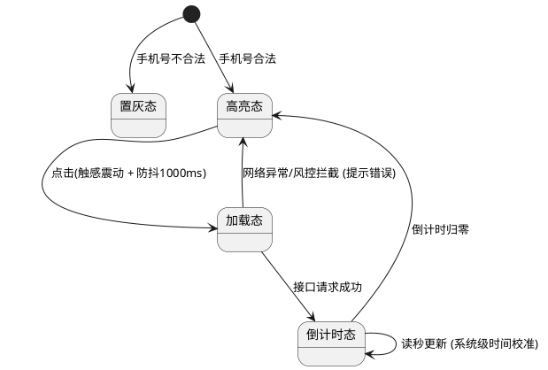

# 2RED Product Monster PRD 使用说明

## 概述

这是一个用于撰写、扩写或评审产品需求文档(PRD)的高级产品经理技能。该技能强制使用严格的序号层级、纯中文表达，覆盖全场景微交互规范，并支持自动生成 PlantUML 图表图片。

## PlantUML 图表自动生成功能

### 功能说明

该技能现在支持在生成 PRD 文档时，自动将 PlantUML 代码转换为图片文件。图片会保存在 PRD 文件所在目录的 `plantuml-images/` 文件夹中。

### 工作原理

1. 当使用该技能生成或更新 PRD 文档时，会自动扫描文档中的 PlantUML 代码块
2. 对每个代码块进行编译，生成对应的 PNG 图片
3. 将图片嵌入到 PRD 文档中对应的位置
4. 图片会自动覆盖，不需要保存历史版本

### 文件结构

```
PRD 文件所在目录/
├── PRD文件名.md              # PRD 文档
└── plantuml-images/          # PlantUML 生成的图片文件夹
    ├── diagram1.png          # 第一个图表
    ├── diagram2.png          # 第二个图表
    └── ...                   # 更多图表
```

### 示例

```markdown
### 4. 流程与状态图表 (PlantUML)

*(此处展示内嵌的 PlantUML 短信验证码发送状态转换图)*


### 5. 附录 (Appendix)
**UML 源码归档**

```
```

## 使用方法

### 1. 生成新 PRD

当使用该技能生成新的 PRD 时，会自动创建 `plantuml-images/` 文件夹并生成对应的图片文件。

### 2. 更新现有 PRD

当更新现有 PRD 时，会自动重新生成所有图表图片，并覆盖原来的图片。

### 3. 手动生成图片

如果需要手动重新生成图片，可以使用以下命令：

```bash
cd /Users/kira2red/.openclaw/workspace/tools
python3 plantuml-generator.py
```

这个脚本会扫描所有 PRD 文件并重新生成图片。

## 注意事项

1. 确保系统已安装 PlantUML（可以通过 `brew install plantuml` 安装）
2. 如果 PRD 文件中没有 PlantUML 代码，不会生成图片文件夹
3. 图片会自动覆盖，所以不需要保存历史版本
4. 如果 PRD