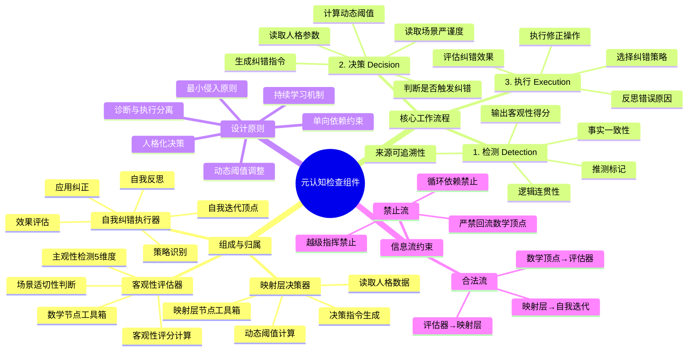

# 元认知检查组件 (Metacognition Check Component)

## 1. 组件概览

**元认知检查组件**是 AGI 进化模型的**"免疫系统"与"质量监督员"**。它作为一个独立的旁路分支，在**数学节点**完成推理后异步触发，负责检测输出的客观性、识别潜在幻觉或逻辑偏差，并协同**映射层**做出是否纠错的决策，最终驱动**自我迭代顶点**执行修正。

### 1.1 核心定位
*   **归属**：跨节点协作组件（逻辑上横跨**数学节点工具箱**与**映射层节点工具箱**）。
    *   **客观性评估器**：隶属于数学节点工具箱。
    *   **映射层决策器**：隶属于映射层节点工具箱。
    *   **自我纠错执行器**：隶属于自我迭代顶点（执行端）。
*   **触发时机**：数学顶点输出结构化推理结果后，主循环流向"自我迭代"之前。
*   **执行方式**：**异步非阻塞**。若触发纠错，则中断当前输出流，转入纠错子流程；若不触发，主循环无感知继续。
*   **核心价值**：确保系统在追求效率（即时性）的同时，不牺牲准确性（客观性），并在人格特质与伦理边界内行动。

### 1.2 设计原则
1.  **诊断与执行分离**：本组件只负责"发现问题"和"下达指令"，**严禁直接修改内容**。修改动作必须由"自我迭代"顶点执行。
2.  **动态阈值**：纠错标准不是固定的，而是根据**场景需求**（如医疗需严谨 vs 创意需发散）和**人格特质**（谨慎型 vs 激进型）动态调整。
3.  **单向依赖**：依赖数学节点的输出和记录层的历史数据，不反向干涉数学节点的推理过程。
4.  **最小侵入**：仅在检测到显著偏差时介入，避免过度纠错导致系统陷入"反思死循环"。

---

## 2. 整体信息流向图

```
┌─────────────────────────────────────────────────────────────┐
│              元认知检查模块（独立分支）                        │
│            不打断主循环，推理后异步触发                        │
└─────────────────────────────────────────────────────────────┘

数学顶点推理完成
    ↓
┌─────────────────────────────────────────────────────────────┐
│                   【进入元认知检测分支】                       │
│                   （不中断主循环，异步执行）                   │
└─────────────────────────────────────────────────────────────┘
    ↓
┌──────────────────────────────────────────────┐
│         2.1 客观性评估器                      │
│                                              │
│  输入：响应内容                              │
│  输出：客观特征标注                          │
│                                              │
│  • 检测主观性特征（5维度）                   │
│  • 计算客观性评分（1.0 - 主观性）            │
│  • 判断场景适切性                           │
│  • 生成元认知提示                           │
└──────────────────────────────────────────────┘
    ↓
┌──────────────────────────────────────────────┐
│         2.2 映射层决策                       │
│                                              │
│  输入：客观特征标注                          │
│  输出：决策指令                              │
│                                              │
│  • 读取人格数据（由人格层提供）              │
│  • 基于马斯洛需求和人格特质决策              │
│  • 动态调整触发阈值                         │
│  • 考虑场景类型                             │
│  • 生成决策理由和置信度                     │
└──────────────────────────────────────────────┘
    │
    ├─ 决策：不触发纠错 → 直接输出响应
    │
    └─ 决策：触发纠错
          ↓
┌──────────────────────────────────────────────┐
│      2.3 自我迭代顶点执行自我纠错             │
│                                              │
│  输入：决策指令（trigger_reflection）        │
│  输出：纠正后的响应                          │
│                                              │
│  1. 自我反思：分析错误原因                   │
│  2. 策略识别：选择纠错策略                   │
│  3. 应用纠正：执行纠错操作                   │
│  4. 效果评估：评估纠错有效性                 │
└──────────────────────────────────────────────┘
    ↓
纠正后的响应 → 用户
    ↓
┌──────────────────────────────────────────────┐
│           记录层存储（完整信息）               │
│                                              │
│  • 客观性标注                                │
│  • 映射层决策                                │
│  • 纠错记录                                  │
│  • 效果评估                                  │
└──────────────────────────────────────────────┘
    │
    ├─→ 映射层（反馈哲学洞察）
    └─→ 自我迭代顶点（反馈元认知学习数据）
```

### 信息流向总览

| 起点 | 终点 | 数据类型 | 方向 | 特征 |
|------|------|---------|------|------|
| 数学顶点 | 客观性评估器 | 响应内容 | 单向 | 触发 |
| 客观性评估器 | 映射层 | 客观特征标注 | 单向 | 评估 |
| 人格层 | 映射层 | 人格数据 | 单向 | 决策 |
| 映射层 | 自我迭代顶点 | 决策指令 | 单向 | 决策 |
| 自我迭代顶点 | 记录层 | 纠错记录 | 单向 | 存储 |
| 记录层 | 映射层 | 纠错效果反馈 | 单向 | 学习 |
| 记录层 | 自我迭代顶点 | 元认知学习数据 | 单向 | 学习 |
| 记录层 | 元认知检测 | 历史客观性数据 | 单向 | 学习 |

---

## 3. 核心功能详解

本组件由三个紧密协作的子模块构成，形成完整的"检测 - 决策 - 执行"链条。

### 3.1 客观性评估器 (Objectivity Evaluator)
**归属**：数学节点工具箱。
**目标**：量化分析数学节点输出的内容，识别主观臆断、幻觉、逻辑跳跃等风险。

#### 3.1.1 信息流向

```
┌─────────────────────────────────────────────────────────────┐
│                    客观性评估器信息流                         │
│                  检测主观性，计算客观性                       │
└─────────────────────────────────────────────────────────────┘

输入：数学顶点推理完成的响应内容
    ↓
┌──────────────────────────────────────────────┐
│        主观性特征检测（5维度）                 │
│                                              │
│  1. 推测性检测                               │
│     → 关键词匹配（"可能"、"大概"、"或许"）  │
│     → 上下文分析                            │
│     → 推测强度评分（0-1）                    │
│                                              │
│  2. 假设性检测                               │
│     → 逻辑推理                              │
│     → 证据缺失检测                          │
│     → 假设强度评分（0-1）                    │
│                                              │
│  3. 幻觉倾向检测                             │
│     → 事实核查                              │
│     → 置信度检测                            │
│     → 幻觉风险评分（0-1）                    │
│                                              │
│  4. 情绪化检测                               │
│     → 情绪词汇检测                          │
│     → 语气分析                              │
│     → 情绪强度评分（0-1）                    │
│                                              │
│  5. 个人偏好检测                             │
│     → 主观词汇识别                          │
│     → 偏好表达检测                          │
│     → 偏好强度评分（0-1）                    │
└──────────────────────────────────────────────┘
    ↓
┌──────────────────────────────────────────────┐
│        客观性评分计算                         │
│                                              │
│  客观性 = 1.0 - 主观性                      │
│  主观性 = 推测性×0.3 + 假设性×0.3             │
│           + 幻觉倾向×0.2 + 情绪化×0.1        │
│           + 个人偏好×0.1                      │
│                                              │
│  精度：0.01                                 │
│  范围：0.0 - 1.0                             │
└──────────────────────────────────────────────┘
    ↓
┌──────────────────────────────────────────────┐
│        场景适切性判断                         │
│                                              │
│  识别场景类型 → 客观性要求 → 触发阈值       │
│                                              │
│  科学推理 → 0.90 → 高                       │
│  司法建议 → 0.85 → 极高                     │
│  医疗建议 → 0.90 → 极高                     │
│  技术文档 → 0.85 → 高                       │
│  创意写作 → 0.30 → 低                       │
│  情感支持 → 0.20 → 极低                     │
│  一般问答 → 0.60 → 中                       │
└──────────────────────────────────────────────┘
    ↓
┌──────────────────────────────────────────────┐
│        生成客观特征标注                       │
└──────────────────────────────────────────────┘
    ↓
输出：客观特征标注 → 映射层
```

#### 3.1.2 检测维度详解

| 维度 | 描述 | 检测方法 | 评估指标 |
|------|------|---------|---------|
| 推测性 | 使用"可能"、"大概"等推测性语言 | 关键词匹配 + 上下文分析 | 推测词频率、推测强度 |
| 假设性 | 基于未验证的假设 | 逻辑推理 + 证据缺失检测 | 假设数量、证据覆盖率 |
| 幻觉倾向 | 生成不存在的事实 | 事实核查 + 置信度检测 | 事实准确率、置信度分布 |
| 情绪化 | 包含情绪化表达 | 情绪词汇检测 | 情绪词密度、情绪强度 |
| 个人偏好 | 表达个人偏好而非客观事实 | 主观词汇识别 | 偏好词频率、偏好强度 |

#### 3.1.3 场景适切性标准

| 场景类型 | 客观性要求 | 触发阈值 | 适用场景 |
|---------|-----------|---------|---------|
| 科学推理 | 0.90 | 高 | 物理公式推导、科学解释 |
| 司法建议 | 0.85 | 极高 | 法律条文解释、案例分析 |
| 医疗建议 | 0.90 | 极高 | 诊断建议、治疗方案 |
| 技术文档 | 0.85 | 高 | API文档、技术规范 |
| 创意写作 | 0.30 | 低 | 故事创作、诗歌写作 |
| 情感支持 | 0.20 | 极低 | 心理咨询、情感安慰 |
| 一般问答 | 0.60 | 中 | 常识问答、知识查询 |

#### 3.1.4 数据结构

**输入数据**：
```python
{
  "response_content": "这个方法可能会有效",
  "scenario_type": "general_qa",
  "timestamp": "2025-02-22T10:30:00Z"
}
```

**输出数据**：
```python
{
  "subjectivity_score": 0.3,          # 主观性评分（0-1）
  "objectivity_score": 0.7,           # 客观性评分（0-1）
  "required_objectivity": 0.8,        # 场景要求的客观性
  "is_appropriate": false,            # 是否适切
  "gap": 0.1,                         # 差距
  "severity": "mild",                 # 严重程度（mild/moderate/severe）
  "subjectivity_dimensions": {
    "speculation": 0.2,               # 推测性（0-1）
    "assumption": 0.3,                # 假设性（0-1）
    "hallucination": 0.0,             # 幻觉倾向（0-1）
    "emotion": 0.1,                   # 情绪化（0-1）
    "preference": 0.1                 # 个人偏好（0-1）
  },
  "meta_cognition_prompt": "检测到推测性表达：'可能'，建议增加谨慎性表述"
}
```

#### 3.1.5 评分算法

计算 **客观性得分 ($S_{obj}$)**：范围 $0.0 \sim 1.0$（1.0 为完全客观）。

公式：
$$ S_{obj} = w_1 \cdot C_{fact} + w_2 \cdot (1 - P_{spec}) + w_3 \cdot L_{logic} + ... $$

其中：
- $P_{spec}$ 为推测密度
- $C_{fact}$ 为事实吻合度
- 主观性 = 推测性×0.3 + 假设性×0.3 + 幻觉倾向×0.2 + 情绪化×0.1 + 个人偏好×0.1
- 客观性 = 1.0 - 主观性

---

### 3.2 映射层决策器 (Mapping Layer Decision Maker)
**归属**：映射层节点工具箱。
**目标**：结合**客观性评分**、**当前场景**与**人格特质**，决定是否触发纠错。

#### 3.2.1 信息流向

```
┌─────────────────────────────────────────────────────────────┐
│                    映射层决策信息流                           │
│              基于人格特质决定是否触发纠错                     │
└─────────────────────────────────────────────────────────────┘

输入：客观特征标注（来自客观性评估器）
    ↓
┌──────────────────────────────────────────────┐
│        读取人格数据                          │
│                                              │
│  • 大五人格：开放性、尽责性、外向性、宜人性、神经质 │
│  • 马斯洛权重：生理、安全、归属、尊重、自我实现、自我超越 │
│  • 核心特质：用户自定义的特质列表               │
│  • 偏好设置：风险偏好、沟通风格、学习方式       │
│  • 历史数据：成功率、满意度统计                   │
└──────────────────────────────────────────────┘
    ↓
┌──────────────────────────────────────────────┐
│        决策逻辑                              │
│                                              │
│  基础阈值 = 场景要求的客观性 - 人格调整系数     │
│                                              │
│  if 客观性评分 < 基础阈值：                   │
│      触发纠错 = True                          │
│  else:                                       │
│      触发纠错 = False                         │
│                                              │
│  人格调整系数计算：                           │
│  • 尽责性高 → 降低阈值（更严格）               │
│  • 神经质高 → 提高阈值（更宽容）               │
│  • 风险偏好低 → 提高阈值（更严格）               │
│  • 历史成功率高 → 降低阈值（更自信）           │
│                                              │
│  决策理由生成：                               │
│  • 选择触发/不触发的主要原因               │
│  • 影响决策的关键人格特质                   │
│  • 置信度评估（0-1）                         │
└──────────────────────────────────────────────┘
    ↓
┌──────────────────────────────────────────────┐
│        输出决策指令                            │
└──────────────────────────────────────────────┘
    ↓
输出：决策指令 → 自我迭代顶点
```

#### 3.2.2 输入数据

*   来自评估器的 $S_{obj}$ 和风险标志。
*   来自人格层的**大五人格参数**（特别是"尽责性"和"神经质"）。
*   来自场景上下文的**严谨度要求**（Context Rigor Requirement, $R_{req}$）。

#### 3.2.3 动态阈值计算

*   **基准阈值 ($T_{base}$)**：由场景决定（例如：医疗咨询 $T_{base}=0.9$，创意写作 $T_{base}=0.6$）。
*   **人格修正系数 ($K_{personality}$)**：
    *   高尽责性 (Conscientiousness) $\rightarrow$ 降低阈值（更挑剔）。
    *   高开放性 (Openness) $\rightarrow$ 适当提高阈值（容忍推测）。
*   **最终触发阈值 ($T_{final}$)**：$T_{final} = T_{base} \times K_{personality}$。

#### 3.2.4 决策逻辑

```python
# 伪代码
base_threshold = get_scene_requirement(scenario_type)
personality_adjustment = calculate_adjustment(personality_traits)
final_threshold = base_threshold * personality_adjustment

if objectivity_score < final_threshold or critical_risk_detected:
    trigger_correction = True
else:
    trigger_correction = False
```

若 $S_{obj} < T_{final}$ **OR** 存在 `critical_risk` 标志 $\rightarrow$ **触发纠错 (Trigger Correction)**。
否则 $\rightarrow$ **放行 (Pass)**。

#### 3.2.5 纠错指令生成

若决定触发，生成结构化指令：
```json
{
  "decision": "CORRECT",
  "reason": "客观性得分 0.65 低于阈值 0.75 (医疗场景 + 谨慎人格)",
  "error_type": "hallucination",
  "correction_hint": "请重新核实第3步的药物相互作用数据，并标注来源",
  "priority": "high",
  "max_retry_attempts": 2
}
```

---

### 3.3 自我纠错执行器 (Self-Correction Executor)
**归属**：自我迭代顶点（作为其子功能）。
**目标**：接收决策指令，执行具体的修正动作。

#### 3.3.1 信息流向

```
┌─────────────────────────────────────────────────────────────┐
│                  自我纠错执行器信息流                         │
│              执行纠错操作，生成纠正后的响应                   │
└─────────────────────────────────────────────────────────────┘

输入：决策指令（trigger_reflection）
    ↓
┌──────────────────────────────────────────────┐
│        3.1 自我反思                          │
│                                              │
│  • 分析错误原因                             │
│  • 识别错误类型（逻辑错误、事实错误、幻觉等）│
│  • 评估错误严重性                           │
│  • 确定纠错优先级                           │
└──────────────────────────────────────────────┘
    ↓
┌──────────────────────────────────────────────┐
│        3.2 策略识别                          │
│                                              │
│  • 选择纠错策略：                           │
│    - 修正：直接修正错误内容                   │
│    - 补充：补充缺失的信息                     │
│    - 重构：重构推理逻辑                       │
│    - 道歉：承认错误并道歉                       │
│  • 评估策略可行性                           │
└──────────────────────────────────────────────┘
    ↓
┌──────────────────────────────────────────────┐
│        3.3 应用纠正                          │
│                                              │
│  • 执行纠错操作                             │
│  • 生成纠正后的响应                         │
│  • 标注纠错位置和方式                       │
└──────────────────────────────────────────────┘
    ↓
┌──────────────────────────────────────────────┐
│        3.4 效果评估                          │
│                                              │
│  • 评估纠错有效性                           │
│  • 计算改进幅度                             │
│  • 记录纠错经验                             │
└──────────────────────────────────────────────┘
    ↓
输出：纠正后的响应 → 用户
```

#### 3.3.2 纠错策略

| 策略 | 描述 | 适用场景 |
|------|------|---------|
| 修正 | 直接修正错误内容 | 事实错误、拼写错误 |
| 补充 | 补充缺失的信息 | 信息不完整、证据不足 |
| 重构 | 重构推理逻辑 | 逻辑错误、推理漏洞 |
| 道歉 | 承认错误并道歉 | 严重错误、用户不满 |

#### 3.3.3 执行四步法

1.  **反思 (Reflection)**：回溯数学节点的原始输入和中间推理链，定位错误根源。
2.  **策略选择 (Strategy Selection)**：
    *   若为事实错误 $\rightarrow$ 调用搜索工具验证。
    *   若为逻辑错误 $\rightarrow$ 重新推导相关步骤。
    *   若为幻觉 $\rightarrow$ 删除无依据内容并降低置信度。
3.  **应用修正 (Application)**：生成修正后的内容版本 ($V_{new}$)。
4.  **效果自评 (Self-Evaluation)**：快速自检 $V_{new}$ 是否解决了指定问题（可选，或由下一轮元认知检测验证）。

#### 3.3.4 输出

*   修正后的内容传递给次循环输出。
*   完整的纠错日志写入记录层（JSON 轨）。

---

## 4. 信息流方向约束

本组件涉及跨节点交互，必须严格遵守以下流向，防止逻辑死锁或循环依赖。

### 4.1 合法信息流
| 起点 | 终点 | 数据类型 | 方向 | 说明 |
| :--- | :--- | :--- | :--- | :--- |
| **数学顶点** | **客观性评估器** | 推理结果/结构化模式 | **单向** | 评估的输入源 |
| **客观性评估器** | **映射层决策器** | 评估报告 ($S_{obj}$, flags) | **单向** | 传递诊断结果 |
| **人格层/记录层** | **映射层决策器** | 人格参数/场景上下文 | **单向** | 提供决策依据 |
| **映射层决策器** | **自我迭代顶点** | 纠错指令 (Correction Command) | **单向** | 下达执行命令 |
| **自我迭代顶点** | **记录层** | 纠错全过程日志 | **单向** | 存档备查 |
| **自我迭代顶点** | **次循环/用户** | 修正后的最终输出 | **单向** | 交付结果 |

### 4.2 禁止信息流 (Critical Constraints)
| 起点 | 终点 | 禁止原因 |
| :--- | :--- | :--- |
| **映射层决策器** | **数学顶点** | ❌ **严禁回流**。决策器不能直接修改数学节点的内存或状态，必须通过"自我迭代"间接影响下一轮。 |
| **客观性评估器** | **自我迭代顶点** | ❌ **越级指挥**。评估器只能给决策器提供数据，不能直接命令执行器，必须经过映射层的"人格过滤"。 |
| **自我迭代顶点** | **客观性评估器** | ❌ **循环依赖**。执行器不能在纠错过程中反过来要求评估器重新评估，应等待下一次自然触发或显式自检。 |

---

## 5. 概念边界约束

1.  **非实时阻断**：评估和决策过程应尽量轻量，避免造成用户感知的明显延迟。若超时，默认放行。
2.  **不替代数学推理**：元认知只检查"质量"，不负责"解题"。它不能替数学节点重新推理，只能要求自我迭代去重做。
3.  **不存储长期知识**：本组件产生的数据（评估报告、决策记录）仅作为短期上下文或归档至记录层，不直接更新长期知识库（那是认知洞察模块的职责）。
4.  **人格中立性**：虽然决策受人格影响，但**评估算法本身**必须保持客观中立，不能因人格偏好而扭曲事实评分。

---

## 6. 数据存储规范

所有元认知相关记录存入 `agi_memory/records.json` 的 `metacognition` 字段，或独立文件 `agi_memory/metacognition_log.json`。

### 6.1 记录格式标准
```json
{
  "session_id": "sess_001",
  "turn_id": 15,
  "timestamp": "2026-02-27T21:35:00Z",
  "evaluation": {
    "score": 0.65,
    "flags": ["high_speculation"]
  },
  "decision_context": {
    "scene_rigor": 0.9,
    "personality_traits": {"conscientiousness": 0.8},
    "threshold_used": 0.75
  },
  "action_taken": "CORRECTED",
  "correction_details": {
    "original_error": "Hallucinated drug interaction",
    "strategy_used": "Web_Search_Verification",
    "iterations": 1
  },
  "final_status": "PASSED"
}
```

---

## 7. 关键设计原则总结

### 7.1 独立分支原则
元认知检查模块作为独立分支运行：
- **不打断主循环**：在数学顶点推理完成后异步触发
- **非阻塞执行**：不阻塞主循环的后续阶段
- **独立决策**：映射层基于人格特质独立决策是否触发纠错

### 7.2 人格化决策
映射层的决策基于人格特质：
- **大五人格调整**：尽责性、神经质等影响触发阈值
- **马斯洛需求引导**：不同需求层次影响纠错优先级
- **风险偏好**：风险偏好影响纠错策略选择
- **历史数据**：成功率、满意度影响决策置信度

### 7.3 分层纠错
纠错执行分为四个步骤：
1. **自我反思**：分析错误原因
2. **策略识别**：选择纠错策略
3. **应用纠正**：执行纠错操作
4. **效果评估**：评估纠错有效性

### 7.4 持续学习
元认知检查模块支持持续学习：
- **记录层存储**：存储所有纠错记录和效果评估
- **反馈机制**：向映射层和自我迭代顶点反馈学习数据
- **动态调整**：基于历史数据动态调整触发阈值

---

## 8. 使用场景

### 8.1 适用场景
- ✅ 需要高客观性的场景（科学推理、司法建议、医疗建议）
- ✅ 需要自我纠错能力的智能体
- ✅ 需要人格化决策的系统
- ✅ 需要持续学习的系统

### 8.2 不适用场景
- ❌ 对实时性要求极高且无法容忍延迟的场景
- ❌ 不需要客观性评估的纯创意任务
- ❌ 黑箱可接受的纯预测任务

---

## 9. 模块脑图 (Mermaid)



---

## 10. 实现细节参考

详细的实现代码示例请参考：
- `scripts/objectivity_evaluator.py` - 客观性评估器实现
- `scripts/personality_layer_pure.py` - 映射层决策实现
- 自我迭代顶点中的纠错逻辑实现
