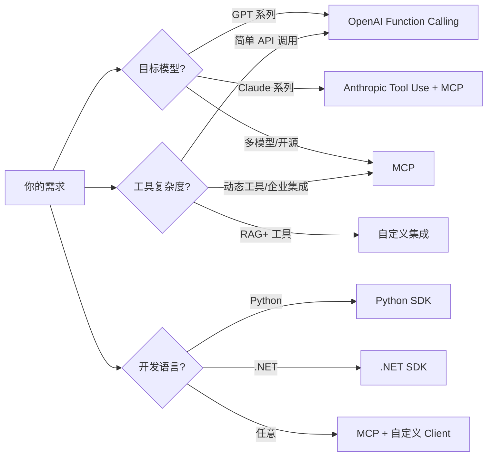

# Tool Use 接口设计规范

## 目录
- [概览](#概览)
- [基础结构](#基础结构)
- [设计原则](#设计原则)
- [标准化输出格式](#标准化输出格式)
- [流式响应（SSE）](#流式响应sse)
- [复杂数据处理](#复杂数据处理)
- [错误处理](#错误处理)
- [可观测性](#可观测性)
- [版本控制与生命周期](#版本控制与生命周期)
- [上下文管理](#上下文管理)
- [行业标准参考](#行业标准参考)
- [最佳实践](#最佳实践)
- [选型建议](#选型建议)
- [趋势与展望](#趋势与展望)
- [在感知节点中的应用](#在感知节点中的应用)

---

## 概览

Tool Use（工具调用）是连接智能体与外部世界的关键接口。本规范定义了感知节点使用的标准化接口，确保工具调用的可靠性和一致性。

### 核心价值

- **标准化**：统一接口格式，降低集成成本
- **可靠性**：参数校验、错误处理、重试策略
- **可扩展**：支持动态工具发现（MCP）
- **兼容性**：兼容主流 AI 平台的规范
- **可观测**：全链路追踪、实时反馈、调试支持

---

## 基础结构

### 工具定义格式

```json
{
  "name": "get_current_weather",
  "description": "获取指定城市的实时天气信息",
  "parameters": {
    "type": "object",
    "properties": {
      "location": {
        "type": "string",
        "description": "城市名称，如 'Beijing' 或 'San Francisco, CA'"
      },
      "unit": {
        "type": "string",
        "enum": ["celsius", "fahrenheit"],
        "description": "温度单位"
      }
    },
    "required": ["location"],
    "additionalProperties": false
  },
  "strict": true,
  "version": "1.0.0",
  "cacheable": true,
  "estimated_tokens": 200
}
```

### 工具定义扩展字段

| 字段 | 类型 | 必需 | 说明 |
|------|------|------|------|
| name | string | 是 | 工具名称，使用 snake_case |
| description | string | 是 | 工具功能描述 |
| parameters | object | 是 | 参数定义（JSON Schema） |
| strict | boolean | 推荐 | 是否开启严格模式（默认 false） |
| version | string | 推荐 | 工具版本号（语义化版本） |
| cacheable | boolean | 否 | 是否支持结果缓存（默认 false） |
| estimated_tokens | number | 否 | 预估返回消耗的 Token 数量 |
| deprecated | boolean | 否 | 是否已废弃（默认 false） |
| sunset_date | string | 否 | 计划废弃日期（ISO 8601 格式） |

### 命名规范

- 使用英文小写+下划线（snake_case）
- 符合正则：`^[a-zA-Z_][a-zA-Z0-9_-]{0,63}$`
- 名称语义清晰，如 `search_product` 优于 `do_stuff`

### 描述撰写原则

| 要素 | 建议 | 示例 |
|------|------|------|
| 功能描述 | 一句话说明用途 | "查询股票实时价格" |
| 参数说明 | 标注类型、格式、取值范围 | "symbol: 股票代码，如 'AAPL'" |
| 边界条件 | 说明限制或异常场景 | "仅支持美股市场，数据延迟15分钟" |

---

## 设计原则

### 单一职责原则

**错误**（多功能聚合）：
```python
{
  "name": "query_service",
  "description": "可查天气、股票、新闻..."
}
```

**正确**（拆分为独立工具）：
- `get_weather(location)`
- `get_stock_price(symbol)`
- `search_news(keyword)`

### 幂等性设计

- 相同输入参数 → 相同输出结果
- 避免因网络重试导致重复执行副作用

### 参数校验前置

```python
def get_weather(location: str, unit: str = "celsius"):
    # 前置校验
    if not re.match(r'^[A-Za-z\s,]+$', location):
        return {"success": False, "error": "Invalid location format"}
    if unit not in ["celsius", "fahrenheit"]:
        return {"success": False, "error": "Invalid unit"}
    # 业务逻辑...
```

### Strict Mode

**关键配置**：`strict: true` + `additionalProperties: false`

```json
{
  "strict": true,
  "parameters": {
    "additionalProperties": false
  }
}
```

**重要性**：
- ✅ 100% Schema 合规保证
- ✅ 防止模型产生幻觉参数
- ✅ 生产环境标配（2026 年标准）

---

## 标准化输出格式

### 基础响应格式

#### 成功响应

```json
{
  "success": true,
  "status": "success",
  "data": {
    "temperature": 25,
    "condition": "sunny"
  },
  "metadata": {
    "tool_name": "get_weather",
    "execution_time_ms": 127,
    "timestamp": "2024-01-01T00:00:00Z",
    "trace_id": "trace_abc123_xyz789"
  }
}
```

#### 错误响应

```json
{
  "success": false,
  "status": "error",
  "error": {
    "code": "CITY_NOT_FOUND",
    "message": "城市'XYZ'未收录",
    "retryable": false
  },
  "metadata": {
    "tool_name": "get_weather",
    "timestamp": "2024-01-01T00:00:00Z",
    "trace_id": "trace_abc123_xyz789"
  }
}
```

### 字段说明

| 字段 | 类型 | 必需 | 说明 |
|------|------|------|------|
| success | bool | 是 | 操作是否成功 |
| status | string | 是 | 状态值：success/error |
| data | object | 条件 | 成功时的返回数据 |
| error | object | 条件 | 失败时的错误信息 |
| metadata | object | 是 | 元数据 |
| metadata.tool_name | string | 是 | 工具名称 |
| metadata.execution_time_ms | number | 否 | 执行耗时（毫秒） |
| metadata.timestamp | string | 是 | 时间戳（ISO 8601） |
| metadata.trace_id | string | 是 | 全链路追踪ID |
| error.code | string | 是 | 错误码 |
| error.message | string | 是 | 错误消息 |
| error.retryable | bool | 否 | 是否可重试（默认 false） |

---

## 流式响应（SSE）

### 概述

对于长时间执行的工具（如网页抓取、大数据查询），使用 Server-Sent Events (SSE) 提供实时进度反馈，避免用户长时间等待。

### SSE 事件基础结构

```
event: <事件类型>
id: <事件ID>
data: <JSON数据>
```

### 事件类型定义

| 事件类型 | 说明 | 触发时机 |
|----------|------|----------|
| `tool_progress` | 工具执行进度 | 长时间任务执行中 |
| `tool_result` | 工具执行成功结果 | 工具执行完成且成功 |
| `tool_error` | 工具执行错误 | 工具执行失败或异常 |
| `tool_retrying` | 重试通知 | 遇到可重试错误时 |

### 事件示例

#### 1. 工具执行进度事件

```sse
event: tool_progress
id: evt_20240305_abc123
data: {
  "progress": 45,
  "message": "正在获取天气数据...",
  "metadata": {
    "tool_name": "get_weather",
    "timestamp": "2024-01-01T00:00:00Z"
  }
}
```

#### 2. 工具执行完成事件

```sse
event: tool_result
id: evt_20240305_def456
data: {
  "success": true,
  "status": "success",
  "data": {
    "temperature": 25,
    "condition": "sunny"
  },
  "metadata": {
    "tool_name": "get_weather",
    "execution_time_ms": 127,
    "timestamp": "2024-01-01T00:00:00Z",
    "trace_id": "trace_xyz789"
  }
}
```

#### 3. 工具执行错误事件

```sse
event: tool_error
id: evt_20240305_ghi789
data: {
  "success": false,
  "status": "error",
  "error": {
    "code": "CITY_NOT_FOUND",
    "message": "城市'XYZ'未收录",
    "retryable": false
  },
  "metadata": {
    "tool_name": "get_weather",
    "timestamp": "2024-01-01T00:00:00Z",
    "trace_id": "trace_xyz789"
  }
}
```

#### 4. 重试事件

```sse
event: tool_retrying
id: evt_20240305_jkl012
data: {
  "retry_count": 1,
  "max_retries": 3,
  "error": {
    "code": "TIMEOUT",
    "message": "请求超时，正在重试..."
  },
  "metadata": {
    "tool_name": "get_weather",
    "timestamp": "2024-01-01T00:00:00Z"
  }
}
```

### SSE 字段说明

| 字段 | 类型 | 必需 | 说明 |
|------|------|------|------|
| event | string | 是 | 事件类型：tool_progress/tool_result/tool_error/tool_retrying |
| id | string | 是 | 事件唯一标识，用于断线重连 |
| data | object | 是 | 工具调用结果（遵循基础响应格式） |

### 服务端实现示例（TypeScript）

```typescript
import express from "express";
import { createSession } from "better-sse";

const app = express();

app.get("/tools/:toolName/sse", async (req, res) => {
  const session = await createSession(req, res);
  const { toolName } = req.params;
  const params = req.query;

  try {
    // 1. 推送开始事件
    session.push(JSON.stringify({
      progress: 0,
      message: `开始执行工具: ${toolName}`,
      metadata: {
        tool_name: toolName,
        timestamp: new Date().toISOString()
      }
    }), "tool_progress");

    // 2. 执行工具（模拟进度更新）
    const result = await executeToolWithProgress(toolName, params, (progress, message) => {
      session.push(JSON.stringify({
        progress,
        message,
        metadata: {
          tool_name: toolName,
          timestamp: new Date().toISOString()
        }
      }), "tool_progress");
    });

    // 3. 推送成功结果
    session.push(JSON.stringify({
      success: true,
      status: "success",
      data: result,
      metadata: {
        tool_name: toolName,
        execution_time_ms: 100,
        timestamp: new Date().toISOString(),
        trace_id: generateTraceId()
      }
    }), "tool_result");

  } catch (error) {
    // 4. 推送错误事件
    session.push(JSON.stringify({
      success: false,
      status: "error",
      error: {
        code: error.code || "EXECUTION_ERROR",
        message: error.message
      },
      metadata: {
        tool_name: toolName,
        timestamp: new Date().toISOString(),
        trace_id: generateTraceId()
      }
    }), "tool_error");
  }
});

async function executeToolWithProgress(toolName, params, onProgress) {
  // 模拟长时间执行的任务
  for (let i = 0; i <= 100; i += 20) {
    await new Promise(resolve => setTimeout(resolve, 200));
    onProgress(i, `处理中... ${i}%`);
  }
  
  // 调用实际工具逻辑
  return { result: "data" };
}

function generateTraceId() {
  return `trace_${Date.now()}_${Math.random().toString(36).substr(2, 9)}`;
}

app.listen(3000);
```

### 客户端实现示例（JavaScript）

```javascript
class ToolSSEClient {
  constructor(toolName, params) {
    this.toolName = toolName;
    this.params = params;
    this.eventSource = null;
  }

  connect() {
    const url = `/tools/${this.toolName}/sse?${new URLSearchParams(this.params)}`;
    this.eventSource = new EventSource(url);

    // 监听进度事件
    this.eventSource.addEventListener("tool_progress", (e) => {
      const data = JSON.parse(e.data);
      console.log(`进度: ${data.progress}% - ${data.message}`);
      this.onProgress?.(data);
    });

    // 监听成功结果
    this.eventSource.addEventListener("tool_result", (e) => {
      const data = JSON.parse(e.data);
      console.log("工具执行成功:", data);
      this.onResult?.(data);
      this.eventSource.close();
    });

    // 监听错误事件
    this.eventSource.addEventListener("tool_error", (e) => {
      const data = JSON.parse(e.data);
      console.error("工具执行失败:", data);
      this.onError?.(data);
      this.eventSource.close();
    });

    // 监听重试事件
    this.eventSource.addEventListener("tool_retrying", (e) => {
      const data = JSON.parse(e.data);
      console.warn(`重试中 (${data.retry_count}/${data.max_retries}):`, data.error);
      this.onRetrying?.(data);
    });

    this.eventSource.onerror = (e) => {
      console.error("SSE 连接错误:", e);
      this.eventSource.close();
    };
  }

  close() {
    this.eventSource?.close();
  }
}

// 使用示例
const client = new ToolSSEClient("get_weather", { location: "Beijing" });
client.onProgress = (data) => {
  // 更新UI进度
};
client.onResult = (data) => {
  // 处理结果
};
client.onError = (data) => {
  // 处理错误
};
client.connect();
```

### 断线重连机制

利用 SSE 的 `Last-Event-ID` 实现断线重连：

```typescript
app.get("/tools/:toolName/sse", async (req, res) => {
  const lastEventId = req.headers["last-event-id"];
  const session = await createSession(req, res);
  
  // 如果有 lastEventId，从断点恢复
  if (lastEventId) {
    const replayEvents = await getEventsAfter(lastEventId);
    for (const event of replayEvents) {
      session.push(event.data, event.eventType);
    }
  }
  
  // 继续正常流程...
});
```

### 与 MCP 协议的兼容性

MCP 协议本身就支持通过 SSE 传输 JSON-RPC 消息。可以将上述 SSE 事件格式转换为 MCP 消息：

```json
// MCP 进度通知
{
  "jsonrpc": "2.0",
  "method": "notifications/progress",
  "params": {
    "progress": 45,
    "message": "正在获取天气数据...",
    "tool_name": "get_weather"
  }
}

// MCP 成功响应
{
  "jsonrpc": "2.0",
  "result": {
    "success": true,
    "data": { "temperature": 25 },
    "metadata": { "tool_name": "get_weather", "trace_id": "trace_abc123" }
  }
}
```

### 集成建议

1. **渐进式集成**：
   - 先在原有的 HTTP 响应格式基础上增加 SSE 支持
   - 保持原有 API 不变，新增 `/sse` 端点

2. **性能优化**：
   - 对于快速工具（<1s），使用原有 HTTP 响应
   - 对于长时间工具，自动切换到 SSE 模式

3. **监控与日志**：
   - 记录每个 SSE 事件的 trace_id
   - 监控连接时长、事件丢失率

---

## 复杂数据处理

### 分页机制

当工具返回大量数据（如搜索结果、日志列表）时，使用游标分页机制避免上下文溢出。

#### 分页响应格式

```json
{
  "success": true,
  "status": "success",
  "data": {
    "items": [
      { "id": 1, "name": "Item 1" },
      { "id": 2, "name": "Item 2" }
    ],
    "pagination": {
      "has_more": true,
      "next_cursor": "eyJvZmZzZXQiOjEwfQ==",
      "total_count": 100
    }
  },
  "metadata": {
    "tool_name": "search_items",
    "execution_time_ms": 45,
    "timestamp": "2024-01-01T00:00:00Z",
    "trace_id": "trace_abc123"
  }
}
```

#### 分页参数

```json
{
  "parameters": {
    "type": "object",
    "properties": {
      "cursor": {
        "type": "string",
        "description": "分页游标，首次调用不传"
      },
      "limit": {
        "type": "integer",
        "description": "每页数量，默认 10，最大 100",
        "minimum": 1,
        "maximum": 100
      }
    }
  }
}
```

### 文件与二进制数据

工具返回图片、PDF 或音频等二进制数据时，使用 Base64 编码或预签名 URL。

#### 方式1：Base64 编码返回

```json
{
  "success": true,
  "status": "success",
  "data": {
    "filename": "report.pdf",
    "content_type": "application/pdf",
    "content_base64": "JVBERi0xLjQKJdP0g..."
  },
  "metadata": {
    "tool_name": "generate_report",
    "timestamp": "2024-01-01T00:00:00Z",
    "trace_id": "trace_abc123"
  }
}
```

#### 方式2：预签名 URL 返回

```json
{
  "success": true,
  "status": "success",
  "data": {
    "filename": "report.pdf",
    "content_type": "application/pdf",
    "url": "https://storage.example.com/reports/report.pdf?signature=...",
    "expires_at": "2024-01-01T01:00:00Z"
  },
  "metadata": {
    "tool_name": "generate_report",
    "timestamp": "2024-01-01T00:00:00Z",
    "trace_id": "trace_abc123"
  }
}
```

**选择建议：**
- 小文件（<1MB）：使用 Base64 编码
- 大文件（≥1MB）：使用预签名 URL
- 公开文件：使用直接 URL
- 私有文件：使用预签名 URL

### 大响应截断

如果工具返回内容超过模型的上下文窗口限制，提供截断策略或摘要机制。

#### 截断响应格式

```json
{
  "success": true,
  "status": "success",
  "data": {
    "content": "...[前 2000 字符]...",
    "truncated": true,
    "truncation_info": {
      "original_length": 15000,
      "returned_length": 2000,
      "summary": "该文档包含 15 个章节，主要讨论了..."
    }
  },
  "metadata": {
    "tool_name": "get_document",
    "timestamp": "2024-01-01T00:00:00Z",
    "trace_id": "trace_abc123"
  }
}
```

#### 截断参数

```json
{
  "parameters": {
    "type": "object",
    "properties": {
      "max_length": {
        "type": "integer",
        "description": "最大返回字符数，默认 2000"
      },
      "return_summary": {
        "type": "boolean",
        "description": "截断时是否返回摘要，默认 true"
      }
    }
  }
}
```

---

## 错误处理

### 错误类型

| 错误码 | 含义 | 处理建议 |
|--------|------|---------|
| INVALID_PARAMS | 参数验证失败 | 检查参数类型和格式 |
| RESOURCE_NOT_FOUND | 资源不存在 | 确认资源ID或路径 |
| PERMISSION_DENIED | 权限不足 | 检查授权 |
| TIMEOUT | 执行超时 | 重试或优化 |
| RATE_LIMITED | 超出速率限制 | 延迟后重试 |
| NETWORK_ERROR | 网络错误 | 重试 |
| EXECUTION_ERROR | 执行错误 | 检查日志 |
| QUOTA_EXCEEDED | 配额超限 | 升级计划 |

### 重试策略

```python
# 重试规则
- 网络错误：最多重试 3 次，指数退避
- 超时错误：最多重试 2 次，指数退避
- 速率限制：根据 Retry-After 头延迟重试
- 参数错误：不重试（立即返回）
- 权限错误：不重试（立即返回）
- 配额超限：不重试（立即返回）
```

### 重试实现示例

```python
def call_tool_with_retry(tool_name: str, params: dict, max_retries: int = 3) -> dict:
    """
    带重试的工具调用
    
    重试策略：
    - 网络错误：最多重试 3 次
    - 超时错误：最多重试 2 次
    - 参数错误：不重试
    - 权限错误：不重试
    """
    retry_count = 0
    last_error = None
    
    while retry_count < max_retries:
        try:
            result = execute_tool(tool_name, params)
            
            # 检查是否需要重试
            if not result['success']:
                error_code = result.get('error', {}).get('code')
                
                # 参数错误和权限错误不重试
                if error_code in ['INVALID_PARAMS', 'PERMISSION_DENIED', 'QUOTA_EXCEEDED']:
                    return result
                
                # 超时错误最多重试 2 次
                if error_code == 'TIMEOUT' and retry_count >= 2:
                    return result
                
                # 速率限制错误，根据 Retry-After 延迟
                if error_code == 'RATE_LIMITED':
                    retry_after = result.get('retry_after', 1)
                    time.sleep(retry_after)
                    last_error = result
                    retry_count += 1
                    continue
                
                # 其他错误继续重试
                last_error = result
                retry_count += 1
                time.sleep(2 ** retry_count)  # 指数退避
                continue
            
            return result
        
        except requests.exceptions.RequestException as e:
            # 网络错误重试
            last_error = {
                "success": False,
                "status": "error",
                "error": {
                    "code": "NETWORK_ERROR",
                    "message": str(e)
                }
            }
            retry_count += 1
            time.sleep(2 ** retry_count)
            continue
        
        except Exception as e:
            # 其他错误不重试
            return {
                "success": False,
                "status": "error",
                "error": {
                    "code": "UNKNOWN_ERROR",
                    "message": str(e)
                }
            }
    
    # 重试次数用尽
    return last_error
```

---

## 可观测性

### Trace ID 全链路追踪

所有工具调用必须包含 `trace_id`，用于关联整个 Agent 推理链路。

#### Trace ID 生成规则

```python
import uuid

def generate_trace_id() -> str:
    """生成全链路追踪 ID"""
    return f"trace_{datetime.now().strftime('%Y%m%d')}_{uuid.uuid4().hex[:12]}"
```

#### Trace ID 传递

```python
def execute_tool_with_trace(tool_name: str, params: dict, trace_id: str) -> dict:
    """执行工具并传递 trace_id"""
    # 在 metadata 中包含 trace_id
    params_with_trace = {
        **params,
        "_trace_id": trace_id  # 内部传递
    }
    
    result = execute_tool(tool_name, params_with_trace)
    
    # 确保返回结果包含 trace_id
    result.setdefault('metadata', {})['trace_id'] = trace_id
    
    return result
```

### 调试模式

开发阶段支持返回详细调试信息，生产环境可屏蔽。

#### 调试响应格式

```json
{
  "success": true,
  "status": "success",
  "data": {
    "temperature": 25,
    "condition": "sunny"
  },
  "metadata": {
    "tool_name": "get_weather",
    "execution_time_ms": 127,
    "timestamp": "2024-01-01T00:00:00Z",
    "trace_id": "trace_abc123"
  },
  "debug_info": {
    "internal_api_response": {
      "status": 200,
      "body": "..."
    },
    "cache_hit": false,
    "query_duration_ms": 45
  }
}
```

#### 调试参数

```json
{
  "parameters": {
    "type": "object",
    "properties": {
      "debug": {
        "type": "boolean",
        "description": "是否返回调试信息，仅开发环境使用"
      }
    }
  }
}
```

### 延迟监控

记录工具执行的详细耗时信息，用于性能分析。

#### 延迟元数据

```json
{
  "metadata": {
    "tool_name": "get_weather",
    "execution_time_ms": 127,
    "timestamp": "2024-01-01T00:00:00Z",
    "trace_id": "trace_abc123",
    "performance": {
      "validation_ms": 2,
      "network_ms": 115,
      "processing_ms": 10
    }
  }
}
```

### 监控指标

建议监控以下指标：

| 指标 | 说明 | 告警阈值 |
|------|------|---------|
| 调用成功率 | 成功调用数 / 总调用数 | < 95% |
| 平均响应时间 | 所有调用的平均耗时 | > 500ms |
| P99 响应时间 | 99% 调用的耗时 | > 2000ms |
| 错误率 | 错误调用数 / 总调用数 | > 5% |
| 重试率 | 重试调用数 / 总调用数 | > 10% |

---

## 版本控制与生命周期

### 工具版本号

使用语义化版本（Semantic Versioning）：

- `MAJOR.MINOR.PATCH`
- `MAJOR`：不兼容的 API 变更
- `MINOR`：向下兼容的功能新增
- `PATCH`：向下兼容的问题修复

#### 版本号示例

```json
{
  "name": "get_weather",
  "version": "2.1.0",
  "description": "获取指定城市的实时天气信息",
  "changelog": {
    "2.1.0": "新增空气质量数据",
    "2.0.0": "重命名参数 location 为 city（不兼容变更）",
    "1.2.0": "支持摄氏度和华氏度",
    "1.1.0": "新增天气状况描述",
    "1.0.0": "初始版本"
  }
}
```

### 废弃策略

明确标记工具废弃状态和计划废弃日期。

#### 废弃标记

```json
{
  "name": "get_weather_v1",
  "version": "1.0.0",
  "deprecated": true,
  "sunset_date": "2026-12-31",
  "replacement": "get_weather",
  "migration_guide": "https://docs.example.com/migration/weather-v1-to-v2"
}
```

#### 废弃响应

```json
{
  "success": false,
  "status": "error",
  "error": {
    "code": "TOOL_DEPRECATED",
    "message": "工具 'get_weather_v1' 已废弃，请使用 'get_weather'",
    "replacement": "get_weather",
    "sunset_date": "2026-12-31",
    "migration_guide": "https://docs.example.com/migration/weather-v1-to-v2"
  }
}
```

### 向后兼容性

**原则：**
- 参数变更必须向后兼容
- 新增参数必须提供默认值
- 不得删除已有参数
- 不得改变已有参数的类型

#### 兼容性示例

**✅ 正确（向后兼容）：**
```json
// v1.0
{
  "parameters": {
    "properties": {
      "location": { "type": "string" }
    }
  }
}

// v2.0（向后兼容）
{
  "parameters": {
    "properties": {
      "location": { "type": "string" },  // 保留原参数
      "unit": { "type": "string", "default": "celsius" }  // 新增参数带默认值
    }
  }
}
```

**❌ 错误（不兼容）：**
```json
// v1.0
{
  "parameters": {
    "properties": {
      "location": { "type": "string" }
    }
  }
}

// v2.0（不兼容）
{
  "parameters": {
    "properties": {
      "city": { "type": "string" }  // 重命名参数
    }
  }
}
```

### 版本迁移

当必须进行不兼容变更时，提供迁移指南。

#### 迁移指南模板

```markdown
## 从 v1.0 迁移到 v2.0

### 变更内容

1. **参数重命名**：`location` → `city`
2. **新增参数**：`country`（必需）
3. **返回字段变更**：`temp` → `temperature`

### 迁移步骤

1. 更新参数名称：
   ```python
   # 旧版本
   params = {"location": "Beijing"}
   
   # 新版本
   params = {"city": "Beijing", "country": "China"}
   ```

2. 更新返回值处理：
   ```python
   # 旧版本
   temp = result["data"]["temp"]
   
   # 新版本
   temperature = result["data"]["temperature"]
   ```

### 兼容性检查

使用迁移检查工具验证：
```bash
python migration_check.py --tool get_weather --from 1.0 --to 2.0
```
```

---

## 上下文管理

### Token 消耗预估

工具定义中应包含预估的 Token 消耗，帮助 Agent 规划上下文窗口。

#### 预估字段

```json
{
  "name": "search_documents",
  "version": "1.0.0",
  "estimated_tokens": {
    "input": 50,
    "output": {
      "min": 200,
      "max": 2000,
      "typical": 500
    }
  }
}
```

#### Token 预估规则

| 数据类型 | 预估规则 |
|---------|---------|
| 纯文本 | 字符数 ÷ 4 |
| JSON | 字符数 ÷ 3.5 |
| 代码 | 字符数 ÷ 2 |
| Markdown | 字符数 ÷ 3.5 |

### 缓存策略

对于幂等性工具，支持结果缓存以减少重复调用。

#### 缓存配置

```json
{
  "name": "get_weather",
  "version": "1.0.0",
  "cacheable": true,
  "cache_ttl": 600,  // 缓存 10 分钟
  "cache_key_params": ["location", "unit"]  // 参与缓存键的参数
}
```

#### 缓存响应

```json
{
  "success": true,
  "status": "success",
  "data": {
    "temperature": 25,
    "condition": "sunny"
  },
  "metadata": {
    "tool_name": "get_weather",
    "execution_time_ms": 0,
    "timestamp": "2024-01-01T00:00:00Z",
    "trace_id": "trace_abc123",
    "cache": {
      "hit": true,
      "cached_at": "2024-01-01T00:00:00Z",
      "ttl_remaining": 300
    }
  }
}
```

#### 缓存实现示例

```python
from functools import lru_cache
import hashlib

def get_cache_key(tool_name: str, params: dict, key_params: list) -> str:
    """生成缓存键"""
    filtered_params = {k: v for k, v in params.items() if k in key_params}
    params_str = json.dumps(filtered_params, sort_keys=True)
    return hashlib.md5(f"{tool_name}:{params_str}".encode()).hexdigest()

class CachedToolExecutor:
    def __init__(self, ttl: int = 600):
        self.ttl = ttl
        self.cache = {}
    
    def execute(self, tool_name: str, params: dict, tool_config: dict) -> dict:
        """执行工具（带缓存）"""
        if not tool_config.get('cacheable'):
            return execute_tool(tool_name, params)
        
        cache_key = get_cache_key(
            tool_name,
            params,
            tool_config.get('cache_key_params', list(params.keys()))
        )
        
        # 检查缓存
        if cache_key in self.cache:
            cached_data, cached_time = self.cache[cache_key]
            if time.time() - cached_time < self.ttl:
                result = cached_data.copy()
                result['metadata']['cache'] = {
                    'hit': True,
                    'cached_at': datetime.fromtimestamp(cached_time).isoformat(),
                    'ttl_remaining': self.ttl - (time.time() - cached_time)
                }
                return result
        
        # 执行工具
        result = execute_tool(tool_name, params)
        
        # 缓存结果
        self.cache[cache_key] = (result, time.time())
        
        return result
```

---

## 行业标准参考

### 主流规范对比（2026 年）

| 规范 | 主导方 | 核心特点 | 适用场景 | 采用率 |
|------|--------|----------|----------|--------|
| **OpenAI Function Calling** | OpenAI | JSON Schema + `strict` 模式 + 并行调用 | GPT 系列应用、兼容生态 | ⭐⭐⭐⭐⭐ |
| **Anthropic Tool Use** | Anthropic | `input_schema` + Client/Server Tools 分离 | Claude 应用、企业 Agent | ⭐⭐⭐⭐⭐ |
| **MCP (Model Context Protocol)** | Anthropic + 社区 | 开放协议 + 动态工具发现 + 解耦架构 | 跨平台 Agent、企业集成 | ⭐⭐⭐⭐ 📈 |

### OpenAI Function Calling（最成熟）

```json
{
  "type": "function",
  "function": {
    "name": "get_weather",
    "description": "Get weather by location",
    "parameters": {
      "type": "object",
      "properties": {
        "location": { "type": "string", "description": "City, Country" }
      },
      "required": ["location"],
      "additionalProperties": false
    },
    "strict": true
  }
}
```

**关键特性：**
- ✅ `strict: true` + `additionalProperties: false` = 100% schema 合规
- ✅ `parallel_tool_calls: false` 控制并发
- ✅ `tool_choice` 支持 `auto`/`required`/`{"name":"xxx"}` 三级控制

### Anthropic Tool Use（最灵活）

```json
{
  "name": "get_weather",
  "description": "Get weather by location",
  "input_schema": {
    "type": "object",
    "properties": {
      "location": { "type": "string" }
    },
    "required": ["location"]
  },
  "strict": true
}
```

**独特优势：**
- 🔹 **Client Tools**：自定义逻辑，模型返回 `tool_use` 后由应用执行
- 🔹 **Server Tools**：平台内置（如 `web_search_20250305`），无需实现
- 🔹 **MCP 原生兼容**：`inputSchema` → `input_schema` 一键转换

### MCP Protocol（增长最快 🚀）

```typescript
// MCP Server 工具定义（标准接口）
interface ToolDefinition {
  name: string;
  description?: string;
  inputSchema: Record<string, unknown>;
  annotations?: {
    title?: string;
    readOnlyHint?: boolean;
    destructiveHint?: boolean;
  };
}

// 客户端动态发现工具
{
  "method": "tools/list",
  "params": {}
}
// → 返回工具列表，支持热更新
```

**为什么 MCP 在爆发：**
| 优势 | 说明 |
|------|------|
| 🔌 **USB-C for AI** | 统一协议连接任意数据源/工具，无需重复开发 |
| 🔁 **动态注册** | 工具变更无需重启 Agent，支持企业级热部署 |
| 🔐 **权限隔离** | MCP Server 可独立控制访问权限，模型不直接接触敏感数据 |
| 🌐 **生态互通** | Claude、ChatGPT、开源模型均可通过 MCP Client 调用同一套工具 |

> 💡 截至 2026 Q1，MCP 已有 200+ 官方/社区 Server（Notion、Google Calendar、PostgreSQL、Figma 等）

---

## 最佳实践

### 1. Strict Mode 成为生产环境标配

```json
{
  "strict": true,
  "parameters": {
    "additionalProperties": false
  }
}
```

**原因：**
- 2026 年所有主流平台均推荐开启
- Schema 校验从"可选"变"必需"
- 防止模型产生幻觉参数

### 2. 参数校验最佳实践

```python
def validate_parameters(tool_name: str, params: dict, schema: dict) -> tuple[bool, str]:
    """
    参数校验最佳实践
    
    返回：
        (is_valid, error_message)
    """
    try:
        # 1. 检查必需参数
        required = schema.get('required', [])
        for param in required:
            if param not in params:
                return False, f"Missing required parameter: {param}"
        
        # 2. 检查参数类型
        properties = schema.get('properties', {})
        for param_name, param_value in params.items():
            if param_name in properties:
                param_schema = properties[param_name]
                expected_type = param_schema.get('type')
                
                # 类型校验
                if expected_type == 'string' and not isinstance(param_value, str):
                    return False, f"Parameter '{param_name}' must be string"
                elif expected_type == 'integer' and not isinstance(param_value, int):
                    return False, f"Parameter '{param_name}' must be integer"
                elif expected_type == 'number' and not isinstance(param_value, (int, float)):
                    return False, f"Parameter '{param_name}' must be number"
                
                # 枚举值校验
                if 'enum' in param_schema and param_value not in param_schema['enum']:
                    return False, f"Parameter '{param_name}' must be one of {param_schema['enum']}"
        
        # 3. 检查额外参数（if strict mode）
        if schema.get('strict') and schema.get('parameters', {}).get('additionalProperties', False) is False:
            for param_name in params:
                if param_name not in properties:
                    return False, f"Unexpected parameter: {param_name}"
        
        return True, ""
    
    except Exception as e:
        return False, f"Validation error: {str(e)}"
```

### 3. 错误处理最佳实践

```python
def call_tool_with_retry(tool_name: str, params: dict, max_retries: int = 3) -> dict:
    """
    带重试的工具调用
    
    重试策略：
    - 网络错误：最多重试 3 次
    - 超时错误：最多重试 2 次
    - 参数错误：不重试
    - 权限错误：不重试
    """
    retry_count = 0
    last_error = None
    
    while retry_count < max_retries:
        try:
            result = execute_tool(tool_name, params)
            
            # 检查是否需要重试
            if not result['success']:
                error_code = result.get('error', {}).get('code')
                
                # 参数错误和权限错误不重试
                if error_code in ['INVALID_PARAMS', 'PERMISSION_DENIED']:
                    return result
                
                # 超时错误最多重试 2 次
                if error_code == 'TIMEOUT' and retry_count >= 2:
                    return result
                
                # 其他错误继续重试
                last_error = result
                retry_count += 1
                time.sleep(2 ** retry_count)  # 指数退避
                continue
            
            return result
        
        except requests.exceptions.RequestException as e:
            # 网络错误重试
            last_error = {
                "success": False,
                "status": "error",
                "error": {
                    "code": "NETWORK_ERROR",
                    "message": str(e)
                }
            }
            retry_count += 1
            time.sleep(2 ** retry_count)
            continue
        
        except Exception as e:
            # 其他错误不重试
            return {
                "success": False,
                "status": "error",
                "error": {
                    "code": "UNKNOWN_ERROR",
                    "message": str(e)
                }
            }
    
    # 重试次数用尽
    return last_error
```

### 4. 动态工具发现（MCP 模式）

```python
class MCPToolRegistry:
    """MCP 工具注册表"""
    
    def __init__(self):
        self.tools = {}
        self.servers = {}
    
    async def register_server(self, server_url: str):
        """注册 MCP Server"""
        # 连接服务器
        response = await requests.post(
            f"{server_url}/tools/list",
            json={}
        )
        
        # 注册工具
        for tool in response.json()['tools']:
            self.tools[tool['name']] = tool
            self.servers[tool['name']] = server_url
    
    async def call_tool(self, tool_name: str, params: dict) -> dict:
        """调用 MCP 工具"""
        if tool_name not in self.tools:
            return {
                "success": False,
                "error": {
                    "code": "TOOL_NOT_FOUND",
                    "message": f"Tool '{tool_name}' not found"
                }
            }
        
        server_url = self.servers[tool_name]
        
        response = await requests.post(
            f"{server_url}/tools/call",
            json={
                "name": tool_name,
                "arguments": params
            }
        )
        
        return response.json()
```

### 5. 流式响应最佳实践

```python
async def execute_tool_with_streaming(tool_name: str, params: dict) -> AsyncGenerator:
    """
    执行工具并流式返回进度
    
    使用场景：长时间运行的工具（>1s）
    """
    # 生成 trace_id
    trace_id = generate_trace_id()
    
    # 推送开始事件
    yield {
        "event": "tool_progress",
        "id": f"evt_{trace_id}_start",
        "data": {
            "progress": 0,
            "message": f"开始执行工具: {tool_name}",
            "metadata": {
                "tool_name": tool_name,
                "timestamp": datetime.now().isoformat(),
                "trace_id": trace_id
            }
        }
    }
    
    try:
        # 执行工具（模拟进度）
        result = await _execute_with_progress(tool_name, params, trace_id, lambda p, m: {
            "event": "tool_progress",
            "id": f"evt_{trace_id}_progress_{p}",
            "data": {
                "progress": p,
                "message": m,
                "metadata": {
                    "tool_name": tool_name,
                    "timestamp": datetime.now().isoformat(),
                    "trace_id": trace_id
                }
            }
        })
        
        # 推送成功结果
        yield {
            "event": "tool_result",
            "id": f"evt_{trace_id}_result",
            "data": {
                "success": True,
                "status": "success",
                "data": result,
                "metadata": {
                    "tool_name": tool_name,
                    "timestamp": datetime.now().isoformat(),
                    "trace_id": trace_id
                }
            }
        }
    
    except Exception as error:
        # 推送错误事件
        yield {
            "event": "tool_error",
            "id": f"evt_{trace_id}_error",
            "data": {
                "success": False,
                "status": "error",
                "error": {
                    "code": "EXECUTION_ERROR",
                    "message": str(error)
                },
                "metadata": {
                    "tool_name": tool_name,
                    "timestamp": datetime.now().isoformat(),
                    "trace_id": trace_id
                }
            }
        }
```

### 6. 分页处理最佳实践

```python
async def fetch_all_pages(tool_name: str, params: dict, max_items: int = 1000) -> list:
    """
    获取所有分页数据
    
    参数：
        tool_name: 工具名称
        params: 工具参数
        max_items: 最大获取数量（防止无限循环）
    
    返回：
        所有项目的列表
    """
    all_items = []
    cursor = None
    fetched_count = 0
    
    while cursor is not None and fetched_count < max_items:
        # 调用工具
        result = await call_tool(tool_name, {
            **params,
            "cursor": cursor,
            "limit": 100
        })
        
        if not result['success']:
            raise Exception(f"Tool error: {result['error']}")
        
        # 添加项目
        items = result['data']['items']
        all_items.extend(items)
        fetched_count += len(items)
        
        # 检查是否还有更多
        pagination = result['data']['pagination']
        if pagination['has_more']:
            cursor = pagination['next_cursor']
        else:
            cursor = None
    
    return all_items
```

### 7. 可观测性最佳实践

```python
import logging

# 配置日志
logging.basicConfig(
    level=logging.INFO,
    format='%(asctime)s - %(name)s - %(levelname)s - %(message)s'
)
logger = logging.getLogger('tool_executor')

def execute_tool_with_observability(tool_name: str, params: dict) -> dict:
    """
    执行工具并记录完整可观测性数据
    """
    # 生成 trace_id
    trace_id = generate_trace_id()
    
    # 记录开始
    start_time = time.time()
    logger.info(f"Tool started: {tool_name}", extra={
        "trace_id": trace_id,
        "tool_name": tool_name,
        "params": params
    })
    
    try:
        # 执行工具
        result = execute_tool(tool_name, params)
        
        # 记录成功
        execution_time = (time.time() - start_time) * 1000
        logger.info(f"Tool completed: {tool_name}", extra={
            "trace_id": trace_id,
            "tool_name": tool_name,
            "execution_time_ms": execution_time,
            "success": result['success']
        })
        
        # 添加性能数据
        result['metadata']['performance'] = {
            'total_ms': execution_time
        }
        
        return result
    
    except Exception as error:
        # 记录错误
        execution_time = (time.time() - start_time) * 1000
        logger.error(f"Tool failed: {tool_name}", extra={
            "trace_id": trace_id,
            "tool_name": tool_name,
            "execution_time_ms": execution_time,
            "error": str(error)
        }, exc_info=True)
        
        raise
```

---

## 选型建议

### 场景匹配



### 技术选型决策树

| 决策因素 | OpenAI | Anthropic | MCP | 自定义 |
|---------|--------|-----------|-----|--------|
| 易用性 | ⭐⭐⭐⭐⭐ | ⭐⭐⭐⭐⭐ | ⭐⭐⭐ | ⭐⭐ |
| 灵活性 | ⭐⭐⭐ | ⭐⭐⭐⭐⭐ | ⭐⭐⭐⭐⭐ | ⭐⭐⭐⭐⭐ |
| 生态支持 | ⭐⭐⭐⭐⭐ | ⭐⭐⭐⭐ | ⭐⭐⭐⭐ | ⭐ |
| 学习成本 | ⭐⭐⭐⭐⭐ | ⭐⭐⭐⭐ | ⭐⭐⭐ | ⭐⭐ |
| 跨平台能力 | ⭐⭐⭐ | ⭐⭐⭐⭐ | ⭐⭐⭐⭐⭐ | ⭐⭐⭐⭐⭐ |

---

## 趋势与展望

### 2026 年趋势

1. **Strict Mode 成为标配**
   - 所有主流平台默认开启
   - Schema 校验从"可选"变"必需"

2. **MCP 协议爆发**
   - 生态快速增长（200+ Server）
   - 成为跨平台工具互操作标准

3. **流式响应普及**
   - 长时间工具支持进度推送
   - SSE 成为标准实现方式

4. **可观测性增强**
   - Trace ID 全链路追踪
   - 性能监控成为标配

5. **AI 驱动的工具发现**
   - 自动分析数据源并生成工具定义
   - 智能推荐工具组合

### 未来展望

**2027 年：**
- 工具调用协议标准化（类似 HTTP/HTTPS）
- 跨模型的工具 marketplace
- AI 驱动的自动工具优化

**2028 年：**
- 工具自描述能力（自动生成文档、测试）
- 工具性能自动优化
- 分布式工具调用网络

---

## 在感知节点中的应用

感知节点是 AGI 进化模型的核心组件，负责工具调用和外部交互。

### 感知节点架构

```
┌─────────────────────────────────────┐
│         感知节点 (Perception Node)     │
├─────────────────────────────────────┤
│                                     │
│  ┌──────────────┐  ┌─────────────┐ │
│  │ 工具注册表    │  │ 工具执行器   │ │
│  │ (Registry)   │  │ (Executor)  │ │
│  └──────┬───────┘  └──────┬──────┘ │
│         │                 │        │
│         └────────┬────────┘        │
│                  ▼                 │
│  ┌──────────────────────────────┐ │
│  │  统一接口层 (Tool Interface)   │ │
│  │  - 参数校验                   │ │
│  │  - 错误处理                   │ │
│  │  - 重试策略                   │ │
│  │  - 流式响应                   │ │
│  │  - 可观测性                   │ │
│  └──────────────────────────────┘ │
│                  │                 │
│                  ▼                 │
│  ┌──────────────────────────────┐ │
│  │   外部工具 (External Tools)    │ │
│  │   - API 调用                  │ │
│  │   - 数据库查询                │ │
│  │   - 文件操作                  │ │
│  │   - MCP Server                │ │
│  └──────────────────────────────┘ │
│                                     │
└─────────────────────────────────────┘
```

### 感知节点工具定义示例

```python
# 感知节点工具注册
PERCEPTION_NODE_TOOLS = [
    {
        "name": "get_weather",
        "description": "获取指定城市的实时天气信息",
        "parameters": {
            "type": "object",
            "properties": {
                "location": {
                    "type": "string",
                    "description": "城市名称，如 'Beijing' 或 'San Francisco, CA'"
                },
                "unit": {
                    "type": "string",
                    "enum": ["celsius", "fahrenheit"],
                    "description": "温度单位"
                }
            },
            "required": ["location"],
            "additionalProperties": false
        },
        "strict": true,
        "version": "1.0.0",
        "cacheable": True,
        "cache_ttl": 600,
        "estimated_tokens": {
            "input": 50,
            "output": {"typical": 100, "max": 200}
        }
    },
    {
        "name": "search_documents",
        "description": "搜索文档数据库",
        "parameters": {
            "type": "object",
            "properties": {
                "query": {
                    "type": "string",
                    "description": "搜索关键词"
                },
                "limit": {
                    "type": "integer",
                    "description": "返回结果数量",
                    "minimum": 1,
                    "maximum": 100,
                    "default": 10
                },
                "cursor": {
                    "type": "string",
                    "description": "分页游标"
                }
            },
            "required": ["query"],
            "additionalProperties": false
        },
        "strict": True,
        "version": "2.1.0",
        "estimated_tokens": {
            "input": 100,
            "output": {"min": 200, "max": 5000, "typical": 1000}
        }
    },
    {
        "name": "generate_report",
        "description": "生成 PDF 报告并返回下载链接",
        "parameters": {
            "type": "object",
            "properties": {
                "title": {
                    "type": "string",
                    "description": "报告标题"
                },
                "content": {
                    "type": "string",
                    "description": "报告内容（Markdown 格式）"
                },
                "format": {
                    "type": "string",
                    "enum": ["pdf", "docx", "html"],
                    "description": "输出格式",
                    "default": "pdf"
                }
            },
            "required": ["title", "content"],
            "additionalProperties": False
        },
        "strict": True,
        "version": "1.2.0",
        "streaming": True,  # 支持流式响应
        "estimated_tokens": {
            "input": 500,
            "output": {"min": 50, "max": 100, "typical": 50}
        }
    }
]
```

### 感知节点工具调用流程

```python
class PerceptionNode:
    """感知节点 - 工具调用统一入口"""
    
    def __init__(self):
        self.registry = ToolRegistry()
        self.executor = ToolExecutor()
        self.cache = ToolCache()
        self.observability = ObservabilityManager()
    
    async def call_tool(self, tool_name: str, params: dict, **options) -> dict:
        """
        调用工具（统一入口）
        
        参数：
            tool_name: 工具名称
            params: 工具参数
            options: 可选参数
                - enable_cache: 是否启用缓存（默认 True）
                - enable_streaming: 是否启用流式响应（默认 True）
                - enable_retry: 是否启用重试（默认 True）
                - debug: 调试模式（默认 False）
        
        返回：
            工具执行结果
        """
        # 1. 获取工具定义
        tool_config = self.registry.get_tool(tool_name)
        if not tool_config:
            return {
                "success": False,
                "status": "error",
                "error": {
                    "code": "TOOL_NOT_FOUND",
                    "message": f"Tool '{tool_name}' not found"
                }
            }
        
        # 2. 生成 trace_id
        trace_id = self.observability.generate_trace_id()
        
        # 3. 参数校验
        is_valid, error_msg = validate_parameters(tool_name, params, tool_config)
        if not is_valid:
            return {
                "success": False,
                "status": "error",
                "error": {
                    "code": "INVALID_PARAMS",
                    "message": error_msg
                },
                "metadata": {
                    "tool_name": tool_name,
                    "timestamp": datetime.now().isoformat(),
                    "trace_id": trace_id
                }
            }
        
        # 4. 检查缓存
        if options.get('enable_cache', True) and tool_config.get('cacheable'):
            cached_result = self.cache.get(tool_name, params, tool_config)
            if cached_result:
                return cached_result
        
        # 5. 执行工具
        start_time = time.time()
        
        try:
            if options.get('enable_streaming', True) and tool_config.get('streaming'):
                # 流式响应
                result_stream = await self.executor.execute_with_streaming(
                    tool_name,
                    params,
                    tool_config,
                    trace_id
                )
                
                # 返回流（异步生成器）
                return result_stream
            
            else:
                # 普通响应
                if options.get('enable_retry', True):
                    result = await self.executor.execute_with_retry(
                        tool_name,
                        params,
                        tool_config,
                        trace_id
                    )
                else:
                    result = await self.executor.execute(
                        tool_name,
                        params,
                        tool_config,
                        trace_id
                    )
                
                # 添加性能数据
                execution_time = (time.time() - start_time) * 1000
                result['metadata']['performance'] = {
                    'total_ms': execution_time
                }
                
                # 缓存结果
                if options.get('enable_cache', True) and tool_config.get('cacheable'):
                    self.cache.set(tool_name, params, result, tool_config)
                
                # 调试信息
                if options.get('debug', False):
                    result['debug_info'] = {
                        'cache_hit': False,
                        'retry_count': 0,
                        'execution_time_ms': execution_time
                    }
                
                return result
        
        except Exception as error:
            # 错误处理
            execution_time = (time.time() - start_time) * 1000
            error_result = {
                "success": False,
                "status": "error",
                "error": {
                    "code": "EXECUTION_ERROR",
                    "message": str(error)
                },
                "metadata": {
                    "tool_name": tool_name,
                    "execution_time_ms": execution_time,
                    "timestamp": datetime.now().isoformat(),
                    "trace_id": trace_id
                }
            }
            
            # 记录错误
            self.observability.log_error(trace_id, tool_name, error)
            
            return error_result
```

### 感知节点与元认知检测模块的集成

```python
class PerceptionNodeWithMetacognition(PerceptionNode):
    """带元认知检测的感知节点"""
    
    def __init__(self, metacognition_checker):
        super().__init__()
        self.metacognition_checker = metacognition_checker
    
    async def call_tool_with_metacognition(
        self,
        tool_name: str,
        params: dict,
        personality: dict = None,
        **options
    ) -> dict:
        """
        调用工具并进行元认知检测
        
        参数：
            tool_name: 工具名称
            params: 工具参数
            personality: 人格参数（用于客观性评估）
            options: 可选参数
        
        返回：
            工具执行结果（包含元认知检测结果）
        """
        # 1. 调用工具
        result = await self.call_tool(tool_name, params, **options)
        
        # 2. 元认知检测
        if result.get('success'):
            metacognition_result = await self.metacognition_checker.evaluate(
                response=result['data'],
                query=params.get('query', ''),
                personality=personality
            )
            
            # 3. 如果检测到问题，触发纠错
            if metacognition_result['needs_correction']:
                correction = await self.metacognition_checker.suggest_correction(
                    metacognition_result,
                    personality
                )
                
                result['metadata']['metacognition'] = {
                    'checked': True,
                    'needs_correction': True,
                    'correction': correction
                }
            else:
                result['metadata']['metacognition'] = {
                    'checked': True,
                    'needs_correction': False
                }
        
        return result
```

---

## 附录

### A. 完整错误码列表

| 错误码 | 说明 | HTTP 状态码 | 可重试 |
|--------|------|------------|--------|
| INVALID_PARAMS | 参数验证失败 | 400 | 否 |
| TOOL_NOT_FOUND | 工具不存在 | 404 | 否 |
| RESOURCE_NOT_FOUND | 资源不存在 | 404 | 否 |
| PERMISSION_DENIED | 权限不足 | 403 | 否 |
| UNAUTHORIZED | 未授权 | 401 | 否 |
| TIMEOUT | 执行超时 | 504 | 是 |
| RATE_LIMITED | 速率限制 | 429 | 是 |
| NETWORK_ERROR | 网络错误 | 503 | 是 |
| EXECUTION_ERROR | 执行错误 | 500 | 否 |
| TOOL_DEPRECATED | 工具已废弃 | 410 | 否 |
| QUOTA_EXCEEDED | 配额超限 | 429 | 否 |

### B. 工具定义模板

```json
{
  "name": "tool_name",
  "description": "Tool description in one sentence",
  "parameters": {
    "type": "object",
    "properties": {
      "param_name": {
        "type": "string|number|integer|boolean|array|object",
        "description": "Parameter description",
        "enum": ["option1", "option2"],
        "default": "default_value",
        "minimum": 0,
        "maximum": 100
      }
    },
    "required": ["param_name"],
    "additionalProperties": false
  },
  "strict": true,
  "version": "1.0.0",
  "cacheable": true,
  "cache_ttl": 600,
  "cache_key_params": ["param_name"],
  "streaming": false,
  "estimated_tokens": {
    "input": 100,
    "output": {
      "min": 200,
      "max": 2000,
      "typical": 500
    }
  },
  "deprecated": false,
  "sunset_date": "2026-12-31",
  "replacement": "new_tool_name"
}
```

### C. 参考资源

- [OpenAI Function Calling 官方文档](https://platform.openai.com/docs/guides/function-calling)
- [Anthropic Tool Use 官方文档](https://docs.anthropic.com/en/docs/tool-use)
- [MCP 协议规范](https://modelcontextprotocol.io/)
- [JSON Schema 规范](https://json-schema.org/)
- [SSE (Server-Sent Events) 规范](https://html.spec.whatwg.org/multipage/server-sent-events.html)

---

## 总结

本规范涵盖了 Tool Use 接口设计的所有关键方面：

✅ **标准化**：统一的工具定义、响应格式、错误处理
✅ **可靠性**：参数校验、重试策略、幂等性设计
✅ **可扩展**：MCP 协议、动态工具发现、版本管理
✅ **兼容性**：兼容 OpenAI、Anthropic 等主流平台
✅ **可观测**：Trace ID、流式响应、性能监控
✅ **企业级**：分页、缓存、文件处理、版本控制

通过遵循本规范，可以构建出高质量、可维护、可扩展的工具调用系统。
