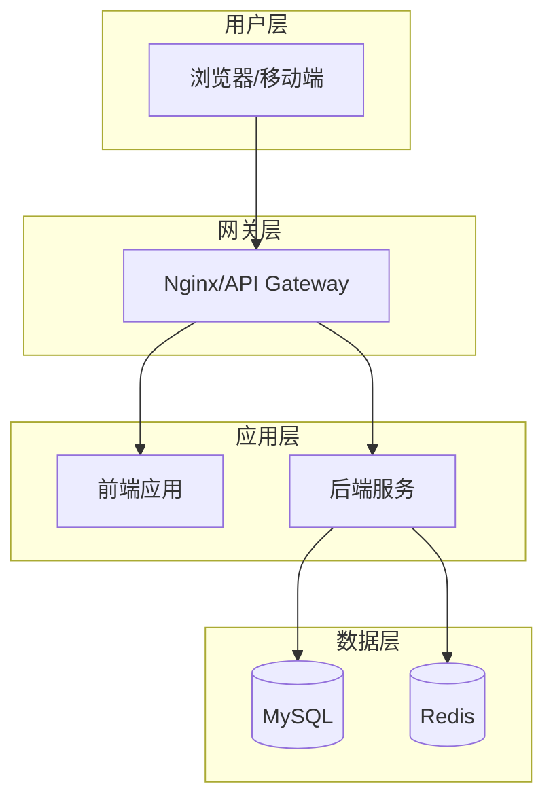
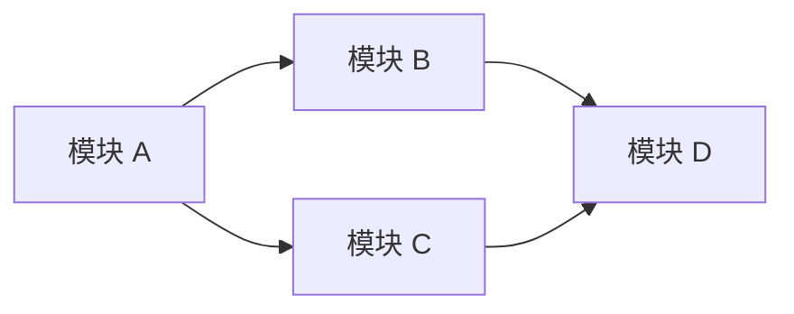
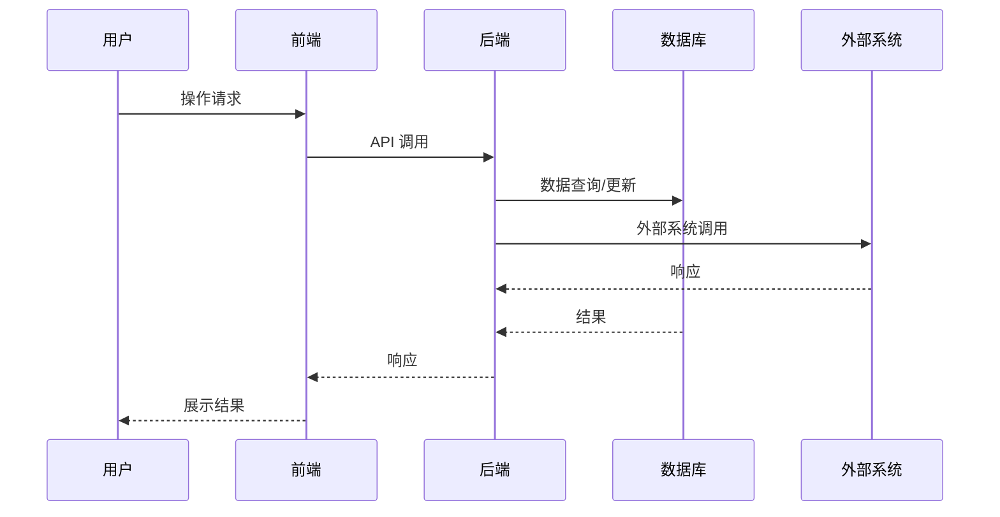
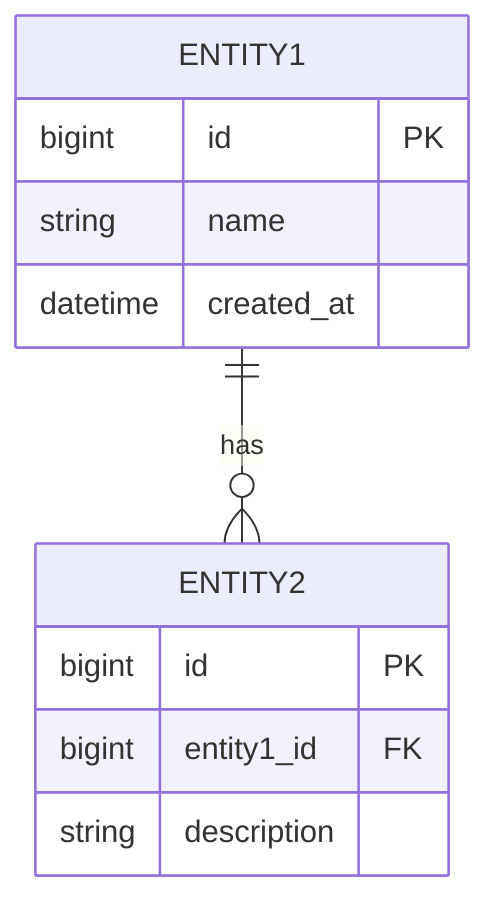
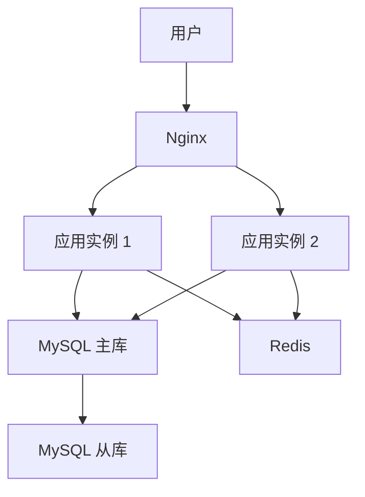

# {项目名称} 系统设计文档

**文档 ID**: `design-{YYYY-MM-DD}-{project-name}`  
**创建日期**: {YYYY-MM-DD}  
**状态**: 草稿  
**版本**: 1.0.0  
**作者**: {作者}  

---

## 文档信息

| 项目 | 内容 |
|------|------|
| 文档名称 | {项目名称} 系统设计文档 |
| 版本 | 1.0.0 |
| 创建日期 | {YYYY-MM-DD} |
| 最后更新 | {YYYY-MM-DD} |
| 文档作者 | {作者} |
| 审核人 | 待审核 |
| 批准人 | 待批准 |
| 文档状态 | 草稿 |
| 关联文档 | {PRD 文档路径} |

---

## 目录

1. [系统架构](#1-系统架构)（含[仓库与代码目录结构](#14-仓库与代码目录结构前后端分离时必填)）
2. [技术栈](#2-技术栈)
3. [模块划分](#3-模块划分)
4. [数据流主线与集成点](#4-数据流主线与集成点)
5. [接口设计](#5-接口设计)
6. [数据模型](#6-数据模型)
7. [部署方案](#7-部署方案)

---

## 1. 系统架构

### 1.1 架构图



### 1.2 架构说明

| 层级 | 组件 | 技术选型 | 说明 |
|------|------|----------|------|
| 用户层 | Web/App | 浏览器/移动端 | 用户访问入口 |
| 网关层 | 负载均衡 | Nginx | 请求分发、静态资源 |
| 应用层 | 前端 | {前端框架} | {说明} |
| 应用层 | 后端 | {后端框架} | {说明} |
| 数据层 | 主库 | MySQL 8.0 | 数据持久化 |
| 数据层 | 缓存 | Redis 6.x | 热点数据缓存 |

### 1.3 架构特点

- {特点 1}
- {特点 2}
- {特点 3}

### 1.4 仓库与代码目录结构（前后端分离时必填）

> **用途**：供 `/gen-code` 等技能确定文件落点；空仓库生成代码前须先创建下列根目录。

| 类型 | 根目录（相对仓库根） | 说明 |
|------|---------------------|------|
| 前端 | `{frontendRoot}`，如 `frontend/` 或 `web/` | 前端工程根（含 `package.json`、构建配置） |
| 后端 | `{backendRoot}`，如 `backend/` 或 `server/` | 后端工程根（含 `pom.xml` / `build.gradle` 等） |
| 文档 | `docs/` | PRD、设计、任务、契约等 |

**约定**：`frontendRoot` 与 `backendRoot` 须在生成设计文档时填入具体路径；执行 `/gen-code` 时前端任务写入前端根目录，后端任务写入后端根目录；**若目录不存在，必须先创建再写入**。

---

## 2. 技术栈

### 2.1 前端技术

| 技术 | 版本 | 说明 |
|------|------|------|
| {框架} | {版本} | {说明} |
| {UI 库} | {版本} | {说明} |
| {状态管理} | {版本} | {说明} |
| {路由} | {版本} | {说明} |
| {HTTP 客户端} | {版本} | {说明} |

### 2.2 后端技术

| 技术 | 版本 | 说明 |
|------|------|------|
| {框架} | {版本} | {说明} |
| {ORM} | {版本} | {说明} |
| {安全} | {版本} | {说明} |
| {文档} | {版本} | {说明} |

### 2.3 数据库

| 技术 | 版本 | 说明 |
|------|------|------|
| MySQL | 8.0 | 关系型数据库 |
| Redis | 6.x | 缓存数据库 |

---

## 3. 模块划分

### 3.1 模块列表

| 模块编号 | 模块名称 | 职责描述 | 对应领域 |
|----------|----------|----------|----------|
| M-001 | {模块名} | {职责} | {领域} |
| M-002 | {模块名} | {职责} | {领域} |
| M-003 | {模块名} | {职责} | {领域} |

### 3.2 模块依赖关系



### 3.3 模块与领域知识库对应

| 模块 | 对应领域知识库 | 知识库来源 |
|------|---------------|------------|
| {模块} | {领域} | {知识库文件} |

---

## 4. 数据流主线与集成点

> **本节为必填项**，必须与 PRD 中的「核心数据流与闭环」对齐

### 4.1 数据流主线

| 数据流编号 | 数据流名称 | 前端/入口 | 后端经手模块 | 数据层/外部系统 | 闭环说明 |
|------------|------------|-----------|--------------|-----------------|----------|
| DF-001 | {名称} | {入口} | {模块} | {数据层} | {闭环说明} |
| DF-002 | {名称} | {入口} | {模块} | {数据层} | {闭环说明} |

### 4.2 数据流泳道图（核心数据流）



### 4.3 集成点清单

| 集成点编号 | 所属数据流 | 集成类型 | 位置/接口 | 说明 | 来源知识库 |
|------------|------------|----------|-----------|------|------------|
| INT-001 | DF-001 | API/事件/表 | {接口} | {说明} | {领域} |
| INT-002 | DF-002 | API/事件/表 | {接口} | {说明} | {领域} |

### 4.4 集成契约

#### INT-001: {集成点名称}

- **集成方式**: {API/消息队列/数据库}
- **接口路径**: {路径}
- **请求方法**: {GET/POST/PUT/DELETE}
- **请求参数**:
  ```json
  {
    "param1": "value1",
    "param2": "value2"
  }
  ```
- **响应格式**:
  ```json
  {
    "code": 200,
    "message": "success",
    "data": {}
  }
  ```
- **调用方式**: {同步/异步}
- **超时设置**: {秒}
- **重试机制**: {策略}
- **幂等性**: {如何保证}

---

## 5. 接口设计

### 5.1 API 规范

- **协议**: HTTP/HTTPS
- **数据格式**: JSON
- **认证方式**: JWT Token
- **版本管理**: URL 路径版本（/api/v1/）
- **编码**: UTF-8

### 5.2 统一响应格式

```json
{
  "code": 200,
  "message": "success",
  "data": {},
  "timestamp": 1234567890
}
```

**响应码说明**:

| 状态码 | 说明 |
|--------|------|
| 200 | 成功 |
| 400 | 请求参数错误 |
| 401 | 未认证 |
| 403 | 无权限 |
| 500 | 服务器内部错误 |

### 5.3 接口列表

| 接口编号 | 接口名称 | 方法 | 路径 | 说明 | 来源知识库 |
|----------|----------|------|------|------|------------|
| API-001 | {名称} | GET | /api/v1/xxx | {说明} | {领域} |
| API-002 | {名称} | POST | /api/v1/xxx | {说明} | {领域} |

### 5.4 接口详细说明

#### API-001: {接口名称}

- **接口描述**: {描述}
- **请求方式**: {GET/POST/PUT/DELETE}
- **请求路径**: `/api/v1/xxx`
- **请求头**:
  ```
  Authorization: Bearer {token}
  Content-Type: application/json
  ```
- **请求参数**:

| 参数名 | 类型 | 必填 | 说明 |
|--------|------|------|------|
| param1 | string | 是 | {说明} |
| param2 | int | 否 | {说明} |

- **响应示例**:
  ```json
  {
    "code": 200,
    "message": "success",
    "data": {}
  }
  ```

---

## 6. 数据模型

### 6.1 领域知识库参考

| 实体 | 来源知识库 | 说明 |
|------|-----------|------|
| {实体} | {领域} | {说明} |

### 6.2 ER 图



### 6.3 表结构设计

#### 6.3.1 {表名} (t_{module}_{entity})

**表说明**: {说明}

| 字段名 | 类型 | 长度 | 说明 | 约束 | 索引 |
|--------|------|------|------|------|------|
| id | BIGINT | - | 主键 | PK | 主键索引 |
| {字段} | {类型} | {长度} | {说明} | {约束} | {索引} |
| created_at | DATETIME | - | 创建时间 | NOT NULL | - |
| updated_at | DATETIME | - | 更新时间 | NOT NULL | - |

**索引设计**:

| 索引名 | 字段 | 类型 | 说明 |
|--------|------|------|------|
| idx_{name} | {字段} | {类型} | {说明} |

**与知识库对应**: 参考 {领域} 知识库中的 {实体} 设计

---

## 7. 部署方案

### 7.1 部署架构



### 7.2 环境配置

| 环境 | 配置 | 说明 |
|------|------|------|
| 开发环境 | {配置} | {说明} |
| 测试环境 | {配置} | {说明} |
| 生产环境 | {配置} | {说明} |

### 7.3 资源配置

| 资源 | 规格 | 数量 | 说明 |
|------|------|------|------|
| ECS | 4 核 8G | 2 | 应用服务器 |
| RDS | MySQL 高可用版 | 1 | 数据库 |
| Redis | 主从版 | 1 | 缓存 |

### 7.4 部署步骤

1. {步骤 1}
2. {步骤 2}
3. {步骤 3}

---

## 附录

### A. 领域知识库引用

| 领域 | 知识库文件 | 引用内容 |
|------|-----------|----------|
| {领域} | {文件路径} | {内容摘要} |

### B. 架构方案参考

参考架构方案库: `skills/libs/architecture-options.md`

采用方案: {方案名称}

### C. 修订历史

| 版本 | 日期 | 作者 | 变更说明 |
|------|------|------|----------|
| 1.0.0 | {日期} | {作者} | 初始版本 |

---

*文档版本：1.0*  
*最后更新：{YYYY-MM-DD}*
