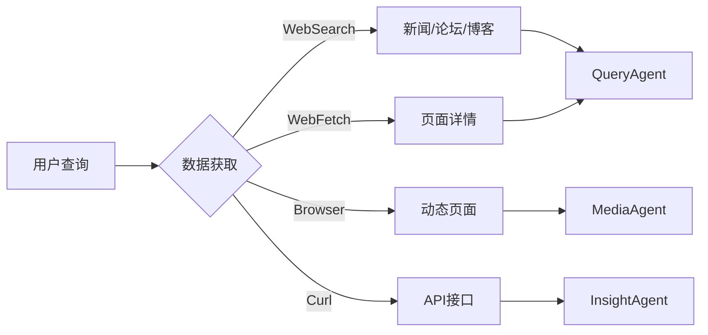
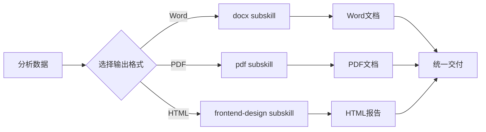

# BettaFish-skill 🐟

<p align="center">
  
</p>

<p align="center">
  <a href="https://github.com/XiaoMaColtAI/BettaFish-skill/stargazers"></a>
  <a href="https://github.com/XiaoMaColtAI/BettaFish-skill/network"></a>
  <a href="LICENSE"></a>
  <a href="https://github.com/XiaoMaColtAI/BettaFish-skill/releases"></a>
</p>

> **多智能体舆情分析系统** —— 基于 BettaFish 的 QueryAgent + MediaAgent + InsightAgent 三引擎并行架构，通过 ForumEngine 实现 Agent 间协作讨论，生成 Word/PDF + 精美 HTML 双格式报告。

---

## 📋 目录

- [项目简介](#-项目简介)
- [核心特性](#-核心特性)
- [架构设计](#-架构设计)
- [项目结构](#-项目结构)
- [多平台安装指南](#-多平台安装指南)
- [快速开始](#-快速开始)
- [使用示例](#-使用示例)
- [运行效果](#-运行效果)
- [贡献指南](#-贡献指南)
- [许可证](#-许可证)

---

## 🎯 项目简介

**BettaFish-skill** 是 [BettaFish（微舆）](https://github.com/666ghj/BettaFish) 多智能体舆情分析系统的 **AI Agent Skill 封装版本**。

与传统的舆情分析工具不同，BettaFish-skill：

- ✅ **零配置开箱即用** —— 无需部署数据库、无需配置环境
- ✅ **自然语言交互** —— 像聊天一样进行舆情分析
- ✅ **双格式报告输出** —— 同时生成 Word/PDF 文档 + 精美 HTML 可视化报告
- ✅ **实时数据获取** —— 通过 WebSearch/WebFetch/Curl 实时获取，无数据库依赖
- ✅ **编辑杂志级设计** —— HTML 报告采用 Editorial/Magazine 风格，可直接用于演示

> "微舆"谐音"微鱼"，BettaFish 是一种体型很小但非常好斗、漂亮的鱼，象征着"小而强大，不畏挑战"。

---

## ✨ 核心特性

### 🤖 三引擎并行架构

| Agent                  | 职责                           | 数据获取方式                   |
| ---------------------- | ------------------------------ | ------------------------------ |
| **QueryAgent**   | 网页搜索、新闻资讯、论坛讨论   | WebSearch + WebFetch + Browser |
| **MediaAgent**   | 短视频/图文内容分析            | video-frames 提取关键帧 + 分析 |
| **InsightAgent** | 情感分析、关键词提取、聚类分析 | WebSearch + Python 脚本        |

### 📝 双格式报告输出

```
📄 Word 文档 (.docx)
   ├── 正式汇报、打印存档、邮件附件
   ├── 自动生成目录和页码
   └── 标准公文格式

📑 PDF 文档 (.pdf)
   ├── 跨平台分享、不可编辑存档
   ├── 完整中文字体支持
   └── 专业版式

🌐 HTML 交互报告 (.html)
   ├── 演示展示、在线分享
   ├── 编辑杂志风格设计
   ├── 深海军蓝 + 金色主题
   └── 分页导航 + 键盘操作
```

### 🎨 编辑杂志级视觉设计

HTML 报告采用 **Editorial/Magazine（编辑杂志）风格**，灵感源自《Monocle》《Wallpaper*》等高端出版物：

- **色彩方案**：深海军蓝 (#0a192f) + 暖金色 (#ffd700)
- **字体搭配**：Playfair Display + Source Serif Pro
- **布局特点**：不对称网格 + 慷慨留白
- **动效设计**：电影级滚动触发 + 微交互

### 📊 8 章完整报告结构

1. **执行摘要** —— 品牌声誉总览、KPI 指标、主要结论
2. **品牌声量与影响力分析** —— 趋势、渠道、区域分布
3. **关键事件深度回顾** —— 时间线、多方观点、关键数据
4. **情感与认知分析** —— 情感光谱、品牌联想、核心议题
5. **用户画像分析** —— 人群属性、触媒习惯
6. **声誉风险与机遇洞察** —— 负面议题、风险预警、正面机遇
7. **结论与战略建议** —— SWOT 分析、优化建议、监测重点
8. **数据附录** —— 指标汇总、权威来源清单

---

## 🏗️ 架构设计

### 系统架构图

```
用户查询输入
    ↓
[并行启动三 Agent]
├─ QueryAgent ──┐
├─ MediaAgent ──┼──→ ForumEngine (Agent 讨论协作)
└─ InsightAgent ─┘         ↓
                    [3轮反思循环优化]
                            ↓
                    [ReportEngine 报告生成]
                            ↓
        ├─ docx subskill → Word 文档
        ├─ pdf subskill → PDF 文档
        └─ frontend-design subskill → HTML 报告
```

### 数据获取策略



### 报告生成流水线



---

## 📁 项目结构

```
BettaFish-skill/
├── SKILL.md                          # Skill 核心定义文件
├── README.md                         # 本文件
├── LICENSE                           # 许可证
├── evals/
│   └── evals.json                    # 测试用例定义
├── references/
│   ├── design_guide.md               # 设计规范指南
│   └── data_sources.md               # 数据来源指南
├── subskills/
│   ├── docx/                         # Word 文档生成 subskill
│   │   └── scripts/
│   ├── pdf/                          # PDF 文档生成 subskill
│   │   └── scripts/
│   ├── frontend-design/              # HTML 报告生成 subskill
│   │   └── assets/
│   └── video-frames/                 # 视频分析 subskill
│       └── scripts/
└── scripts/
    └── report_generator.py           # 报告生成核心脚本
```

---

## 🚀 多平台安装指南

### 1. Claude Code（推荐）

**Claude Code** 是 Anthropic 推出的 Claude 官方 CLI 工具，提供最完整的 skill 支持。

#### 安装步骤：

```bash
# 1. 安装 Claude Code（如尚未安装）
npm install -g @anthropic-ai/claude-code

# 2. 克隆本仓库到本地 skills 目录
git clone https://github.com/XiaoMaColtAI/BettaFish-skill.git ~/.claude/skills/bettafish-opinion-analysis

# 3. 启动 Claude Code
claude

# 4. 在对话中使用 skill
/skill bettafish-opinion-analysis
```

#### 或者使用 skill 安装命令：

```bash
# 在 Claude Code 中直接安装
claude /skill install XiaoMaColtAI/BettaFish-skill
```

---

### 2. Cursor

**Cursor** 是基于 VS Code 的 AI 编程编辑器，支持自定义 skill。

#### 安装步骤：

```bash
# 1. 克隆仓库到 Cursor skills 目录
git clone https://github.com/XiaoMaColtAI/BettaFish-skill.git ~/.cursor/skills/bettafish-opinion-analysis

# 2. 在 Cursor 中启用 skill
# 打开 Cursor → Settings → AI Features → Skills
# 点击 "Add Skill" → 选择 ~/.cursor/skills/bettafish-opinion-analysis
```

#### 配置 `.cursorrules`：

在你的项目根目录创建 `.cursorrules` 文件：

```json
{
  "skills": [
    {
      "name": "bettafish-opinion-analysis",
      "path": "~/.cursor/skills/bettafish-opinion-analysis"
    }
  ]
}
```

---

### 3. OpenClaw

**OpenClaw** 是开源的个人 AI 助手平台，支持通过工作空间（workspace）管理技能。

#### 安装步骤：

```bash
# 1. 安装 OpenClaw（如尚未安装）
npm install -g openclaw@latest

# 2. 创建技能目录（如果尚未创建）
mkdir -p ~/.openclaw/workspace/skills

# 3. 克隆本仓库到 OpenClaw 技能目录
git clone https://github.com/XiaoMaColtAI/BettaFish-skill.git \
  ~/.openclaw/workspace/skills/bettafish-opinion-analysis

# 4. 验证安装 - 检查 SKILL.md 是否存在
ls ~/.openclaw/workspace/skills/bettafish-opinion-analysis/SKILL.md

# 5. 重启 OpenClaw Gateway 使技能生效
openclaw gateway restart
```

#### 配置说明：

OpenClaw 启动时会自动加载 `~/.openclaw/workspace/skills/` 目录下的所有技能。每个技能目录需要包含 `SKILL.md` 文件。

技能加载后，你可以在 OpenClaw 的任意会话（WebChat、Telegram、Discord 等）中使用以下方式触发：

```
分析某咖啡连锁品牌的社交媒体口碑
```

或明确指定使用本 skill：

```
/skill bettafish-opinion-analysis 分析某咖啡连锁品牌的舆情
```

更多详情参考 [OpenClaw Skills 文档](https://docs.openclaw.ai/tools/skills)。

---

### 4. Claude Desktop App

**Claude Desktop** 支持通过项目文件加载 skill。

#### 安装步骤：

```bash
# 1. 克隆仓库
git clone https://github.com/XiaoMaColtAI/BettaFish-skill.git

# 2. 在 Claude Desktop 中打开项目文件夹
# File → Open Folder → 选择 BettaFish-skill

# 3. Claude 会自动读取项目中的 SKILL.md
```

---

### 5. 手动安装（通用方法）

任何支持 skill 的 AI 工具都可以使用以下通用安装方法：

```bash
# 1. 克隆仓库
git clone https://github.com/XiaoMaColtAI/BettaFish-skill.git

# 2. 将 BettaFish-skill 目录复制到你的 AI 工具的 skills 目录
# 具体路径取决于你使用的工具：
# - Claude Code: ~/.claude/skills/
# - Cursor: ~/.cursor/skills/
# - 其他工具: 参考对应工具的文档

# 3. 重启你的 AI 工具，skill 将自动加载
```

---

## ⚡ 快速开始

### 安装完成后，你可以这样使用：

```
用户：分析某咖啡连锁品牌最近一个月的社交媒体口碑

Skill 自动执行：
├─ Step 1: 需求解析 → 提取"某咖啡连锁品牌"、"社交媒体"、"近30天"
├─ Step 2: 并行启动三 Agent
│   ├─ QueryAgent → WebSearch 新闻/论坛
│   ├─ MediaAgent → 分析抖音/小红书视频
│   └─ InsightAgent → 情感分析/关键词提取
├─ Step 3: ForumEngine 讨论协作
├─ Step 4: 3轮反思循环优化
└─ Step 5: 生成报告
    ├─ Word文档 → 某咖啡品牌舆情分析_20260305.docx
    ├─ PDF文档 → 某咖啡品牌舆情分析_20260305.pdf
    └─ HTML报告 → 某咖啡品牌舆情分析_20260305.html
```

---

## 💡 使用示例

### 示例 1：品牌舆情监测

```
分析苹果 iPhone 17 在国内社交媒体上的口碑表现，
重点关注用户对相机、续航、AI 功能的评价。
```

### 示例 2：热点事件追踪

```
追踪 "某国际音乐节现场安全事故" 的舆情发酵情况，
分析事件传播路径、关键节点和公众情绪变化。
```

### 示例 3：竞品对比分析

```
对比分析可口可乐和百事可乐两款饮料的社交媒体舆情表现，
从品牌声量、情感倾向、营销活动效果三个维度进行对比。
```

### 示例 4：危机预警

```
监测某护肤品牌 "成分安全性讨论" 的舆情动态，
识别潜在的负面传播风险并提供应对建议。
```

---

## 📸 运行效果

以下是使用 **OpenClaw** 平台运行 BettaFish-skill 的实际效果展示：

### 多智能体协作流程

**主 Agent 任务分发**
主 Agent 接收用户查询后，智能解析需求并分发任务给三个子 Agent：


**三个 Agent 并行执行**
QueryAgent、MediaAgent、InsightAgent 同时工作，分别负责不同维度的数据获取与分析：


**QueryAgent 任务执行**
负责网页搜索、新闻资讯和论坛讨论数据的获取：


**MediaAgent 任务执行**
负责短视频和图文内容的分析与关键帧提取：


**InsightAgent 任务执行**
负责情感分析、关键词提取和聚类分析：


### 报告产出

**生成的报告文件**
执行完成后，自动生成 Word、PDF 和 HTML 三种格式的完整报告：


**HTML 报告效果**
采用编辑杂志风格设计，深海军蓝 + 金色主题，支持分页导航和键盘操作：


**Markdown 中间产物**
生成的 Markdown 格式报告内容，包含完整的 8 章分析结构：


---

## 🤝 贡献指南

我们欢迎所有形式的贡献！

### 如何贡献

1. **Fork 本仓库**

   ```bash
   git clone https://github.com/XiaoMaColtAI/BettaFish-skill.git
   cd BettaFish-skill
   ```
2. **创建特性分支**

   ```bash
   git checkout -b feature/your-feature-name
   ```
3. **提交更改**

   ```bash
   git add .
   git commit -m "feat: 添加新功能"
   ```
4. **推送到远程**

   ```bash
   git push origin feature/your-feature-name
   ```
5. **创建 Pull Request**

### 贡献类型

- 🐛 **Bug 修复** —— 修复代码中的问题
- ✨ **新功能** —— 添加新的分析能力
- 📚 **文档** —— 改进文档和说明
- 🎨 **设计** —— 优化报告的视觉设计
- ⚡ **性能** —— 提升分析效率

---

## 📄 许可证

本项目采用 [MIT 许可证](LICENSE) 开源。

```
MIT License

Copyright (c) 2026 XiaoMaColtAI

Permission is hereby granted, free of charge, to any person obtaining a copy
of this software and associated documentation files (the "Software"), to deal
in the Software without restriction, including without limitation the rights
to use, copy, modify, merge, publish, distribute, sublicense, and/or sell
copies of the Software, and to permit persons to whom the Software is
furnished to do so, subject to the following conditions:

The above copyright notice and this permission notice shall be included in all
copies or substantial portions of the Software.

THE SOFTWARE IS PROVIDED "AS IS", WITHOUT WARRANTY OF ANY KIND, EXPRESS OR
IMPLIED, INCLUDING BUT NOT LIMITED TO THE WARRANTIES OF MERCHANTABILITY,
FITNESS FOR A PARTICULAR PURPOSE AND NONINFRINGEMENT. IN NO EVENT SHALL THE
AUTHORS OR COPYRIGHT HOLDERS BE LIABLE FOR ANY CLAIM, DAMAGES OR OTHER
LIABILITY, WHETHER IN AN ACTION OF CONTRACT, TORT OR OTHERWISE, ARISING FROM,
OUT OF OR IN CONNECTION WITH THE SOFTWARE OR THE USE OR OTHER DEALINGS IN THE
SOFTWARE.
```

---

## 🔗 相关项目

- **[BettaFish](https://github.com/666ghj/BettaFish)** —— 原多智能体舆情分析系统
- **[MiroFish](https://github.com/666ghj/MiroFish)** —— 简洁通用的群体智能预测引擎

---

## 💬 社区与支持

- **GitHub Issues**: [提交问题或建议](https://github.com/XiaoMaColtAI/BettaFish-skill/issues)
- **GitHub Discussions**: [参与讨论](https://github.com/XiaoMaColtAI/BettaFish-skill/discussions)
- **作者主页**: [@XiaoMaColtAI](https://github.com/XiaoMaColtAI)

---

<p align="center">
  <b>如果这个项目对你有帮助，请给它一个 ⭐️ Star！</b>
</p>

<p align="center">
  Made with ❤️ by <a href="https://github.com/XiaoMaColtAI">XiaoMaColtAI</a>
</p>
