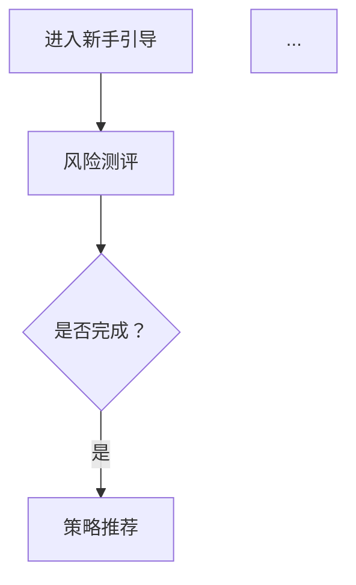

# 工具集成指南

**版本：** 1.0.0  
**最后更新：** 2026-03-26  
**适用：** 金融产品工作流 Skill

---

## 🎯 设计原则：工具可选，不绑定

**核心理念：**
- ✅ **有工具** → 调用 API，自动化创建
- ✅ **无工具** → 生成文档/Markdown，手动复制
- ✅ **广义搜索** → 使用 searxng/web_search 获取竞品信息

**为什么这样设计？**
1. 不是所有团队都用 Jira/Confluence
2. API 配置需要时间，不应成为使用门槛
3. AI 生成的文档/清单本身就有价值
4. 搜索竞品信息不需要 API，用公开数据即可

---

## 📊 工具配置 3 层降级

### Level 1（完整工具链）

**配置要求：**
- ✅ Jira API（Atlassian Cloud）
- ✅ Confluence API（Atlassian Cloud）
- ✅ 原型工具（墨刀/Axure/Figma）
- ✅ 数据工具（神策/GrowingIO）

**输出方式：**
```
AI 生成 → Claude Code 调用 API → 自动创建
输出：Jira Issue 链接 + Confluence 文档链接 + 原型链接
```

**适用场景：**
- 工具链完整的大中型团队
- 已配置 API Key
- 追求自动化效率

---

### Level 2（部分工具）

**配置要求：**
- ⚠️ Jira/Confluence 二选一
- ⚠️ 原型工具：无 API，手动创建
- ⚠️ 数据工具：手动导出

**输出方式：**
```
AI 生成 → Markdown 文档/文字描述 → 手动复制
输出：Markdown 文档 + mermaid 流程图 + 文字原型描述
```

**适用场景：**
- 部分工具已配置
- 部分工具无 API
- 接受部分手动操作

---

### Level 3（无工具，仅 AI）

**配置要求：**
- ❌ 无 Jira/Confluence API
- ❌ 无原型工具 API
- ❌ 无数据工具 API
- ✅ 仅需 AI（OpenClaw/Claude Code）

**输出方式：**
```
AI 生成 → Markdown 文档 + 待办清单 → 全部手动
输出：完整文档 + 待办清单 + 搜索竞品信息
```

**适用场景：**
- 初创团队/个人
- 工具链不完整
- 快速验证想法

---

## 🔧 工具配置方法

### Jira API 配置

**前提条件：**
- Atlassian Cloud 账号
- Jira Software Cloud 订阅
- API Token

**配置步骤：**
1. 登录 Atlassian：https://id.atlassian.com/manage-profile/security/api-tokens
2. 创建 API Token
3. 记录：`JIRA_SERVER`、`JIRA_EMAIL`、`API_TOKEN`

**环境变量：**
```bash
export JIRA_SERVER="https://your-company.atlassian.net"
export JIRA_EMAIL="your-email@company.com"
export JIRA_API_TOKEN="your-api-token"
```

**测试连接：**
```python
from jira import JIRA

jira = JIRA(
    server='https://your-company.atlassian.net',
    basic_auth=('your-email@company.com', 'your-api-token')
)

# 测试
projects = jira.projects()
print(f"✅ 连接成功！找到 {len(projects)} 个项目")
```

**降级检测：**
```python
def has_jira_api():
    try:
        jira.projects()
        return True
    except:
        return False
```

---

### Confluence API 配置

**前提条件：**
- Atlassian Cloud 账号
- Confluence Cloud 订阅
- API Token（与 Jira 相同）

**配置步骤：**
1. 登录 Atlassian：同上
2. 使用相同 API Token
3. 记录：`CONFLUENCE_SERVER`、`SPACE_KEY`

**环境变量：**
```bash
export CONFLUENCE_SERVER="https://your-company.atlassian.net/wiki"
export CONFLUENCE_SPACE="YOURSPACE"
export CONFLUENCE_API_TOKEN="your-api-token"
```

**测试连接：**
```python
from atlassian import Confluence

confluence = Confluence(
    url='https://your-company.atlassian.net/wiki',
    username='your-email@company.com',
    password='your-api-token'
)

# 测试
spaces = confluence.get_all_spaces()
print(f"✅ 连接成功！找到 {len(spaces)} 个空间")
```

---

### 原型工具配置

**墨刀（Modao）：**
- API 文档：https://modao.com/api
- 需要企业版
- 配置：`MODAO_API_KEY`

**Axure Cloud：**
- API 文档：https://www.axure.com/api
- 需要团队版
- 配置：`AXURE_API_KEY`

**Figma：**
- API 文档：https://www.figma.com/developers/api
- 免费可用
- 配置：`FIGMA_API_KEY`

**降级方案：**
```
无 API → 输出文字原型描述 + mermaid 流程图
用户手动在墨刀/Axure/Figma 中创建
```

---

### 数据工具配置

**神策数据（Sensors Data）：**
- API 文档：https://www.sensorsdata.cn/api/
- 需要企业版
- 配置：`SENZE_API_URL`、`SENZE_API_KEY`

**GrowingIO：**
- API 文档：https://docs.growingio.com/
- 需要企业版
- 配置：`GIO_API_KEY`

**降级方案：**
```
无 API → 输出数据埋点设计文档
用户手动在数据工具中配置事件
```

---

## 📐 降级输出示例

### 场景 1：Jira Issue 创建

**Level 1（有 API）：**
```
✅ 已创建 Jira Issue: PROD-123
链接：https://your-company.atlassian.net/browse/PROD-123
```

**Level 3（无 API）：**
```markdown
📋 待创建 Jira Issue

**项目：** PROD
**标题：** [新手引导] 设计新手任务体系
**类型：** Story
**优先级：** High
**描述：**
作为产品经理，
我希望设计新手任务体系，
以便提升首购转化率从 12% 到 18%。

**验收标准：**
- [ ] 新手任务≤5 个
- [ ] 每个任务有奖励
- [ ] 进度可视化
- [ ] 提醒机制

**操作：** 请手动在 Jira 中创建上述 Issue
```

---

### 场景 2：Confluence 文档创建

**Level 1（有 API）：**
```
✅ 已创建 Confluence 页面：PRD-新手引导功能
链接：https://your-company.atlassian.net/wiki/spaces/PROD/pages/123
```

**Level 3（无 API）：**
```markdown
# PRD 文档：新手引导功能

## 1. 产品背景
[为什么做这个功能]

## 2. 产品目标
[达到什么效果]

## 3. 功能说明
[详细功能描述]

## 4. 流程图


## 5. 原型描述
[详细页面布局描述]

**操作：** 请手动在 Confluence/飞书文档 中创建上述 PRD
```

---

### 场景 3：原型设计

**Level 1（有 API）：**
```
✅ 已生成墨刀原型：新手引导流程
链接：https://modao.com/proto/xxxxx
```

**Level 3（无 API）：**
```markdown
# 原型描述：新手引导流程

## 页面 1：欢迎页
**布局：**
- 顶部：产品 Logo
- 中部：欢迎文案（"欢迎使用 XX 投顾"）
- 底部："开始"按钮

**交互：**
- 点击"开始"→ 进入页面 2（风险测评）

## 页面 2：风险测评
**布局：**
- 顶部：进度条（1/5）
- 中部：测评题目（8 题）
- 底部："下一步"按钮

**交互：**
- 选择答案→ 自动下一题
- 完成 8 题→ 进入页面 3

...（共 5 个页面）

**操作：** 请手动在墨刀/Axure/Figma 中创建上述原型
```

---

### 场景 4：竞品信息搜索

**Level 1/2/3（通用，使用 searxng）：**
```markdown
# 竞品分析：基金投顾产品

## 竞品信息（来自公开数据）

### 竞品 1：XX 基金投顾
- 签约规模：约 100 亿（来源：XX 证券研报）
- 策略数量：10 个
- 用户评价：4.5 星（来源：蚂蚁财富）
- 优势：策略丰富，费率低
- 劣势：起投金额高（1000 元）

### 竞品 2：XX 财富投顾
- 签约规模：约 80 亿（来源：XX 财经）
- 策略数量：8 个
- 用户评价：4.3 星
- 优势：起投金额低（100 元）
- 劣势：策略单一

**搜索来源：**
- 七麦数据
- 蝉大师
- 券商研报
- 公开新闻报道
```

---

## 🛠️ 工具集成脚本（可选）

**脚本位置：** `scripts/` 目录

### 脚本 1：Jira Issue 创建（含降级）

```python
#!/usr/bin/env python3
"""
Jira Issue 创建脚本（含降级）
用法：python jira-create-issue.py "标题" "描述"
"""

import os
import sys
from jira import JIRA

def create_issue_with_fallback(summary, description):
    """创建 Jira Issue，失败则输出 Markdown"""
    
    # 检测是否有 API 配置
    jira_server = os.getenv('JIRA_SERVER')
    jira_email = os.getenv('JIRA_EMAIL')
    jira_token = os.getenv('JIRA_API_TOKEN')
    
    if not all([jira_server, jira_email, jira_token]):
        # Level 3：降级输出 Markdown
        return f"""
📋 待创建 Jira Issue

**项目：** PROD
**标题：** {summary}
**类型：** Story
**优先级：** High
**描述：**
{description}

**操作：** 请手动在 Jira 中创建上述 Issue
"""
    
    try:
        # Level 1：调用 API
        jira = JIRA(
            server=jira_server,
            basic_auth=(jira_email, jira_token)
        )
        
        issue = jira.create_issue(
            project={'key': 'PROD'},
            summary=summary,
            description=description,
            issuetype={'name': 'Story'}
        )
        
        return f"✅ 已创建 Jira Issue: {issue.key}\n链接：{jira_server}/browse/{issue.key}"
    
    except Exception as e:
        # Level 3：降级输出 Markdown
        return f"""
⚠️ Jira API 调用失败：{e}

📋 待创建 Jira Issue（手动创建）

**项目：** PROD
**标题：** {summary}
**描述：** {description}

**操作：** 请手动在 Jira 中创建上述 Issue
"""

if __name__ == '__main__':
    if len(sys.argv) < 3:
        print("用法：python jira-create-issue.py \"标题\" \"描述\"")
        sys.exit(1)
    
    summary = sys.argv[1]
    description = sys.argv[2]
    
    result = create_issue_with_fallback(summary, description)
    print(result)
```

---

### 脚本 2：Confluence 文档创建（含降级）

```python
#!/usr/bin/env python3
"""
Confluence 文档创建脚本（含降级）
用法：python confluence-create-page.py "标题" "内容"
"""

import os
import sys
from atlassian import Confluence

def create_page_with_fallback(title, body):
    """创建 Confluence 页面，失败则输出 Markdown"""
    
    # 检测是否有 API 配置
    confluence_server = os.getenv('CONFLUENCE_SERVER')
    confluence_token = os.getenv('CONFLUENCE_API_TOKEN')
    confluence_space = os.getenv('CONFLUENCE_SPACE')
    
    if not all([confluence_server, confluence_token, confluence_space]):
        # Level 3：降级输出 Markdown
        return f"""
# {title}

{body}

**操作：** 请手动在 Confluence/飞书文档 中创建上述文档
"""
    
    try:
        # Level 1：调用 API
        confluence = Confluence(
            url=confluence_server,
            username='api',
            password=confluence_token
        )
        
        page = confluence.create_page(
            space=confluence_space,
            title=title,
            body=body
        )
        
        return f"✅ 已创建 Confluence 页面：{title}\n链接：{confluence_server}/pages/viewpage.action?pageId={page['id']}"
    
    except Exception as e:
        # Level 3：降级输出 Markdown
        return f"""
⚠️ Confluence API 调用失败：{e}

# {title}

{body}

**操作：** 请手动在 Confluence/飞书文档 中创建上述文档
"""

if __name__ == '__main__':
    if len(sys.argv) < 3:
        print("用法：python confluence-create-page.py \"标题\" \"内容\"")
        sys.exit(1)
    
    title = sys.argv[1]
    body = sys.argv[2]
    
    result = create_page_with_fallback(title, body)
    print(result)
```

---

## ❓ 常见问题

### Q1：我没有 Jira/Confluence，能用这个 Skill 吗？

**A：** 可以！Skill 支持降级使用。

- **无工具** → 输出 Markdown 文档 + 待办清单
- **手动创建** → 在飞书文档/腾讯文档中创建
- **效果一样** → AI 生成的内容本身就有价值

---

### Q2：API 配置复杂吗？需要多久？

**A：** 约 10-30 分钟。

1. 申请 API Token：5 分钟
2. 配置环境变量：5 分钟
3. 测试连接：5 分钟
4. 首次使用：15 分钟

**建议：** 先用 Level 3（无工具），熟悉后再配置 API。

---

### Q3：竞品数据从哪里来？准确吗？

**A：** 来自公开数据。

- **来源：** 七麦数据/蝉大师/券商研报/公开新闻
- **工具：** searxng/web_search（不需要 API）
- **准确性：** 标注来源，供参考

---

### Q4：如何知道当前是 Level 几？

**A：** 提示词中会自动检测。

```markdown
【工具配置检测】
- Jira API：✅ 已配置
- Confluence API：❌ 未配置
- 原型工具：❌ 未配置
- 数据工具：❌ 未配置

→ 当前等级：Level 2（部分工具）
→ 输出方式：Jira Issue 自动创建，其他输出 Markdown
```

---

*参考资料：Atlassian API 文档/神策 API 文档/Figma API 文档*
