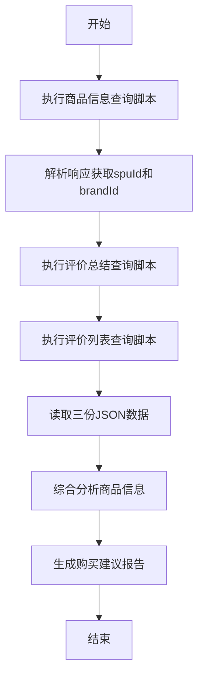

# 商品咨询 Skill

## 基本信息

- **名称**: vipshop-product-consultant
- **描述**: 通过调用唯品会API查询商品信息、评价总结和评价列表，对商品进行综合分析并给出购买建议。


## 使用方法

```
/product-consult [product_id]
```

参数说明：
- `product_id`（可选）：商品ID，默认使用示例商品ID `6920078387106353303`

## 执行流程



## 执行步骤

### 步骤1：查询商品信息

执行Python脚本查询商品基本信息：

```bash
python query_product_info.py {product_id}
```

从返回结果中提取：
- `spuId`：商品SPU ID
- `brandId`：品牌ID
- 商品名称、价格、折扣等基本信息

### 步骤2：查询评价总结

使用步骤1获取的spuId查询评价总结：

```bash
python query_review_summary.py {spu_id}
```

获取评价统计信息：
- 满意度
- 热门关键词标签
- 尺码感受统计

### 步骤3：查询评价列表

使用spuId和brandId查询具体评价：

```bash
python query_review_list.py {spu_id} {brand_id}
```

获取用户真实评价内容：
- 评价内容
- 用户评分
- 购买规格
- 评价图片

### 步骤4：综合分析

基于获取的三份数据（product_info.json、review_summary.json、review_list.json），进行综合分析：

1. **价格分析**：对比市场价与特卖价，计算优惠力度
2. **口碑分析**：分析满意度、热门评价标签、回头客数量
3. **尺码建议**：根据尺码感受统计给出尺码选择建议
4. **真实评价精选**：挑选有代表性的用户评价
5. **购买建议**：综合以上分析给出推荐指数和购买建议

## 输出格式

### 商品基本信息

| 项目 | 内容 |
|------|------|
| 商品名称 | {productName} |
| 品牌 | {brandName} |
| 特卖价 | ¥{salePrice} |
| 市场价 | ¥{marketPrice} |
| 折扣 | {discount} |

### 口碑分析

- 满意度：{satisfaction}%
- 评价总数：{totalCount}
- 热门标签：{topKeywords}
- 回头客：{repeatCustomer}人

### 尺码建议

根据用户反馈统计：
- 合适：{fitCount}人（{fitPercent}%）
- 偏大：{largeCount}人（{largePercent}%）
- 偏小：{smallCount}人（{smallPercent}%）

### 购买建议

综合评分：⭐⭐⭐⭐⭐（推荐指数）

推荐理由：
1. {reason1}
2. {reason2}
3. {reason3}

注意事项：
- {note1}
- {note2}

## 技术说明

- 所有接口均采用HTTP直接调用（非浏览器方式）
- 接口响应格式为JSONP，需去除callback包装后解析JSON
- 兼容API返回code=0或code=1的状态码
- 评价列表接口的data字段可能是list或dict，需兼容处理
