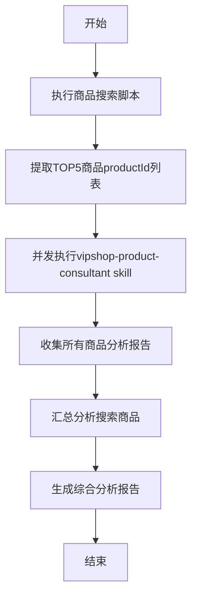

# 商品搜索 Skill

## 基本信息

- **名称**: vipshop-product-search
- **描述**: 当用户有服饰、美妆、母婴等商品搜索诉求时，调用此技能帮助用户搜索商品

## 依赖

- **嵌套Skill**: vipshop-product-consultant（商品咨询助手）
- 直接调用该skill的三个Python脚本进行商品分析

## 使用方法

```
/product-search [keyword]
```

参数说明：
- `keyword`（必填）：搜索关键词，如"nike"、"羽绒服"等

## 执行流程



## 执行步骤

### 步骤1：搜索商品

执行Python脚本搜索商品：

```bash
python query_search_products.py {keyword}
```

从返回结果中提取：
- `productIds`：搜索结果商品ID列表（取TOP5）
- 搜索商品基本信息（名称、品牌、价格等）

### 步骤2：并发执行vipshop-product-consultant skill

对于TOP5搜索结果，同时并发嵌套执行vipshop-product-consultant skill，提升分析效率

### 步骤3：汇总分析

基于所有搜索商品的分析结果，进行综合分析：

1. **价格分析**：计算价格区间、平均价格
2. **口碑分析**：计算平均满意度、对比评价关键词
3. **推荐排序**：按性价比、口碑等维度排序
4. **最优推荐**：给出最具性价比和最佳口碑的推荐

## 输出格式

### 搜索商品概览

| 序号 | 商品名称 | 品牌 | 价格 | 折扣 | 满意度 | 推荐指数 |
|------|----------|------|------|------|--------|----------|
| 1 | {name} | {brand} | ¥{price} | {discount} | {satisfaction}% | ⭐⭐⭐⭐⭐ |

### 综合分析

- 搜索关键词：{keyword}
- 价格区间：¥{minPrice} - ¥{maxPrice}
- 平均价格：¥{avgPrice}
- 平均满意度：{avgSatisfaction}%

### 最优推荐

**最具性价比**
- 商品：{bestValue.title}
- 价格：¥{bestValue.price}
- 满意度：{bestValue.satisfaction}%

**最佳口碑**
- 商品：{bestQuality.title}
- 价格：¥{bestQuality.price}
- 满意度：{bestQuality.satisfaction}%

### 购买建议

根据分析结果，为您推荐以下商品：
1. {recommend1}
2. {recommend2}
3. {recommend3}

## 技术说明

- 搜索接口采用HTTP直接调用（非浏览器方式）
- **并发嵌套执行vipshop-product-consultant skill**：同时调用多个商品咨询脚本，提升分析效率
- 接口响应格式为JSONP，需去除callback包装后解析JSON
- 商品ID从products数组的pid字段获取
- 最大并发数默认为5，可根据需要调整
