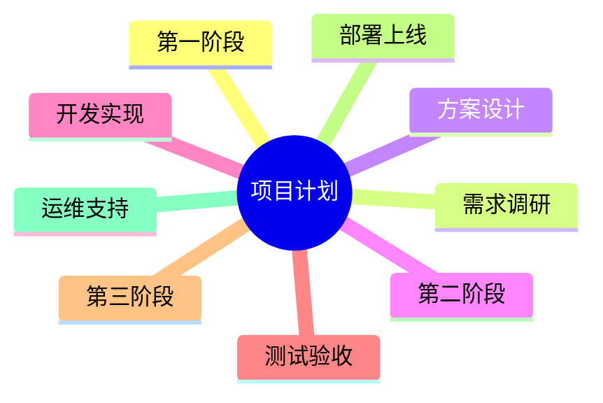

# 🧠 项目计划

```mermaid
mindmap
  root((项目计划))
      第一阶段
      需求调研
      方案设计
      第二阶段
      开发实现
      测试验收
      第三阶段
      部署上线
      运维支持
```

---

## 📋 详细内容

## 1. 第一阶段

## 2. 需求调研

## 3. 方案设计

## 4. 第二阶段

## 5. 开发实现

## 6. 测试验收

## 7. 第三阶段

## 8. 部署上线

## 9. 运维支持
