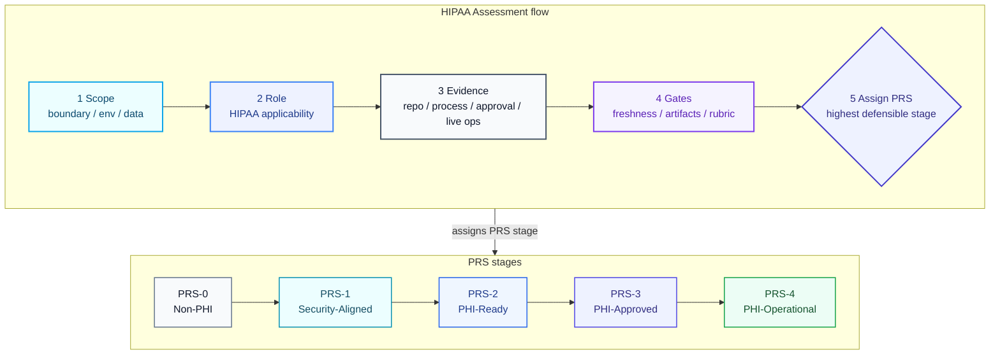

# PHI Readiness Stages (PRS)

PHI Readiness Stages (PRS) is a HIPAA-informed workload status framework for software systems that may handle protected health information.

Canonical citation: `PHI Readiness Stages (PRS) Framework v1.1`.

This repository is primarily an agent skill package and no-code assessment framework for Codex, Claude Code, OpenClaw, and human reviewers who need to assess the current PRS stage of a system, identify blocking gaps, and recommend the next actions without overstating legal status.

## At a glance

## What PRS is

PRS is a practical workload-stage model that separates:

- technical safeguards
- organizational and process readiness
- formal approval to use real PHI
- live operational maintenance

PRS is informed by the HIPAA Security Rule and related HHS/OCR guidance. It is not a certification, a legal opinion, or a substitute for counsel or formal compliance review.

## Stage set

| Stage | Name | Frozen public label |
| --- | --- | --- |
| PRS-0 | Non-PHI | PRS-0 Non-PHI - out of PHI scope |
| PRS-1 | Security-Aligned | PRS-1 Security-Aligned - not approved for PHI |
| PRS-2 | PHI-Ready | PRS-2 PHI-Ready - pending internal approval |
| PRS-3 | PHI-Approved | PRS-3 PHI-Approved - internally approved for PHI use in defined scope |
| PRS-4 | PHI-Operational | PRS-4 PHI-Operational - operating with PHI under ongoing controls |

## Non-negotiable rules

- Assign PRS per workload, environment, and deployment boundary, not per company.
- A stage cannot exceed the lowest unsatisfied required domain for that stage.
- Missing evidence is a blocker.
- Repo-only review cannot justify PRS-3 or PRS-4.
- Approval and operations must be evidenced outside the codebase.
- Do not use `HIPAA compliant`, `HIPAA certified`, or `HIPAA secure` as stage labels.

## Repository layout

- `framework/`: canonical framework, rubric, role matrix, freshness policy, artifact matrix, boundary rules, evidence policy, assessment rules, output contract
- `skills/phi-readiness-review/`: single agent entrypoint plus scenario references for health apps, APIs, mobile, wearables, and communications
- `controls/`: domain-specific review rules and evidence expectations
- `checklists/`: stage-transition checklists
- `mappings/`: companion references to HIPAA Security Rule, NIST SP 800-66 Rev. 2, recognized security practices, and the 2024 NPRM tracker
- `references/`: official source registry, current baseline summary, and public-language rules

## How agents should use this repo

1. Read `AGENTS.md`.
2. Immediately load `skills/phi-readiness-review/SKILL.md` as the canonical workflow.
3. Verify the official sources in `references/source-registry.md` live before making legal or regulatory statements.
4. Follow `framework/assessment-rules.md`, `framework/applicability-role-matrix.md`, and `framework/regulatory-boundaries.md`.
5. Apply `framework/stage-rubric.md`, `framework/evidence-levels.md`, `framework/evidence-freshness.md`, and `framework/minimum-artifact-matrix.md`.
6. Load the scenario references under `skills/phi-readiness-review/references/` when the workload involves health apps, provider APIs, customer-hosted products, mobile devices, wearables, or outbound communications.
7. Use `controls/shared-responsibility.md` whenever the workload inherits controls.
8. Output results in the format required by `framework/output-contract.md`.

## Install as a skill

### Claude Code

Clone the published repository into your Claude skills directory at `~/.claude/skills/phi-readiness-stages`, then use `/phi-readiness-stages` in Claude Code.

Claude will discover the root `SKILL.md` as the repository's canonical skill entrypoint. Then load `skills/phi-readiness-review/SKILL.md` as the canonical workflow.

### Codex

Copy or clone the published repository into your Codex skills directory at `~/.codex/skills/phi-readiness-stages`.

Codex can then use the root `SKILL.md` as the skill entrypoint, with `AGENTS.md` and the referenced framework files providing the full review flow.
Codex should then immediately load `skills/phi-readiness-review/SKILL.md` as the canonical workflow.

### OpenClaw / ClawHub

The repository root is also structured as a publishable OpenClaw skill bundle.

ClawHub-compatible publishing can use the root `SKILL.md` plus the supporting framework files directly, while `.clawhubignore` excludes repo-local files that are not part of the published skill.

### Repo context mode

If you do not want to install it as a skill, you can also add the repository itself as context and start from `AGENTS.md`.

## Current legal baseline

The canonical dated baseline summary lives in `references/current-baseline.md`.

Agents should verify current official sources live from `references/source-registry.md` instead of relying on README summaries.

## Limitations

This repository is designed to support a conservative, evidence-driven PRS assessment. It does not:

- replace legal counsel or formal compliance review
- determine full HIPAA Privacy Rule compliance
- determine whether a specific incident is a reportable breach
- resolve state-law, FTC, or other non-HIPAA obligations
- guarantee that a repo-only assessment can establish anything beyond early-stage readiness

These limits are intentional and are also enforced in `AGENTS.md`, `framework/regulatory-boundaries.md`, `framework/spec.md`, and `framework/output-contract.md`.
