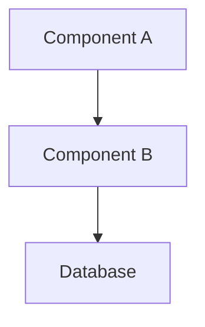

# [Feature Name] Design Brief
# Aegis ID: AEGIS-{project}-{seq}

## Problem Statement
<!-- What problem does this solve? Why now? (1-3 sentences) -->

## Architecture Overview
<!-- Mermaid or ASCII diagram. A newcomer should be able to sketch the system after reading this. -->

## Key Design Decisions

| Decision | Choice | Rationale | Alternatives Considered |
|----------|--------|-----------|------------------------|
| | | | |

## Module Boundaries

### Module A
- **Responsibility:**
- **Exposed Interface:**
- **Dependencies:**

### Module B
- **Responsibility:**
- **Exposed Interface:**
- **Dependencies:**

**Communication Rules:** Modules communicate only through defined interfaces.

## API Surface (Summary)
<!-- Key endpoints — detailed definitions go in contracts/ -->

- `POST /api/xxx` — Description, input/output summary
- `GET /api/yyy` — Description, input/output summary

## Known Gaps & Open Questions

- [ ] **[blocking]** Gap 1: Description + impact
- [ ] **[non-blocking]** Gap 2: Description + impact

## Debugging Guide

- **Logs:** Location, key log keywords
- **State inspection:** How to check system state
- **Common failures:** Failure mode → diagnosis path

## Testing Strategy

- **Unit tests:** What to cover
- **Contract tests:** Which APIs
- **Integration tests:** Which flows
- **E2E tests:** Which scenarios
