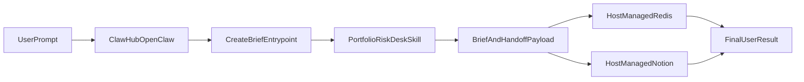

# Portfolio Risk Desk

`Portfolio Risk Desk` is a production-ready skill package for generating portfolio-aware public-markets briefs. It gathers evidence, maps exposures, explains what changed, stress-tests scenarios, and returns a concise brief with traceable sources and explicit uncertainty notes.

This repo is the skill layer. It owns the analysis pipeline and the handoff contract. OpenClaw or ClawHub should own the outer runtime, including Redis-backed memory, Notion writes, auth boundaries, and secret management.

## What This Skill Does

The skill accepts a portfolio, watchlist, themes, and optional scenario questions, then produces:

- a user focus snapshot
- a current exposure map
- dominant factors
- what changed since the last brief
- key drivers and cross-holding read-throughs
- scenario analysis with confidence levels
- signal-vs-noise analysis
- watchpoints
- evidence and source traceability
- audit metadata and delivery handoff payloads

It is designed for public-markets analysis, not trade execution.

## Architecture Boundary

### What this repo owns

- contract validation
- retrieval adapters and fixture-backed validation flows
- evidence normalization
- ranking and continuity scoring
- exposure mapping and read-through logic
- scenario generation
- brief synthesis and rendering
- delivery handoff payload shaping
- local development fallbacks such as file-backed memory

### What OpenClaw or ClawHub should own

- prompt routing into the skill
- host-managed Redis memory recall and memory store
- host-managed Notion persistence
- auth and workspace boundaries
- provider secret management
- first-run Apify task bootstrap for the user's account

The intended production flow is:



## Current Feature Set

The current `1.0.0` skill package includes:

- contract-valid `create_brief` generation
- structured markdown and JSON output
- fixture-backed and live-provider retrieval paths
- automatic Apify task bootstrap from `APIFY_API_TOKEN`, with manual task-ID fallback
- comparison-aware ranking and delta reporting
- workspace-scoped saved profiles
- local development fallback for repeated-run memory
- host-oriented Notion handoff payload generation
- graceful degradation when retrieval or delivery weakens
- demo modes for happy path, provider failure, and delivery failure
- benchmark coverage for source quality, factor relevance, scenario coherence, signal-vs-noise quality, and delta usefulness

## Package Surfaces

These names refer to the same skill in different contexts:

- product name: `Portfolio Risk Desk`
- package name: `intelligence-desk-brief`
- import path: `intelligence_desk_brief`
- CLI: `portfolio-risk-desk`

## Key Files

- `intelligence_desk_brief_SKILL.md`: skill definition, usage guidance, and guardrails
- `intelligence_desk_brief_tool_contract.json`: machine-readable entrypoints and schemas
- `src/intelligence_desk_brief/`: runtime implementation
- `tests/`: regression coverage for the shipped skill
- `intelligence_desk_brief_output_template.md`: expected brief shape
- `docs/OPENCLAW_SKILL_ARCHITECTURE.md`: maintainer-facing host integration notes

## Local Validation

Bootstrap the user's Apify tasks:

```bash
APIFY_API_TOKEN=... python3 -m intelligence_desk_brief bootstrap-apify
```

This creates or updates the two saved Apify tasks the skill expects. If a host cannot run the bootstrap step automatically, advanced users can still set `APIFY_TASK_ID` and `APIFY_X_TASK_ID` manually.

Run the core local brief flow:

```bash
PYTHONPATH=src python3 -m intelligence_desk_brief create-brief --fixture --as-of-date 2026-03-25 --output-format both
```

Run the host-handoff rehearsal flows:

```bash
PYTHONPATH=src python3 -m intelligence_desk_brief run-demo --mode happy --output-format both
PYTHONPATH=src python3 -m intelligence_desk_brief run-demo --mode provider_failure --output-format json
PYTHONPATH=src python3 -m intelligence_desk_brief run-demo --mode delivery_failure --output-format json
```

Run the benchmark harness:

```bash
PYTHONPATH=src python3 -m intelligence_desk_brief run-benchmarks --output-format both
```

## Notes For Host Integration

This package intentionally does not ship a direct Redis client or a direct Notion API client as part of the production architecture. Instead, it emits the analysis artifact and handoff payloads that OpenClaw or ClawHub should consume to perform memory and persistence operations on the user's behalf.
