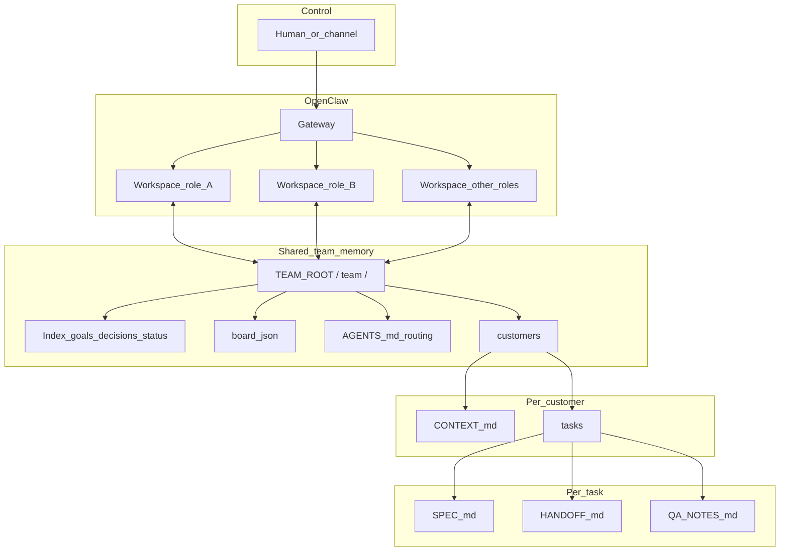

# Dev team (OpenClaw)

## Introduction

### What this skill is

**`dev_team`** is an **OpenClaw skill guide** (plain text: Markdown plus JSON schema notes). It helps you run a **multi-role dev or agency “team”** of **specialized AI agents**: instead of mixing everything in one generic chat, you get **clear roles**, **shared project memory** on disk, and **traceable handoffs** between agents.

The skill **does not install binaries** and **does not create secrets**. It describes **folder layout**, **workflow**, and **prompt snippets** — you or OpenClaw create the files (see [OPENCLAW_TEAM_SETUP_GUIDE.md](references/OPENCLAW_TEAM_SETUP_GUIDE.md)).

### What you can do with it

- **Separate roles** (e.g. Lead, PM, Dev, QA, Security): each OpenClaw agent with its own workspace, persona, and scope.
- **Manage customers / clients cleanly**: `TEAM_ROOT/team/customers/<customer>/CONTEXT.md` (repos, Shopware staging, rules).
- **Bundle work into tasks**: under `…/tasks/<task_id>/` e.g. `SPEC.md` → `HANDOFF.md` → `QA_NOTES.md` — the next agent knows where to continue.
- **Keep many customers visible**: portfolio index `board.json` + short human index `PROJECT_STATUS.md` (details stay in task folders).
- **Record routing** — who plays which role on which channel — in `TEAM_ROOT/team/AGENTS.md` — **without** mandating a specific messenger (Telegram, Discord, …).
- **Automate onboarding with OpenClaw**: copy-paste **master prompt** and variable list in the setup guide.

### How this SKILL.md is structured

| Part | Content |
|------|---------|
| **This introduction** | Overview, capabilities, diagram |
| [**Original use case (reference)**](#original-use-case-reference) | From the community — **example story**, not “you must build it this way” |
| [**Dev-team extensions**](#dev-team-extensions) | Concrete rules: `TEAM_ROOT`, handoffs, Shopware notes, `board.json` |
| **`references/`** | Deep dives: setup, layout, role templates, board schema — linked from here |

A larger **structure map** (ASCII boxes + more Mermaid): [ORG_CHART_EXAMPLE.md](references/ORG_CHART_EXAMPLE.md).

### Data flow: you, agents, shared `team/`

In the diagram: **control** → **OpenClaw** (multiple workspaces) ↔ **one shared directory** `TEAM_ROOT/team/` → **customers** → **tasks**.



**Remember:** each agent has its **own OpenClaw workspace** (incl. `SOUL.md`, `AGENTS.md`). Everything **shared for the team** lives under **`TEAM_ROOT/team/`** — in handoffs, prefer **absolute paths** there.

### Quick start

1. **[OPENCLAW_TEAM_SETUP_GUIDE.md](references/OPENCLAW_TEAM_SETUP_GUIDE.md)** — master prompt, Mode A/B (one vs. multiple agents), variables.
2. **[SKILL-SETUP.md](references/SKILL-SETUP.md)** — exact folder tree under `team/`.
3. **[ROLE_TEMPLATES.md](references/ROLE_TEMPLATES.md)** — boilerplate per role.

The **reference block below** comes from [awesome-openclaw-usecases — multi-agent-team.md](https://github.com/hesamsheikh/awesome-openclaw-usecases/blob/main/usecases/multi-agent-team.md): **Telegram/VPS** there are *examples*, not requirements for this skill — see [LICENSE.md](LICENSE.md).

---

## Original use case (reference)

*Example stack from the community — not a mandatory blueprint for `dev_team`.*

# Multi-Agent Specialized Team (Solo Founder Setup)

Solo founders wear every hat — strategy, development, marketing, sales, operations. Context-switching between these roles destroys deep work. Hiring is expensive and slow. What if you could spin up a small, specialized team of AI agents, each with a distinct role and personality, all controllable from a single chat interface?

This use case sets up multiple OpenClaw agents as a coordinated team, each specialized in a domain, communicating through shared memory and reachable through **a control surface you choose** (the historic write-up used **Telegram**; others use Discord, WhatsApp, or **only** the IDE/gateway with `sessions_spawn` / `sessions_send`).

## Pain Point

- **One agent can't do everything well**: A single agent's context window fills up fast when juggling strategy, code, marketing research, and business analysis
- **No specialization**: Generic prompts produce generic outputs — a coding agent shouldn't also be crafting marketing copy
- **Solo founder burnout**: You need a team, not another tool to manage. The agents should work in the background and surface results, not require constant babysitting
- **Knowledge silos**: Insights from marketing research don't automatically inform dev priorities unless you manually bridge them

## What It Does

- **Specialized agents**: Each agent has a distinct role, personality, and model optimized for its domain
- **Shared memory**: Project docs, goals, and key decisions are accessible to all agents — nothing gets lost
- **Private context**: Each agent also maintains its own conversation history and domain-specific notes
- **Single control plane (one pattern, optional)**: In the original story, one **group chat** with @-tags reached every agent; you might instead use **one OpenClaw agent / one thread** (Mode A), **separate channels per agent**, or **no messenger at all** — see [OPENCLAW_TEAM_SETUP_GUIDE.md](references/OPENCLAW_TEAM_SETUP_GUIDE.md)
- **Scheduled daily tasks**: Agents proactively work without being asked — content prompts, competitor monitoring, metric tracking
- **Parallel execution**: Multiple agents can work on independent tasks simultaneously

## Example Team Configuration

**Channel lines in the snippets** (`Channel: Telegram …`) copy the **original demo**. Substitute your real channel(s) and @-handles in **`TEAM_ROOT/team/AGENTS.md`** — do not read them as “you must install Telegram.”

### Agent 1: Milo (Strategy Lead)

```text
## SOUL.md — Milo

You are Milo, the team lead. Confident, big-picture, charismatic.

Responsibilities:
- Strategic planning and prioritization
- Coordinating the other agents
- Weekly goal setting and OKR tracking
- Synthesizing insights from all agents into actionable decisions

Model: Claude Opus
Channel: Telegram (responds to @milo)

Daily tasks:
- 8:00 AM: Review overnight agent activity, post morning standup summary
- 6:00 PM: End-of-day recap with progress toward weekly goals
```

### Agent 2: Josh (Business & Growth)

```text
## SOUL.md — Josh

You are Josh, the business analyst. Pragmatic, straight to the point, numbers-driven.

Responsibilities:
- Pricing strategy and competitive analysis
- Growth metrics and KPI tracking
- Revenue modeling and unit economics
- Customer feedback analysis

Model: Claude Sonnet (fast, analytical)
Channel: Telegram (responds to @josh)

Daily tasks:
- 9:00 AM: Pull and summarize key metrics
- Track competitor pricing changes weekly
```

### Agent 3: Marketing Agent

```text
## SOUL.md — Marketing Agent

You are the marketing researcher. Creative, curious, trend-aware.

Responsibilities:
- Content ideation and drafting
- Competitor social media monitoring
- Reddit/HN/X trend tracking for relevant topics
- SEO keyword research

Model: Gemini (strong at web research and long-context analysis)
Channel: Telegram (responds to @marketing)

Daily tasks:
- 10:00 AM: Surface 3 content ideas based on trending topics
- Monitor competitor Reddit/X mentions daily
- Weekly content calendar draft
```

### Agent 4: Dev Agent

```text
## SOUL.md — Dev Agent

You are the dev agent. Precise, thorough, security-conscious.

Responsibilities:
- Coding and architecture decisions
- Code review and quality checks
- Bug investigation and fixing
- Technical documentation

Model: Claude Opus / Codex (for implementation)
Channel: Telegram (responds to @dev)

Daily tasks:
- Check CI/CD pipeline health
- Review open PRs
- Flag technical debt items
```

## Typical building blocks (all optional — pick what matches your host)

Nothing here is **mandatory** for adopting the **`TEAM_ROOT/team/`** layout in **Dev-team extensions**. The list below is “things people often combine,” not a checklist you must complete.

- **Control / chat (optional):** A channel skill (e.g. Telegram/Discord/WhatsApp) **if** you want group/mobile routing **or** rely on **OpenClaw/IDE only** without a messenger.
- **Multi-agent coordination (when you run multiple agents):** e.g. `sessions_spawn` / `sessions_send` — *if* your setup uses them; single-agent workflows do not need this.
- **Team memory for this skill:** A **shared directory** (`TEAM_ROOT/team/`), not a specific third-party notes app.
- **API keys / models:** Only whatever your gateway already uses; **mixed providers** may mean multiple keys — that is a **host** concern, not prescribed here.
- **Always-on hardware:** A **VPS** is one way to keep a gateway reachable 24/7; many setups use a **desktop/laptop**, **hosted** OpenClaw, or no dedicated VPS — whatever you already run.

## How to Set It Up

### 1. Shared Memory Structure

```text
team/
├── GOALS.md           # Current OKRs and priorities (all agents read)
├── DECISIONS.md       # Key decisions log (append-only)
├── PROJECT_STATUS.md  # Current project state (updated by all)
├── agents/
│   ├── milo/          # Milo's private context and notes
│   ├── josh/          # Josh's private context
│   ├── marketing/     # Marketing agent's research
│   └── dev/           # Dev agent's technical notes
```

### 2. Routing example (Telegram — illustrative only)

The upstream example used **one Telegram group** and @-tags. **Your** routing belongs in **`TEAM_ROOT/team/AGENTS.md`** for whatever channel(s) you actually use. The block below shows the **same idea** (tag → agent) transposed to Telegram:

```text
## AGENTS.md — Telegram Routing

Telegram group: "Team"

Routing:
- @milo → Strategy agent (spawns/resumes milo session)
- @josh → Business agent (spawns/resumes josh session)
- @marketing → Marketing agent (spawns/resumes marketing session)
- @dev → Dev agent (spawns/resumes dev session)
- @all → Broadcast to all agents
- No tag → Milo (team lead) handles by default

Each agent:
1. Reads shared GOALS.md and PROJECT_STATUS.md for context
2. Reads its own private notes
3. Processes the message
4. Responds in Telegram
5. Updates shared files if the response involves a decision or status change
```

### 3. Scheduled Tasks

```text
## HEARTBEAT.md — Team Schedule

Daily:
- 8:00 AM: Milo posts morning standup (aggregates overnight agent activity)
- 9:00 AM: Josh pulls key metrics
- 10:00 AM: Marketing surfaces content ideas from trending topics
- 6:00 PM: Milo posts end-of-day recap

Ongoing:
- Dev: Monitor CI/CD health, review PRs as they come in
- Marketing: Reddit/X keyword monitoring (every 2 hours)
- Josh: Competitor pricing checks (weekly)

Weekly:
- Monday: Milo drafts weekly priorities (input from all agents)
- Friday: Josh compiles weekly metrics report
```

## Key Insights

- **Personality matters more than you'd think**: Giving agents distinct names and communication styles makes it natural to "talk to your team" rather than wrestle with a generic AI
- **Shared memory + private context**: The combination is critical — agents need common ground (goals, decisions) but also their own space to accumulate domain expertise
- **Right model for the right job**: Don't use an expensive reasoning model for keyword monitoring. Match model capability to task complexity
- **Scheduled tasks are the flywheel**: The real value emerges when agents proactively surface insights, not just when you ask
- **Start with 2, not 4**: Begin with a lead + one specialist, then add agents as you identify bottlenecks

## Inspired By

This pattern was described by [Trebuh on X](https://x.com/iamtrebuh/status/2011260468975771862), a solo founder who set up 4 OpenClaw agents — Milo (strategy lead), Josh (business), a marketing agent, and a dev agent — all controlled through a single Telegram chat on a VPS. Each agent has its own personality, model, and scheduled tasks, while sharing project memory. He described it as "a real small team available 24/7."

The pattern was also confirmed on the [OpenClaw Showcase](https://openclaw.ai/showcase), where `@jdrhyne` reported running "15+ agents, 3 machines, 1 Discord server — IT built most of this, just by chatting," and `@nateliason` described a multi-model pipeline (prototype → summarize → optimize → implement → repeat) using different models at each stage. Another user, `@danpeguine`, runs two different OpenClaw instances collaborating in the same WhatsApp group.

## Related Links

- [OpenClaw Subagent Documentation](https://github.com/openclaw/openclaw)
- [OpenClaw docs / channels](https://github.com/openclaw/openclaw) (Telegram is one possible channel, not a dependency of this skill)
- [OpenClaw Showcase](https://openclaw.ai/showcase)
- [Anthropic: Building Effective Agents](https://www.anthropic.com/research/building-effective-agents)

---

## Dev-team extensions

**Agency, Shopware, and customer tasks:** Use this section together with the **reference use case** above (example, no mandatory tools). OpenClaw skill format: [Creating Skills](https://docs.openclaw.ai/tools/creating-skills).

### OpenClaw workspace mapping

This team pattern must work on **any** OpenClaw deployment (laptop, bare-metal server, VM, Docker/Kubernetes). Official docs often show `~/.openclaw/` as a **default**; your host may set `OPENCLAW_STATE_DIR`, per-agent workspaces under `/srv/...`, or volume mounts. Resolve **actual** directories from **your** `openclaw.json` and environment.

#### Official path map (OpenClaw docs)

| Purpose | Typical default | Config / override |
|--------|-----------------|-------------------|
| Gateway config | `<stateDir>/openclaw.json` | e.g. `OPENCLAW_CONFIG_PATH` (see docs) |
| State root | `~/.openclaw` | `OPENCLAW_STATE_DIR` |
| **Agent workspace** (default CWD for file tools) | `~/.openclaw/workspace` | `agents.list[].workspace`; profile: `OPENCLAW_PROFILE` |
| Per-agent auth / state | `<stateDir>/agents/<agentId>/agent` | `agents.list[].agentDir` |
| Sessions / transcripts | `<stateDir>/agents/<agentId>/sessions/` | — |
| Workspace-only skills | `<thatWorkspace>/skills/` | Highest precedence for that agent |
| Shared (*managed*) skills | `<stateDir>/skills/` | All agents using this state dir |
| Extra skill dirs | — | `skills.load.extraDirs` |
| Workspace bootstrap files | `AGENTS.md`, `SOUL.md`, `USER.md`, `memory/`, … | [Agent workspace — file map](https://docs.openclaw.ai/concepts/agent-workspace) |

`<stateDir>` is the effective OpenClaw state directory for **this** gateway: use `OPENCLAW_STATE_DIR` if set, otherwise `~/.openclaw`.

**Multi-agent implication:** each OpenClaw `agentId` has its **own** workspace tree, sessions, and `agentDir` credentials — they do **not** automatically share one project folder. Shared **chat** history lives under `<stateDir>/agents/<agentId>/sessions/`. Shared **project** memory for this skill is the **`team/`** tree under **`TEAM_ROOT`** (below).

#### `TEAM_ROOT` (canonical shared tree)

The extended **`team/`** layout ([Extended shared directory layout](#extended-shared-directory-layout)) is **not** a built-in OpenClaw path. This skill defines a **single** root directory per installation:

1. **`stateDir`:** `OPENCLAW_STATE_DIR` if set, else `~/.openclaw`.
2. **`TEAM_ROOT`:** If environment variable **`DEV_TEAM_ROOT`** is set, use it as **`TEAM_ROOT`**. Otherwise **`TEAM_ROOT` = `<stateDir>/dev-team`**.
3. On disk, shared agency data lives under **`TEAM_ROOT/team/`** (e.g. `TEAM_ROOT/team/customers/<customer_id>/`, task artefacts under `…/customers/<customer_id>/tasks/<task_id>/`). There is **no** top-level `team/tasks/`. All agents that participate in handoffs must use the **same resolved absolute** `TEAM_ROOT`.
4. **Docker / container sandbox:** if agents run in isolated containers, mount `TEAM_ROOT` at the **same host path** inside each sandbox that needs handoffs. See [Sandboxing](https://docs.openclaw.ai/gateway/sandboxing).
5. **Git:** `git init` under `TEAM_ROOT` is **optional** (recommended for history/backup); OpenClaw does not do this for you.

Do **not** rely on relative `team/...` paths **across** different agent workspaces unless each workspace’s CWD is intentionally shared — prefer **absolute** `TEAM_ROOT/team/...` in instructions and handoffs.

#### Bootstrap: “Set up the dev_team skeleton”

When the user asks to **set up / initialize** this layout (e.g. “Set up the dev_team skeleton / file layout”):

**Human-facing playbook:** [references/OPENCLAW_TEAM_SETUP_GUIDE.md](references/OPENCLAW_TEAM_SETUP_GUIDE.md) (guided team setup + **master prompt** for OpenClaw). Folder details: [references/SKILL-SETUP.md](references/SKILL-SETUP.md) — section **“File scaffold: create exactly like this”** for the canonical tree.

1. Resolve **`stateDir`** and then **`TEAM_ROOT`** using the rules above.
2. Create **`TEAM_ROOT/team/`** and the directories from [Extended shared directory layout](#extended-shared-directory-layout): `customers/`, `shared/reviews/`, `shared/security/`, `agents/pm|dev|qa|security|lead/` (adjust role folder names to match your team). Do **not** create a top-level `team/tasks/`. Per-customer **`customers/<customer_id>/tasks/`** appears **lazily** when the first task for that customer is opened (see [Customer context](#customer-context-required-before-coding)).
3. Add minimal stub files: **`TEAM_ROOT/team/GOALS.md`**, **`DECISIONS.md`**, **`PROJECT_STATUS.md`** (index-only stub — see [Portfolio index](#portfolio-index-project_status-and-boardjson)), **`TEAM_ROOT/team/board.json`** (empty `customers: []` per [references/BOARD_SCHEMA.md](references/BOARD_SCHEMA.md)), and a starter **`TEAM_ROOT/team/AGENTS.md`** for routing notes (each can start with one line, e.g. purpose of the file).
4. In **every OpenClaw agent workspace** that participates, append to **`AGENTS.md`** (same absolute `TEAM_ROOT` for all): where shared project memory lives and that handoffs use **`TEAM_ROOT/team/`**. Use [references/ROLE_TEMPLATES.md](references/ROLE_TEMPLATES.md) for role-specific SOUL/AGENTS paragraphs. Optionally one line in **`SOUL.md`**: shared project memory under `TEAM_ROOT/team`.
5. Mention **`DEV_TEAM_ROOT`** in `AGENTS.md` if admins override the default path.
6. Optionally run **`git init`** in `TEAM_ROOT` and add a **`.gitignore`** (e.g. `.env`, `*.pem`, `**/secrets*`) if secrets could appear under `team/` — still: never commit credentials. Example in [references/SKILL-SETUP.md](references/SKILL-SETUP.md).

Full copy-paste snippets: [references/OPENCLAW_LAYOUT.md](references/OPENCLAW_LAYOUT.md).

#### Skill install dir vs `TEAM_ROOT`

In [Creating Skills](https://docs.openclaw.ai/tools/creating-skills), **`{baseDir}`** is the directory that contains this skill’s `SKILL.md` after installation. That is **orthogonal** to **`TEAM_ROOT`**: `{baseDir}` is where the **skill package** lives; **`TEAM_ROOT`** is where **agency `team/` data** lives. Install **`dev_team`** as a managed skill under `<stateDir>/skills/` or per-workspace `<workspace>/skills/` when appropriate — see [Skills — per-agent vs shared](https://docs.openclaw.ai/tools/skills).

#### Coordination and tooling

- **Agent-to-agent** tools are **off** by default; enable and allowlist if you use them: [Multi-agent routing](https://docs.openclaw.ai/concepts/multi-agent).
- **Per-agent sandbox** (e.g. QA read-only, dev write/exec) is configured in `openclaw.json`, not in this skill: [Multi-agent sandbox & tools](https://docs.openclaw.ai/tools/multi-agent-sandbox-tools).

### Customer context (required before coding)

1. Identify **customer id** (slug) and open or create **`TEAM_ROOT/team/customers/<customer_id>/CONTEXT.md`** (see template in [references/CUSTOMER_CONTEXT.template.md](references/CUSTOMER_CONTEXT.template.md)). If you use relative paths from a single workspace, ensure that workspace’s CWD is correct; cross-agent handoffs should use the absolute `TEAM_ROOT/team/...` form.
2. For **each new work item**, create **`TEAM_ROOT/team/customers/<customer_id>/tasks/<task_id>/`** (slug `task_id`, e.g. `shopware-top-bar-v1`). Store **`SPEC.md`**, **`HANDOFF.md`**, and **`QA_NOTES.md`** there — not under a global `team/tasks/`.
3. Before changing code or infrastructure: read that customer’s **`CONTEXT.md`** first. For a **portfolio snapshot** across customers, read **`TEAM_ROOT/team/PROJECT_STATUS.md`** (short index) and **`TEAM_ROOT/team/board.json`**. **All specification, handoff narrative, and QA detail** live under **`team/customers/<customer_id>/tasks/<task_id>/`** — not in global files.
4. **Never** paste production passwords, API keys, or shop admin credentials into chat or committed markdown. Reference a **secret manager** entry name or “ask the human”.

**Shopware:** Default to **staging** URLs and non-production sales channels for verification. Production changes only with explicit human approval.

### Portfolio index (PROJECT_STATUS and board.json)

**Problem:** With many customers, cramming everything into a few shared `.md` files causes overlap and confusion.

**Rules:**

- **`TEAM_ROOT/team/PROJECT_STATUS.md`** — **Human-readable index only.** Keep:
  - a **short** team-wide blurb (2–5 bullets: themes, risks, this week); and
  - **per customer that has active work**, at most **1–3 lines**: one-line status + **relative path** to the task folder (under `team/`, e.g. `customers/acme-shop/tasks/top-bar-v1`).
  - Do **not** duplicate full specs, long handoffs, or QA checklists here — those stay in the task directory’s **`SPEC.md`**, **`HANDOFF.md`**, **`QA_NOTES.md`**.
- **`TEAM_ROOT/team/board.json`** — **Recommended** structured portfolio index: active task per customer, phase, paths — format in [references/BOARD_SCHEMA.md](references/BOARD_SCHEMA.md). Keeps many customers tractable for agents and humans scanning JSON.
- **Lead** (or delegate) keeps **`board.json`** and the **`PROJECT_STATUS.md`** index aligned after meaningful phase changes; other roles **should** nudge updates when they hand off (see [Handoff protocol](#handoff-protocol-between-agents)).

### Role mapping (replace Milo/Josh/Marketing/Dev)

Use **one primary role per agent**. Map to your OpenClaw profiles or SOUL files:

| Role | Purpose | Typical model tier |
|------|---------|-------------------|
| **PM / Product owner** | Clarify task, acceptance criteria, customer docs, external research; asks blocking questions | High reasoning |
| **Developer** | Implements in the right repo(s); branch/PR hygiene; staging deploy mindset | Strong coding |
| **QA / Tester** | Test plan, staging validation (e.g. Shopware flows), regression notes | Strong analysis |
| **Security** | Secret handling, authz, dependency/surface review, safe defaults checklist | High reasoning |
| **Lead / Orchestrator** | Routes tags/messages; keeps **`TEAM_ROOT/team/board.json`** and the **`PROJECT_STATUS.md`** index aligned with reality; enforces handoffs | High reasoning |

You can keep **Marketing** from the original example only if your agency needs it; otherwise rename folders under **`TEAM_ROOT/team/agents/`** to `pm`, `dev`, `qa`, `security`, `lead`.

### Handoff protocol (between agents)

When passing work, the sender **writes** into shared memory (e.g. `TEAM_ROOT/team/customers/<customer_id>/tasks/<task_id>/HANDOFF.md` or a dated entry in `TEAM_ROOT/team/DECISIONS.md`) with:

1. **What was done** — short summary  
2. **Where artifacts are** — paths, branches, PR URLs  
3. **How to verify** — commands, staging URLs, acceptance criteria  
4. **Known issues / risks**  
5. **Next** — exact next role and action  

Poor handoff: “Done, check repo.”  
Good handoff: “PR #12 against `develop`. Staging: `https://staging.example.com`. Verify checkout with rule X. Open: edge case for guests.”

**Portfolio sync:** When **phase** or **active task** changes for a customer, update **`TEAM_ROOT/team/board.json`** (see [BOARD_SCHEMA.md](references/BOARD_SCHEMA.md)) and, if needed, **one line** in **`PROJECT_STATUS.md`** — do not move long prose into those files.

**Multi-customer work:** If one change concerns **more than one** customer, use **separate** `tasks/` folders under each `customers/<customer_id>/`, or a single **`TEAM_ROOT/team/DECISIONS.md`** entry that links both absolute task paths — avoid one task folder implying two customers without an explicit decision.

### Extended shared directory layout

Canonical on-disk path: **`TEAM_ROOT/team/`** (see [OpenClaw workspace mapping](#openclaw-workspace-mapping) for **`TEAM_ROOT`**). Extend the original `team/` tree:

```text
team/
├── GOALS.md
├── DECISIONS.md
├── PROJECT_STATUS.md   # short human index only — details in task folders + board.json
├── board.json          # structured portfolio index (recommended) — see references/BOARD_SCHEMA.md
├── customers/
│   └── <customer_id>/
│       ├── CONTEXT.md           # Repos, docs, Shopware staging, contacts
│       └── tasks/
│           └── <task_id>/
│               ├── SPEC.md      # PM output: goal, AC, questions answered
│               ├── HANDOFF.md   # Latest structured handoff
│               └── QA_NOTES.md  # Tester results
├── shared/
│   ├── reviews/                 # Review feedback
│   └── security/               # Security review notes / checklist results
└── agents/
    ├── pm/
    ├── dev/
    ├── qa/
    ├── security/
    └── lead/
```

### Routing (Telegram optional)

The reference block above often uses **Telegram** and @-tags as **one** story; the same *routing idea* applies to **OpenClaw** workspaces with **`sessions_spawn` / `sessions_send`**, other channels, or IDE-only flows — see *Typical building blocks* and **`TEAM_ROOT/team/AGENTS.md`** (match names to your SOUL files).

### Synergy: task lifecycle and review gates

For stricter **Inbox → spec → build → review → done** behavior and anti-patterns, load the companion skill **`agent-team-orchestration`** in the same workspace if available: [agent-team-orchestration-1.0.0/SKILL.md](../agent-team-orchestration-1.0.0/SKILL.md).

### ClawHub (Registry)

Publishing follows [ClawHub skill format](https://github.com/openclaw/clawhub/blob/main/docs/skill-format.md): this folder is **`dev-team`**, so the default registry slug from the CLI is **`dev-team`**. **Registry license:** uploads are released under **MIT-0** (per ClawHub terms). The section *Original use case (reference)* remains **credited** to [awesome-openclaw-usecases](https://github.com/hesamsheikh/awesome-openclaw-usecases) (MIT); see [LICENSE.md](LICENSE.md).

**One-off publish** (from the parent of this folder or with an absolute path):

```bash
clawhub login
# From the parent of this skill folder (e.g. repo root):
clawhub publish ./dev-team --version 1.0.1 --changelog "Documentation: all skill text in English; no behavior change" --tags latest
```

The CLI uses the folder basename as `slug` and `displayName` unless you override, e.g. `--slug dev-team --name "Dev team"`. Bump semver for later releases.

**Sync** (batch upload changed skills): `clawhub sync --root /path/to/parent` — ensure this skill folder is named `dev-team` so the slug stays stable.

Optional local mirror: [\_meta.json](_meta.json) (`slug`, `version`); registry ownership is tied to your `clawhub login` account, not to `ownerId` in this file.
