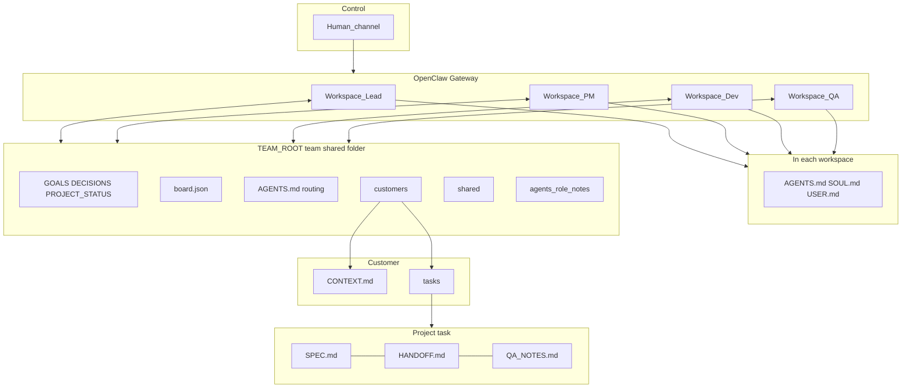
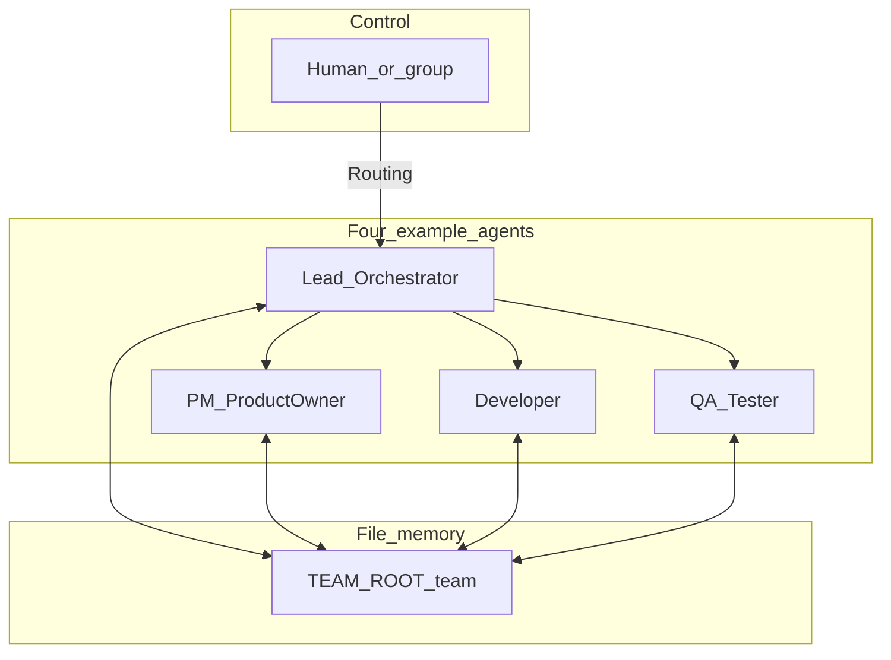

# Structure map: team, agents, customers, projects (`dev_team`)

A **purely textual** overview (ASCII boxes + Mermaid) of how **OpenClaw agents**, **`TEAM_ROOT`**, **customers**, and **tasks/projects** connect and **which files** live where. Rendering optional: ASCII works in every editor.

---

## 1) Big picture (ASCII boxes)

```text
                         ┌─────────────────────────────┐
                         │   Human / control channel   │
                         │   (e.g. chat, Telegram)     │
                         └──────────────┬──────────────┘
                                        │
                         ┌──────────────▼──────────────┐
                         │   OpenClaw Gateway          │
                         │   (one installation)          │
                         └──────────────┬──────────────┘
                                        │
          ┌───────────────┬─────────────┴─────────────┬───────────────┐
          │               │                           │               │
   ┌──────▼──────┐ ┌──────▼──────┐           ┌──────▼──────┐ ┌──────▼──────┐
   │ Workspace   │ │ Workspace   │           │ Workspace   │ │ Workspace   │
   │ Agent lead  │ │ Agent pm    │           │ Agent dev   │ │ Agent qa    │
   └──────┬──────┘ └──────┬──────┘           └──────┬──────┘ └──────┬──────┘
          └───────────────┴───────────┬───────────────┴───────────────┘
                    each incl.: AGENTS.md, SOUL.md, USER.md, optional skills/
                    (persona, rules, pointer to TEAM_ROOT — OPENCLAW_LAYOUT)
                                    │
                    all read/write the same area (absolute paths)
                                    │
          ┌─────────────────────────▼─────────────────────────┐
          │  TEAM_ROOT  (e.g. …/dev-team or DEV_TEAM_ROOT)     │
          │  ┌───────────────────────────────────────────────┐  │
          │  │                    team/                       │  │
          │  │  • GOALS.md                                    │  │
          │  │  • DECISIONS.md                                │  │
          │  │  • PROJECT_STATUS.md   ← short index          │  │
          │  │  • board.json            ← portfolio index      │  │
          │  │  • AGENTS.md             ← routing              │  │
          │  │  • customers/                                  │  │
          │  │  • shared/reviews/   shared/security/          │  │
          │  │  • agents/pm dev qa …  ← role notes           │  │
          │  │      (not the OpenClaw workspace!)             │  │
          │  └───────────────────────┬───────────────────────┘  │
          └──────────────────────────┼──────────────────────────┘
                                     │
              ┌──────────────────────▼──────────────────────┐
              │  team/customers/<customer_id>/              │
              │       CONTEXT.md   ← repos, staging, rules  │
              │       tasks/                                │
              │         └── <task_id>/  ← one “project” /   │
              │                 SPEC.md      work item      │
              │                 HANDOFF.md                  │
              │                 QA_NOTES.md                 │
              └────────────────────────────────────────────┘
```

**Easy to mix up:**

- **`team/agents/pm/`** (folder under `TEAM_ROOT`): **shared notes** for that role only.
- **OpenClaw workspace** of the PM agent: completely different path (`agents.list[].workspace`) — there the “brain” files **AGENTS.md** / **SOUL.md**.

---

## 2) Files by layer (short list)

| Layer | Location (conceptual) | Typical files |
|-------|----------------------|---------------|
| **OpenClaw per agent** | each `workspace` in `openclaw.json` | `AGENTS.md`, `SOUL.md`, `USER.md`, optional `memory/`, `skills/` |
| **Team memory (all)** | `TEAM_ROOT/team/` | `GOALS.md`, `DECISIONS.md`, `PROJECT_STATUS.md`, `board.json`, `AGENTS.md` |
| **Customer** | `team/customers/<id>/` | `CONTEXT.md` |
| **Project / task** | `team/customers/<id>/tasks/<task_id>/` | `SPEC.md`, `HANDOFF.md`, `QA_NOTES.md` |
| **Review / security (optional)** | `team/shared/…` | as needed |

---

## 3) Mermaid: relationships (for preview renderers)



---

## 4) Org chart: four agents stacked (example)



---

## 5) agentId checklist (example)

| Org chart | `agentId` (example) | Job in `team/` tree |
|-----------|---------------------|---------------------|
| Lead | `lead` | `board.json`, `PROJECT_STATUS`, routing |
| PM | `pm` | SPEC, create task folder |
| Dev | `dev` | `HANDOFF.md`, code |
| QA | `qa` | `QA_NOTES.md` |

**Security** is optional in the skill — the last diagram only shows four nodes.

---

## Further reading

- [SKILL.md](../SKILL.md) — full layout, handoffs
- [BOARD_SCHEMA.md](BOARD_SCHEMA.md) — `board.json`
- [OPENCLAW_LAYOUT.md](OPENCLAW_LAYOUT.md) — paths, snippets
- [ROLE_TEMPLATES.md](ROLE_TEMPLATES.md)
- [SKILL-SETUP.md](SKILL-SETUP.md)
