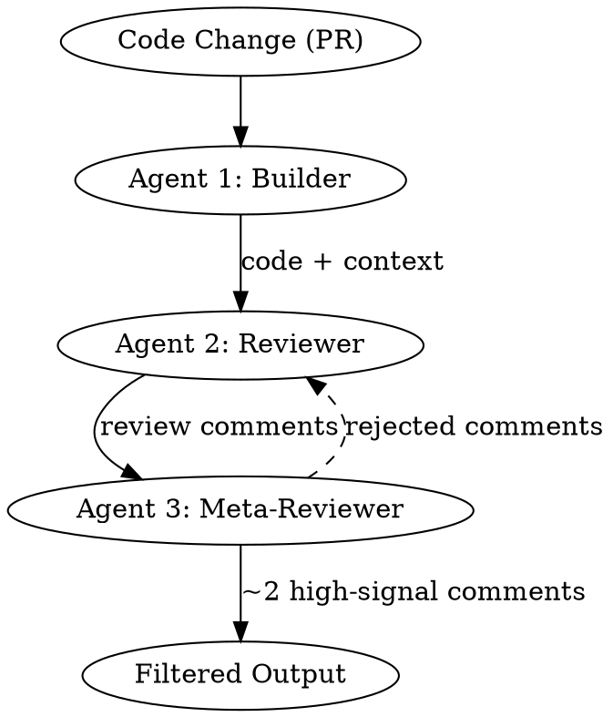

# Adversarial Code Review

## Overview

A multi-agent review pattern where one agent builds (or authors), a second agent critiques the code, and a third agent critiques the review itself. This layered adversarial approach filters out low-value nitpicks and surfaces only high-confidence, high-priority issues that deserve human attention.

**Core principle:** Fewer, higher-quality review comments build trust. Filter ruthlessly to high confidence + high priority only. Target roughly two comments per PR.

**Dependency:** Claude Code CLI with `--append-system-prompt` support. Optionally, a different model for the review pass than the one used for writing.

## When to Use

- Reviewing pull requests before merge, especially when review quality matters more than speed
- As a CI-integrated automated reviewer that developers actually read instead of ignore
- When existing automated reviews produce too much noise and developers have stopped trusting them
- During versioned critique cycles where a plan or design needs iterative refinement

## When NOT to Use

- Trivial PRs (typo fixes, dependency bumps, single-line config changes)
- When you need instant feedback during live pairing sessions (too slow for interactive use)
- As a replacement for human review on security-critical or compliance-gated changes

## Common Mistakes

| Mistake | Why it's wrong |
|---------|---------------|
| Surfacing every finding to the developer | Noise kills trust. Developers stop reading reviews that cry wolf. Filter to ~2 high-priority, high-confidence comments per PR. |
| Using the same model for writing and reviewing | The model is biased toward its own patterns. Use a different model for review than the one that wrote the code — it catches different classes of issues. |
| Skipping the meta-reviewer (third agent) | Without a check on the reviewer, you get false positives and nitpicks dressed up as critical findings. The meta-reviewer filters the reviewer's output. |
| Running adversarial review without priming the critic | A neutral prompt produces polite, hedging reviews. Tell the reviewer the code likely contains bugs to prime it for genuine criticality. |
| Treating all review comments as equal priority | Without confidence and priority scoring, developers cannot triage. Every comment must carry explicit confidence (high/medium/low) and priority (high/medium/low). |

## The Three-Agent Adversarial Pattern



### Step 1: Set up the builder context

Agent 1 is the code author (or a proxy that understands the change). It produces:
- The diff itself
- A summary of intent ("what this PR is trying to do")
- Related context (linked issues, design docs, test plan)

If you are reviewing someone else's PR, have an agent read the PR description, diff, and linked issues to reconstruct this context.

### Step 2: Run the adversarial reviewer (Agent 2)

Spawn a sub-agent with a system prompt that primes it for critical review. The key trick: tell the reviewer the code likely contains bugs.

```bash
claude --print --append-system-prompt "You are a senior engineer reviewing code that was just generated by an AI coding agent. The agent has likely introduced subtle bugs, security issues, or logic errors. Your job is to find them. Do not be polite. Do not hedge. For every issue you find, assign:
- confidence: high | medium | low
- priority: high | medium | low
- category: bug | security | performance | logic | style
Only report issues where confidence is medium or higher." \
  -p "Review this PR diff for bugs and issues:

$(git diff main...HEAD)"
```

**Model selection:** If the code was written by Claude, use a different model for review. Cross-model review catches different failure modes.

### Step 3: Run the meta-reviewer (Agent 3)

The meta-reviewer receives Agent 2's comments and filters them. Its job is to reject false positives, remove nitpicks that escaped the confidence filter, and validate that remaining comments are actionable.

```bash
claude --print --append-system-prompt "You are reviewing a code review. The reviewer may have produced false positives, nitpicks disguised as bugs, or low-value comments. Your job is to filter ruthlessly. Keep ONLY comments that are:
1. Genuinely high-confidence issues (not speculative)
2. High-priority (would cause a bug, security hole, or data loss)
3. Actionable (the developer knows exactly what to fix)

Reject everything else. Target output: 1-3 comments maximum. If the code is fine, say so." \
  -p "Here is the code review to evaluate:

$REVIEWER_OUTPUT

And here is the original diff for reference:

$(git diff main...HEAD)"
```

### Step 4: Format and deliver the filtered output

The final output should contain only the surviving comments, each with:
- **Location**: File and line range
- **Issue**: One-sentence description
- **Why it matters**: Impact if not fixed
- **Suggested fix**: Concrete code change
- **Confidence**: high
- **Priority**: high

## CI Integration with `--append-system-prompt`

To run this as an automated CI reviewer, add a workflow step that pipes the diff through the three-agent chain:

```yaml
# .github/workflows/adversarial-review.yml
name: Adversarial Code Review
on:
  pull_request:
    types: [opened, synchronize]

jobs:
  review:
    runs-on: ubuntu-latest
    steps:
      - uses: actions/checkout@v4
        with:
          fetch-depth: 0

      - name: Run adversarial review
        env:
          ANTHROPIC_API_KEY: ${{ secrets.ANTHROPIC_API_KEY }}
        run: |
          DIFF=$(git diff origin/main...HEAD)

          # Agent 2: Adversarial reviewer
          REVIEW=$(claude --print --append-system-prompt \
            "You are reviewing code that an AI agent just wrote. It likely introduced bugs. Find them. For each issue, provide confidence (high/medium/low), priority (high/medium/low), file, line range, and a concrete fix. Only report medium+ confidence issues." \
            -p "Review this diff:\n\n$DIFF")

          # Agent 3: Meta-reviewer filters
          FILTERED=$(claude --print --append-system-prompt \
            "Filter this code review to only high-confidence, high-priority issues. Maximum 3 comments. Reject nitpicks and false positives." \
            -p "Review to filter:\n\n$REVIEW\n\nOriginal diff:\n\n$DIFF")

          # Post as PR comment
          echo "$FILTERED" > review.md
          gh pr comment ${{ github.event.pull_request.number }} --body-file review.md
```

The `--append-system-prompt` flag is what makes this work in CI: it lets you inject the adversarial priming without modifying the user message, keeping the diff clean as the primary input.

## Versioned Critique Cycle (For Plans and Designs)

For longer-form work like architecture plans, use a versioned critique loop:

1. **plan_v1**: Initial plan authored by Agent 1
2. **critique_opus_v1**: Critique from one model (e.g., Claude)
3. **critique_gpt_v1**: Critique from a different model (e.g., GPT) for cross-model coverage
4. **revise**: Author incorporates valid critiques
5. **plan_v2**: Revised plan, repeat if needed

This ensures the plan survives scrutiny from multiple perspectives before implementation begins. Each critique version is saved so you can trace which feedback was incorporated and which was rejected (and why).

## Quick Reference

| Item | Details |
|------|---------|
| Agent 1 (Builder) | Produces diff, intent summary, and context |
| Agent 2 (Reviewer) | Adversarially primed critic, scores by confidence + priority |
| Agent 3 (Meta-Reviewer) | Filters reviewer output, rejects false positives |
| Target output | ~2 high-confidence, high-priority comments per PR |
| CI flag | `--append-system-prompt` for injecting adversarial priming |
| Model strategy | Use a different model for review than for writing |
| Priming trick | "AI agent likely introduced bugs — find them" |
| Versioned cycle | plan_v1 -> critique_v1 -> revise -> plan_v2 |

## Key Principles

1. **Fewer comments build more trust.** A reviewer that posts two real bugs gets read. A reviewer that posts twenty nitpicks gets ignored. Filter to ~2 high-priority, high-confidence findings.
2. **Cross-model review catches what self-review misses.** A model is biased toward its own idioms. Use a different model for review than the one that wrote the code.
3. **Prime the critic for genuine adversarial behavior.** Telling the reviewer "an AI agent likely introduced bugs, find them" produces dramatically more critical and useful reviews than a neutral prompt.
4. **The meta-reviewer is non-negotiable.** Without a third agent checking the reviewer, false positives leak through and erode developer trust in the entire system.
5. **Every comment must be actionable.** If the developer cannot immediately understand what to fix and why, the comment has failed. Include file, line, impact, and concrete fix.

## Attribution

Based on techniques from the Coding Agents: AI Driven Dev Conference. Sid (Anthropic) demonstrated the three-agent adversarial pattern and CI integration with `--append-system-prompt`. Ankit (Databricks) contributed the cross-model review strategy. Demetrios introduced the priming trick of telling the reviewer that bugs were likely introduced. Chad described the versioned critique cycle for iterative plan refinement.
