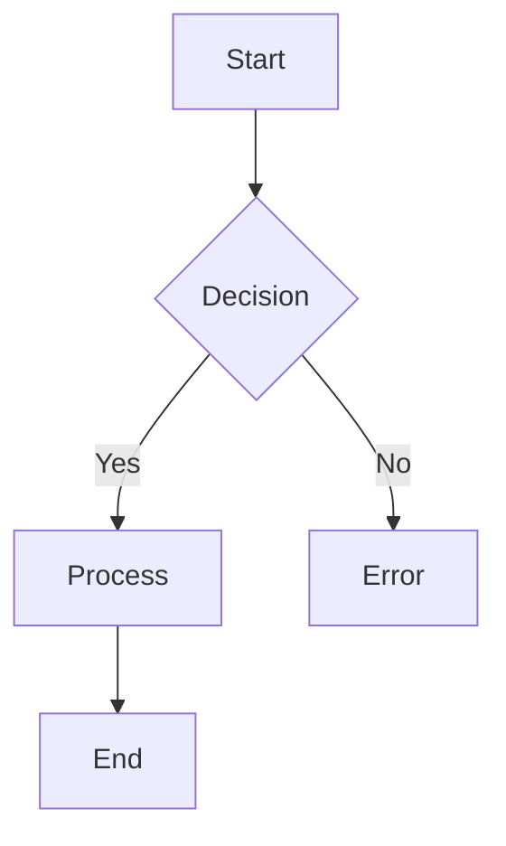
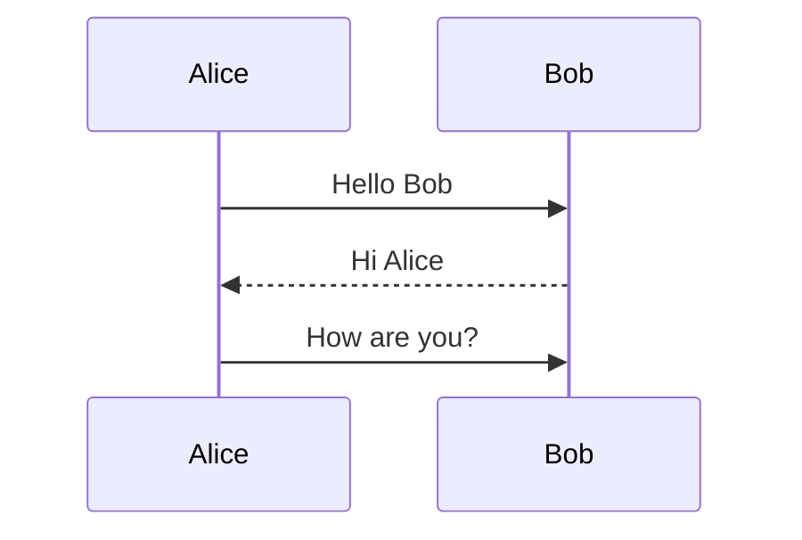
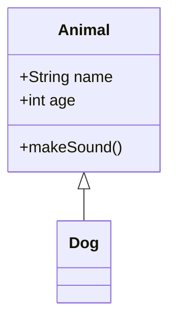
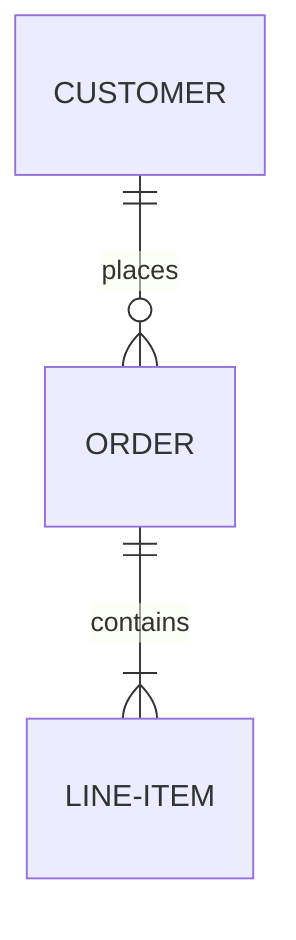
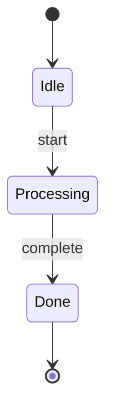
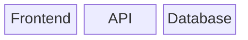
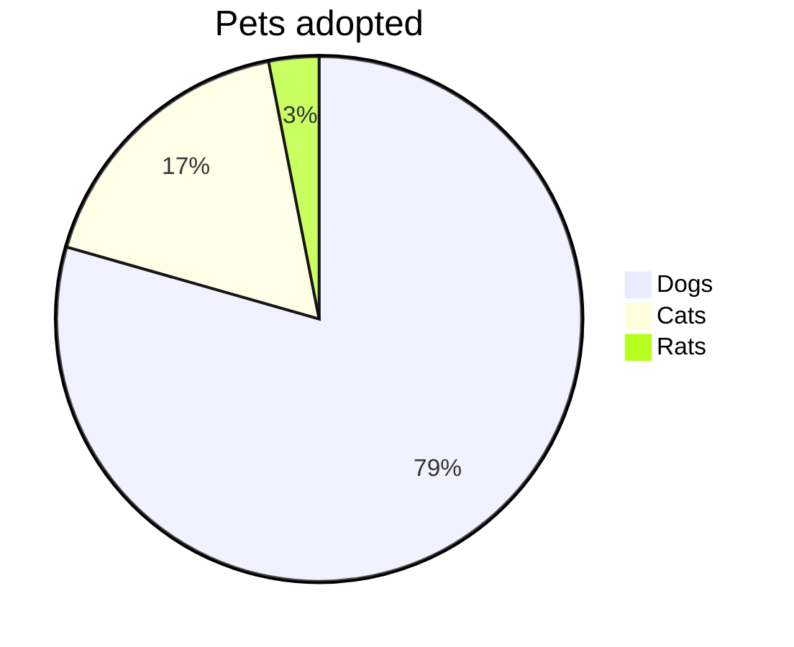
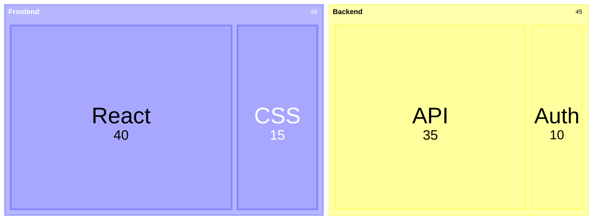

# Termaid Skill for OpenClaw

[](https://github.com/fasouto/termaid)
[](https://python.org)
[](LICENSE)
[](https://openclaw.ai)

A comprehensive skill package for integrating [Termaid](https://github.com/fasouto/termaid) with [OpenClaw](https://openclaw.ai). Termaid is a pure-Python Mermaid diagram renderer that converts Mermaid markup into terminal-friendly ASCII/Unicode diagrams.

## 🌟 Why Termaid?

- **🔒 Zero Dependencies** - Pure Python, no browser or external services needed
- **🖥️ Terminal Native** - Render diagrams in SSH, CI logs, TUI apps
- **🎨 Colorful Themes** - 6 built-in themes with rich terminal colors
- **📊 9 Diagram Types** - Flowcharts, sequence, class, ER, state, block, git, pie, treemaps
- **🔄 Pipe Friendly** - Works seamlessly with Unix pipelines

## 📦 Installation

### Option 1: Quick Install (Recommended)
```bash
# Clone the skill
git clone https://github.com/smallnest/termaid-skill.git
cd termaid-skill

# Run installation script
bash install.sh
```

### Option 2: Manual Installation
```bash
# Install Termaid
pip install termaid

# Optional: Install with extras
pip install termaid[rich]      # Colored output
pip install termaid[textual]   # TUI components

# Copy skill to OpenClaw
cp -r termaid-skill ~/.openclaw/workspace/skills/termaid
```

## 🚀 Quick Start

### Basic Usage
```bash
# Render a Mermaid file
termaid diagram.mmd

# Pipe input
echo "graph LR; A-->B-->C" | termaid

# Use a theme
termaid diagram.mmd --theme neon

# ASCII mode (no Unicode)
termaid diagram.mmd --ascii

# TUI interactive viewer
termaid diagram.mmd --tui
```

### Python API
```python
from termaid import render

# Basic rendering
print(render("graph LR\n A --> B --> C"))

# Colored output
from termaid import render_rich
from rich import print as rprint
rprint(render_rich("graph LR\n A --> B", theme="terra"))

# TUI widget
from termaid import MermaidWidget
widget = MermaidWidget("graph LR\n A --> B")
```

### Run Examples
```bash
# Run basic examples
bash ~/.termaid/examples/run_examples.sh

# Run advanced examples
bash ~/.termaid/examples/advanced_usage.sh

# Batch render all diagrams
bash examples/batch-render.sh
```

## 📁 Project Structure

```
termaid-skill/
├── SKILL.md                    # Main skill documentation
├── README.md                   # This file
├── install.sh                  # One-click installation script
├── examples/                   # Example scripts and diagrams
│   ├── demo-mermaid.mmd       # Comprehensive demo diagrams
│   ├── batch-render.sh        # Batch rendering script
│   ├── run_examples.sh        # Basic demo script
│   └── advanced_usage.sh      # Advanced features demo
├── package.json               # Package configuration
└── LICENSE                    # MIT License
```

## 📊 Supported Diagram Types

### 1. Flowcharts


### 2. Sequence Diagrams


### 3. Class Diagrams


### 4. ER Diagrams


### 5. State Diagrams


### 6. Block Diagrams


### 7. Git Graphs
```mermaid
gitGraph
    commit id: "init"
    commit id: "feat"
    branch develop
    commit id: "dev-1"
    merge develop id: "merge"
```

### 8. Pie Charts


### 9. Treemaps


## 🎨 Themes

Termaid comes with 6 beautiful themes:

| Theme | Colors | Description |
|-------|--------|-------------|
| `default` | Cyan nodes, yellow arrows | Default terminal colors |
| `terra` | Earth tones (browns, oranges) | Warm and professional |
| `neon` | Magenta nodes, green arrows | Bright and vibrant |
| `mono` | White/gray monochrome | Classic terminal look |
| `amber` | Amber/gold CRT-style | Retro computer terminal |
| `phosphor` | Green phosphor terminal | Classic green-screen |

## 🔧 CLI Options

| Option | Description |
|--------|-------------|
| `--tui` | Interactive TUI viewer |
| `--ascii` | ASCII-only output (no Unicode) |
| `--theme NAME` | Color theme (`default`, `terra`, `neon`, `mono`, `amber`, `phosphor`) |
| `--padding-x N` | Horizontal padding inside boxes (default: 4) |
| `--padding-y N` | Vertical padding inside boxes (default: 2) |
| `--sharp-edges` | Sharp corners instead of rounded |

## 💡 Use Cases

### 1. Documentation Generation
```bash
# Embed terminal diagrams in documentation
termaid architecture.mmd >> README.md
```

### 2. CI/CD Logs
```bash
# Show architecture in CI logs
echo "graph LR; Frontend-->API-->Database" | termaid --ascii
```

### 3. Code Reviews
```python
# Generate diagrams dynamically in code
from termaid import render
print(render(class_diagram_source))
```

### 4. TUI Applications
```python
# Interactive diagrams in Textual apps
from termaid import MermaidWidget
from textual.app import App

class DiagramApp(App):
    def compose(self):
        yield MermaidWidget("graph LR\n A --> B")
```

### 5. SSH Sessions
```bash
# View diagrams on remote servers
ssh user@server "cat diagram.mmd | termaid"
```

## 🔄 OpenClaw Integration

### AI Agent Automation
```python
# Use Termaid in AI Agent workflows
def visualize_architecture(description):
    """
    Convert AI-generated architecture description to diagram
    """
    mermaid_source = convert_to_mermaid(description)
    from termaid import render
    return render(mermaid_source)
```

### Automated Documentation
```bash
#!/bin/bash
# Auto-generate architecture documentation

# 1. Generate Mermaid from code
python generate_architecture.py > arch.mmd

# 2. Render for terminal
termaid arch.mmd --theme phosphor > terminal_arch.txt

# 3. Include in documentation
cat terminal_arch.txt >> ARCHITECTURE.md
```

## 🛠️ Troubleshooting

### Common Issues

1. **No colors displayed**
   ```bash
   # Install rich extension
   pip install termaid[rich]
   
   # Or use ASCII mode
   termaid diagram.mmd --ascii
   ```

2. **Encoding problems**
   ```bash
   # Ensure UTF-8 support
   export LANG=en_US.UTF-8
   export LC_ALL=en_US.UTF-8
   ```

3. **Rendering fails**
   ```bash
   # Check Mermaid syntax
   # Verify diagram type is supported
   ```

4. **Output too large**
   ```bash
   # Reduce padding
   termaid diagram.mmd --padding-x 2 --padding-y 1
   ```

## 📚 Learning Resources

### Official Links
- **GitHub**: https://github.com/fasouto/termaid
- **Online Demo**: https://termaid.com
- **PyPI**: https://pypi.org/project/termaid/

### Related Tools
- [Mermaid.js](https://mermaid.js.org/) - Original Mermaid library
- [mermaid-ascii](https://github.com/AlexanderGrooff/mermaid-ascii) - Go implementation
- [beautiful-mermaid](https://github.com/lukilabs/beautiful-mermaid) - TypeScript implementation

## 📝 License

This skill package is licensed under the MIT License - see the [LICENSE](LICENSE) file for details.

Termaid itself is also MIT licensed.

## 🤝 Contributing

Contributions are welcome! Please feel free to submit a Pull Request.

## 🙏 Acknowledgments

- [Termaid](https://github.com/fasouto/termaid) by Fabio Souto (@fasouto)
- [OpenClaw](https://openclaw.ai) community
- All contributors and users

---

**Happy diagramming!** 📊✨

If you find this skill useful, please ⭐ star the repository!