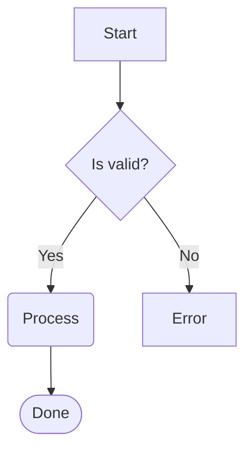
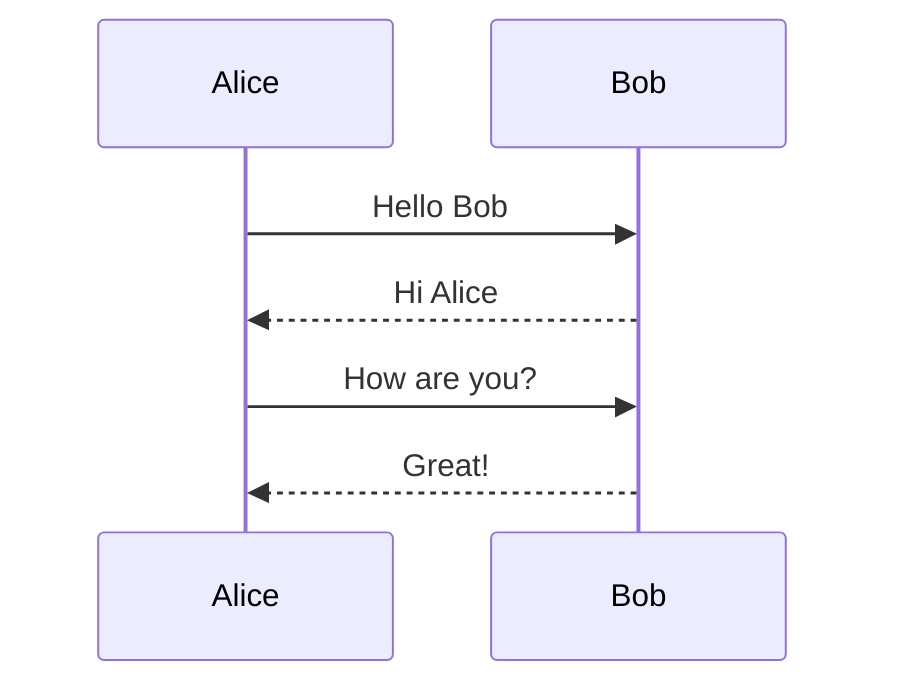
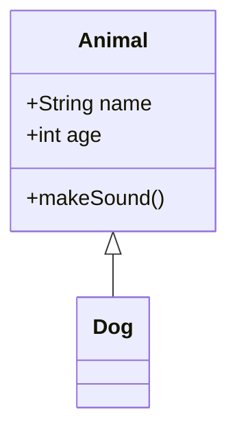
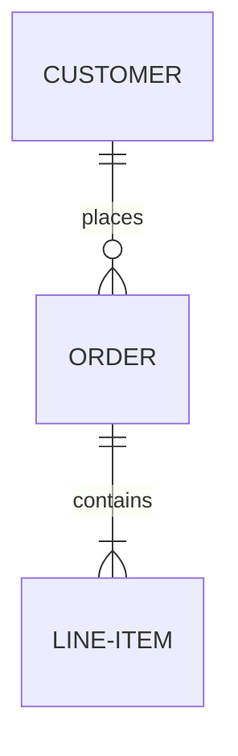
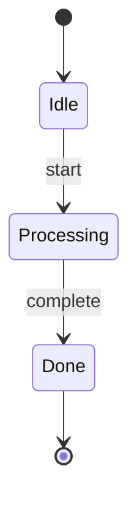
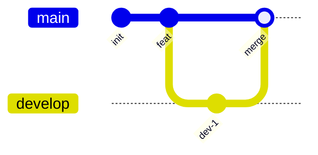
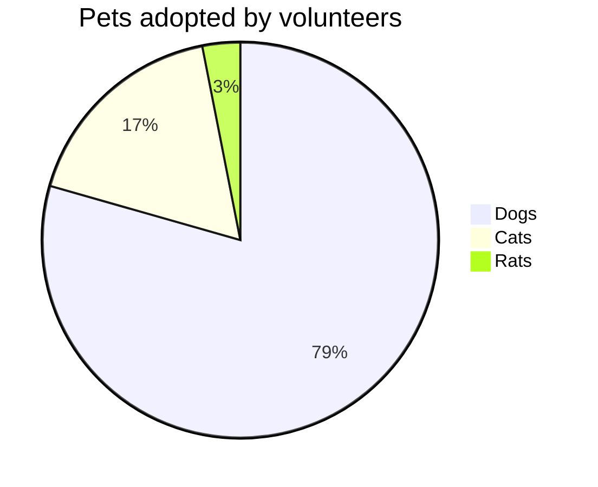
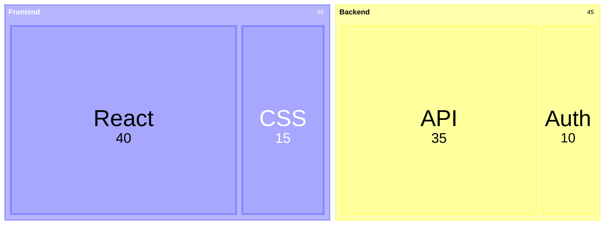

# Termaid - Terminal Mermaid Diagram Renderer

## 概述

**Termaid** 是一个纯 Python 的 Mermaid 图表渲染工具，可以在终端或 Python 应用中直接渲染 Mermaid 图表为 ASCII/Unicode 字符图形。

### 核心价值
- **零依赖**：纯 Python 实现，无需浏览器或外部服务
- **终端友好**：在 SSH、CI 日志、TUI 应用中直接渲染图表
- **多图表支持**：9 种 Mermaid 图表类型
- **彩色主题**：6 种内置颜色主题
- **ASCII 回退**：支持最基本的终端环境

## 🚀 快速开始

### 安装
```bash
# 基本安装
pip install termaid

# 带彩色输出
pip install termaid[rich]

# 带 TUI 界面
pip install termaid[textual]

# 试用（无需安装）
uvx termaid diagram.mmd
```

### 基本使用
```bash
# 渲染文件
termaid diagram.mmd

# 管道输入
echo "graph LR; A-->B-->C" | termaid

# 使用主题
termaid diagram.mmd --theme neon

# ASCII 模式
termaid diagram.mmd --ascii

# TUI 交互界面
termaid diagram.mmd --tui
```

### Python API
```python
from termaid import render

# 基础渲染
print(render("graph LR\n A --> B --> C"))

# 彩色渲染
from termaid import render_rich
from rich import print as rprint
rprint(render_rich("graph LR\n A --> B", theme="terra"))

# Textual TUI 组件
from termaid import MermaidWidget
widget = MermaidWidget("graph LR\n A --> B")
```

## 📊 支持的图表类型

### 1. 流程图 (Flowcharts)


**特性**：
- 所有方向：LR, RL, TD/TB, BT
- 多种节点形状：矩形、圆角矩形、菱形、圆形等
- 边样式：实线、虚线、粗线、带标签等

### 2. 序列图 (Sequence Diagrams)


### 3. 类图 (Class Diagrams)


### 4. ER 图 (Entity-Relationship)


### 5. 状态图 (State Diagrams)


### 6. 块图 (Block Diagrams)


### 7. Git 图 (Git Graphs)


### 8. 饼图 (Pie Charts)


**注意**：饼图以水平条形图形式渲染，更易于终端阅读

### 9. 树状图 (Treemaps)


## 🎨 主题系统

### 内置主题
1. **default** - 青色节点，黄色箭头，白色标签
2. **terra** - 温暖的地球色调（棕色、橙色）
3. **neon** - 霓虹色调（品红色节点，绿色箭头）
4. **mono** - 单色（白色/灰色）
5. **amber** - 琥珀色 CRT 风格
6. **phosphor** - 绿色磷光终端风格

### 使用主题
```bash
termaid diagram.mmd --theme neon
termaid diagram.mmd --theme phosphor
```

```python
rprint(render_rich(source, theme="amber"))
```

## 🔧 CLI 选项

| 选项 | 描述 |
|------|------|
| `--tui` | 交互式 TUI 查看器 |
| `--ascii` | ASCII 纯文本输出（无 Unicode） |
| `--theme NAME` | 颜色主题：default, terra, neon, mono, amber, phosphor |
| `--padding-x N` | 框内水平填充（默认：4） |
| `--padding-y N` | 框内垂直填充（默认：2） |
| `--sharp-edges` | 边角使用锐角而非圆角 |

## 💡 使用场景

### 1. 文档生成
```bash
# 在 Markdown 文档中嵌入 Mermaid 图表的终端版本
termaid architecture.mmd >> README.md
```

### 2. CI/CD 日志
```bash
# 在 CI 日志中显示架构图
echo "graph LR; Frontend-->API-->Database" | termaid --ascii
```

### 3. 代码审查
```python
# 在代码中动态生成图表
from termaid import render
print(render(class_diagram_source))
```

### 4. TUI 应用
```python
# 在 Textual 应用中显示动态图表
from termaid import MermaidWidget
from textual.app import App

class DiagramApp(App):
    def compose(self):
        yield MermaidWidget("graph LR\n A --> B")
```

### 5. SSH 会话
```bash
# 在远程服务器上查看图表
ssh user@server "cat diagram.mmd | termaid"
```

## 🔄 集成 OpenClaw

### 自动化工作流
```bash
#!/bin/bash
# 自动生成架构文档

# 1. 从代码生成 Mermaid 图
python generate_architecture_mmd.py > arch.mmd

# 2. 渲染为终端友好的格式
termaid arch.mmd --theme neon > terminal_arch.txt

# 3. 嵌入到文档中
cat terminal_arch.txt >> ARCHITECTURE.md
```

### AI Agent 集成
```python
# 在 AI Agent 中使用 Termaid 可视化架构
def visualize_architecture(agent_response):
    """
    将 AI 生成的架构描述转换为可视化图表
    """
    mermaid_source = agent_response.get('mermaid', '')
    if mermaid_source:
        from termaid import render
        return render(mermaid_source)
    return "No diagram to render"
```

## 📝 实用脚本

### 批量转换脚本
```bash
#!/bin/bash
# 批量转换 Mermaid 文件

for file in *.mmd; do
    output="${file%.mmd}.txt"
    echo "Converting $file to $output"
    termaid "$file" --theme terra > "$output"
done
```

### 监控脚本
```bash
#!/bin/bash
# 监控架构变化并重新渲染

WATCH_DIR="./diagrams"
RENDER_DIR="./rendered"

inotifywait -m -e modify "$WATCH_DIR" |
while read -r directory events filename; do
    if [[ "$filename" == *.mmd ]]; then
        echo "Rendering $filename..."
        termaid "$WATCH_DIR/$filename" \
            --theme phosphor \
            > "$RENDER_DIR/${filename%.mmd}.txt"
    fi
done
```

## 🔍 高级用法

### 自定义渲染
```python
from termaid import render

# 带自定义参数
result = render(
    mermaid_source,
    padding_x=8,
    padding_y=4,
    sharp_edges=True
)
```

### 错误处理
```python
from termaid import render
import sys

try:
    output = render(invalid_mermaid_source)
except Exception as e:
    print(f"渲染失败: {e}", file=sys.stderr)
    # 提供降级方案
    print("graph TD\n Error[渲染错误] --> Help[检查语法]")
```

### 性能优化
```python
# 预加载常用图表
from termaid import render
import functools

@functools.lru_cache(maxsize=100)
def cached_render(source: str) -> str:
    """缓存渲染结果"""
    return render(source)
```

## 🛠️ 故障排除

### 常见问题

1. **编码问题**
   ```bash
   # 确保终端支持 UTF-8
   export LANG=en_US.UTF-8
   export LC_ALL=en_US.UTF-8
   ```

2. **颜色不显示**
   ```bash
   # 安装 rich 扩展
   pip install termaid[rich]
   # 或使用 ASCII 模式
   termaid diagram.mmd --ascii
   ```

3. **图表过大**
   ```bash
   # 调整填充
   termaid diagram.mmd --padding-x 2 --padding-y 1
   ```

4. **渲染失败**
   ```bash
   # 检查 Mermaid 语法
   # 确保使用支持的图表类型
   ```

### 调试模式
```python
import termaid
import logging

# 启用调试日志
logging.basicConfig(level=logging.DEBUG)

# 或查看内部状态
diagram = termaid.parse_mermaid(source)
print(f"图表类型: {diagram.type}")
print(f"节点数: {len(diagram.nodes)}")
```

## 📚 学习资源

### 官方链接
- **GitHub**: https://github.com/fasouto/termaid
- **在线试用**: https://termaid.com
- **PyPI**: https://pypi.org/project/termaid/

### 相关工具
- [Mermaid.js](https://mermaid.js.org/) - 原始 Mermaid 库
- [mermaid-ascii](https://github.com/AlexanderGrooff/mermaid-ascii) - Go 实现的终端渲染
- [beautiful-mermaid](https://github.com/lukilabs/beautiful-mermaid) - TypeScript 实现

### 最佳实践
1. **保持简单**：终端图表适合简单架构
2. **使用主题**：选择合适的主题提高可读性
3. **ASCII 备用**：为不支持 Unicode 的环境提供回退
4. **缓存结果**：重复使用的图表可以缓存渲染结果

## 🎯 适用场景

### 推荐使用
- ✅ 终端文档和演示
- ✅ CI/CD 日志可视化
- ✅ SSH 远程架构查看
- ✅ TUI 应用集成
- ✅ 代码生成工具

### 不推荐使用
- ❌ 复杂的多层图表
- ❌ 需要精确布局的场景
- ❌ 需要交互式编辑
- ❌ 打印输出（分辨率不足）

## 📈 扩展可能性

### 1. 自定义主题
```python
# 创建自定义颜色主题
custom_theme = {
    "node_color": "#FF5733",
    "edge_color": "#33FF57",
    "label_color": "#FFFFFF"
}
```

### 2. 导出格式
```python
# 导出为其他格式
def export_as_html(mermaid_source, termaid_output):
    html = f"""
    <div class="terminal-diagram">
        <pre>{termaid_output}</pre>
        <details>
            <summary>Mermaid 源代码</summary>
            <pre>{mermaid_source}</pre>
        </details>
    </div>
    """
    return html
```

### 3. 集成其他工具
```bash
# 与 Graphviz 结合
termaid diagram.mmd | dot -Tpng > diagram.png
```

---

**许可证**: MIT  
**Python 要求**: >= 3.11  
**作者**: Fabio Souto (@fasouto)  
**项目状态**: Alpha（积极开发中）