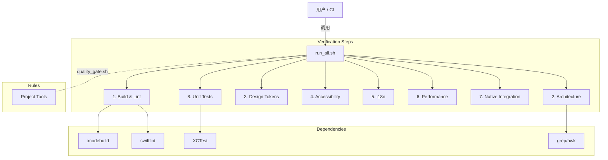

# SwiftVerify: Apple 原生应用质量验证技能 (v1.0)

> **核心任务**: 确保代码达到 **Apple Design Award** 评审标准 (执行 `./tools/quality_gate.sh full`)。
> **执行频率**: 每次 Feature 完成后、PR 合并前、发布前必须执行。

## 技能目录结构

```
├── scripts/
│   ├── run_all.sh                # 入口脚本
│   ├── check_build.sh            # Step 1: 编译
│   ├── check_architecture.sh     # Step 2: 架构
│   ├── check_design_tokens.sh    # Step 3: 设计
│   ├── check_a11y.sh             # Step 4: 无障碍
│   ├── check_i18n.sh             # Step 5: 国际化
│   ├── check_performance.sh      # Step 6: 性能
│   ├── check_native.sh           # Step 7: 原生
│   └── check_tests.sh            # Step 8: 测试

## 技能拓扑图 (Topology)


│   ├── check_build.sh            # Step 1: 编译检查
│   ├── check_architecture.sh     # Step 2: 架构漂移检测
│   ├── check_design_tokens.sh    # Step 3: 设计系统合规
│   ├── check_a11y.sh             # Step 4: 无障碍检查
│   ├── check_i18n.sh             # Step 5: 国际化检查
│   ├── check_performance.sh      # Step 6: 性能基准 (需手动)
│   ├── check_native.sh           # Step 7: 原生集成检查
│   └── run_all.sh                # 一键执行全部检查
├── templates/
│   └── verification_report.md    # 报告模板
└── resources/
    └── ada_checklist.md          # Apple Design Award 检查清单
```

---

## 1. 执行流程 (Execution Protocol)

### 快速验证 (Quick Check)
```bash
./agent/skills/swiftverify/scripts/run_all.sh
```

### 完整验证 (Full Check)
按顺序执行以下检查，任一失败则阻断：

| Step | 脚本 | 验证内容 | 阻断级别 |
|------|------|----------|----------|
| 1 | `check_build.sh` | 编译通过 + SwiftLint | 🔴 HARD |
| 2 | `check_architecture.sh` | MVVM+ 分层 + 依赖方向 | 🔴 HARD |
| 3 | `check_design_tokens.sh` | Token 使用率 100% | 🟡 SOFT |
| 4 | `check_a11y.sh` | 无障碍标签覆盖 | 🟡 SOFT |
| 5 | `check_i18n.sh` | 字符串本地化 100% | 🟡 SOFT |
| 6 | `check_performance.sh` | 性能基准 (手动) | 🟢 INFO |
| 7 | `check_native.sh` | 原生集成验证 | 🟢 INFO |
| 8 | `check_tests.sh` | Unit Tests (XCTest) | 🟡 SOFT |

---

## 2. 检查详情 (Check Details)

### 无障碍参考

swiftverify 整合了完整的无障碍检查指南。详见 `resources/accessibility-checklist.md`。

**自动检查项**：
- ✅ VoiceOver 标签缺失检测
- ✅ 硬编码字号检测（破坏 Dynamic Type）
- ✅ Reduce Motion 适配提示
- ✅ 空标签或占位符标签检测
- ✅ 触控目标大小验证

**执行检查**：
```bash
./scripts/check_a11y.sh
```

### Step 1: 编译检查 (Build Check)
**文件**: `scripts/check_build.sh`

| 检查项 | 标准 | 状态 |
|--------|------|------|
| xcodebuild 编译 | EXIT 0 | HARD |
| SwiftLint | 0 Error | HARD |
| 生命周期激活 | 所有 Service 启动 | HARD |

### Step 2: 架构漂移检测 (Architecture Drift)
**文件**: `scripts/check_architecture.sh`

| 检查项 | 验证规则 | 状态 |
|--------|----------|------|
| View 层隔离 | Views/ 不 import SwiftData | HARD |
| Model 层隔离 | Models/ 不 import SwiftUI | HARD |
| Sendable 符合 | 所有 Model 实现 Sendable | HARD |
| GCD 禁用 | 无 DispatchQueue | HARD |

### Step 3: 设计系统合规 (Design System Compliance)
**文件**: `scripts/check_design_tokens.sh`

| 检查项 | 验证规则 | 状态 |
|--------|----------|------|
| 硬编码颜色 | 无 `Color(#...)` 或 `.red` 等 | SOFT |
| 硬编码数值 | 无 `.padding(16)` 等 | SOFT |
| 标准圆角 | 使用 `DesignTokens.CornerRadius` | SOFT |
| 标准间距 | 使用 `DesignTokens.Spacing` | SOFT |

### Step 4: 无障碍检查 (Accessibility)
**文件**: `scripts/check_a11y.sh`

| 检查项 | 验证规则 | 状态 |
|--------|----------|------|
| accessibilityLabel | 所有 Button/Image 有标签 | SOFT |
| 触控区域 | 交互元素 ≥ 44x44 pt | SOFT |
| 动态字体 | 无 `.font(.system(size:))` | SOFT |

### Step 5: 国际化检查 (Internationalization)
**文件**: `scripts/check_i18n.sh`

| 检查项 | 验证规则 | 状态 |
|--------|----------|------|
| 字符串本地化 | 使用 `String(localized:)` | SOFT |
| 无硬编码中文 | Text("中文") 需替换 | SOFT |

### Step 6: 性能检查 (Performance)
**文件**: `scripts/check_performance.sh`

| 检查项 | 工具 | 标准 |
|--------|------|------|
| 启动时间 | Instruments | < 400ms |
| 内存泄漏 | Instruments Leaks | 0 |
| 主线程阻塞 | Main Thread Checker | 0 |

> ⚠️ 性能检查需要手动运行 Instruments

### Step 7: 原生集成检查 (Native Integration)
**文件**: `scripts/check_native.sh`

| 检查项 | 验证规则 | 状态 |
|--------|----------|------|
| AppIntent 存在 | Intents/ 目录非空 | INFO |
| Shortcuts 注册 | AppShortcutsProvider 存在 | INFO |

### Step 8: 单元测试 (Unit Tests)
**文件**: `scripts/check_tests.sh`

| 检查项 | 验证规则 | 状态 |
|--------|----------|------|
| Unit Tests | 如果存在测试 Target，必须全部通过 | SOFT |
| Code Coverage | (可选) 输出覆盖率报告 | INFO |

---

## 3. 报告生成 (Report Generation)

执行完成后，在 `specs/verification_report.md` 生成报告：

```markdown
# 验证报告 - [日期]

## 总体状态: ✅ PASS / ❌ FAIL

| 检查维度 | 状态 | 违规数 |
|----------|------|--------|
| 编译检查 | ✅ | 0 |
| 架构一致性 | ✅ | 0 |
| 设计系统 | ⚠️ | 3 |
| 无障碍 | ⚠️ | 5 |
| 国际化 | ✅ | 0 |
| 性能 | ⏳ | - |
| 原生集成 | ✅ | 0 |
| 单元测试 | ✅ | 0 |

## 违规详情
...
```

---

## 4. 自动修复 (Auto-Fix)

对于 SOFT 级别的违规，提供自动修复建议：

| 违规类型 | 自动修复方法 |
|----------|--------------|
| 硬编码字符串 | 替换为 `String(localized: "key")` |
| 硬编码数值 | 替换为 `DesignTokens.Spacing.xxx` |
| 缺少 a11y 标签 | 添加 `.accessibilityLabel()` |

---

## 5. 与 CI/CD 集成

```yaml
# GitHub Actions 示例
- name: SwiftVerify
  run: |
    chmod +x .agent/skills/swiftverify/scripts/run_all.sh
    .agent/skills/swiftverify/scripts/run_all.sh
```

---

## 6. 安全阻断 (Safety)

- [ ] HARD 级别失败：必须修复后才能继续
- [ ] SOFT 级别失败：可继续但需记录 Tech Debt
- [ ] INFO 级别失败：仅供参考
