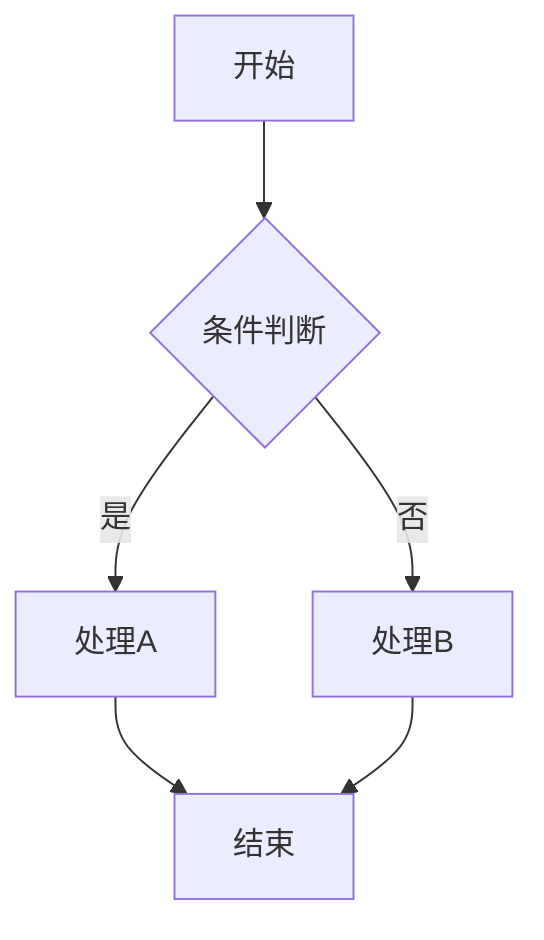

# 图片处理与流程图分析

## PDF 图片提取

### 常见问题

1. **大量重复图片**：PDF 中图片对象被多页共享，导致同一图片被重复提取
2. **无效小图片**：包含大量装饰性、低质量的小尺寸图片
3. **存储浪费**：重复文件占用大量存储空间

### 优化方案

使用 `scripts/extract_pdf_images.py` 脚本，核心优化策略：

1. **双重去重机制**
   - xref 去重：同一 PDF 图片对象仅提取一次
   - MD5 哈希去重：内容完全相同的不同对象仅保留一份

2. **质量过滤**
   - 尺寸过滤：宽高均大于 100px
   - 大小过滤：文件大于 5KB
   - 过滤掉装饰性小图标和空白图片

3. **颜色空间处理**
   - 自动检测 CMYK 颜色空间
   - CMYK 图片自动转换为 RGB 再保存

### 效果对比

- 优化前：300 个重复文件，大量存储浪费
- 优化后：约 10 个高质量唯一图片，节省约 97% 存储空间

## 视觉内容分析方法

### 流程图分析

从流程图中提取可测试信息：

1. **节点识别**
   - 开始/结束节点 → 确定流程边界
   - 处理节点 → 对应具体操作步骤
   - 判断节点 → 对应决策点和条件分支

2. **路径提取**
   - 识别所有从开始到结束的路径
   - 标记正常路径和异常路径
   - 计算路径覆盖度

3. **测试用例映射**
   - 每条独立路径至少对应 1 条功能测试用例
   - 每个判断节点至少对应 2 条用例（真/假分支）
   - 循环节点对应边界值用例（0次、1次、多次、最大次数）

### 状态图分析

1. **状态识别**：提取所有可能的状态
2. **转换条件**：识别状态间的转换触发条件
3. **用例设计**：
   - 每个状态转换对应 1 条功能用例
   - 非法状态转换对应异常用例
   - 状态回退/循环对应边界用例

### UI 原型分析

1. **界面元素识别**：按钮、输入框、下拉框、弹窗等
2. **交互行为提取**：点击、hover、拖拽、输入等
3. **布局规格**：尺寸、间距、对齐方式等 UI 约束
4. **用例设计**：
   - 每个可交互元素对应功能用例
   - 布局规格对应 UI 验证用例
   - 响应式/适配性测试用例

### 序列图分析

1. **参与者识别**：系统组件和外部角色
2. **消息流提取**：请求/响应对、异步通知
3. **用例设计**：
   - 正常消息流对应集成测试用例
   - 超时/丢失对应异常处理用例
   - 消息顺序对应时序验证用例

## Mermaid 流程图生成

在需求分析阶段生成 Mermaid 格式的流程图，辅助理解和验证：

### 生成规则

- 使用 `graph TD`（从上到下）或 `graph LR`（从左到右）
- 方框 `[]` 表示处理节点
- 菱形 `{}` 表示判断节点
- 圆角 `()` 表示开始/结束
- 标注条件文字在箭头上 `-->|条件|`
