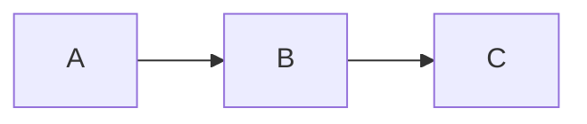

# Markdown Studio

Professional Markdown document generator with full syntax support and image embedding capabilities.

## Features

- 📝 **Full Markdown Syntax**: Headers, lists, tables, code blocks, math
- 🖼️ **Image Embedding**: Base64 embedding or local file references
- 📊 **Tables & Diagrams**: Mermaid, ASCII art, formatted tables
- 🎨 **Professional Templates**: Technical docs, README, reports
- 🔤 **Code Highlighting**: Syntax highlighting for 100+ languages
- 📐 **Math Formulas**: LaTeX math support
- 🌍 **Multi-Language**: Unicode native - Chinese, English, Japanese, Korean, etc.
- ✅ **Cross-Platform**: Works on Windows, macOS, Linux
- 📱 **GitHub Compatible**: Renders perfectly on GitHub/GitLab/VS Code

## Trigger Conditions

- "帮我写Markdown文档" / "Write a Markdown document"
- "生成README" / "Generate README"
- "写技术文档" / "Create technical documentation"
- "制作报告" / "Create a report"
- "写Wiki" / "Write wiki pages"
- "markdown-studio"

## Document Types

### Technical (技术文档)
- README.md
- API Documentation
- Architecture Design
- Technical Specifications
- Deployment Guide
- Contributing Guide

### Business (商务文档)
- Project Report
- Meeting Minutes
- Proposal
- White Paper
- Case Study

### Academic (学术文档)
- Research Notes
- Literature Review
- Lab Report
- Thesis Outline

### Personal (个人文档)
- Blog Post
- Tutorial
- Cheatsheet
- Knowledge Base

---

## Step 1: Understand Requirements

```
请提供以下信息：

文档类型：（README/API文档/技术报告/其他）
文档标题：
主要内容：
图片需求：（是否需要插入图片）
格式要求：（GitHub兼容/标准Markdown）
语言：（中文/英文）
特殊要求：（表格/代码/数学公式等）
```

---

## Step 2: Generate Markdown

### Python Script Template

```python
python3 << 'PYEOF'
import os
import base64
from datetime import datetime
from pathlib import Path

class MarkdownGenerator:
    def __init__(self, config):
        self.config = config
        self.content = []
        self.toc_entries = []
        
    def add_header(self, text, level=1):
        """Add header with anchor"""
        anchor = text.lower().replace(' ', '-').replace('/', '-')
        self.content.append(f"\n{'#' * level} {text}\n")
        if level <= 2:
            self.toc_entries.append((level, text, anchor))
        return self
    
    def add_paragraph(self, text):
        """Add paragraph"""
        self.content.append(f"\n{text}\n")
        return self
    
    def add_bold(self, text):
        """Add bold text"""
        return f"**{text}**"
    
    def add_italic(self, text):
        """Add italic text"""
        return f"*{text}*"
    
    def add_code_inline(self, code):
        """Add inline code"""
        return f"`{code}`"
    
    def add_code_block(self, code, language=''):
        """Add code block with syntax highlighting"""
        self.content.append(f"\n```{language}\n{code}\n```\n")
        return self
    
    def add_table(self, headers, rows, align=None):
        """Add formatted table"""
        if align is None:
            align = ['left'] * len(headers)
        
        # Header
        header_row = '| ' + ' | '.join(headers) + ' |'
        self.content.append(f"\n{header_row}")
        
        # Separator
        separators = []
        for a in align:
            if a == 'center':
                separators.append(':---:')
            elif a == 'right':
                separators.append('---:')
            else:
                separators.append('---')
        separator_row = '| ' + ' | '.join(separators) + ' |'
        self.content.append(separator_row)
        
        # Data rows
        for row in rows:
            data_row = '| ' + ' | '.join(str(cell) for cell in row) + ' |'
            self.content.append(data_row)
        
        self.content.append('')
        return self
    
    def add_image(self, image_path, alt_text='', width=None, embed=False):
        """Add image with embedding option"""
        if embed and os.path.exists(image_path):
            # Base64 embedding
            with open(image_path, 'rb') as f:
                img_data = base64.b64encode(f.read()).decode()
            ext = Path(image_path).suffix.lower()
            mime = {
                '.png': 'image/png',
                '.jpg': 'image/jpeg',
                '.jpeg': 'image/jpeg',
                '.gif': 'image/gif',
                '.svg': 'image/svg+xml',
                '.webp': 'image/webp'
            }.get(ext, 'image/png')
            
            if width:
                self.content.append(f'\n\n')
            else:
                self.content.append(f'\n\n')
        else:
            # File reference
            if width:
                self.content.append(f'\n\n')
            else:
                self.content.append(f'\n\n')
        
        return self
    
    def add_image_centered(self, image_path, alt_text='', width='80%', embed=False):
        """Add centered image using HTML"""
        if embed and os.path.exists(image_path):
            with open(image_path, 'rb') as f:
                img_data = base64.b64encode(f.read()).decode()
            ext = Path(image_path).suffix.lower()
            mime = {
                '.png': 'image/png',
                '.jpg': 'image/jpeg',
                '.jpeg': 'image/jpeg',
                '.gif': 'image/gif',
                '.svg': 'image/svg+xml',
                '.webp': 'image/webp'
            }.get(ext, 'image/png')
            src = f"data:{mime};base64,{img_data}"
        else:
            src = image_path
        
        self.content.append(f'\n<div align="center">\n  \n</div>\n')
        return self
    
    def add_mermaid(self, diagram_type, content):
        """Add Mermaid diagram"""
        self.content.append(f'\n```mermaid\n{diagram_type}\n{content}\n```\n')
        return self
    
    def add_math(self, formula, block=False):
        """Add LaTeX math formula"""
        if block:
            self.content.append(f'\n$$\n{formula}\n$$\n')
        else:
            return f"${formula}$"
        return self
    
    def add_list(self, items, ordered=False):
        """Add list"""
        self.content.append('')
        for i, item in enumerate(items):
            if ordered:
                self.content.append(f"{i+1}. {item}")
            else:
                self.content.append(f"- {item}")
        self.content.append('')
        return self
    
    def add_task_list(self, items):
        """Add task list"""
        self.content.append('')
        for item, checked in items:
            mark = 'x' if checked else ' '
            self.content.append(f"- [{mark}] {item}")
        self.content.append('')
        return self
    
    def add_blockquote(self, text):
        """Add blockquote"""
        lines = text.split('\n')
        quoted = '\n'.join(f"> {line}" for line in lines)
        self.content.append(f"\n{quoted}\n")
        return self
    
    def add_horizontal_rule(self):
        """Add horizontal rule"""
        self.content.append("\n---\n")
        return self
    
    def add_details(self, summary, content):
        """Add collapsible section"""
        self.content.append(f"\n<details>\n<summary>{summary}</summary>\n\n{content}\n\n</details>\n")
        return self
    
    def add_badge(self, text, color='blue'):
        """Add badge (GitHub style)"""
        return f"}-{color})"
    
    def generate_toc(self):
        """Generate table of contents"""
        toc = "\n## Table of Contents\n\n"
        for level, text, anchor in self.toc_entries:
            indent = "  " * (level - 1)
            toc += f"{indent}- [{text}](#{anchor})\n"
        return toc
    
    def render(self, include_toc=True):
        """Render final Markdown"""
        result = ""
        
        # Add TOC if requested
        if include_toc and len(self.toc_entries) > 2:
            result += self.generate_toc()
            result += "\n---\n"
        
        # Add main content
        result += '\n'.join(self.content)
        
        return result
    
    def save(self, output_path, include_toc=True):
        """Save to file"""
        content = self.render(include_toc)
        
        # Create directory if needed
        os.makedirs(os.path.dirname(output_path) or '.', exist_ok=True)
        
        with open(output_path, 'w', encoding='utf-8') as f:
            f.write(content)
        
        return output_path

# 示例使用
def create_sample_document():
    config = {
        'title': 'Project Documentation',
        'include_toc': True
    }
    
    md = MarkdownGenerator(config)
    
    # 添加标题
    md.add_header('Project Name', 1)
    md.add_paragraph('A brief description of the project.')
    
    # 添加徽章
    badges = " ".join([
        md.add_badge('version-1.0.0', 'blue'),
        md.add_badge('license-MIT', 'green'),
        md.add_badge('build-passing', 'brightgreen')
    ])
    md.add_paragraph(badges)
    
    # 添加功能列表
    md.add_header('Features', 2)
    md.add_list([
        'Feature 1: Description',
        'Feature 2: Description',
        'Feature 3: Description'
    ])
    
    # 添加代码示例
    md.add_header('Installation', 2)
    md.add_code_block('npm install my-package', 'bash')
    
    # 添加表格
    md.add_header('API Reference', 2)
    md.add_table(
        ['Method', 'Description', 'Parameters'],
        [
            ['getData()', 'Fetches data', 'id: string'],
            ['setData()', 'Updates data', 'id, value'],
            ['deleteData()', 'Deletes data', 'id: string']
        ],
        ['left', 'left', 'left']
    )
    
    # 添加数学公式
    md.add_header('Mathematical Formula', 2)
    md.add_paragraph(f"The formula is: {md.add_math('E = mc^2')}")
    
    # 添加Mermaid图表
    md.add_header('Architecture', 2)
    md.add_mermaid('graph TD', '''
    A[Client] --> B[Server]
    B --> C[Database]
    B --> D[Cache]
    ''')
    
    # 添加折叠部分
    md.add_details('Click to expand', 'Hidden content here')
    
    return md

# 生成示例文档
output_dir = os.environ.get('OPENCLAW_WORKSPACE', os.getcwd())
output_path = os.path.join(output_dir, 'sample-document.md')

md = create_sample_document()
md.save(output_path)

print(f"✅ Markdown文档已生成：{output_path}")
PYEOF
```

---

## Image Handling (图片处理)

### Image Embedding Options

```python
def handle_image(image_path, embed_mode='auto'):
    """
    Handle image based on embed_mode:
    - 'auto': Embed small images (<100KB), reference large ones
    - 'embed': Always embed as base64
    - 'reference': Always use file reference
    - 'url': Convert to URL if possible
    """
    
    file_size = os.path.getsize(image_path)
    
    if embed_mode == 'auto':
        if file_size < 100 * 1024:  # < 100KB
            return embed_image(image_path)
        else:
            return reference_image(image_path)
    elif embed_mode == 'embed':
        return embed_image(image_path)
    elif embed_mode == 'reference':
        return reference_image(image_path)
    
def embed_image(image_path):
    """Embed image as base64"""
    with open(image_path, 'rb') as f:
        data = base64.b64encode(f.read()).decode()
    ext = os.path.splitext(image_path)[1].lower()
    mime = get_mime_type(ext)
    return f""

def reference_image(image_path):
    """Use file reference"""
    return f""

def get_mime_type(ext):
    """Get MIME type from extension"""
    types = {
        '.png': 'image/png',
        '.jpg': 'image/jpeg',
        '.jpeg': 'image/jpeg',
        '.gif': 'image/gif',
        '.svg': 'image/svg+xml',
        '.webp': 'image/webp'
    }
    return types.get(ext, 'image/png')
```

### Image Layout Options

```python
# 居中图片


# 左对齐


# 右对齐


# 并排图片
<table><tr>
<td></td>
<td></td>
</tr></table>
```

---

## Template Library

### README Template

```markdown
# Project Name

[]()
[]()

> Brief description of the project

## Features

- Feature 1
- Feature 2
- Feature 3

## Installation

\`\`\`bash
npm install package-name
\`\`\`

## Usage

\`\`\`javascript
import { something } from 'package-name';
\`\`\`

## API Reference

| Method | Description |
|--------|-------------|
| method1() | Does something |

## Contributing

Please read CONTRIBUTING.md for details.

## License

This project is licensed under the MIT License.
```

### Technical Report Template

```markdown
# Technical Report: [Title]

**Author:** Name  
**Date:** YYYY-MM-DD  
**Version:** 1.0

---

## Executive Summary

Brief overview...

## Table of Contents

- [Section 1](#section-1)
- [Section 2](#section-2)

## 1. Introduction

Content...

## 2. Methodology

Content with code:

\`\`\`python
def method():
    pass
\`\`\`

## 3. Results

| Metric | Value | Change |
|--------|-------|--------|
| Metric1 | 100 | +10% |

## 4. Conclusion

Summary...

## References

1. Reference 1
2. Reference 2
```

---

## Syntax Reference

### Headers
```markdown
# H1
## H2
### H3
#### H4
##### H5
###### H6
```

### Emphasis
```markdown
**bold**
*italic*
***bold italic***
~~strikethrough==
```

### Lists
```markdown
- Unordered item
- Another item

1. Ordered item
2. Another item

- [ ] Task unchecked
- [x] Task checked
```

### Links & Images
```markdown
[Link text](url)

[Reference link][ref]

[ref]: url
```

### Code
```markdown
`inline code`

\`\`\`python
# Code block with syntax highlighting
def hello():
    print("Hello")
\`\`\`
```

### Tables
```markdown
| Left | Center | Right |
|:-----|:------:|------:|
| L    | C      | R     |
```

### Math
```markdown
Inline: $E = mc^2$

Block:
$$
\sum_{i=1}^{n} x_i
$$
```

### Diagrams (Mermaid)
````markdown

````

### Collapsible
```markdown
<details>
<summary>Click to expand</summary>

Hidden content

</details>
```

---

## Compatibility

### GitHub/GitLab Support

| Feature | GitHub | GitLab | VS Code |
|---------|--------|--------|---------|
| Headers | ✅ | ✅ | ✅ |
| Tables | ✅ | ✅ | ✅ |
| Code blocks | ✅ | ✅ | ✅ |
| Mermaid | ✅ | ✅ | ✅ |
| Math (LaTeX) | ✅ | ✅ | ✅ |
| Task lists | ✅ | ✅ | ✅ |
| Collapsible | ✅ | ✅ | ✅ |
| Base64 images | ✅ | ✅ | ✅ |

---

## Notes

- All Markdown features are GitHub-compatible
- Base64 images work but increase file size
- Mermaid diagrams render on GitHub/GitLab
- Math formulas use LaTeX syntax
- Tables support alignment options
