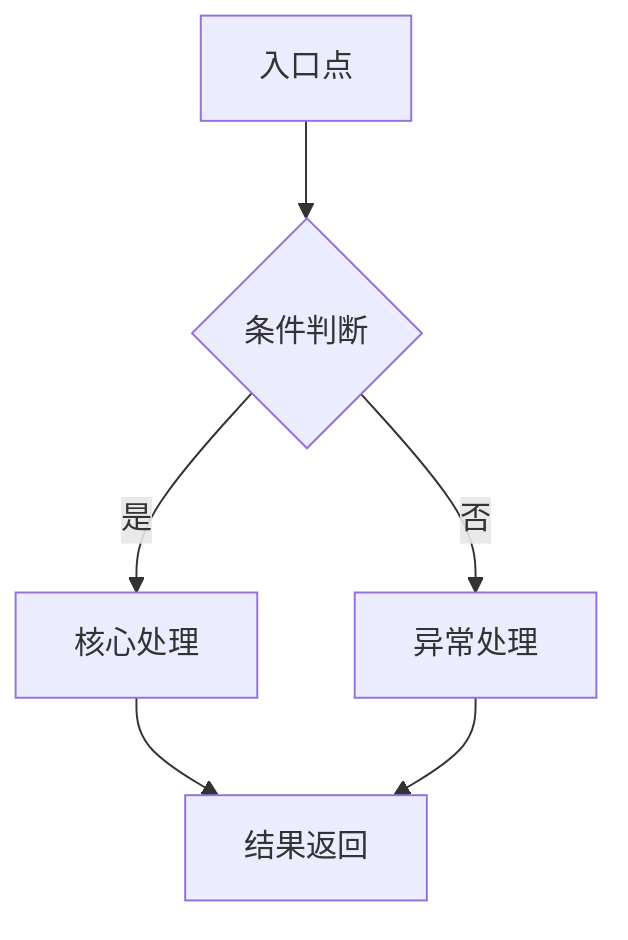

# 核心机制分析模板

## 技术名称: {{TECHNOLOGY_NAME}}

### 1. 核心算法与数据结构
**主要算法**: 
- {{MAIN_ALGORITHM}}
- 时间复杂度: {{TIME_COMPLEXITY}}
- 空间复杂度: {{SPACE_COMPLEXITY}}

**关键数据结构**:
- {{KEY_DATA_STRUCTURES}}
- 内存占用估算: {{MEMORY_USAGE}}

### 2. 执行流程分析
**典型执行路径**:

**关键控制流**:
- {{CONTROL_FLOW_DESCRIPTION}}
- 并发处理机制: {{CONCURRENCY_MECHANISM}}

### 3. 性能特征
**吞吐量**: {{THROUGHPUT}} TPS/QPS (±5%)
**延迟分布**: 
- P50: {{P50_LATENCY}} ms
- P95: {{P95_LATENCY}} ms  
- P99: {{P99_LATENCY}} ms

**资源消耗**:
- CPU使用率: {{CPU_USAGE}}%
- 内存峰值: {{PEAK_MEMORY}} MB
- I/O模式: {{IO_PATTERN}}

### 4. 边界条件与异常处理
**边界情况**:
- {{BOUNDARY_CONDITIONS}}
- 超时处理: {{TIMEOUT_HANDLING}}

**错误恢复**:
- {{ERROR_RECOVERY_STRATEGY}}
- 重试机制: {{RETRY_MECHANISM}}

### 5. 可扩展性分析
**水平扩展**: {{HORIZONTAL_SCALING}}
**垂直扩展**: {{VERTICAL_SCALING}}
**瓶颈点**: {{BOTTLENECKS}}

### 6. 量化指标汇总
| 指标 | 数值 | 置信区间 |
|------|------|----------|
| 算法效率 | {{ALGORITHM_EFFICIENCY}} | ±{{CONFIDENCE_INTERVAL}}% |
| 资源利用率 | {{RESOURCE_UTILIZATION}}% | ±{{RESOURCE_CONFIDENCE}}% |
| 可靠性评分 | {{RELIABILITY_SCORE}}/10 | {{RELIABILITY_CONFIDENCE}}% |
| 扩展性评分 | {{SCALABILITY_SCORE}}/10 | {{SCALABILITY_CONFIDENCE}}% |

### 7. 验证方法
**测试覆盖**:
- {{TEST_COVERAGE}}
- 基准测试结果: {{BENCHMARK_RESULTS}}

**验证来源**:
- 官方文档: {{OFFICIAL_DOCS}}
- 源码分析: {{SOURCE_CODE_ANALYSIS}}
- 第三方评测: {{THIRD_PARTY_REVIEWS}}