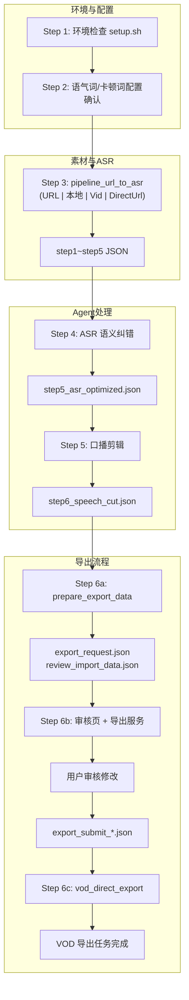

# 功能描述

**byted-mediakit-voiceover-editing**：口播视频一站式剪辑技能。从视频/音频素材到 VOD 导出的完整流水线。

## Agent 快速识别

| 项目         | 说明                                                                                 |
| ------------ | ------------------------------------------------------------------------------------ |
| **触发词**   | 口播剪辑、剪口播、剪视频、去掉停顿、处理音频、导出口播、自动剪辑、去除口误、视频剪辑 |
| **输入**     | 视频/音频 URL、本地文件、VOD Vid、DirectUrl（空间内文件名）                          |
| **核心能力** | ASR 转写 → 语义纠错 → 口癖/重复/静音剪辑（EDL） → 审核页修改 → VOD 导出              |
| **输出**     | 剪辑后的视频（VOD OutputVid + PlayURL）                                              |
| **前置**     | 完成 `SKILL.md` 阅读；按顺序执行 Step 1～6c，不得跳步                                |

## 规则

1.  请完成阅读 SKILL.MD
2.  禁止重新生成脚本
3.  需要根据环境变量 `TALKING_VIDEO_AUTO_EDIT_REVIEW_AUTO_OPEN` 是否打开审核页面：审核页启动时是否自动打开浏览器（默认不打开；0 表示不打开，1 打开）
4.  各个任务间相互隔离
5.  需要使用绝对路径运行。

# 环境变量配置

**注册表元数据**：`SKILL.md` frontmatter 中 `env[].required/secret` 与本表一致；必填项为 VOD + ASR 运行所必需。**安全**：请使用最小权限密钥与独立测试点播空间；`.env` 仅本地保存，勿提交仓库（本目录已提供 `.gitignore`）。

**依赖锁定**：Python 依赖在 `scripts/requirements.txt` 中以 `==` 固定主版本；`setup.sh` 使用 `python -m venv` 创建 `scripts/.venv` 并执行 `pip install -r requirements.txt`。间接依赖由安装时 PyPI 元数据解析；若需全量字节级复现，可在受控环境自行导出 `pip freeze` 清单使用。

| 变量名                                     | 备注                                                                                                    | 默认值                                                 | 是否必选           |
| ------------------------------------------ | ------------------------------------------------------------------------------------------------------- | ------------------------------------------------------ | ------------------ |
| `VOLC_ACCESS_KEY_ID`                       | 火山引擎 Access Key ID                                                                                  | -                                                      | 必选               |
| `VOLC_ACCESS_KEY_SECRET`                   | 火山引擎 Access Key Secret                                                                              | -                                                      | 必选               |
| `VOLC_SPACE_NAME`                          | 火山引擎点播空间名称                                                                                    | -                                                      | 必选               |
| `VOLC_HOST`                                | VOD API 主机                                                                                            | `vod.volcengineapi.com`                                | 可选               |
| `VOLC_REGION`                              | VOD 区域                                                                                                | `cn-north-1`                                           | 可选               |
| `ASR_API_KEY`                              | 豆包语音转写 API Key                                                                                    | -                                                      | 必选（ASR/剪辑时） |
| `ASR_BASE_URL`                             | 豆包语音转写 API Base URL                                                                               | `https://openspeech.bytedance.com/api/v3/auc/bigmodel` | 可选               |
| `VOD_EXPORT_SKIP_SUBTITLE`                 | 导出时跳过字幕压制；默认跳过，`0` 表示启用字幕压制， `1` 表示跳过                                       | 跳过字幕压制                                           | 可选               |
| `TALKING_VIDEO_AUTO_EDIT_REVIEW_AUTO_OPEN` | 审核页启动时是否自动打开浏览器；默认不打开，`1` 表示打开，`0`标识不打开，**打开审核页面需要在本地环境** | 不打开审核页面                                         | 可选               |
| `TALKING_VIDEO_AUTO_EDIT_VIDEO_CUT`        | 导出时是否进行视频剪辑；`1` 且（有字幕或音频静音）时移除 mute 段、主时间轴从 0 无缝拼接                 | `1` 进行视频剪辑                                       | 可选               |

# 流程图

