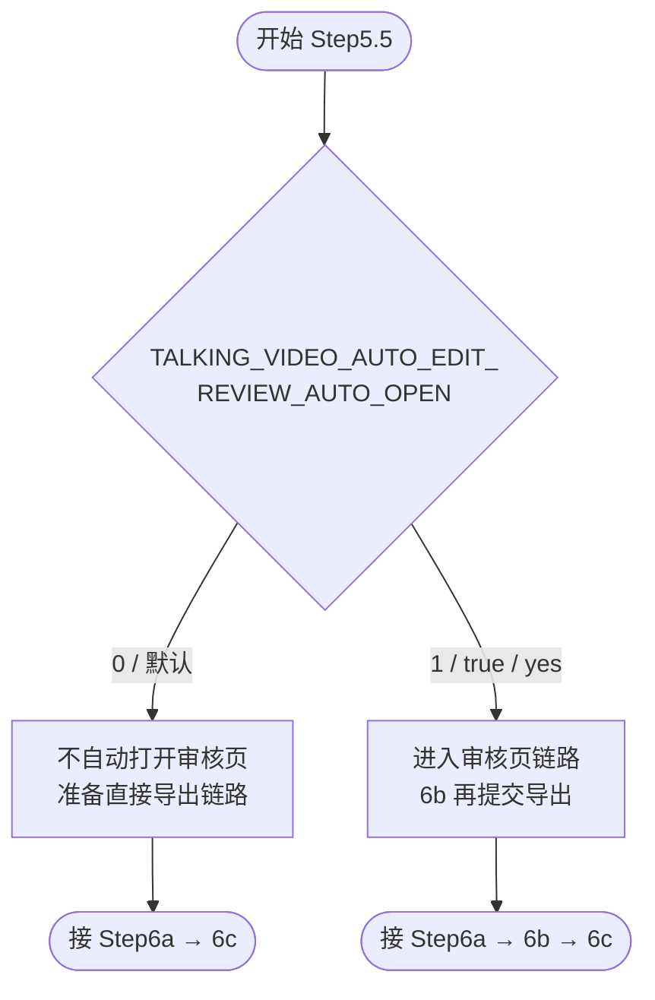

# Step5.5: 审核逻辑确认（是否打开审核页面）

> **目标**：根据环境变量决定后续是「先审后导出」还是「直接进入导出准备」
>
> **SKILL_DIR**：指 `byted-mediakit-voiceover-editing` 目录路径
>
> **关键变量**：`TALKING_VIDEO_AUTO_EDIT_REVIEW_AUTO_OPEN`（见主 SKILL frontmatter 说明）

# 检查单

- [ ] **启动审核页面前置判断**：查看环境变量 `TALKING_VIDEO_AUTO_EDIT_REVIEW_AUTO_OPEN` 判断是否打开，0 不打开、1 打开，根据信息控制 Step6b 审核页面打开逻辑
  - [ ] 不打开的情况下需要直接进行视频导出（进入 6a → 6c 路径，跳过人工在审核页的交互）
  - [ ] 打开情况下需要不直接进行视频导出（需经过 6b 审核与导出服务交互后再 6c）

# 使用流程示意

