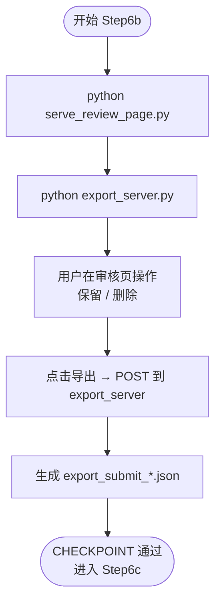

# Step6b: 审核与导出

> **目标**：本地启动审核页与导出服务，由用户在页面完成字幕/句级决策后提交导出数据
>
> **SKILL_DIR**：指 `byted-mediakit-voiceover-editing` 目录路径
>
> **前置要求**：必须先 `cd ./scripts` 并激活 `scripts/.venv`；默认是否自动打开浏览器由 `TALKING_VIDEO_AUTO_EDIT_REVIEW_AUTO_OPEN` 决定，可加 `--no-open` 覆盖

# 检查单

- [ ] **示例参考**：`examples/step6_speech_cut.json`
- [ ] **启动审核页面前置判断**：默认不自动打开；是否打开由 `TALKING_VIDEO_AUTO_EDIT_REVIEW_AUTO_OPEN` 决定（`1`/`true`/`yes` 时打开）。
- [ ] **启动审核页服务**：`python ./serve_review_page.py [--output-dir output/<文件名>]`（默认 5173，端口冲突时自动使用其他端口，以启动时打印的 URL 为准）
- [ ] **启动导出服务**：`python ./export_server.py [--output-dir output/<文件名>]`（默认 http://127.0.0.1:7860/export）
- [ ] **审核页**：默认不自动打开；是否打开由 `TALKING_VIDEO_AUTO_EDIT_REVIEW_AUTO_OPEN` 决定（`1`/`true`/`yes` 时打开）。用户可手动打开启动时打印的 URL（默认 http://127.0.0.1:5173），点击「从 API 加载」或自动加载 review_import_data；命令行可加 `--no-open` 覆盖
- [ ] **用户审核**：修改字幕、删除/保留句、调整时间
- [ ] **操作仅两类**：**保留**（原样输出）| **删除**（可恢复）
  - 删除-音频：`a_volume: 0` 静音，恢复时设为 1
  - 删除-字幕：`Extra[transform].Alpha: 0` 隐藏画布渲染，恢复时设为 1
- [ ] **导出**：点击「导出」，提交至 `export_server`，数据保存至 `output/export_submit_<ts>.json`
- [ ] **CHECKPOINT**：用户完成审核并成功导出，Agent 可读取 `export_submit_*.json` 反馈结果

# 使用流程示意

