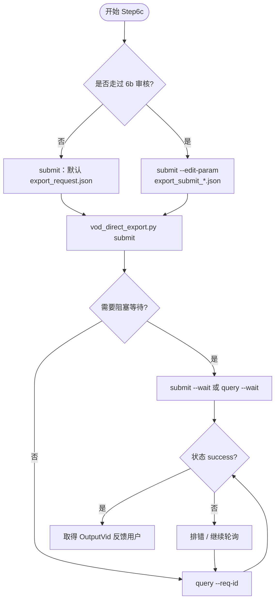

# Step6c: VOD 导出任务提交与查询

> **目标**：向火山 VOD 提交直接剪辑任务并轮询结果，获得 OutputVid 等成功产物
>
> **SKILL_DIR**：指 `byted-mediakit-voiceover-editing` 目录路径
>
> **前置要求**：必须先 `cd ./scripts` 并激活 `scripts/.venv`；依赖 `.env` 中 `VOLC_*` 等配置

# 检查单

- [ ] **提交任务**：`python ./vod_direct_export.py submit [--output-dir output/<文件名>]`
  - 默认读取 `output/<文件名>/export_request.json`（跳过审核则用 6a 产出）
  - 审核后导出：`python ./vod_direct_export.py submit --edit-param output/<文件名>/export_submit_<ts>.json`
  - 等待完成：`python ./vod_direct_export.py submit --wait`
  - UploadInfo：`--space-name`、`--video-name`、`--file-name` 覆盖 JSON 内值
- [ ] **查询结果**：`python ./vod_direct_export.py query --req-id <ReqId>`
  - 轮询直到完成：`python ./vod_direct_export.py query --req-id <ReqId> --wait`
- [ ] **CHECKPOINT**：任务 success 时获得 OutputVid，可反馈用户

# 使用流程示意

