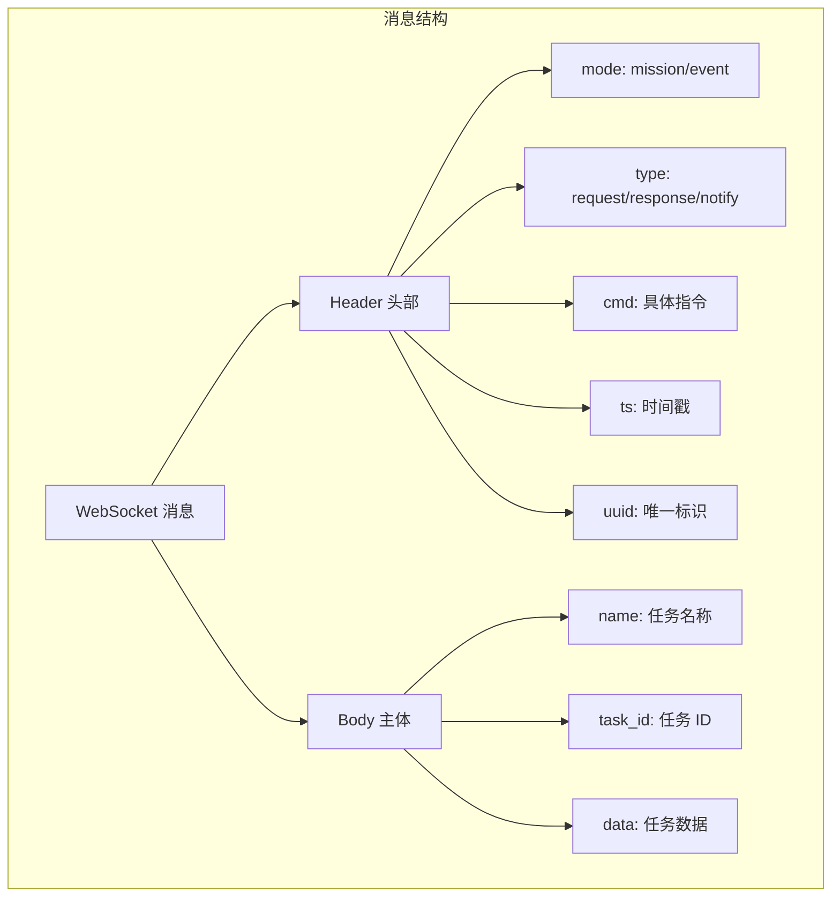
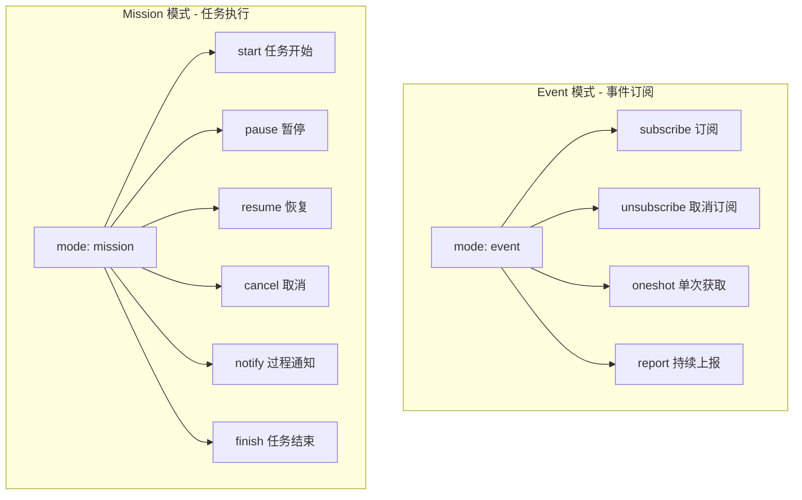
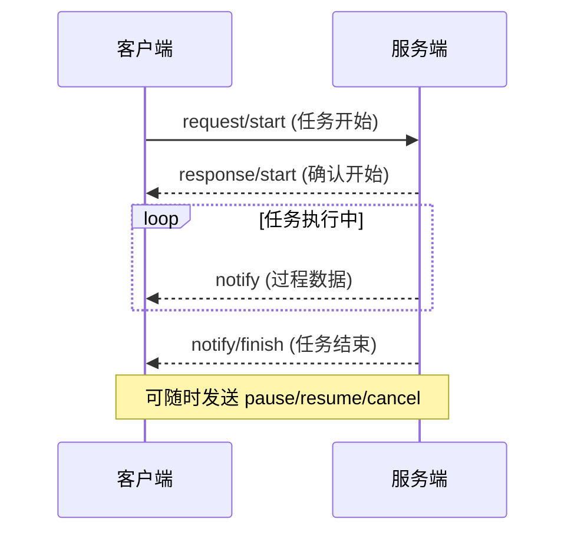
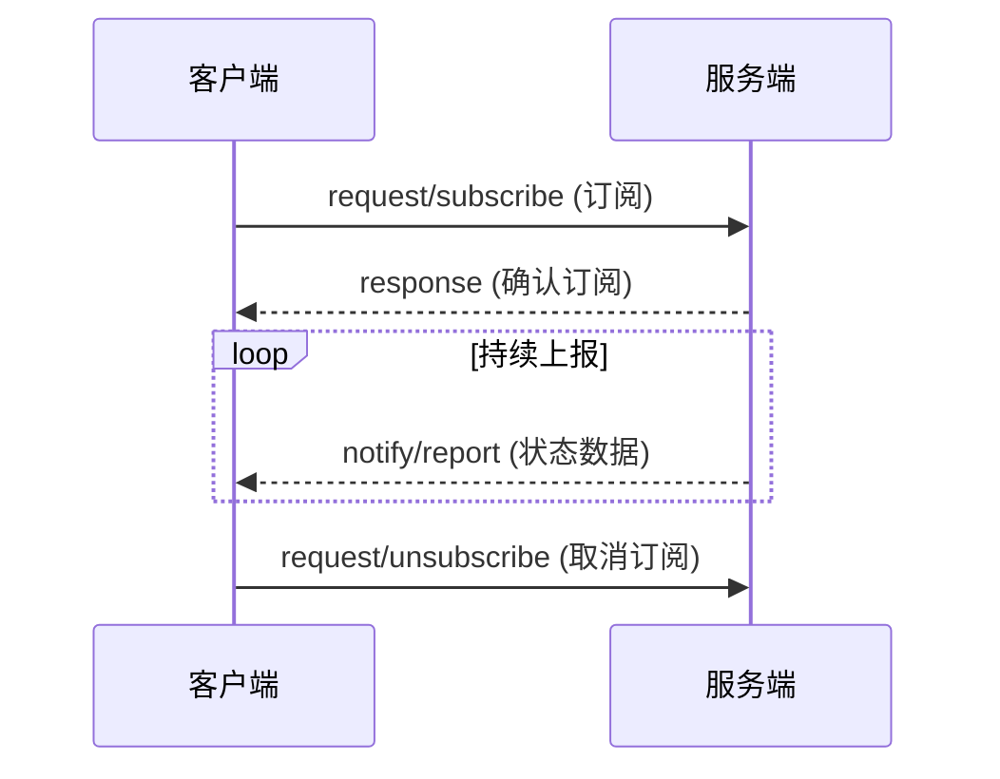
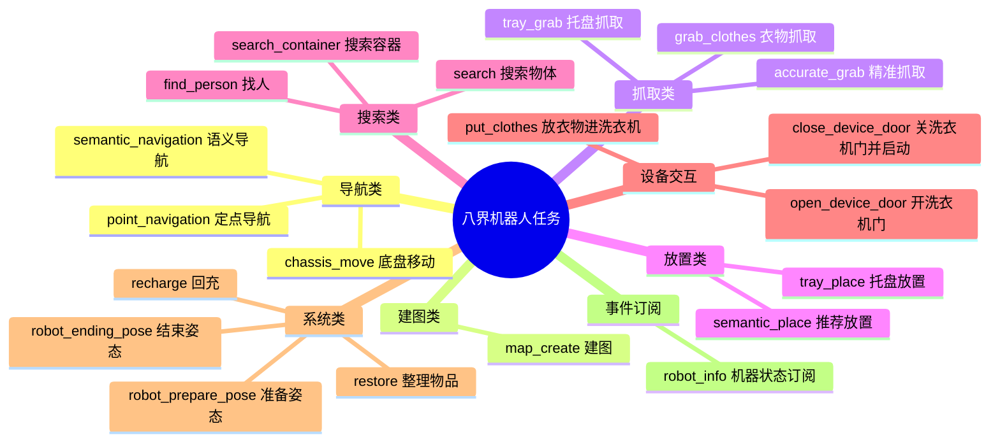
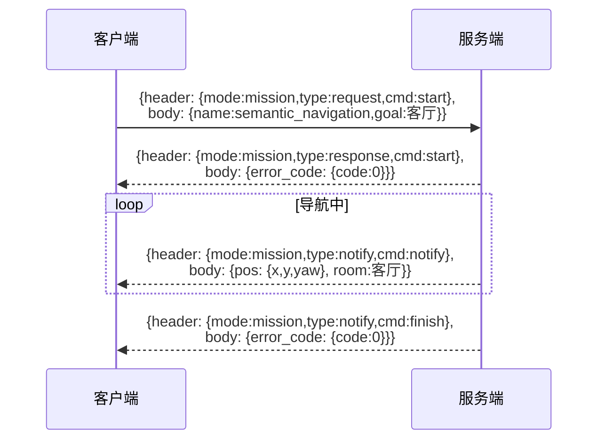

# 八界机器人 WebSocket 通信协议流程图

## 1. 协议基础结构



## 2. 两种通信模式



## 3. Mission 模式任务流程



## 4. Event 模式数据流



## 5. 任务类型总览



## 6. 完整通信示例 - 语义导航



## 7. 连接信息

- **WebSocket 地址**: `ws://10.10.10.12:9900`
- **通信方式**: 以太网 WebSocket
- **数据格式**: JSON
- **连接模式**: 一对一通讯（任务调度系统）

## 8. 关键字段说明

| 字段 | 类型 | 说明 |
|------|------|------|
| mode | string | mission(任务模式) / event(订阅模式) |
| type | string | request(请求) / response(应答) / notify(通知) |
| cmd | string | 具体指令 (start/pause/resume/cancel/subscribe 等) |
| uuid | string | 唯一标识，关联上下文共用 |
| ts | number | 时间戳 (秒) |
| task_id | string | 任务唯一 ID，客户端生成 |
| name | string | 任务/事件名称 |
| data | object | 具体任务数据 |

## 9. 错误码结构

```json
{
  "error_code": {
    "code": 0,
    "module": "模块名",
    "msg": "错误信息",
    "version_info": "版本信息"
  }
}
```

- `code: 0` 表示成功
- `code: 非 0` 表示失败，查看 module 和 msg
