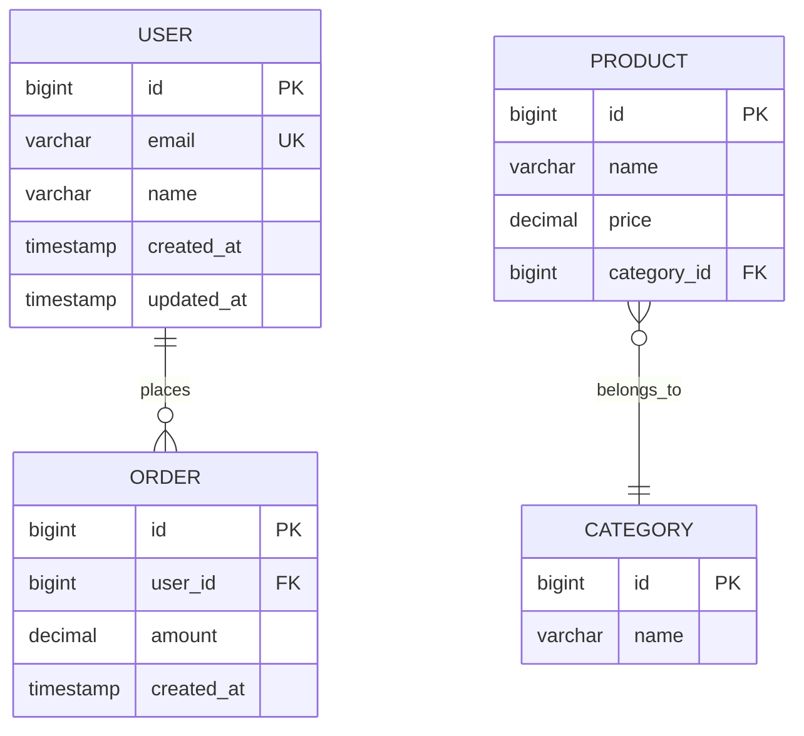

# 数据库分析指南

## Entity 类分析

### JPA Entity (Java)

```java
@Entity
@Table(name = "users", indexes = {
    @Index(name = "idx_email", columnList = "email")
})
public class User {
    @Id
    @GeneratedValue(strategy = GenerationType.IDENTITY)
    private Long id;
    
    @Column(nullable = false, unique = true, length = 100)
    private String email;
    
    @Column(length = 50)
    private String name;
    
    @OneToMany(mappedBy = "user", cascade = CascadeType.ALL)
    private List<Order> orders;
    
    @CreatedDate
    private LocalDateTime createdAt;
    
    @LastModifiedDate
    private LocalDateTime updatedAt;
}
```

**提取信息：**
- 表名：users
- 字段：id, email, name, created_at, updated_at
- 索引：idx_email (email)
- 约束：email 唯一、非空
- 关系：一对多 (Order)

### MyBatis Entity (Java)

```java
@Data
@TableName("orders")
public class Order {
    @TableId(type = IdType.AUTO)
    private Long id;
    
    @TableField("user_id")
    private Long userId;
    
    private BigDecimal amount;
    
    @TableField(fill = FieldFill.INSERT)
    private LocalDateTime createdAt;
    
    @Version
    private Integer version;
}
```

### TypeORM Entity (Node.js)

```typescript
@Entity("products")
@Index(["categoryId", "name"])
export class Product {
    @PrimaryGeneratedColumn()
    id: number;
    
    @Column({ length: 100 })
    name: string;
    
    @Column({ type: "decimal", precision: 10, scale: 2 })
    price: number;
    
    @ManyToOne(() => Category)
    @JoinColumn({ name: "category_id" })
    category: Category;
}
```

### Sequelize Model (Node.js)

```javascript
const Product = sequelize.define('Product', {
    id: {
        type: DataTypes.INTEGER,
        primaryKey: true,
        autoIncrement: true
    },
    name: {
        type: DataTypes.STRING(100),
        allowNull: false
    },
    price: {
        type: DataTypes.DECIMAL(10, 2)
    }
}, {
    tableName: 'products',
    indexes: [
        { fields: ['category_id', 'name'] }
    ]
});
```

### Django Model (Python)

```python
class Product(models.Model):
    name = models.CharField(max_length=100, db_index=True)
    price = models.DecimalField(max_digits=10, decimal_places=2)
    category = models.ForeignKey(
        Category, 
        on_delete=models.CASCADE,
        db_index=True
    )
    created_at = models.DateTimeField(auto_now_add=True)
    
    class Meta:
        db_table = 'products'
        indexes = [
            models.Index(fields=['category', 'name'])
        ]
```

---

## SQL Migration 分析

### Flyway (Java)

```sql
-- V1__create_users_table.sql
CREATE TABLE users (
    id BIGINT PRIMARY KEY AUTO_INCREMENT,
    email VARCHAR(100) NOT NULL UNIQUE,
    name VARCHAR(50),
    created_at TIMESTAMP DEFAULT CURRENT_TIMESTAMP,
    updated_at TIMESTAMP DEFAULT CURRENT_TIMESTAMP ON UPDATE CURRENT_TIMESTAMP,
    INDEX idx_email (email)
);
```

### Liquibase (Java)

```yaml
# changelog.yaml
databaseChangeLog:
  - changeSet:
      id: 1
      author: dev
      changes:
        - createTable:
            tableName: users
            columns:
              - column:
                  name: id
                  type: BIGINT
                  autoIncrement: true
                  constraints:
                    primaryKey: true
              - column:
                  name: email
                  type: VARCHAR(100)
                  constraints:
                    nullable: false
                    unique: true
```

### Prisma Migration (Node.js)

```prisma
model User {
    id        Int      @id @default(autoincrement())
    email     String   @unique @db.VarChar(100)
    name      String?  @db.VarChar(50)
    orders    Order[]
    createdAt DateTime @default(now())
    updatedAt DateTime @updatedAt
    
    @@index([email])
}
```

---

## 输出格式

### 表结构文档

```markdown
## users 表

**描述：** 用户表

| 字段名 | 类型 | 约束 | 说明 |
|--------|------|------|------|
| id | BIGINT | PK, AUTO_INCREMENT | 主键 |
| email | VARCHAR(100) | NOT NULL, UNIQUE | 邮箱 |
| name | VARCHAR(50) | | 姓名 |
| created_at | TIMESTAMP | DEFAULT CURRENT_TIMESTAMP | 创建时间 |
| updated_at | TIMESTAMP | ON UPDATE CURRENT_TIMESTAMP | 更新时间 |

**索引：**
- PRIMARY KEY: id
- UNIQUE: email
- INDEX: idx_email (email)

**关系：**
- 一对多：orders (Order.user_id → User.id)
```

### ER 图生成

使用 Mermaid 语法：


