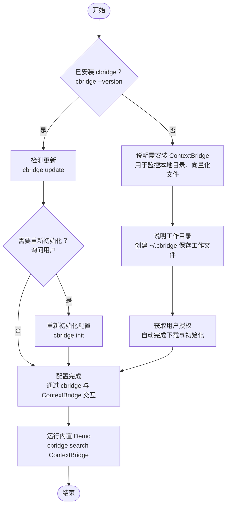

# ContextBridge 知识库

## 📚 工作原理

ContextBridge 为 OpenClaw 提供对你本地文档（Word、Excel、PDF、Markdown）的即时检索能力。

1. 本地索引：扫描文档并将文本切分为文本块。
2. 向量化：使用本地 AI 嵌入模型将文本转换为语义向量。
3. 语义搜索：从知识库中匹配最相关的文本块。

---

## 🚀 下载安装

cbridge 安装与初始化流程



### 1. 下载

> 🔓 **开源可信**：`cbridge-agent` 完全开源，代码托管于 [GitHub](https://github.com/whyischen/context-bridge)，可审计验证，本地运行无数据泄露风险。

```bash
pip install cbridge-agent
```

### 2. 初始化配置

```bash
cbridge init
```

因为软件主要为 AI 工具调用，推荐用户全部使用默认配置

### 3. 添加文档

```bash
cbridge watch add /path/to/your/documents
cbridge watch list    # 查看已监听文件夹
```

### 4. 运行测试 demo

```bash
cbridge search ContextBridge    # 搜索内置测试文档
```

---

## 💡 搜索最佳实践

1. 尽量做到无感使用，根据用户语义判断使用调用 `cbridge seatch` 检索本地内容
2. `cbridge seatch` 会返回与搜索相关的**文档片段**以及**文档路径**，根据文档片段**判断是否需要获取文档全部内容**。

### 什么时候使用 ContextBridge

1. 分析用户所提到的资料可能是内部资料时
2. 用户明确提出查看本地文档时

### 关键词提取

- 推荐：提取核心实体
  - `2024 marketing budget` ✅
- 不推荐：使用完整句子
  - `What was the budget for 2024 marketing` ❌

### 迭代搜索

1. 先用精准关键词
2. 若无结果，扩大查询范围
3. 尝试同义词或相关术语

---

## 📖 CLI 命令

```bash
# 初始化
cbridge init                 # 初始化工作区
cbridge lang en              # 切换语言

# 文档管理
cbridge watch add path     # 添加文件夹
cbridge watch remove path  # 移除文件夹
cbridge watch list           # 列出文件夹
cbridge index                # 手动重建索引

# 服务控制
cbridge start                # 启动服务
cbridge serve                # 仅启动 API
cbridge stop                 # 停止服务
cbridge status               # 查看状态
cbridge logs                 # 查看日志

# 搜索
cbridge search query       # 搜索文档
```

---

## 📚 资源链接

- GitHub：[whyischen/context-bridge](https://github.com/whyischen/context-bridge)
- 配置文件：`~.cbridgeconfig.yaml`
- 工作区：`~.cbridgeworkspace`
