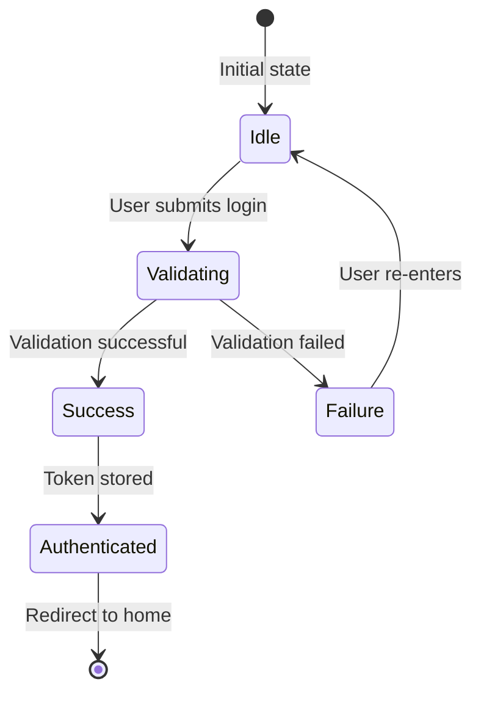

# Sample Output: Login Feature Technical Specification

> This is a sample technical specification generated using the technical-spec-design skill
> Refer to `sample_input.md` for original input

---

# User Login Feature Technical Specification

**Version:** V1.0
**Author:** Tech Team
**Date:** 2026-03-24

---

## 1. Requirements Overview

### 1.1 Background/Goals

**Business Background:**
The current system lacks user authentication functionality, preventing users from saving personal data and configurations, which limits user experience.

**Project Goals:**
Implement user login functionality supporting both email and phone number login methods to establish a foundation for user identity authentication.

**Validation Question:** Does this solve the real business problem of "users unable to save personal data"? ✅ Yes

### 1.2 Business Value

| Value Dimension | Specific Impact |
|-----------------|-----------------|
| **User Experience** | Users can save preferences, improving retention |
| **Data Accumulation** | Collect user behavior data to support product iteration |
| **Feature Foundation** | Establish foundation for future personalized features |

---

## 2. Requirements Analysis

### 2.1 Feature Breakdown

| Product Requirement | Involved Pages | Changes |
|---------------------|----------------|---------|
| Email password login | Login page | Email input, password input, login button |
| Phone verification code login | Login page | Phone input, verification code input, send code button |
| Login success redirect | Login page, Home page | Redirect logic, Token storage |
| Remember login state | Global | Cookie/LocalStorage management, Token refresh |

### 2.2 Use Case Analysis

**Normal Login Flow (Email):**
```
User enters login page → Enter email and password → Click login →
Verification successful → Generate Token → Store Token → Redirect to home
```

**Normal Login Flow (Phone):**
```
User enters login page → Switch to phone login →
Enter phone number → Click send code → Enter verification code →
Click login → Verification successful → Generate Token → Redirect to home
```

**Exception Flow:**
```
User enters wrong password → Login fails → Show error message →
Log failure → User re-enters credentials
```

### 2.3 Page Operation Details

| Operation | Constraints | Object | Content |
|-----------|-------------|--------|---------|
| Email login | Valid email format, password not empty | Login button | Trigger login API call |
| Send verification code | Valid phone format, 60s cooldown | Send code button | Call SMS API, start countdown |
| Remember me | Optional | Remember me checkbox | Set Token expiration |

---

## 3. Technical Design

### 3.1 LoginForm Component

**Used by:** Login page

**API Design:**

| Prop | Type | Required | Description | Default |
|------|------|----------|-------------|---------|
| loginType | 'email' \| 'phone' | ✓ | Login type | 'email' |
| onLoginSuccess | (user: User) => void | ✓ | Login success callback | - |
| rememberMe | boolean | ✗ | Remember login state | false |

**Component Implementation:**
- **Challenges:**
  - Verification code countdown state management
  - Switching between two login methods
  - Form validation
- **Dependencies:**
  - `useAuth` hook (authentication state management)
  - `useForm` hook (form management)
  - `useCountdown` hook (countdown timer)
- **Flow:**
  ```
  Initialize form → User input → Form validation →
  Call login API → Success→Store Token → Redirect
                → Failure→Show error
  ```

**Pseudocode:**
```typescript
// Pseudocode - component structure
type LoginFormProps = {
  loginType: 'email' | 'phone';
  onLoginSuccess: (user: User) => void;
  rememberMe?: boolean;
};

// Implementation:
// 1. email mode: email input + password input
// 2. phone mode: phone input + code input + send button
// 3. Form validation: required, format check
// 4. Login logic: call API, handle response
// 5. On success: store Token, trigger callback
```

---

### 3.2 TokenManager Module

**Module Responsibilities:**
Manage storage, refresh, and validation of user authentication Tokens.

**Implementation Notes:**
- Token stored in HttpOnly Cookie (XSS prevention)
- AccessToken valid for 1 hour
- RefreshToken valid for 7 days
- Auto-refresh mechanism

**Pseudocode:**
```typescript
// Pseudocode - Token management
interface TokenManager {
  // Store Token
  setTokens(accessToken: string, refreshToken: string): void;

  // Get AccessToken
  getAccessToken(): string | null;

  // Refresh Token
  refreshAccessToken(): Promise<string>;

  // Clear Token
  clearTokens(): void;

  // Validate Token
  isTokenValid(): boolean;
}
```

---

## 4. State Machine Design



---

## 5. Interface Design

| Endpoint | Purpose | Request | Response |
|----------|---------|---------|----------|
| POST /api/auth/login/email | Email password login | email, password | { accessToken, refreshToken, user } |
| POST /api/auth/login/phone | Phone code login | phone, code | { accessToken, refreshToken, user } |
| POST /api/auth/send-code | Send verification code | phone | { success, expireIn } |
| POST /api/auth/refresh | Refresh Token | refreshToken | { accessToken } |
| POST /api/auth/logout | Logout | - | { success } |

---

## 6. Technical Research

### 6.1 Token Storage Options

| Approach | Description | Pros | Cons | Dependencies |
|----------|-------------|------|------|--------------|
| LocalStorage | Browser local storage | Simple implementation | Vulnerable to XSS | - |
| Cookie (HttpOnly) | Server-set Cookie | XSS-proof, auto-sent | Requires server support | cookie-parser |
| Memory storage | Stored in memory variable | Most secure | Lost on refresh | - |

**Decision:** Use Cookie (HttpOnly) for RefreshToken, store AccessToken in memory.

### 6.2 Password Encryption Options

| Approach | Description | Pros | Cons | Dependencies |
|----------|-------------|------|------|--------------|
| MD5 | Hash encryption | Fast | Cracked, insecure | crypto |
| SHA256 | Hash encryption | More secure than MD5 | Rainbow table attacks | crypto |
| bcrypt | Adaptive hash | Rainbow table resistant, tunable cost | Slower computation | bcrypt |

**Decision:** Use bcrypt with cost factor of 12.

---

## 7. Analytics/Monitoring

| Event Key | Description | Monitoring Method |
|-----------|-------------|-------------------|
| login_attempt | Login attempt | SLS |
| login_success | Login success | SLS |
| login_failure | Login failure | SLS |
| password_insecure | Weak password attempt | Sentry |

---

## 8. Development Effort Estimate

| Technical Task | Owner | Hours |
|----------------|-------|-------|
| LoginForm component | Frontend A | 8 |
| TokenManager module | Frontend A | 6 |
| useAuth hook | Frontend B | 4 |
| Login API endpoints | Backend A | 12 |
| Verification code service | Backend A | 8 |
| Test case writing | QA | 8 |
| Integration testing | All | 4 |
| **Total** | - | **50 hours** |

---

## 9. Appendix

### 9.1 Glossary

| Term | Description |
|------|-------------|
| AccessToken | Access token, valid for 1 hour, used for API authentication |
| RefreshToken | Refresh token, valid for 7 days, used to obtain new AccessToken |
| bcrypt | Adaptive password hashing function |

### 9.2 References

- [RFC 6749: OAuth 2.0](https://datatracker.ietf.org/doc/html/rfc6749)
- [OWASP Password Storage Cheat Sheet](https://cheatsheetseries.owasp.org/cheatsheets/Password_Storage_Cheat_Sheet.html)
