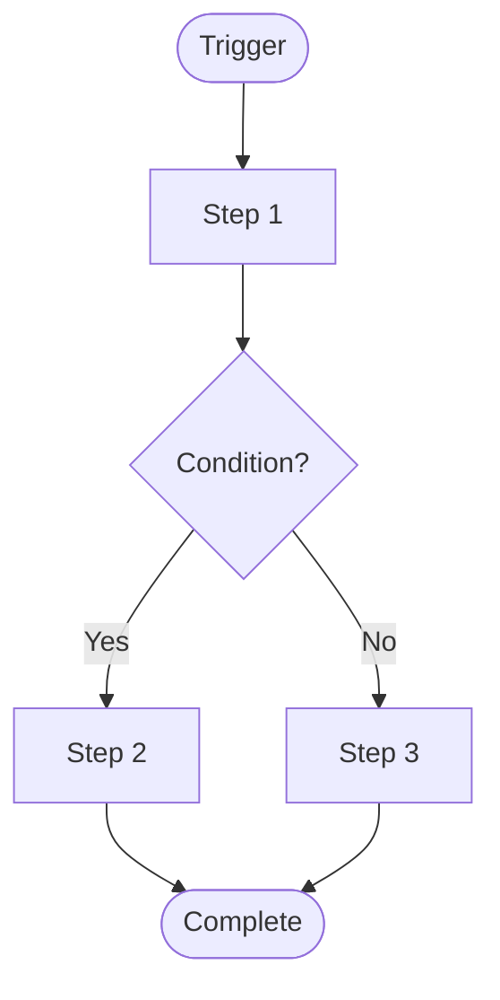

# Component Design Template

Copy this template to create detailed design documents for each component that needs design.

---

## ComponentName Component Design

### Overview

Brief description of the component's purpose and responsibilities.

### Used By

- Page A: Usage scenario description
- Page B: Usage scenario description

### UI Design

```
+----------------------------------+
|       Component UI Wireframe       |
|  [Can include ASCII art or         |
|   image links]                    |
+----------------------------------+
```

### API Design

#### Props

| Prop | Type | Required | Description | Default |
|------|------|----------|-------------|---------|
| propName | Type | ✓/✗ | Purpose description | defaultValue |

#### Events/Callbacks

| Event | Parameters | Description |
|-------|------------|-------------|
| onEvent | (param: Type) => void | Trigger condition description |

#### Slots (if applicable)

| Slot | Description |
|------|-------------|
| default | Default slot content |
| named | Named slot description |

### State Management

| State | Type | Initial Value | Description |
|-------|------|---------------|-------------|
| stateName | Type | initialValue | State description |

### Component Implementation

#### Challenges/Complexities

1. Challenge description
   - Solution
2. Challenge description
   - Solution

#### Dependencies

- External libraries: ...
- Other components: ...
- Utility functions: ...

#### Flow Chart



#### Pseudocode

```typescript
// Pseudocode - component structure
type ComponentProps = {
  // props definitions
};

// Implementation:
// 1. State initialization
// 2. Side effect handling
// 3. Event handling
// 4. Render logic
```

### Edge Cases

| Scenario | Handling |
|----------|----------|
| Empty data | Show empty state |
| Load failure | Show error message |
| Network timeout | Retry mechanism |

### Accessibility

- Keyboard navigation: ...
- Screen reader: ...
- ARIA attributes: ...

### Testing Checklist

- [ ] Normal rendering
- [ ] Props passed correctly
- [ ] Events trigger correctly
- [ ] Edge case handling
- [ ] Accessibility testing
