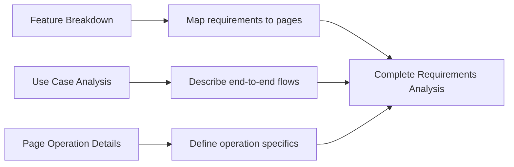

# Requirements Analysis Trifecta Template

Use this template to ensure completeness and consistency of requirements analysis.

---

## 1. Feature Breakdown

### Purpose

Convert product requirements into implementable technical features.

### Format

| Product Requirement | Involved Pages | Changes |
|---------------------|----------------|---------|
| Requirement description | Page name | Specific change description |

### Example

| Product Requirement | Involved Pages | Changes |
|---------------------|----------------|---------|
| Add persistent entry to order list | Order planning page | Use Tab component to switch between order plan and stock plan |
| Stock target confirmation | Stock plan page | Add stock target info, stock quantity info |

### Notes

1. **Product Requirement**: Feature described from user/product perspective
2. **Involved Pages**: Specific page where changes occur
3. **Changes**: Specific technical change content, not user actions

---

## 2. Use Case Analysis

### Purpose

Describe functionality from end-to-end business flow perspective.

### Format

```
User → Action1 → Action2 → Action3 → Complete
```

### Example

**Normal Flow:**
```
User enters order planning page → Click stock plan tab →
View stock target info → Click confirm → Stock quantity updates
```

**Exception Flow:**
```
User enters order planning page → Click stock plan tab →
Network request fails → Show error → User retries → Success
```

### Notes

1. Start from business flow, not single-page operations
2. Include both normal and exception flows
3. Clearly define trigger conditions and results for each step

---

## 3. Page Operation Details

### Purpose

Describe page-level specific operations and constraints.

### Format

| Operation | Constraints | Object | Content |
|-----------|-------------|--------|---------|
| Operation name | Usage constraint description | Operation object | Specific operation content |

### Example

| Operation | Constraints | Object | Content |
|-----------|-------------|--------|---------|
| Confirm stock target | Only operable when unconfirmed | Stock target card | Lock info after clicking confirm |
| Report exception | Must be outside store geofence | Waybill scan | Submit after selecting exception reason |

### Notes

1. **Operation**: Specific user behavior (click, input, select, etc.)
2. **Constraints**: Pre-conditions or limitations (permissions, state, location, etc.)
3. **Object**: Specific UI element or data object acted upon
4. **Content**: Specific effect of the operation

---

## Trifecta Relationship Diagram



---

## Common Mistakes

| Mistake | Correct Approach |
|---------|------------------|
| Confusing features with use cases | Features focus on requirement→page mapping, use cases focus on business flows |
| Only page operations without use cases | Use case analysis is cross-page business flow, essential |
| Operation details missing constraints | Must specify pre-conditions and constraints |
| Use case analysis as operation steps | Use case analysis is business flow, not operation manual |
