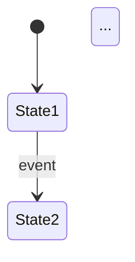

# {project_name} Technical Specification

**Version:** {version}
**Author:** {author}
**Date:** {date}

---

## 1. Requirements Overview

### 1.1 Background/Goals

{background}

**Project Goals:**

{goal}

**Validation Question:** Does this solve a real business problem?

### 1.2 Business Value

{business_value}

---

## 2. Requirements Analysis

### 2.1 Feature Breakdown

| Product Requirement | Involved Pages | Changes |
|---------------------|----------------|---------|
{features_table}

### 2.2 Use Case Analysis

```
User operation flow description...
```

### 2.3 Page Operation Details

| Operation | Constraints | Object | Description |
|-----------|-------------|--------|-------------|
| ... | ... | ... | ... |

---

## 3. Technical Design

### 3.1 Component/Module Design

#### Component Name

**Used by:** ...

**API Design:**

| Props/Param | Type | Description | Default |
|-------------|------|-------------|---------|
| ... | ... | ... | ... |

**Implementation Notes:**
- Challenges: ...
- Dependencies: ...
- Flow: ...

**Pseudocode:**
```typescript
// Pseudocode description
...
```

---

## 4. State Machine Design



---

## 5. Interface Design

| Endpoint | Purpose | Request | Response |
|----------|---------|---------|----------|
| ... | ... | ... | ... |

---

## 6. Technical Research

| Approach | Description | Pros | Cons | Dependencies |
|----------|-------------|------|------|--------------|
| ... | ... | ... | ... | ... |

**Decision:** ...

---

## 7. Analytics/Monitoring

| Event Key | Description | Monitoring Method |
|-----------|-------------|-------------------|
| ... | ... | ... |

---

## 8. Development Effort Estimate

| Technical Task | Owner | Hours |
|----------------|-------|-------|
| ... | ... | ... |
| **Total** | - | **...** |

---

## 9. Appendix

### 9.1 Glossary

| Term | Description |
|------|-------------|
| ... | ... |

### 9.2 References

- ...
